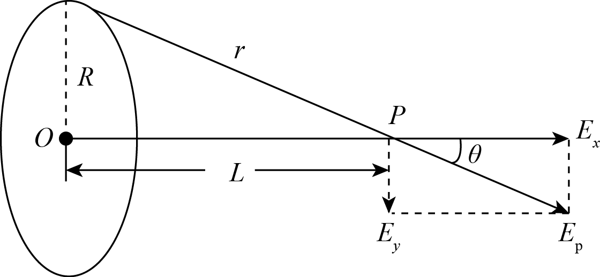

# 第1讲静电场力学模型与场强叠加解析版

> [!ti] *第1讲静电场力学模型与场强叠加第14题*
> 某物理兴趣小组利用图装置来探究影响电荷间静电力的因素，做了如下实验，A是一个电荷量为$Q$的带正电物体，把系在绝缘丝线上的带正电的小球先后挂在$P_{1}$、$P_{2}$、$P_{3}$等位置，小球所带电荷量为$q$．
>
> ![[assets/01-静电场力学模型/l01-img-001.png|201]]
>
> （1）为了比较小球在不同位置所受带电体的作用力的大小，下列方法最好的是 ．
> > [!opts2]
> > - A. 比较小球抬起的高度
> > - B. 比较小球往右偏移的距离
> > - C. 比较丝线偏离竖直方向的角度
> > - D. 比较丝线的长度
>
> （2）使小球系于同一位置，增大或减小小球所带的电荷量，比较小球所受作用力的大小．上述操作所采用的物理方法是 ．（填正确选项前的字母）．
> > [!opts4]
> > - A. 等效替代法
> > - B. 控制变量法
> > - C. 理想模型法
> > - D. 微小量放大法
>
> （3）接着该组同学又进行了如下实验，如图所示，悬挂在$P$点的不可伸长的绝缘细线下端有一个带电量不变的小球B，在两次实验中，均缓慢移动另一带同种电荷的小球A，当A球到达悬点$P$的正下方并与B在同一水平线上，B处于受力平衡时，悬线偏离竖直方向角度为$θ$，若两次实验中A的电量分别为$Q_{1}$和$Q_{2}$，$θ$分别为30°和60°，则$\frac{Q_{1}}{Q_{2}}$为 ．
>
> ![[assets/01-静电场力学模型/l01-img-002.png|131]]

#### 1.1.1. 思路分析

1、带电小球平衡时，根据平衡条件可知，小球所受带电体的作用力大小为 $F=mg\tan \theta$，

所以，为了比较带电小球所受作用力的大小，最好的办法是比较丝线偏离竖直方向的 角度 ．

2、使小球系于同一位置，增大或减小小球所带的电荷量，比较小球所受作用力的大小．所以，用的是 控制变量法 ．

3、对小球B受力分析，根据库仑定律结合平衡条件有$mg\tan \theta =\frac{kq_{\text{A}}\cdot q_{\text{B}}}{\left(L\sin \theta \right)^{2}}$

解得$q_{\text{A}}=$ $\frac{mgL^{2}\tan \theta \sin ^{2}\theta }{kq_{\text{B}}}$ ,

可得两次实验中A的电量之比为$\frac{Q_{1}}{Q_{2}}=\frac{\tan 30{^{\circ}}\sin ^{2}30{^{\circ}}}{\tan 60{^{\circ}}\sin ^{2}60{^{\circ}}}=$ $\frac{1}{9}$ .

#### 1.1.2.规律总结

解决库伦摆和静电摆的问题核心是运用力学中物体平衡的分析方法。

### 1.2. 库伦摆

### 答案

暂无

### 详解

暂无

###### 1

### 答案

暂无

### 详解

暂无

> [!ti] *第1讲静电场力学模型与场强叠加第4题*
> 两个大小相同的小球带有同种电荷，（可看作点电荷），质量分别为$m_{1}$和$m_{2}$，带电量分别为$q_{1}$和$q_{2}$，用绝缘线悬挂后，因静电力而使线张开，分别与竖直方向成夹角$\alpha_{1}$和$\alpha_{2}$，且两球同处一水平线上，如图所示，若${{\alpha }_{1}}={{\alpha }_{2}}$，则下述结论正确的是（）
>
> ![[assets/01-静电场力学模型/l01-img-003.png|231]]
> > [!opts1]
> > - A. 必须同时满足${{q}_{1}}={{q}_{2}}$，${{m}_{1}}={{m}_{2}}$
> > - B. 一定满足$\frac{{{q}_{1}}}{{{m}_{1}}}=\frac{{{q}_{2}}}{{{m}_{2}}}$
> > - C. $q_{1}$一定等于$q_{2}$
> > - D. $m_{1}$一定等于$m_{2}$

### 答案

D

### 详解

因M点场强为零，则带电薄板在M点产生的场强与+q在M点产生的场强等大方向，则带电薄板在M点的场强为
E=k\frac{q}{\left(3d\right)^{2}}=k\frac{q}{9d^{2}}
方向向右，所以带电薄板带负电；因为M点和N点与带电薄板的距离相等，由对称性可知，带电薄板在N点的场强为
E^{\prime }=k\frac{q}{9d^{2}}
方向向左，则N点的合场强为
E_{\text{N}}=k\frac{q}{d^{2}}+k\frac{q}{\left(3d\right)^{2}}=k\frac{10q}{9d^{2}}
方向向左；
综上所述，故ABC错误，故D正确．
故选D．

###### 2

### 答案

A

### 详解

四个电荷的电荷量相等，两对对角线的电荷都是一对等量异种点电荷，在交点处的电场强度的方向指向负电荷，且大小相等，则合场强的方向水平向左．根据对称性可知，电场强度的大小为
E_{\text{合}}=2\times \frac{2kQ}{\left(\frac{\sqrt{2}}{2}a\right)^{2}}\cos 45^{{^{\circ}}}=\frac{4\sqrt{2}kQ}{a^{2}}合
故选A．

> [!ti] *第1讲静电场力学模型与场强叠加第4题*
> 如图所示，用长度不等的绝缘丝线将带电小球 $A$、$B$ 悬挂起来，两丝线与竖直方向的夹角分别是 $\alpha$ 和 $\beta$（$\alpha >\beta$），两小球恰在同一水平线上，则下列说法正确的是（）
>
> ![[assets/01-静电场力学模型/l01-img-005.png|240]]
> > [!opts1]
> > - A. 两小球一定带异种电荷
> > - B. $A$ 小球的质量一定小于 $B$ 小球的质量
> > - C. $A$ 小球所带电荷量一定大于 $B$ 小球所带电荷量
> > - D. $A$ 小球所受库仑力一定大于 $B$ 小球所受库仑力

### 答案

D

### 详解

因M点场强为零，则带电薄板在M点产生的场强与+q在M点产生的场强等大方向，则带电薄板在M点的场强为
E=k\frac{q}{\left(3d\right)^{2}}=k\frac{q}{9d^{2}}
方向向右，所以带电薄板带负电；因为M点和N点与带电薄板的距离相等，由对称性可知，带电薄板在N点的场强为
E^{\prime }=k\frac{q}{9d^{2}}
方向向左，则N点的合场强为
E_{\text{N}}=k\frac{q}{d^{2}}+k\frac{q}{\left(3d\right)^{2}}=k\frac{10q}{9d^{2}}
方向向左；
综上所述，故ABC错误，故D正确．
故选D．

###### 3

### 答案

B

### 详解

根据点电荷的电场强度公式E=\dfrac{kq}{{{r}^{2}}}可得各\dfrac{1}{4}圆环上的电荷在O点的电场场强大小，再根据矢量合成，求出合场强，最后比较它们的大小即可．
由于电荷均匀分布，则各\dfrac{1}{4}圆环上的电荷等效集中于\dfrac{1}{4}圆环的中心，设圆的半径为r，则A图O点处的场强大小为E_{A}=\dfrac{k q}{r^{2}}；
将B图中正、负电荷产生的场强进行叠加，等效两电荷场强方向间的夹角为90^\circ，则在O点的合场强E_{B}=\dfrac{\sqrt{2} k q}{r^{2}}，方向沿x轴负方向；
C图中两正电荷在O点的合场强为零，则C中的场强大小为E_{C}=\dfrac{k q}{r^{2}}，D图由于完全对称，易得合场强E_D=0．
故O处电场强度最大的是图B．
故答案为B．

> [!ti] *第1讲静电场力学模型与场强叠加第13题*
> 某同学设计如图所示的实验装置来验证库仑定律：将一个带电小球$\text A$用绝缘细线悬挂，并将另一个与小球$\text A$带同种电荷的小球$\text B$与它靠近，$\text A$球受到$\text B$球的静电斥力$F$而发生偏移，测得$\text A$球的质量为m，悬点到$\text A$球球心的距离为l．首先，在保持两球电荷量不变的情况下，移动小球$\text B$改变两球之间的距离，用刻度尺测量稳定后两球间的距离r和$\text A$球偏移的距离d（实验中满足$l\gg d$）；然后，设法改变两球的电荷量，再进行相关实验．下列说法正确的是（）
>
> ![[assets/01-静电场力学模型/l01-img-004.png|298]]
> > [!opts1]
> > - A. 实验中，小球$\text A$所受静电力的测量值$F=mg\frac{l}{d}$
> > - B. 为方便验证“静电力与距离平方成反比的关系”，应由实验数据作出$F$与$r^{2}$的关系图像
> > - C. 用不带电导体球$C$分别与$\text A$、$\text B$两球接触后，$\text A$、$\text B$两球一定带等量同种电荷
> > - D. 实验中仅测量$d$与$r$，也可以验证“静电力与距离平方成反比的关系”

## 2级：静电场中的平衡

### 2.1. 典中典

### 答案

暂无

### 详解

暂无

> [!ti] *第1讲静电场力学模型与场强叠加第10题*
> 如图所示，在光滑小滑轮$O$正下方相距$h$处固定一电量为$Q$的小球A，电量为$q$的带电小球B用一绝缘细线通过定滑轮拉住并处于静止状态，此时小球与$A$点的距离为$R$．现用力$F$缓慢拉动细线，使B球移动一小段距离．假定两球均可视为点电荷且电荷量均保持不变，静电力常量为$k$，环境可视为真空，则下列说法正确的是（）
>
> ![[assets/01-静电场力学模型/l01-img-006.png|91]]
> > [!opts2]
> > - A. 小球B所受的重力大小为$\frac{kQqh}{R^{3}}$
> > - B. 细线上的拉力先增大后减小
> > - C. A、B两球之间的距离不变
> > - D. B球的运动轨迹是一段圆弧

#### 2.1.1. 思路分析

1、开始处于静止状态，对B球受力分析及结合三角形相似可得$\frac{G}{h}=\frac{F_{库}}{R}$，$F_{库}=k\frac{Qq}{R^{2}}$；

联立解得$G=$ $\frac{kQqh}{R^{3}}$；

2、缓慢拉动细线过程，由上述分析可得$R=$ $\sqrt[3]{\frac{kQqh}{G}}$，其中$k$、$Q$、$q$、$h$、$G$均保持不变，所以A、B两球之间的距离$R$也不会改变，即B球的运动轨迹是以A为圆心，以$R$为半径的 圆弧，

再次结合三角形相似可得$\frac{G}{h}=\frac{F_{库}}{R}=\frac{F}{L_{绳}}$，$L_{绳}$不断 减小，其他量都不变，所以细线上的拉力一直 减小 ．

#### 2.1.2. 规律总结

静态平衡和动态平衡问题的分析方法结合电场力进行分析。

### 2.2. 动态平衡

### 答案

暂无

### 详解

暂无

> [!ti] *第1讲静电场力学模型与场强叠加第9题*
>
> 如图所示，竖直墙面与水平地面均光滑且绝缘，两个带有同种电荷的小球 $A 、 B$ 分别处于竖直墙面和水平地面，且共处于同一竖直平面内．若用图示方向的水平推力 $F$ 作用于 $B$ ，则两球静止于图示位置，如果将 $B$ 稍向左推过一些，两球重新平衡时的情况与原来相比
> ![[Pasted image 20251205002823.png|100]]
> > [!opts2]
> > - A. 推力 $F$ 将增大
> > - B. 墙面对 $A$ 的弹力增大
> > - C. 地面对 $B$ 的弹力减小
> > - D. 两小球之间的距离增大

### 答案

B

### 详解

A．根据对称性可知，B、C两点处的电场线疏密程度相同，则B、C两点处的电场强度相等，由图甲可看出B、C两点处的电场的方向相同，故A正确；
B．根据对称性可知，A、D两点处的电场线疏密程度相同，则A、D两点处的电场强度相等，由图甲可看出A、D两点处的电场的方向相同，故B错误；
C．由图甲可以看出E、O、F三点中，O点处的电场线最密，所以O点电场强度最强，故C正确；
D．由图甲可以看出B、O、C三点中，O点处的电场线最疏，O点电场强度最弱，故D正确．
故选：B．

> [!ti] *第1讲静电场力学模型与场强叠加第10题*
> 如图所示，倾角为 $\theta$ 的光滑绝缘斜面固定在水平面上．为了使质量为 $m$ ，带电量为 $+q$ 的小球静止在斜面上，可加一平行于纸面的匀强电场（未画出），则（ ）
> ![[Pasted image 20251205002551.png|150]]
> > [!opts1]
> > - A. 电场强度的最小值为 $E=\frac{m g \sin \theta}{q}$
> > - B. 电场强度的最大值为 $E=\frac{m g}{q}$
> > - C. 若电场强度方向从沿斜面向上逐渐转到坚直向上，则电场强度逐渐增大
> > - D. 若电场强度方向从沿斜面向上逐渐转到坚直向上，则电场强度先减小后增大

### 2.3. 电性讨论

### 答案

暂无

### 详解

暂无

###### 4

### 答案

D

### 详解

因M点场强为零，则带电薄板在M点产生的场强与+q在M点产生的场强等大方向，则带电薄板在M点的场强为
E=k\frac{q}{\left(3d\right)^{2}}=k\frac{q}{9d^{2}}
方向向右，所以带电薄板带负电；因为M点和N点与带电薄板的距离相等，由对称性可知，带电薄板在N点的场强为
E^{\prime }=k\frac{q}{9d^{2}}
方向向左，则N点的合场强为
E_{\text{N}}=k\frac{q}{d^{2}}+k\frac{q}{\left(3d\right)^{2}}=k\frac{10q}{9d^{2}}
方向向左；
综上所述，故ABC错误，故D正确．
故选D．

> [!ti] *第1讲静电场力学模型与场强叠加第8题*
> 如图所示用三根长度相同的绝缘细线将三个带电小球连接后悬挂在空中。三个带电小球质量相等，A球带负电，平衡时三根绝缘细线都是直的，但拉力都为零。则下列说法正确的是（　　）
>
> ![[assets/01-静电场力学模型/l01-img-008.png|100]]
> > [!opts2]
> > - A. B球和C球都带负电荷
> > - B. B球带负电荷，C球带正电荷
> > - C. B球和C球都带正电荷，所带电量不一定相等
> > - D. B球和C球所带电量一定相等

### 答案

C

### 详解

本题主要考查场强的矢量性，同一直线上两点电荷产生场强的叠加则变成了代数的加或减．由于两个点电荷带异种电荷且电量不等，则{{E}_{1}}={{E}_{2}}的点必有两个，其中一处合场强为零，另一处合场强为2E．故选C．

###### 5

### 答案

暂无

### 详解

暂无

> [!ti] *第1讲静电场力学模型与场强叠加第3题*
> 如图所示，水平天花板下用长度相同的绝缘轻质细线悬挂起来的两个相同的带电小球$a$、$b$，左边放一个带正电的固定球＋$Q$时，两悬球都保持竖直方向．下面说法正确的是(　　) 
>
> ![[assets/01-静电场力学模型/l01-img-009.png|126]]
> > [!opts1]
> > - A. $a$球带正电，$b$球带正电，并且$a$球带电荷量较大
> > - B. $a$球带负电，$b$球带正电，并且$a$球带电荷量较小
> > - C. $a$球带负电，$b$球带正电，并且$a$球带电荷量较大
> > - D. $a$球带正电，$b$球带负电，并且$a$球带电荷量较小

### 2.4. 三点一线

### 答案

B

### 详解

根据点电荷的电场强度公式E=\dfrac{kq}{{{r}^{2}}}可得各\dfrac{1}{4}圆环上的电荷在O点的电场场强大小，再根据矢量合成，求出合场强，最后比较它们的大小即可．
由于电荷均匀分布，则各\dfrac{1}{4}圆环上的电荷等效集中于\dfrac{1}{4}圆环的中心，设圆的半径为r，则A图O点处的场强大小为E_{A}=\dfrac{k q}{r^{2}}；
将B图中正、负电荷产生的场强进行叠加，等效两电荷场强方向间的夹角为90^\circ，则在O点的合场强E_{B}=\dfrac{\sqrt{2} k q}{r^{2}}，方向沿x轴负方向；
C图中两正电荷在O点的合场强为零，则C中的场强大小为E_{C}=\dfrac{k q}{r^{2}}，D图由于完全对称，易得合场强E_D=0．
故O处电场强度最大的是图B．
故答案为B．

###### 6

### 答案

暂无

### 详解

暂无

> [!ti] *第1讲静电场力学模型与场强叠加第16题*
> 在真空中有 A、B、C 三个可自由移动的点电荷，依次放在同一直线上，都在库仑力作用下处于平衡状态。若三个点电荷的电荷量、电荷的正负及相互距离均未知，根据平衡能判断出这三个点电荷的情况是（　　）
>
> > [!opts2]
> > - A. 分别带何种电荷
> > - B. 哪几个同号，哪几个异号
> > - C. 哪一个电荷量最小
> > - D. 电荷量大小的排序

### 答案

暂无

### 详解

暂无

###### 7

### 答案

D

### 详解

A．根据电场线的对称性可以知道，
a
、
b
两点电势相同，场强大小相等，但方向相反，所以电场强度不同，故A错误；
B．沿电场线方向电势降低，
ab
两点电势不相等，故B错误；
C．
a
、
b
是离点电荷等距的
a
、
b
两点，处于同一等势面上，电势相同，场强大小相等，但方向不同，则电场强度不同，故C错误；
D．导体内部场强电势都为零，故D正确．
故选D．

> [!ti] *第1讲静电场力学模型与场强叠加第18题*
> 真空中两个点电荷，电荷量分别为 $q_1=8\times10^{-9}\mathrm{C}$ 和 $q_2=-18\times10^{-9}\mathrm{C}$，两者固定于相距 20 cm 的 $a$、$b$ 两点上，如图所示。有一个点电荷放在 $a$、$b$ 连线（或延长线）上某点，恰好能静止，则该点的位置是（　　）
> ![[Pasted image 20260903232543.png|200]]
> > [!opts4]
> > - A. $a$ 点左侧 40 cm 处
> > - B. $a$ 点右侧 8 cm 处
> > - C. $b$ 点右侧 20 cm 处
> > - D. 以上都不对

## 3级：常见电场的分布

### 3.1. 典中典

### 答案

(1) 
(2) 
(3)

### 详解

(1) 由库仑定律得：．
(2) 由电场强度的定义，知点处电场强度的大小为：．
(3) 电场强度由电场本身决定，与试探电荷是否存在没有关系，故将放在处的点电荷取走，该处的电场强度没有变化；电场强度仍为．

> [!ti] *第1讲静电场力学模型与场强叠加第7题*
> 如图所示，哪些图满足$a$、$b$两点的电势相等，$a$、$b$两点电场强度相同的情况（　　）
>
> ![[assets/01-静电场力学模型/l01-img-012.png|557]]
> > [!opts1]
> > - A. 甲图为等量同种点电荷的电场，$a$、$b$两点关于两点电荷的中垂线对称
> > - B. 乙图为等量异种点电荷的电场，$a$、$b$两点关于两点电荷的中垂线对称
> > - C. 丙图为两彼此靠近带电金属板间的电场，$a$、$b$两点处于两金属板间
> > - D. 丁图为金属导体处于外电场中，$a$、$b$两点处于金属导体内

#### 3.1.1. 思路分析

1、甲图中a、b两点电场强度大小 相等，方向 相反；

2、顺着电场线方向电势降低，故乙图中a点电势 高于 b点；

3、丙图a、b两点处于匀强电场，电场强度相等，方向相同，但 电势 不同；

4、丁图中金属导体处于静电平衡状态，整体是一个 等势 体，因此a、b两点的电势 相等，导体内部 合场强 为零，因此a、b两点电场强度均为零。

#### 3.1.2. 规律总结

1、电场强度是**矢量**，既有大小，又有方向。

2、沿电场线电势降低，电场线方向是电势降低**最快**的方向。

3、静电平衡状态的导体是**等势体**，其内部场强处处为零。

### 3.2. 常见电场

### 答案

D

### 详解

A．根据电场线的对称性可以知道，
a
、
b
两点电势相同，场强大小相等，但方向相反，所以电场强度不同，故A错误；
B．沿电场线方向电势降低，
ab
两点电势不相等，故B错误；
C．
a
、
b
是离点电荷等距的
a
、
b
两点，处于同一等势面上，电势相同，场强大小相等，但方向不同，则电场强度不同，故C错误；
D．导体内部场强电势都为零，故D正确．
故选D．

###### 8

### 答案

C

### 详解

本题主要考查场强的矢量性，同一直线上两点电荷产生场强的叠加则变成了代数的加或减．由于两个点电荷带异种电荷且电量不等，则{{E}_{1}}={{E}_{2}}的点必有两个，其中一处合场强为零，另一处合场强为2E．故选C．

> [!ti] *第1讲静电场力学模型与场强叠加第2题*
> 如图所示，$Q$是真空中固定的点电荷，$a$、$b$、$c$是以$Q$所在位置为圆心、半径分别为$r$或$2r$球面上的三点，电量为$-q$的试探电荷在$a$点受到的库仑力方向指向$Q$，则（）
>
> ![[assets/01-静电场力学模型/l01-img-013.png|192]]
> > [!opts1]
> > - A. $Q$带负电
> > - B. $b$、$c$两点电场强度相同
> > - C. $a$、$b$两点的电场强度大小之比为$4:1$
> > - D. 将$a$处试探电荷电量变为$+2q$，该处电场强度变为原来两倍

### 答案

A

### 详解

四个电荷的电荷量相等，两对对角线的电荷都是一对等量异种点电荷，在交点处的电场强度的方向指向负电荷，且大小相等，则合场强的方向水平向左．根据对称性可知，电场强度的大小为
E_{\text{合}}=2\times \frac{2kQ}{\left(\frac{\sqrt{2}}{2}a\right)^{2}}\cos 45^{{^{\circ}}}=\frac{4\sqrt{2}kQ}{a^{2}}合
故选A．

###### 9

### 答案

B

### 详解

A．根据对称性可知，B、C两点处的电场线疏密程度相同，则B、C两点处的电场强度相等，由图甲可看出B、C两点处的电场的方向相同，故A正确；
B．根据对称性可知，A、D两点处的电场线疏密程度相同，则A、D两点处的电场强度相等，由图甲可看出A、D两点处的电场的方向相同，故B错误；
C．由图甲可以看出E、O、F三点中，O点处的电场线最密，所以O点电场强度最强，故C正确；
D．由图甲可以看出B、O、C三点中，O点处的电场线最疏，O点电场强度最弱，故D正确．
故选：B．

> [!ti] *第1讲静电场力学模型与场强叠加第9题*
> 用电场线能直观、方便地比较电场中各点场强的强弱．如图甲是等量异种点电荷形成电场的电场线，图乙是电场中的一些点：$O$是两点电荷连线的中点，$E$、$F$是连线中垂线上相对于$O$点对称的两点，$B$、$C$和$A$、$D$也相对于$O$点对称．则下列说法不正确的是（）
>
> ![[assets/01-静电场力学模型/l01-img-014.png|307]]
> > [!opts1]
> > - A. $B$、$C$两点场强大小和方向都相同
> > - B. $A$、$D$两点场强大小相等，方向相反
> > - C. $E$、$O$、$F$三点比较，$O$点场强最强
> > - D. $B$、$O$、$C$三点比较，$O$点场强最弱

### 3.3. 等效替代

### 答案

B

### 详解

A．根据对称性可知，B、C两点处的电场线疏密程度相同，则B、C两点处的电场强度相等，由图甲可看出B、C两点处的电场的方向相同，故A正确；
B．根据对称性可知，A、D两点处的电场线疏密程度相同，则A、D两点处的电场强度相等，由图甲可看出A、D两点处的电场的方向相同，故B错误；
C．由图甲可以看出E、O、F三点中，O点处的电场线最密，所以O点电场强度最强，故C正确；
D．由图甲可以看出B、O、C三点中，O点处的电场线最疏，O点电场强度最弱，故D正确．
故选：B．

> [!ti] *第1讲静电场力学模型与场强叠加第14题*
> 如图所示，图甲中$MN$为足够大的不带电薄金属板，在金属板的右侧，距离为$d$的位置上放入一个电荷量为＋$q$的点电荷$O$，由于静电感应产生了如图甲所示的电场分布．$P$是金属板上的一点，$P$点与点电荷$O$之间的距离为$r$，几位同学想求出$P$点的电场强度大小，但发现问题很难．几位同学经过仔细研究，从图乙所示的电场得到了一些启示，经过查阅资料他们知道：图甲所示的电场分布与图乙中虚线右侧的电场分布是一样的．图乙中两异种点电荷电荷量的大小均为$q$，它们之间的距离为2$d$，虚线是两点电荷连线的中垂线．由此他们分别对$P$点的电场强度方向和大小做出以下判断，其中正确的是(　　)
> ![[assets/01-静电场力学模型/l01-img-019.png|198]]
> > [!opts1]
> > - A. 方向沿$P$点和点电荷的连线向左，大小为$\frac{2kqd}{{{r}^{3}}}$
> > - B. 方向沿$P$点和点电荷的连线向左，大小为$\frac{2kq\sqrt{{{r}^{2}}-{{d}^{2}}}}{{{r}^{3}}}$
> > - C. 方向垂直于金属板向左，大小为$\frac{2kqd}{{{r}^{3}}}$
> > - D. 方向垂直于金属板向左，大小为$\frac{2kq\sqrt{{{r}^{2}}-{{d}^{2}}}}{{{r}^{3}}}$

### 3.4. 场强叠加

### 答案

暂无

### 详解

暂无

###### 10

### 答案

暂无

### 详解

暂无

> [!ti] *第1讲静电场力学模型与场强叠加第2题*
> 如图所示，四个点电荷所带电荷量的绝对值均为$Q$，分别固定在正方形的四个顶点上，正方形边长为$a$，静电力常量为$k$，则正方形两条对角线交点处的电场强度（）
>
> ![[assets/01-静电场力学模型/l01-img-020.png|100]]
> > [!opts1]
> > - A. 大小为$\frac{4\sqrt{2}kQ}{a^{2}}$，方向水平向左
> > - B. 大小为$\frac{2\sqrt{2}kQ}{a^{2}}$，方向水平向左
> > - C. 大小为$\frac{4\sqrt{2}kQ}{a^{2}}$，方向水平向右
> > - D. 大小为$\frac{2\sqrt{2}kQ}{a^{2}}$，方向水平向右

### 答案

A

### 详解

四个电荷的电荷量相等，两对对角线的电荷都是一对等量异种点电荷，在交点处的电场强度的方向指向负电荷，且大小相等，则合场强的方向水平向左．根据对称性可知，电场强度的大小为
E_{\text{合}}=2\times \frac{2kQ}{\left(\frac{\sqrt{2}}{2}a\right)^{2}}\cos 45^{{^{\circ}}}=\frac{4\sqrt{2}kQ}{a^{2}}合
故选A．

###### 11

### 答案

B

### 详解

根据电场线从正电荷出发到负电荷终止，叠加后的电场满足矢量加减，故两板间的电场强度为2E．两板相互靠近，两板间的电场强度会叠加，但计算电场力时，应将其中一个平板看作试探电荷，它处在另外一个平板产生的电场中，故其所受电场力为Eq，同理可得，另一个平板也可以看作是一个试探电荷，它所受的电场力也为Eq，故两板的相互作用力大小为Eq．故选B．

> [!ti] *第1讲静电场力学模型与场强叠加第8题*
> 两个固定的异种点电荷，电荷量给定但大小不等。用$E_{1}$和$E_{2}$分别表示这两个点电荷产生的电场强度的大小，则在通过两点电荷的直线上，${{E}_{1}}={{E}_{2}}$的点（　　）
> > [!opts1]
> > - A. 有三个，其中两处合场强为零
> > - B. 有三个，其中一处合场强为零
> > - C. 只有两个，其中一处合场强为零
> > - D. 只有一个，该处合场强不为零

### 答案

C

### 详解

本题主要考查场强的矢量性，同一直线上两点电荷产生场强的叠加则变成了代数的加或减．由于两个点电荷带异种电荷且电量不等，则{{E}_{1}}={{E}_{2}}的点必有两个，其中一处合场强为零，另一处合场强为2E．故选C．

###### 12

### 答案

暂无

### 详解

暂无

> [!ti] *第1讲静电场力学模型与场强叠加第11题*
> 相隔很远、均匀带电 + $q$、 - $q$的大平板在靠近平板处的匀强电场电场线如图$a$所示，电场强度大小均为$E$．将两板靠近，根据一直线上电场的叠加，得到电场线如图$b$所示．此时两板间的电场强度和两板相互吸引力的大小分别为（）
>
> ![[assets/01-静电场力学模型/l01-img-021.png|363]]
> > [!opts1]
> > - A. $E$     $Eq$
> > - B. 2 $E$    $Eq$
> > - C. $E$      2 $Eq$
> > - D. 2$E$   2$Eq$

## 4. 4级：连续带电体求场强

### 4.1. 典中典

### 答案

B

### 详解

根据电场线从正电荷出发到负电荷终止，叠加后的电场满足矢量加减，故两板间的电场强度为2E．两板相互靠近，两板间的电场强度会叠加，但计算电场力时，应将其中一个平板看作试探电荷，它处在另外一个平板产生的电场中，故其所受电场力为Eq，同理可得，另一个平板也可以看作是一个试探电荷，它所受的电场力也为Eq，故两板的相互作用力大小为Eq．故选B．

> [!ti] *第1讲静电场力学模型与场强叠加第31题*
> 如图所示，一个均匀的带电圆环，带电量为$+Q$，半径为$R$，放在绝缘水平桌面上。圆心为$O$点，过$O$点做一竖直线，在此线上取一点$A$，使$A$到$O$点的距离为$R$，在$A$点放一检验电荷$+q$，则$+q$在$A$点所受的静电力为（）
>
> ![[assets/01-静电场力学模型/l01-img-022.png|150]]
> > [!opts2]
> > - A. $\frac{\sqrt{2}kQq}{4{{R}^{2}}}$，方向向下
> > - B. $\frac{kQq}{{{R}^{2}}}$，方向向上
> > - C. $\frac{kQq}{{{R}^{2}}}$，方向向下
> > - D. $\frac{\sqrt{2}kQq}{4{{R}^{2}}}$，方向向上

#### 4.1.1. 思路分析

取长度为$\Delta x$的微元，微元的带电量为${{q}_{0}}=$ $\frac{Q}{2\pi R}\cdot \Delta x$ ,微元对A点的$+q$在竖直向上的分力为${{F}_{y}}=\frac{kq{{q}_{0}}}{{{(\sqrt{2}R)}^{2}}}\cos 45{}^\circ$，根据对称性可知，圆环对电荷在水平方向上的分力相互抵消，则$+q$在A点所受的静电力为

$F=\frac{2\pi R}{ \Delta x}\cdot {{F}_{y}}=$ $\frac{\sqrt{2}kQq}{4{{R}^{2}}}$，方向向上。

#### 4.1.2. 规律总结

利用微元法分析，以及圆环几何上的对称特点求解此类问题。

### 4.2. 微元法

### 答案

D

### 详解

取长度为\text{ }\!\!\Delta\!\!\text{ }x的微元，微元的带电量为
{{q}_{0}}=\frac{Q}{2\pi R}\cdot \text{ }\!\!\Delta\!\!\text{ }x
微元对A点的+q在竖直向上的分力为
{{F}_{y}}=\frac{kq{{q}_{0}}}{{{(\sqrt{2}R)}^{2}}}\cos 45{}^\circ
根据对称性可知，圆环对电荷在水平方向上的分力相互抵消，则+q在A点所受的静电力为
F=\frac{2\pi R}{\text{ }\!\!\Delta\!\!\text{ }x}\cdot {{F}_{y}}=\frac{\sqrt{2}kQq}{4{{R}^{2}}}
方向向上。
故答案为D。

###### 13

### 答案

暂无

### 详解

暂无

> [!ti] *第1讲静电场力学模型与场强叠加第33题*
> 如图所示，一半径为$R$的绝缘环上，均匀地带有电荷量为$Q$的电荷，在垂直于圆环平面的对称轴上有一点$P$，它与环心$O$的距离$OP=L$．设静电力常量为$k$，关于$P$点的场强$E$，请你根据所学的物理知识，通过一定的分析，判断正确的表达式是（）
>
> ![[assets/01-静电场力学模型/l01-img-023.png|188]]
> > [!opts4]
> > - A. $\frac{kQ}{{{R}^{2}}+{{L}^{2}}}$
> > - B. $\frac{kQL}{{{R}^{2}}+{{L}^{2}}}$
> > - C. $\frac{kQR}{\sqrt{{{({{R}^{2}}+{{L}^{2}})}^{3}}}}$
> > - D. $\frac{kQL}{\sqrt{{{({{R}^{2}}+{{L}^{2}})}^{3}}}}$

### 4.3. 对称法

### 答案

D

### 详解

设想将圆环等分为n个小段，当n相当大时，每一小段都可以看做点电荷，其所带电荷量为：q=frac{Q}{n}
如图所示，由点电荷场强公式可求得每一点电荷在P处的场强为：
E=kfrac{Q}{n{{r}^{2}}}=kfrac{Q}{n({{R}^{2}}+{{L}^{2}})}
由对称性可知，各小段带电环在P处的场强E垂直于轴向的分量{{E}_{y}}相互抵消，而E的轴向分量{{E}_{x}}之和即为带电环在P处的场强{{E}_text{p}}，故
{{E}_{总}}=n{{E}_{x}}=ntimes frac{kQ}{n({{L}^{2}}+{{R}^{2}})}times frac{L}{r}=frac{kQL}{r({{L}^{2}}+{{R}^{2}})}总，
而r=sqrt{{{L}^{2}}+{{R}^{2}}}．

故选D．

###### 14

### 答案

暂无

### 详解

暂无

> [!ti] *第1讲静电场力学模型与场强叠加第3题*
> 下列选项中的各$\frac{1}{4}$圆环大小相同，所带电荷量已在图中标出，且电荷均匀分布，各$\frac{1}{4}$圆环间彼此绝缘．坐标原点$O$处电场强度最大的是（）
> > [!opts1]
> > ![[QQ_1788443926091.png|500]]
> >

### 答案

B

### 详解

根据点电荷的电场强度公式E=\dfrac{kq}{{{r}^{2}}}可得各\dfrac{1}{4}圆环上的电荷在O点的电场场强大小，再根据矢量合成，求出合场强，最后比较它们的大小即可．
由于电荷均匀分布，则各\dfrac{1}{4}圆环上的电荷等效集中于\dfrac{1}{4}圆环的中心，设圆的半径为r，则A图O点处的场强大小为E_{A}=\dfrac{k q}{r^{2}}；
将B图中正、负电荷产生的场强进行叠加，等效两电荷场强方向间的夹角为90^\circ，则在O点的合场强E_{B}=\dfrac{\sqrt{2} k q}{r^{2}}，方向沿x轴负方向；
C图中两正电荷在O点的合场强为零，则C中的场强大小为E_{C}=\dfrac{k q}{r^{2}}，D图由于完全对称，易得合场强E_D=0．
故O处电场强度最大的是图B．
故答案为B．

###### 15

### 答案

暂无

### 详解

暂无

> [!ti] *第1讲静电场力学模型与场强叠加第37题*
> 如图所示，正电荷均匀分布在半球面$ACB$上，球面半径为$R$，$CD$为通过半球顶点$C$和球心$O$的轴线．$P$、$M$为$CD$轴线上的两点，距球心$O$的距离均为$\frac{R}{2}$，在$M$右侧轴线上$O^{\prime }$点固定正点电荷，电量为$Q$，点$O^{\prime }$、$M$间距离为$R$，已知$P$点的合场强为零，若带电均匀的封闭球壳内部电场强度处处为零，则$M$点的合场强为（）
>
> ![[assets/01-静电场力学模型/l01-img-028.png|280]]
> > [!opts1]
> > - A. $0$
> > - B. 大小为$k\frac{Q}{{{R}^{2}}}$，方向由$M$指向$C$
> > - C. 大小为$k\frac{Q}{4{{R}^{2}}}$，方向由$M$指向$D$
> > - D. 大小为$k\frac{3Q}{4{{R}^{2}}}$，方向由$M$指向$C$

### 答案

D

### 详解

已知P点的合场强为零，说明半球上电荷与点电荷Q在P点产生的场强大小相等、方向相反，点电荷Q在P点产生场强大小为
E=k\frac{Q}{{{(2R)}^{2}}}=k\frac{Q}{4{{R}^{2}}}
方向水平向左，所以，半球在P点产生的场强大小为k\frac{Q}{4{{R}^{2}}}，方向水平向右．假如是一个封闭球壳，球壳内部电场强度处处为零，则知右半球在P点产生的场强大小也等于k\frac{Q}{4{{R}^{2}}}，方向向左，根据对称性可知，左半球在M点产生的场强大小为k\frac{Q}{4{{R}^{2}}}，方向向右，点电荷在M点产生的场强为
{E}^{\prime }=k\frac{Q}{{{R}^{2}}}
方向向左所以M点的合场强为
E_{M}=k\frac{Q}{R^{2}}-k\frac{Q}{4R^{2}}=k\frac{3Q}{4R^{2}}
方向向左，故D正确．
故选D．

###### 16

### 答案

暂无

### 详解

暂无

> [!ti] *第1讲静电场力学模型与场强叠加第4题*
> 如图所示，电荷量为$q$的点电荷与均匀带电薄板相距$2\text d$，点电荷到带电薄板的垂线通过板的几何中心，$M$点在板的几何中心左侧$d$处的垂线上，$N$点与$M$点关于带电薄板对称．已知静电力常量为$k$，若图中$M$点的电场强度为$0$，那么（）
>
> ![[assets/01-静电场力学模型/l01-img-029.png|182]]
> > [!opts2]
> > - A. 带电薄板带正电荷
> > - B. $N$点场强水平向右
> > - C. $N$点电场强度也为零
> > - D. $N$点的电场强度$E=\frac{10kq}{9d^{2}}$

### 4.4. 均匀球壳

### 答案

D

### 详解

因M点场强为零，则带电薄板在M点产生的场强与+q在M点产生的场强等大方向，则带电薄板在M点的场强为
E=k\frac{q}{\left(3d\right)^{2}}=k\frac{q}{9d^{2}}
方向向右，所以带电薄板带负电；因为M点和N点与带电薄板的距离相等，由对称性可知，带电薄板在N点的场强为
E^{\prime }=k\frac{q}{9d^{2}}
方向向左，则N点的合场强为
E_{\text{N}}=k\frac{q}{d^{2}}+k\frac{q}{\left(3d\right)^{2}}=k\frac{10q}{9d^{2}}
方向向左；
综上所述，故ABC错误，故D正确．
故选D．

> [!ti] *第1讲静电场力学模型与场强叠加第40题*
> 理论上已经证明，均匀带电球壳在球壳外部产生的电场，与一个位于球心、电荷量相等的点电荷在同一点产生的电场相同，即电场强度 $E=\frac{k Q}{r^2}$ ，电势 $\varphi=\frac{k Q}{r}$ ；而均匀带电球壳在其内部任意一点产生的电场强度为零．
> （1）如甲图所示，一个均匀带电球体半径为 $R$ ，电荷量为 $+Q$ ，试求球内 $x_1$ 处电场强度的大小；
> ![[Pasted image 20251204004811.png|200]]
> （2）
> i．定性的画出甲图中均匀带电球体内、外部电场线分布图；
>ii ．定性的画出甲图中均匀带电球体产生的场强 $E$ 随 $x$ 变化的图像，以及电势 $\varphi$ 随 x 变化的图像，并在图像中标示出关键点的坐标；

### 4.5. *割补法

### 答案

(1)4πkQ；E_{1}> E_{2}
(2)B；见解析

### 详解

【详解】（1）a.由题可得
\Phi =ES=\frac{kQ}{R_{1}^{2}}\cdot 4\pi R_{1}^{2}=4\pi kQ
b.单位面积的电通量即电场强度，则
E=\frac{\Phi }{S}=\frac{kQ}{r^{2}}
其中
R_{1}< R_{2}
则
E_{1}> E_{2}
（2）a.b.可把整个球体分为一个个半径逐渐增大的球壳，每个球壳内部电荷量与球壳半径成正比．设球体带电荷量Q，球体带电密度
\frac{Q}{V}=\frac{3Q}{4\pi R^{3}}
半径为x的球体带电量
Q'=\frac{3Q}{4\pi R^{3}}\cdot \frac{4}{3}\pi x^{3}=\frac{Q}{R^{3}}x^{3}
根据点电荷电场强度公式，整个球体内部电场强度
E=\frac{kQ'}{x^{2}}=\frac{kQ}{R^{3}}x
与x成正比．在球体外部，根据点电荷电场强度公式，电场强度与x的二次方成反比．所以从带电球体的球心开始，沿着半径（x）方向场强的分布图是B图．

> [!ti] *第1讲静电场力学模型与场强叠加第41题*
> 已知均匀带电球体在球的外部产生的电场与一个位于球心的、带电荷量相等的点电荷产生的电场相同。如图所示，半径为 $R$ 的球体上均匀分布着电荷量为 $Q$ 的电荷，在过球心 $O$ 的直线上有 $A, B$ 两个点，$O$ 和 $B, B$ 和 $A$ 间的距离均为 $R$ 。现以 OB 为直径在球内挖一球形空腔，若静电力常量为 $k$ ，球的体积公式为 $V=\frac{4}{3} \pi r^3$ ，则 $A$ 点处电荷量为 $q$ 的检验电荷所受到的电场力的大小为
> ![[Pasted image 20251204002138.png|300]]
>
> > [!opts4]
> > - A. $\frac{5 k q Q}{36 R^2}$
> > - B. $\frac{7 k q Q}{36 R^2}$
> > - C. $\frac{7 k q Q}{32 R^2}$
> > - D. $\frac{3 k q Q}{16 R^2}$

### 答案

B

### 详解

根据题意分析可知，半径为R的均匀带电体可以看成是点电荷存在O点，根据库仑定律可知对在A点的电荷的电场力为
{{F}_{1}}=\frac{kQq}{{{(2R)}^{2}}}=\frac{kQq}{4{{R}^{2}}}
同理割出的小球，因为电荷均匀分布其带电荷量
{Q}'=\frac{\frac{4}{3}\pi {{(\frac{R}{2})}^{3}}}{\frac{4}{3}\pi {{R}^{3}}}Q
同理对A处点电荷的电场力为
{{F}_{2}}=\frac{k{{Q}^{'}}q}{{{(\frac{3R}{2})}^{2}}}=\frac{kQq}{18{{R}^{2}}}
所以剩余空腔部分电荷在A处点电荷的电场力
F=F1-F2=\frac{7kQq}{36{{R}^{2}}}
故答案为B。
