# 第10讲 安培力 #h0
# 知识讲解
磁场对其中的通电直导线有力的作用, 这个力叫作安培力. 这节课主要研究安培力的方向和大小. 并研究安培力作用下的力学问题.
## 1. 安培力的方向

安培力的方向是通过实验总结出的实验定律. 不需要解释为什么.

### 1.1. 安培力的方向——左手定则：
1. 伸开左手：使拇指跟其余四指垂直，并且都跟手掌在一个平面内；
2. 放入磁场：将左手放入磁场中，使磁感线垂直穿入手心；
3. 确定电流方向：四指指向电流的方向；
4. 得出受力方向：拇指所指的方向就是通电导线在磁场中所受安培力的方向。
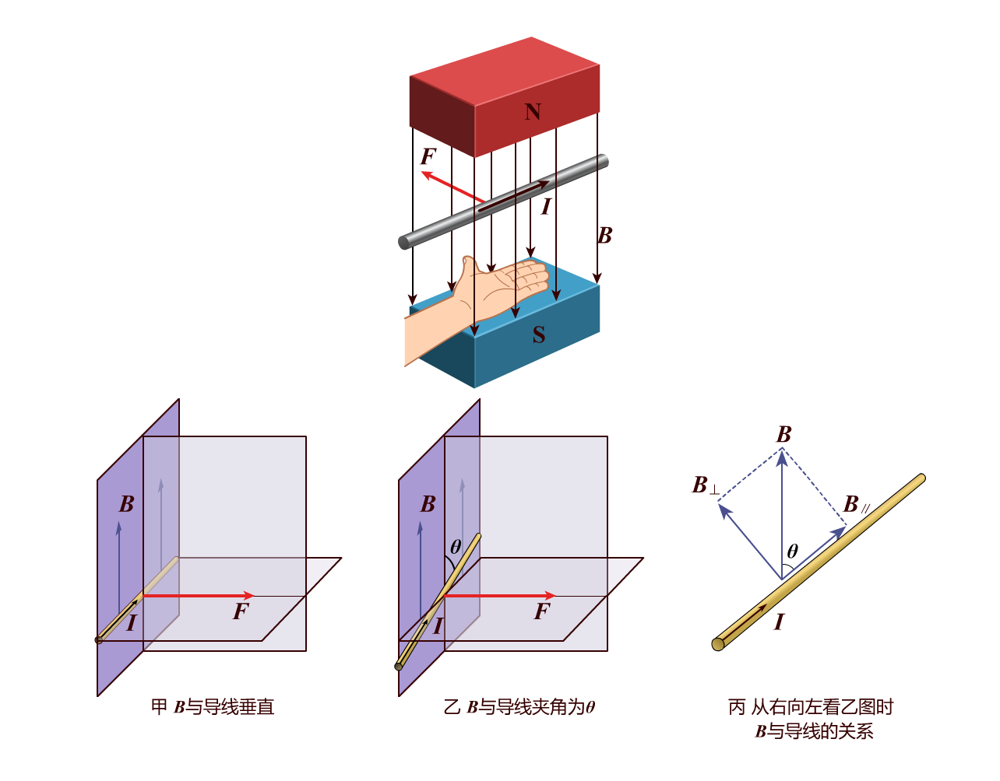
### 1.2. 如果磁场与电流不垂直怎么办 ?
将磁感应强度分解为垂直和平行分量.
**平行分量对电流无力的作用**,直接忽略.
只需关注垂直分量即可.

### 1.3. 安培力方向的特点：
> [!question] 观察总结$I,F,B$ 这三个矢量的空间位置关系:
$F\bot B$，$F\bot I$，即 $F$ 垂直于 $B$ 和 $I$ 决定的平面．（注意：$B$ 和 $I$ 可以有任意夹角）
### 1.4. 知二求一
$I,F,B$ 三个矢量知二求一.
```horizontal

---

---

```

```horizontal

---


```

## 2. 平行电流的相互作用
A导线产生的磁场, 会对 B导线施加安培力.
B导线产生的磁场, 也会对 A 导线施加安培力.
### 2.1. 基本原理
• 安培力：通电导线在磁场中受到的力叫安培力。当两根平行通电导线放置在周围空间时，每根导线都处在另一根导线产生的磁场中，从而受到安培力的作用，这就是平行电流间相互作用的本质。
• 右手螺旋定则：也叫安培定则，用于判断电流周围磁场的方向。对于直线电流，右手握住导线，拇指指向电流方向，四指环绕的方向就是磁场的方向；对于环形电流和通电螺线管，右手弯曲的四指指向电流方向，拇指所指方向为磁场的方向。
### 2.2. 相互作用规律
• 同向电流相互吸引：两根平行放置的导线，当通以同向电流时，根据右手螺旋定则，它们在对方位置产生的磁场方向相反，再根据左手定则判断安培力方向，会发现两根导线受到的安培力都指向对方，所以同向电流相互吸引。
• 反向电流相互排斥：若两根导线通以反向电流，同样用右手螺旋定则和左手定则分析，会得出两根导线受到的安培力方向背离对方，即反向电流相互排斥。

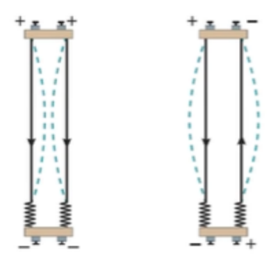
## 3. 安培力的大小
### 3.1. 安培力大小
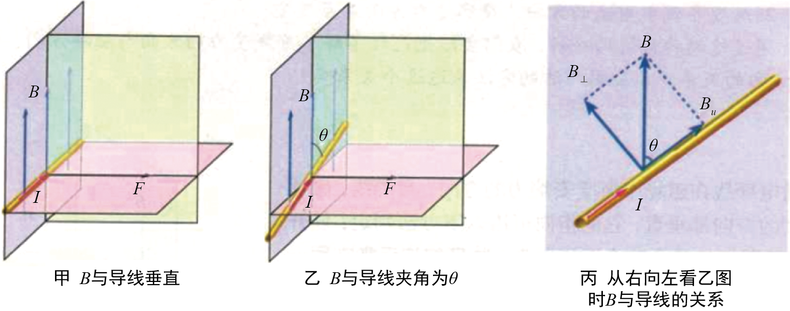
由磁感应强度的定义可知，垂直于磁场$B$ 放置，长为$L$ 的一段导线，当通过的电流为$I$ 时，它所受的安培力$F$为：$F=BIL$
1. 当磁感应强度 $B$ 的方向与导线的方向**平行**时，导线**受力为 $0$**。
2. 当磁感应强度 $B$ 的方向与导线方向成 $\theta$ 角时，可以将 $B$ 分解为与导线垂直的分量 $B_{\bot}$ 和与导线平行的分量 $B_{//}$。
根据矢量计算方法可得：$B_{\bot}=B\text{sin}\theta$，$B_{//}=B\text{cos}\theta$;
其中$B_{//}$不产生安培力，导线所受的安培力只是$B_{\bot}$产生的，由此可以得到安培力的一般表达式：
$$F=ILB\text{sin}\theta$$

## 4. 求安培力时的有效长度问题
你在整局比赛中可能做了很多操作, 但评比贡献时
### 4.1. 直导线的垂直分量
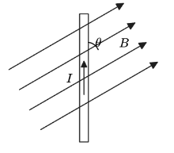
当 $I,B$ 不垂直时, 我们将磁场分解出垂直分量. 计算得到 $F_安=IBLsin\theta$.
那是否可以将导线分解?
理论上来说, 导线是一个实物, 不应该被分解. 但从结果上来说, 计算出的安培力是对的. 所以我们在计算安培力时, 如果 $I,B$ 不垂直, 可以看导线在垂直方向上的投影, 这就是第一种有效长度.
### 4.2. 非直导线处理成直导线   
**任何形状的导线, 在磁场中的受力总等于它从起到末的连线形成的导线.**
如图所示，在匀强磁场中放入下列各种形状的通电导电线，电流强度为 $I$ ，磁感应强度为 $B$ ，求各导线所受的安培力．

> [!quote] 证明
> 不加证明的给出一个结论:任意形状的闭合线圈，其有效长度 $L=0$。
> 利用这个结论,如何证明化曲为直的合理性?

练习一下:
请画出下图中通电导线所受的安培力方向，并用图中所给信息写出所受安培力大小。（图中各导体均通有大小为$I$，方向逆时针的电流）
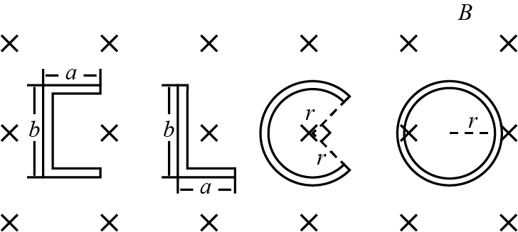

## 5. 安培力作用下的平衡问题

### 5.1. 安培力下的受力分析

1. 由安培力的产生原因可知，安培力是真实存在的力，需要在受力分析时分析安培力。
> [!question] 受力分析时不需要分析的效果力有哪些?


2. 安培力是**主动力**, 是可以利用 $I,L,B$ 等信息, 主动确定的力.当物体的受力平衡问题中出现安培力的时候，需要首先分析安培力和重力、已知力等.

3. 更新后的受力分析顺序为：
	①重力、安培力、已知力
	②弹力
	③摩擦力
### 5.2. 解决安培力作用下的导体平衡问题时需注意：
1. 将**立体图**转化为平面图（侧视图），突出电流方向和磁场方向，做受力分析。这是安培力分析中的一个难点所在, 需要一定的空间想象能力.
2. 安培力的分析要严格使用左手定则进行判断。
3. 注意安培力的方向和 $B$、$I$ 垂直。
4. 平衡问题，要写出平衡方程，然后求解。

# 题目练习

## 1. 1 级：安培力的方向

> [!ti] *2025~2026 学年 12 月北京西城区北京市第三十五中学高二上学期月考*
> 在如图所示的四幅图中，正确标明了通电导线所受安培力 $F$ 方向的是（　　）
> 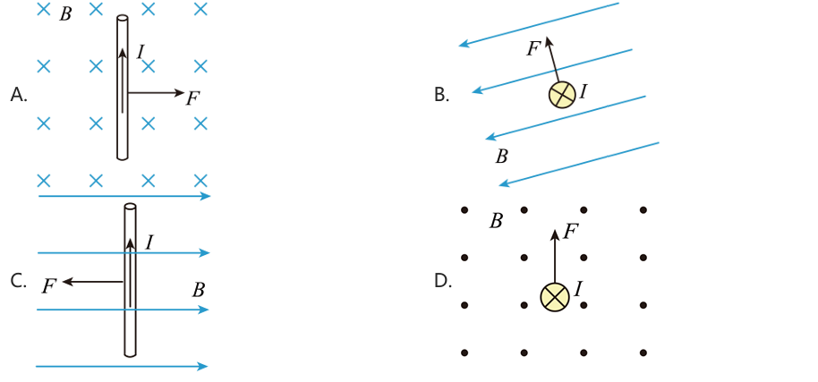

> [!ti] *2025~2026 学年北京延庆区高二上学期期末*
> （多选）下图中标出了匀强磁场的磁感应强度 $B$、通电直导线中的电流 $I$ 和它受到的安培力 $F$ 的方向，其中正确的是（　　）
> 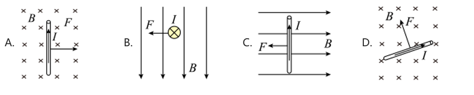

> [!ti] *2024~2025 学年北京顺义区北京市顺义区第一中学高二上学期期末*
> 如图所示的平面内，在通有图示方向电流 $I$ 的长直导线右侧，固定一矩形金属线框 $abcd$，$ad$ 边与导线平行，线框中的电流方向为 $a\to b\to c\to d\to a$，线框各边的相互作用力忽略不计。下列判断正确的是（　　）
> 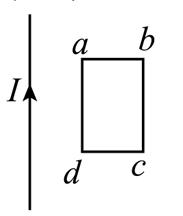
> > [!opts1]
> > - A. 线框 $ad$ 边所受的安培力方向向右
> > - B. 线框 $ab$ 边与 $cd$ 边受力相同
> > - C. 线框 $ad$ 边与 $bc$ 边受力相同
> > - D. 线框整体受到的安培力向左


## 2. 2 级：平行电流的相互作用
> [!ti] *2025~2026 学年北京海淀区北京市第二十中学高二上学期期末*
> 如图所示为研究平行通电直导线之间相互作用的实验装置。接通电路后发现两根导线均发生形变，此时通过导线 $M$ 和 $N$ 的电流大小分别为 $I_1$ 和 $I_2$，已知 $I_1>I_2$，方向均向上。若用 $F_1$ 和 $F_2$ 分别表示导线 $M$ 与 $N$ 受到的磁场力，则下列说法正确的是（　　）
> 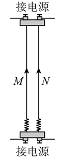
> > [!opts1]
> > - A. 两根导线相互排斥
> > - B. 为判断 $F_1$ 的方向，需要知道 $I_1$ 和 $I_2$ 的合磁场方向
> > - C. 两个力的大小关系为 $F_1>F_2$
> > - D. 仅增大电流 $I_2$，$F_1$、$F_2$ 会同时都增大
> > - 
<div class="page-break" style="page-break-before: always;"></div>


> [!ti] *2024 学年北京房山区高二上学期期末第 7 题 3 分*
> 两条平行的通电直导线 AB、CD 通过磁场发生相互作用，电流方向如图所示。下列说法正确的是（　　）
> 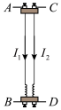
> > [!opts1]
> > - A. 两根导线之间将相互排斥
> > - B. AB 受到的力是由 $I_{2}$ 的磁场施加的
> > - C. 若 $I_{1}> I_{2}$，则 AB 受到的力大于 CD 受到的力
> > - D. $I_{1}$ 产生的磁场在 CD 所在位置方向垂直纸面向里


> [!ti] *2023~2024 学年北京海淀区北京一零一中高二上学期期中文科第 38 题 3 分*
> （多选）如图所示，两根导线互相平行，通了同方向的电流，下列说法正确的是（　　）
> 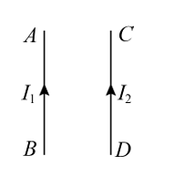
> > [!opts1]
> > - A. 导线 $AB$ 通了电流 $I_1$，其在 $CD$ 处产生的磁场方向向外
> > - B. 导线 $AB$ 通了电流 $I_1$，其在 $CD$ 处产生的磁场方向向里
> > - C. 导线 $CD$ 受到 $AB$ 的磁场的安培力作用，方向向左
> > - D. 导线 $CD$ 受到 $AB$ 的磁场的安培力作用，方向向右
<div class="page-break" style="page-break-before: always;"></div>


> [!ti] *2023~2024 学年北京东城区北京汇文实验中学高二上学期期中第 12 题 3 分*
> 如图所示为研究平行通电直导线之间相互作用的实验装置。接通电路后发现两根导线均发生形变，此时通过导线 $M$ 和 $N$ 的电流大小分别为 $I_1$ 和 $I_2$，已知 $I_1=2I_2$，其中 $M$ 的电流方向向下，$N$ 的电流方向向上。若用 $F_1$ 和 $F_2$ 分别表示导线 $M$ 与 $N$ 受到的磁场力，则下列说法正确的是（　　）
> 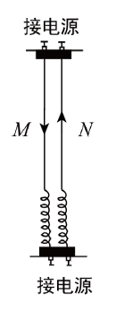
> 
> > [!opts1]
> > - A. 两根导线相互吸引
> > - B. 仅增大电流 $I_2$，$F_1$、$F_2$ 会同时都增大
> > - C. 两个力的大小关系为 $F_1=2F_2$
> > - D. 为判断 $F_2$ 的方向，需要知道 $I_1$ 和 $I_2$ 合磁场的方向


## 3. 3 级：安培力的大小
> [!ti] *例题*
> 已知磁场的磁感应强度为 $1\,\mathrm{T}$，磁场中导线的长度为 $1\,\mathrm{m}$，导线中电流为 $I=10\,\mathrm{mA}$。试求下列各图中导线所受安培力的大小。
> 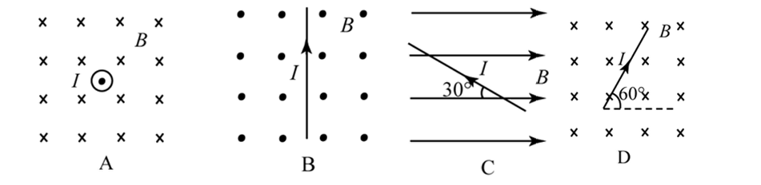
> （1）$F_A=$ ________ $\mathrm{N}$。                   （2）$F_B=$ ________ $\mathrm{N}$。
> （3）$F_C=$ ________ $\mathrm{N}$。                  （4）$F_D=$ ________ $\mathrm{N}$。
<div class="page-break" style="page-break-before: always;"></div>


> [!ti] *2023~2024 学年 12 月北京东城区北京市第一七一中学高二上学期月考第 3 题 3 分*
> 关于磁感应强度与通电导线在磁场中受力情况及相互关系，下列说法正确的是（　　）
> > [!opts1]
> > - A. 一小段通电直导线在磁场中不受安培力作用，则该处磁感应强度一定为零
> > - B. 一小段通电直导线所受安培力的方向一定与磁场方向垂直
> > - C. 一小段通电直导线所受安培力的方向、磁场方向、导线中的电流方向，这三者总是相互垂直的
> > - D. 通电直导线在磁场中所受安培力越大，其磁感应强度一定越大

> [!ti] *例题*
> 如图所示，磁场方向竖直向下，通电直导线 $ab$ 由水平位置绕 $a$ 点在竖直平面内转到位置 2，通电导线所受的安培力（　　）
> 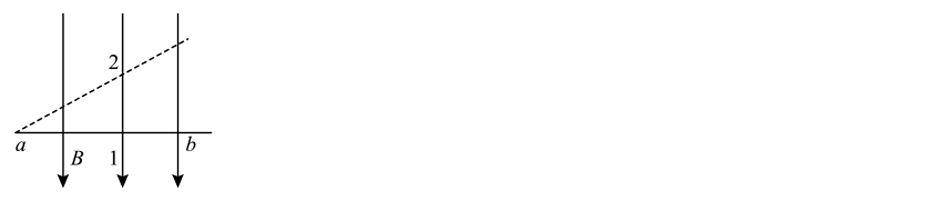
> 
> > [!opts2]
> > - A. 数值变大，方向不变
> > - B. 数值变小，方向不变
> > - C. 数值不变，方向改变
> > - D. 数值、方向均改变


> [!ti] *2024~2025 学年北京通州区高二上学期期末（1 月）*
> 在匀强磁场中，一根长 $l=0.5\,\mathrm{m}$ 的通电导线中的电流为 $I=10\,\mathrm{A}$，这条导线与磁场方向垂直时，受的磁场力为 $F=5\times10^{-3}\,\mathrm{N}$。
> （1）求磁感应强度 $B$ 的大小
> （2）把导线中的电流增大到 $I_1=20\,\mathrm{A}$，求此时磁场力的大小 $F_1$。

<div class="page-break" style="page-break-before: always;"></div>


> [!ti] *2023~2024 学年北京海淀区北京一零一中学高二上学期期末*
> 如图所示，两根平行直导轨 $MN$、$PQ$ 固定在同一水平面内，间距为 $L$。导轨的左端接有电源 $E$ 和开关 $S$，导体棒 $ab$ 垂直于导轨放置。空间存在斜向右上方的匀强磁场，其方向与轨道平面成 $\theta$ 角，且与导体棒 $ab$ 垂直。闭合开关 $S$，导体棒 $ab$ 仍保持静止。已知通过导体棒的电流为 $I$，则闭合开关 $S$ 后，下列说法正确的是（　　）
> 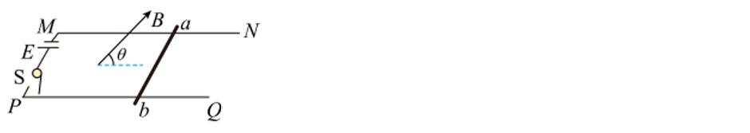
> 
> > [!opts1]
> > - A. 导体棒所受的摩擦力小于 $ILB$，方向水平向左
> > - B. 导体棒所受的摩擦力小于 $ILB$，方向水平向右
> > - C. 导体棒所受的安培力小于 $ILB$，方向水平向左
> > - D. 导体棒所受的安培力小于 $ILB$，方向水平向右


## 4. 4 级：有效长度问题
> [!ti] *2024 学年北京海淀区中国人民大学附属中学高二上学期期中第 8 题 3 分*
> 如图所示，匀强磁场的磁感应强度为 B，L 形导线通以恒定电流 I，放置在磁场中。已知 ab 边长为 $2l$，与磁场方向垂直，bc 边长为 $l$，与磁场方向平行。该导线受到的安培力为 （　　）
> 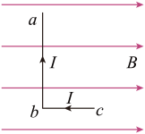
> > [!opts4]
> > - A. 0
> > - B. $~ IlB$
> > - C. $2IlB$
> > - D. $\sqrt{5}IlB$


> [!ti] *2023~2024 学年北京昌平区高二上学期期末（1 月）*
> 如图所示，匀强磁场的磁感应强度为 $B$，直角三角形导线框 $abc$ 通以恒定电流 $I$，放置在磁场中。已知 $ab$ 边长为 $l$，与磁场方向平行；$bc$ 边长为 $2l$，与磁场方向垂直。下列说法正确的是（　　）
> 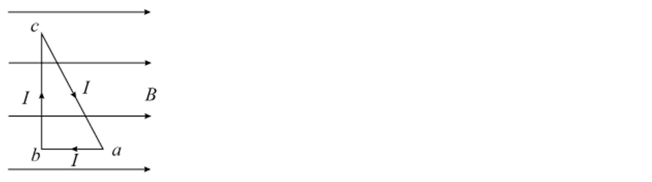
> 
> > [!opts2]
> > - A. $ab$ 边所受安培力大小为 $BIl$
> > - B. $bc$ 边所受安培力大小为 $BIl$
> > - C. $ca$ 边所受安培力大小为 $\sqrt{5}BIl$
> > - D. 整个导线框所受安培力为 $0$

<div class="page-break" style="page-break-before: always;"></div>


> [!ti] *例题*
> 如图所示，$AC$ 是一个用长为 $L$ 的导线弯成的、以 $O$ 为圆心的四分之一圆弧，将其放置在与平面 $AOC$ 垂直的磁感应强度为 $B$ 的匀强磁场中。当在该导线中通以由 $C$ 到 $A$、大小为 $I$ 的恒定电流时，该导线受到的安培力大小和方向是（　　）
> 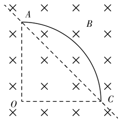
> 
> > [!opts1]
> > - A. $BIL$，平行于 $OC$ 向左
> > - B. $\dfrac{2\sqrt{2}BIL}{\pi}$，平行于 $OC$ 向右
> > - C. $\dfrac{2\sqrt{2}BIL}{\pi}$，垂直 $AC$ 的连线指向左下方
> > - D. $2\sqrt{2}BIL$，垂直 $AC$ 的连线指向左下方

> [!ti] *例题*
> 将闭合通电导线圆环平行于纸面缓慢地竖直向下放入水平方向垂直纸面向里的匀强磁场中，如图所示，则在通电圆环从刚进入到完全进入磁场的过程中，所受的安培力的大小（　　）
> 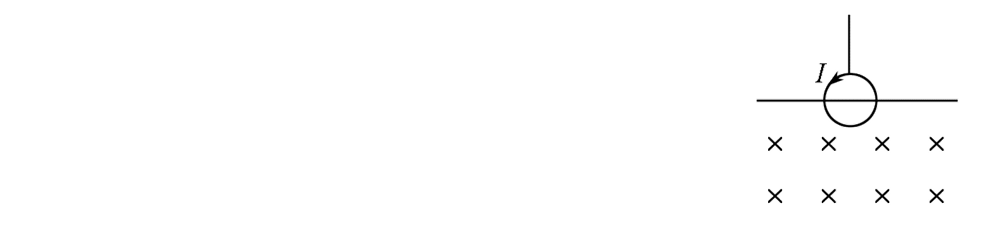
> > [!opts1]
> > - A. 逐渐增大
> > - B. 逐渐变小
> > - C. 先增大后减小
> > - D. 先减小后增大
<div class="page-break" style="page-break-before: always;"></div>


> [!ti] *2023~2024 学年北京西城区北京市第七中学高二上学期期中第 8 题 3 分*
> 如图所示，直径为 $d$ 的圆环中通有顺时针方向的电流 $I$，以通过圆心的虚线为界线，左侧有垂直圆环平面向外的匀强磁场，右侧有垂直圆环平面向里的匀强磁场，磁感应强度大小都为 $B$，则对圆环受到的安培力情况正确的是（　　）
> 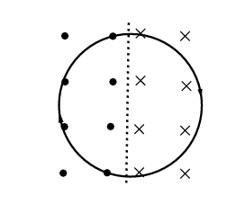
> > [!opts1]
> > - A. 受到的安培力的合力为 $0$
> > - B. 受到的安培力的合力大小为 $BdI$，方向垂直虚线向右
> > - C. 受到的安培力的合力大小为 $2BdI$，方向垂直虚线向左
> > - D. 受到的安培力的合力大小为 $2BdI$，方向垂直虚线向右


## 5. 5 级：安培力下的平衡问题
> [!ti] *2025~2026 学年 12 月北京东城区北京市第五十五中学高二上学期月考*
> 如图甲所示，在倾角为 $37^\circ$ 的光滑斜面上水平放置一根长为 $0.2\,\mathrm{m}$ 的金属杆 $PQ$，两端以很软的导线通入 $1\,\mathrm{A}$ 的电流。斜面及金属杆处在竖直向上的匀强磁场中，当磁感应强度 $B=0.6\,\mathrm{T}$ 时，$PQ$ 恰好处于平衡状态。（$\sin37^\circ=0.6$，$\cos37^\circ=0.8$，$g=10\,\mathrm{m/s^2}$）
>
> （1）在图乙中画出金属杆受力的示意图；
>
> （2）求金属杆 $PQ$ 受到的安培力的大小；
>
> （3）求金属杆 $PQ$ 的质量。
> 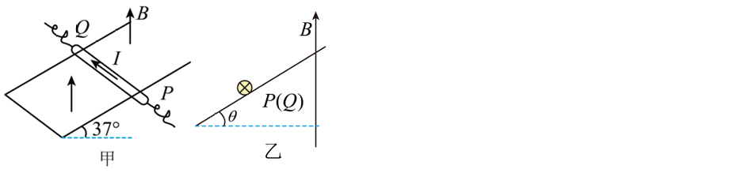

<div class="page-break" style="page-break-before: always;"></div>


> [!ti] *2024~2025 学年北京怀柔区高二上学期期末*
> 如图所示，在水平地面上固定一对与水平面夹角为 $\theta$ 的光滑平行金属导轨，顶端接有电源，直导体棒 $ab$ 垂直两导轨放置，且与两轨道接触良好，整套装置处于匀强磁场中。图为沿 $a\to b$ 方向观察的侧视图，下面四幅图中所加磁场能使导体棒 $ab$ 静止在轨道上的是（　　）
> 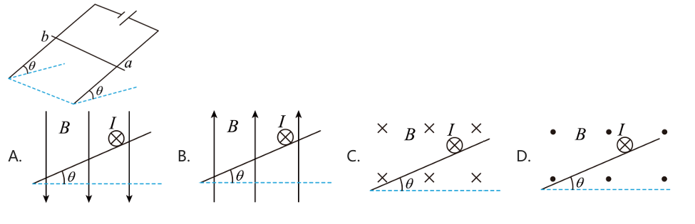


> [!ti] *例题*
> （多选）质量为 $m$ 的通电细杆 $ab$ 垂直置于倾角为 $\theta$ 的平行导轨上，导轨宽度为 $d$，杆 $ab$ 与导轨间的动摩擦因数为 $\mu$，有电流时 $ab$ 恰好在导轨上静止，如图所示是沿 $ab$ 方向观察时的四个平面图，图中标出了四种不同的匀强磁场方向，其中杆与导轨间的摩擦力可能为零的是（　　）
> 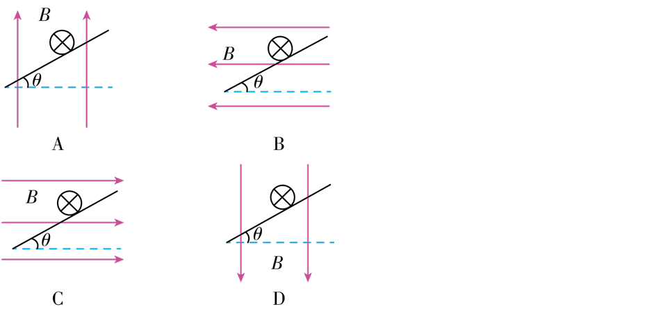
> 
> > [!opts4]
> > - A. A
> > - B. B
> > - C. C
> > - D. D
<div class="page-break" style="page-break-before: always;"></div>


> [!ti] *2025~2026 学年 12 月北京朝阳区北京市第八十中学高二上学期月考*
> 如图所示，宽为 $L$ 的固定光滑平行金属导轨与水平面成 $\alpha$ 角，金属杆 $ab$ 水平放置在导轨上，且与导轨垂直，处于磁感应强度大小为 $B$、方向竖直向上的匀强磁场中。电源电动势为 $E$，当电阻箱接入电路的阻值为 $R_0$ 时，金属杆恰好保持静止。不计电源内阻、导轨和金属杆的电阻，重力加速度为 $g$。
> 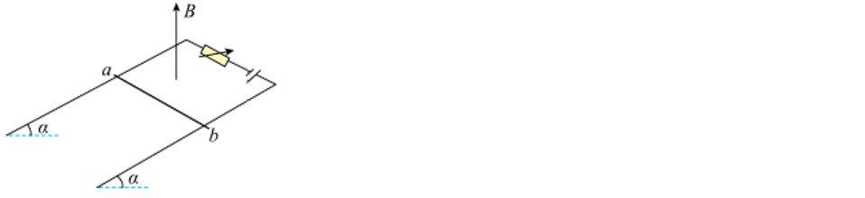
> 
> （1）求金属杆所受安培力的大小 $F$。
>
> （2）求金属杆的质量 $m$。
>
> （3）保持磁感应强度大小不变，改变其方向，同时调整电阻箱接入电路的阻值 $R$ 以保持金属杆静止，求 $R$ 的最大值。


> [!ti] *2023~2024 学年 12 月北京西城区北京市第一六一中学高三上学期月考*
> 如图所示，质量为 $m$、长为 $l$ 的直导线用两条绝缘细线悬挂于 $O$、$O'$，并处于匀强磁场中。当导线中通以沿 $x$ 轴正方向的电流 $I$，且导线保持静止时，悬线与竖直方向夹角为 $\theta$。该磁场的磁感应强度可能是（　　）
> 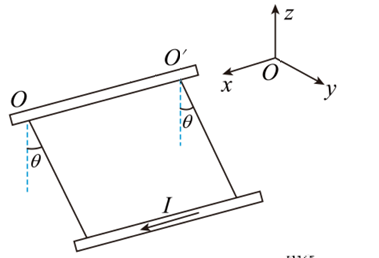
> > [!opts2]
> > - A. 方向沿 $z$ 轴正方向，大小为 $\dfrac{mg}{Il}\tan\theta$
> > - B. 方向沿 $y$ 轴正方向，大小为 $\dfrac{mg}{Il}$
> > - C. 方向沿悬线向上，大小为 $\dfrac{mg}{Il}\sin\theta$
> > - D. 方向垂直悬线向上，大小为 $\dfrac{mg}{Il}\sin\theta$

<div class="page-break" style="page-break-before: always;"></div>


## 出门测

> [!ti] *例题*
> 下图中标出了匀强磁场的磁感应强度 $B$、通电直导线中的电流 $I$ 和它受到的安培力 $F$ 的方向，其中正确的是（　　）
> 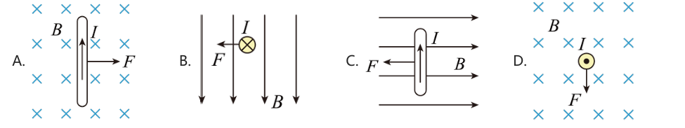

> [!ti] *例题*
> 两条平行的通电直导线 $AB$、$CD$ 通过磁场发生相互作用，电流方向如图所示。下列说法正确的是（　　）
> 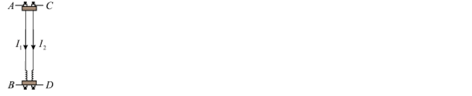
> 
> > [!opts1]
> > - A. 两根导线之间将相互排斥
> > - B. $AB$ 受到的力是由 $I_2$ 的磁场施加的
> > - C. 若 $I_1>I_2$，则 $AB$ 受到的力大于 $CD$ 受到的力
> > - D. $I_1$ 产生的磁场在 $CD$ 所在位置方向垂直纸面向里

> [!ti] *例题*
> 将一段长 $L=0.2\,\mathrm{m}$、通有电流 $I=2.5\,\mathrm{A}$ 的直导线放入磁感应强度为 $B$ 的磁场中，则关于其所受安培力 $F$ 的说法正确的是（　　）
> > [!opts2]
> > - A. 若 $B=2\,\mathrm{T}$，则 $F$ 可能为 $1\,\mathrm{N}$
> > - B. 若 $F=0$，则 $B$ 也一定为零
> > - C. 若 $B=4\,\mathrm{T}$，则 $F$ 一定为 $2\,\mathrm{N}$
> > - D. 当 $F$ 为最大值时，通电导线一定与 $B$ 平行
<div class="page-break" style="page-break-before: always;"></div>


> [!ti] *例题*
> 如图，导体棒 $ABC$ 和 $DEF$ 中的电流均为 $I$，方向分别为 $A\to B\to C$ 和 $D\to E\to F$。其中 $AB=BC=DE=EF=d$，匀强磁场的磁感应强度均为 $B$，方向如图中所示，关于棒受到的安培力说法正确的是（　　）
> 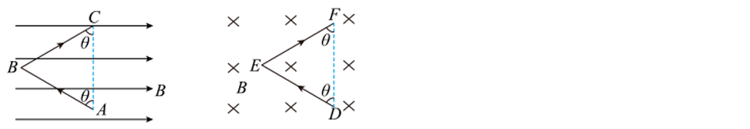
> 
> > [!opts1]
> > - A. $AB$ 棒受到的安培力的大小为 $BId$
> > - B. $ABC$ 棒的安培力的合力大小为 $2BId$
> > - C. $DEF$ 棒的安培力的合力大小为 $2BId\sin\theta$
> > - D. $ABC$ 棒和 $DEF$ 棒受到的安培力的合力大小相等


> [!ti] *例题*
> 如图所示，质量为 $m$，通电电流为 $I$ 的金属棒 $ab$ 置于磁感应强度为 $B$ 的匀强磁场中，磁场方向与宽为 $L$ 的水平导轨平面夹角为 $\theta$，金属棒 $ab$ 处于静止状态。下列说法正确的是（　　）
> 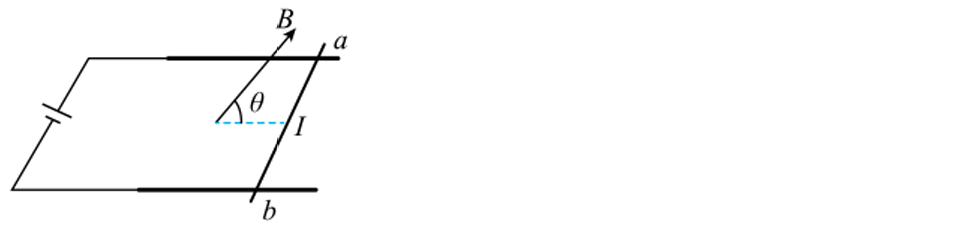
> > [!opts1]
> > - A. 金属棒受到的安培力大小为 $BIL\sin\theta$
> > - B. 金属棒受到的支持力大小为 $BIL\cos\theta$
> > - C. 若只减小夹角 $\theta$，金属棒受到的摩擦力将减小
> > - D. 若只改变电流方向，金属棒对导轨的压力将减小
<div class="page-break" style="page-break-before: always;"></div>


