# 第4讲 电势差与等势面 #h0
# 知识讲解
## 电势差与场强的关系
### 推导
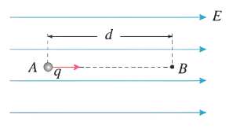
1. 如图所示，带电量为 $+q$ 的点电荷在匀强电场中由 $A$ 点运动到 $B$ 点的过程中：
（1）若已知匀强电场场强为 $E$，$A$、$B$ 两点间距离为 $d$，求电场力对电荷做的功；
（2）若已知 $A$、$B$ 两点间的电势差为 $U$，求电场力对电荷做的功；
（3）比较以上两问中的做功，说明匀强电场中电势差与场强有什么关系？
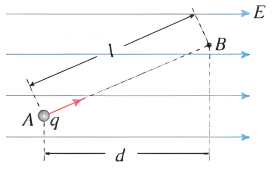
2. 如图所示，若 $A$、$B$ 间距离为 $l$，与场强方向不在同一条电场线上，请你分析说明以上结论还成立吗？
### 场强与电势差的关系
1. 大小关系：$U_{AB}=Ed$ 或 $E=\dfrac{U_{AB}}{d}$。
2. 意义：在匀强电场中，电场强度大小等于两点间电势差与两点沿电场强度方向距离的比值。
3. 电场强度的单位：伏每米（$\mathrm{V/m}$）。$1\,\mathrm{V/m}=1\,\mathrm{N/C}$。
$$
1\,\mathrm{V/m}
=\dfrac{1\,\mathrm{J/C}}{1\,\mathrm{m}}
=\dfrac{1\,\mathrm{N\cdot m}}{1\,\mathrm{C\cdot m}}
=1\,\mathrm{N/C}
$$
4. 说明
	1）$E=\dfrac{U_{AB}}{d}$ 表明，在匀强电场中，电场强度在数值上等于沿电场强度方向上单位距离的电势差。
	2）电场强度 $E$ 的方向是电势降低最快的方向。
## 等势面
### 推导
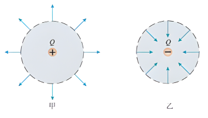
如图所示，点电荷形成的电场中，以场源电荷为球心的某个球面上的两个点间移动电荷： 
1. 电场力做功吗？为什么？
2. 电势能变化吗？
3. 这两点的电势变化吗？
### 定义
1. 定义：电场中电势相等的各点组成的面。
2. 特点 
	1. 等势面一定与电场线垂直，即跟场强的方向垂直。 
	2. 电荷在同一等势面上移动时，电场力不做功。 
	3. 电场线总是从电势高的等势面指向电势低的等势面。 
	4. 不同的等势面不相交.
	5. 等差等势面越密的地方电场强度越大，反之越小。
> [!check] 解释上述特点

### 常见电场的等势面
1. 点电荷
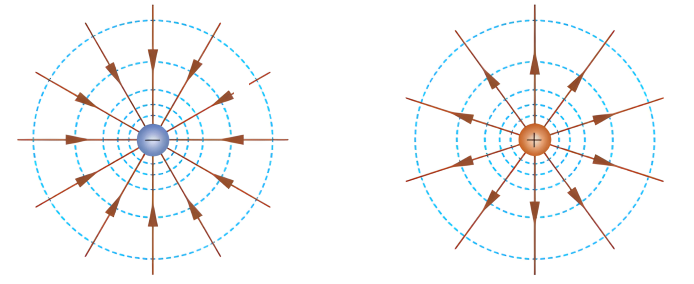
2. 两个点电荷
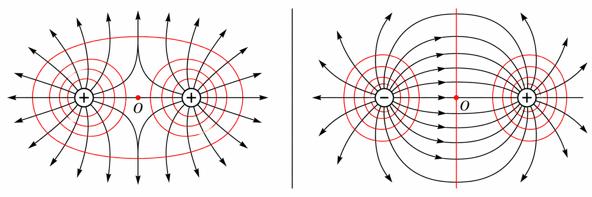
3. 匀强电场的等势面
 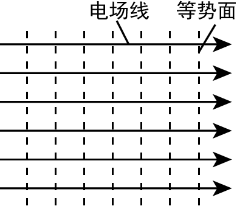
4. 一头大一头小的导体的等势面。
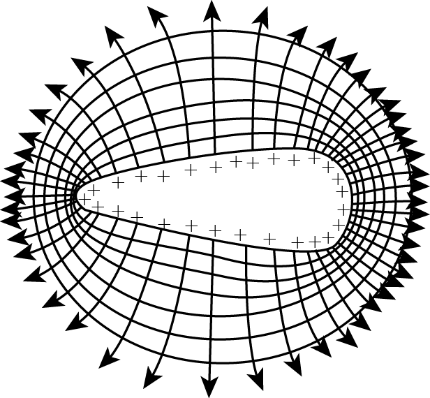
> [!question] 等势面
> 在上面实例中我们不难发现，任何一个带电体的等势面之间是有空隙的，那是不是就意味着中间没有等势面？或者有，我们漏画了？
### 等势面的应用
通过等势面, 可以获取
1. 电势高低的信息, 电势的变化又反映了电势能, 利用能量方法.
2. 等势面还可以判断电场线, 电场线反映电场力, 可以利用牛二或功能关系.

## 电场中各物理量之间的联系
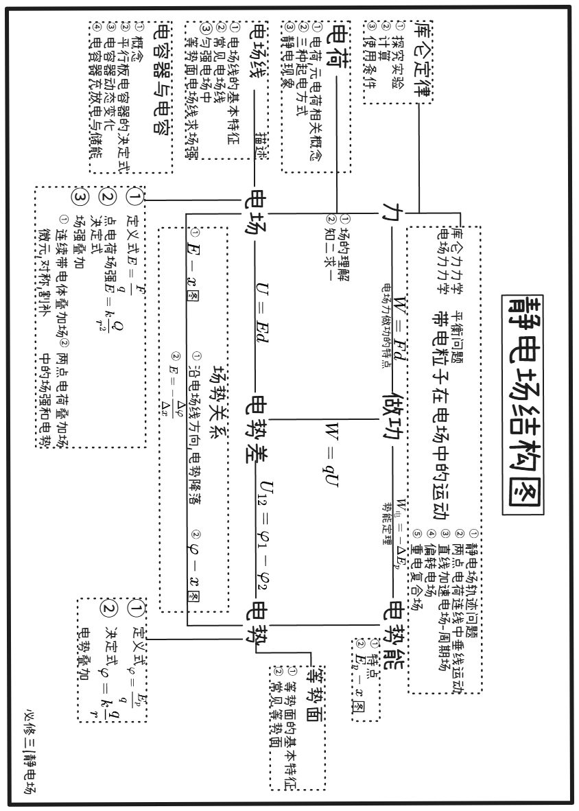

## 静电感应
### 静电平衡
1. 把金属导体放在外电场 $E_0$ 中，由于导体内的自由电子受电场力作用而定向运动，使导体的两个端面出现等量的异种电荷，这种现象叫**静电感应**.

2. **达到静电平衡的过程:**
发生静电感应的导体两端感应的等量异种电荷形成一附加电场 $E^{\prime}$ ，当附加电场与外电场完全抵消，即 $E^{\prime}=E$ 时，导体内实际电场 $E=0$ ，自由电子的定向移动停止，这时的导体处于静电平衡状态.
3. **静电平衡状态下导体特点：**
导体内部与表面相对, 不同于导体空腔.
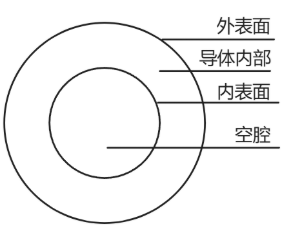
	1. 场强:导体内部的场强（即合场）处处为零；
	2. 电势:整个导体是个等势体，它的表面是个等势面；
	3. 电势:导体表面任意点的场强方向与该表面垂直；
	4. 电荷分布导体内部没有净电荷, 净电荷只分布在导体的外表面;
	5. 电荷分布导体所带的电荷分布在导体表面上．越尖锐的地方电荷密度越大，凹陷的位置几乎没有电荷 (尖端放电)．

> [!question] 尝试解释 1,2,3
> 4,5 无法利用高中知识解释
### 静电屏蔽
如果导体内部存在空腔, 空腔内部是否存在电场?
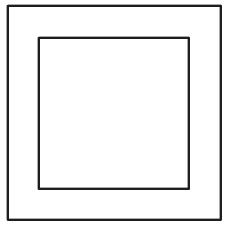
1. 定义
把一个电学仪器放在封闭的金属壳里，即使壳外有电场，由于壳内电场强度保持为零，外电场对壳内的仪器不会产生影响，金属壳的这种作用叫静电屏蔽．
2. 实质
静电屏蔽实际上利用了静电感应现象，使金属壳内感应电荷的电场和外加电场矢量和为零，好像是金属壳将外电场“挡”在外面，即所谓的屏蔽作用，其实是壳内两种电场并存，矢量和为零．
3. 静电屏蔽的两种情况
	1. 导体外部的电场不影响导体内部
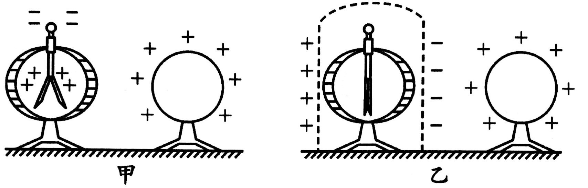
	2. 接地导体的内部电场不影响导体外部
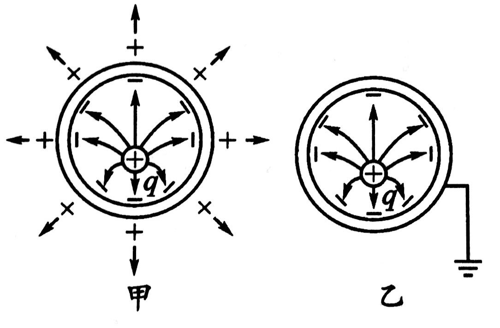

# 题目练习

## 1级：电势差与场强的关系

> [!ti] *2023学年北京丰台区高二上学期期末第17题*
> 如图所示，带有等量异种电荷的两平行板之间有匀强电场，电场强度$E=2\times 10^{3}\mathrm{N}/\mathrm{C}$，方向水平向右。电场中A、$B$两点相距$5\mathrm{cm}$，连线与电场线平行。在A点由静止释放电荷量$q=4\times 10^{-8}\mathrm{C}$的正电荷。求：
> （1）电荷受到的静电力$F$的大小；
> （2）A、$B$两点之间的电势差$U_{AB}$；
> （3）电荷从A点运动到$B$点过程中静电力做的功$W$。
> 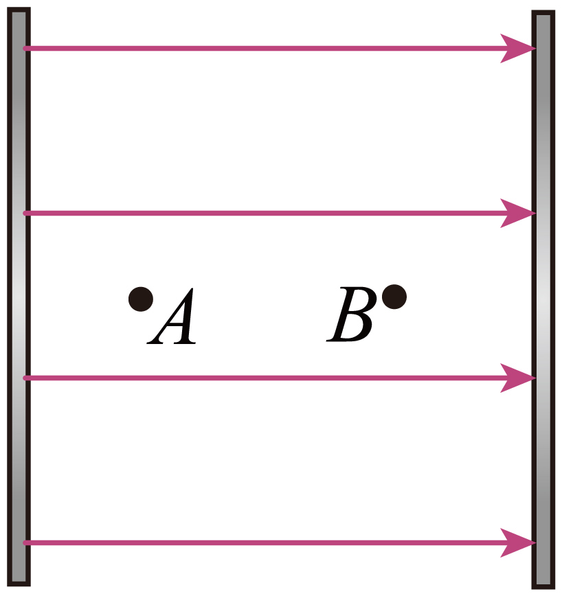

> [!ti] *2025~2026 学年北京海淀区北京市八一学校高二上学期期中*
> 如图所示，在匀强电场中，$A$、$B$ 为同一条电场线上的两点。已知电场的电场强度大小 $E=1.0\times10^4\,\mathrm{V/m}$，$A$、$B$ 两点之间的距离 $d=0.20\,\mathrm{m}$。
> 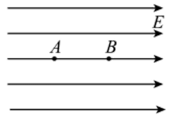
> （1）求 $A$、$B$ 两点之间的电势差 $U_{AB}$；
>
> （2）将电荷量 $q=+1.0\times10^{-8}\,\mathrm{C}$ 的试探电荷沿电场线由 $A$ 点移至 $B$ 点，求在此过程中静电力对试探电荷所做的功 $W$。
>
> （3）场是物理学中的重要概念，除了电场和磁场，还有重力场。地球附近的物体就处在地球产生的重力场中，仿照电势的定义，你认为应该怎样定义地球表面附近 $h$ 处的重力势（取地球表面为零势面，认为地球表面附近重力加速度 $g$ 不变）。

> [!ti] *2024~2025 学年北京延庆区高二上学期期中*
> （多选）如图所示，在匀强电场中，将电荷量为 $-6\times10^{-6}\,\mathrm{C}$ 的点电荷从电场中的 $A$ 点移到 $B$ 点，静电力做了 $-2.4\times10^{-5}\,\mathrm{J}$ 的功，再从 $B$ 点移到 $C$ 点，静电力做了 $1.2\times10^{-5}\,\mathrm{J}$ 的功。已知电场的方向与直角 $\triangle ABC$ 所在的平面平行，$AB$ 长 $6\,\mathrm{cm}$，$BC$ 长 $4\,\mathrm{cm}$。下列说法正确的是（　　）
> 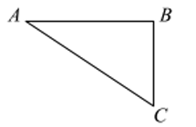
> > [!opts1]
> > - A. $A$、$B$ 两点间的电势差 $U_{AB}=4\,\mathrm{V}$
> > - B. $B$、$C$ 两点间的电势差 $U_{BC}=2\,\mathrm{V}$
> > - C. 电场强度的大小为 $\dfrac{5}{6}\times10^2\,\mathrm{V/m}$
> > - D. 场强的方向垂直于 $AC$ 指向 $B$

> [!ti] *2025~2026 学年 9 月北京东城区北京市广渠门中学高二上学期月考*
> 图为描述某静电场的电场线，$a$、$b$、$c$ 是同一条电场线上的三个点，$ab=bc$，其电场强度大小分别为 $E_a$、$E_b$、$E_c$，电势分别为 $\varphi_a$、$\varphi_b$、$\varphi_c$。下列说法正确的是（　　）
> 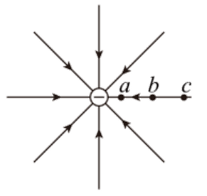
> > [!opts1]
> > - A. $E_a>E_b>E_c$
> > - B. $E_a<E_b<E_c$
> > - C. $\varphi_a>\varphi_b>\varphi_c$
> > - D. $U_{ab}=U_{bc}$

> [!ti] *例题*
> 如图所示，匀强电场场强为 $E$，$A$ 与 $B$ 两点间的距离为 $d$，$AB$ 与电场夹角为 $\alpha$，则 $A$ 与 $B$ 两点间的电势差为（　　）
> 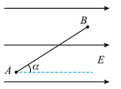
> > [!opts4]
> > - A. $Ed$
> > - B. $Ed\cos\alpha$
> > - C. $Ed\sin\alpha$
> > - D. $Ed\tan\alpha$

## 2级：等势面

> [!ti] *例题*
> 下列关于等势面的说法正确的是
> > [!opts1]
> > - A. 电荷在等势面上移动时不受电场力作用，所以不做功
> > - B. 等势面上各点的场强相等
> > - C. 点电荷形成的电场的等差等势面是以点电荷为圆心的一簇等间距的球面
> > - D. 匀强电场中的等差等势面是相互平行的垂直于电场线的一簇等间距平面
> > - E. 两个电势不同的等势面可能相交
> > - F. 电场线与等势面处处相互垂直
> > - G. 同一电场中等差等势面密的地方电场强度反而小
> > - H. 将一试探电荷从电势较高的等势面移至电势较低的等势面，电势能不一定减小
> > - I. 沿电场线方向电势升高

> [!ti] *2025~2026 学年北京大兴区大兴区第一中学高二上学期期中模拟*
> 如图所示实线为某一静电场中的一组等势线，$A$、$B$ 为同一等势线上两点，下列说法正确的是（　　）
> 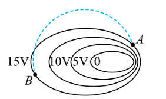
> > [!opts1]
> > - A. 该电场可能是某一负点电荷产生
> > - B. $A$ 点电场强度大于 $B$ 点电场强度
> > - C. $B$ 点电场强度方向沿图中等势线切线方向
> > - D. 将试探电荷沿虚线轨迹从 $A$ 点移到 $B$ 点的过程中，电场力始终不做功

> [!ti] *2025~2026 学年北京朝阳区对外经济贸易大学附属中学高二上学期期中*
> 某带正电的导体周围的电场线和等势线的分布如图所示，用 $E_A$、$\varphi_A$ 和 $E_B$、$\varphi_B$ 分别表示 $A$、$B$ 两点的电场强度大小和电势，下列关系式正确的是（　　）
> 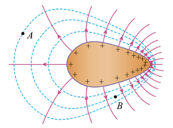
> > [!opts4]
> > - A. $E_A>E_B$
> > - B. $E_A=E_B$
> > - C. $\varphi_A>\varphi_B$
> > - D. $\varphi_A<\varphi_B$

> [!ti] *2025~2026 学年北京顺义区北京市顺义区牛栏山第一中学高二上学期期中（11 月）*
> 如图所示某电场的部分电场线和等势线，下列说法正确的是（　　）
> 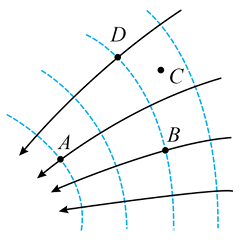
> > [!opts1]
> > - A. $C$ 点的电场强度为零
> > - B. $BD$ 所在的曲线是电场线
> > - C. $A$ 点的电势低于 $B$ 点的电势
> > - D. 因为 $U_{AB}<0$，所以电势差是矢量

> [!ti] *例题*
> 如图所示，实线为电场线，虚线为等势面，$\varphi_a=50\,\mathrm{V}$，$\varphi_c=20\,\mathrm{V}$，则 $a$、$c$ 连线中点的电势 $\varphi_b$ 为（　　）
> 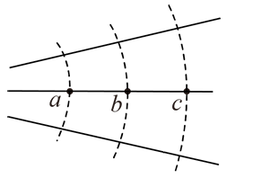
> > [!opts4]
> > - A. 等于 $35\,\mathrm{V}$
> > - B. 大于 $35\,\mathrm{V}$
> > - C. 小于 $35\,\mathrm{V}$
> > - D. 等于 $15\,\mathrm{V}$

## 3级：等势面的应用

> [!ti] *2025学年9月北京通州区潞河中学高二上学期月考（选考）第2题*
> 图中实线表示某静电场的电场线，虚线表示该电场的等势面。A、B两点处电场强度大小分别为EA、EB，电势分别为φA、φB。下列说法正确的是（　　）
> 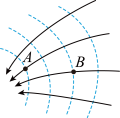
> > [!opts1]
> > - A. 该电场可能是正点电荷产生的
> > - B. 同一点电荷放在A点受到的静电力比放在B点时受到的静电力大
> > - C. 一点电荷在A点的电势能小于B点
> > - D. 正电荷在A点由静止释放，将始终沿A点所在的那条电场线运动

> [!ti] *2025~2026 学年 10 月北京西城区北京师范大学附属中学高二上学期月考*
> 真空中某点电荷的等势面示意如图，图中相邻等势面间电势差相等。下列说法正确的是（　　）
> 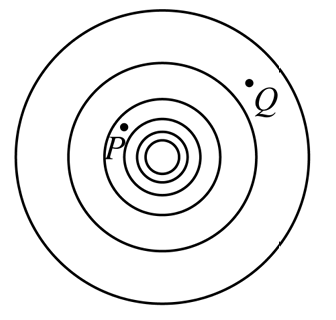
> > [!opts1]
> > - A. 该点电荷一定为正电荷
> > - B. $P$ 点的场强一定比 $Q$ 点的场强大
> > - C. $P$ 点电势一定比 $Q$ 点电势低
> > - D. 正检验电荷在 $P$ 点比在 $Q$ 点的电势能大

> [!ti] *2025~2026 学年 10 月北京西城区北京师范大学附属中学高二上学期月考*
> 如图所示，$a$、$b$ 两点位于以负点电荷 $-Q$（$Q>0$）为球心的球面上，$c$ 点在球面外，则（　　）
> 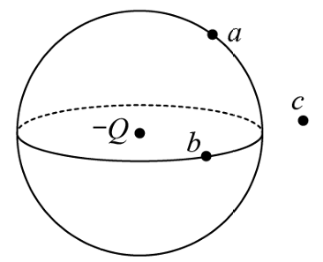
> > [!opts2]
> > - A. $a$ 点场强的大小比 $b$ 点大
> > - B. $b$ 点场强的大小比 $c$ 点小
> > - C. $a$ 点电势比 $b$ 点高
> > - D. $b$ 点电势比 $c$ 点低

> [!ti] *2024~2025 学年北京海淀区北京市育英学校高二上学期期中*
> 图中实线表示某静电场的电场线，虚线表示该电场的等势面。$A$、$B$ 两点处电场强度大小分别为 $E_A$、$E_B$，电势分别为 $\varphi_A$、$\varphi_B$。下列说法正确的是（　　）
> 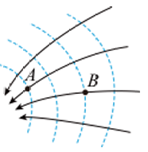
> > [!opts1]
> > - A. 该电场可能是正点电荷产生的
> > - B. 同一点电荷放在 $A$ 点受到的静电力比放在 $B$ 点时受到的静电力大
> > - C. 一点电荷在 $A$ 点的电势能小于 $B$ 点
> > - D. 正电荷在 $A$ 点由静止释放，将始终沿 $A$ 点所在的那条电场线运动

> [!ti] *2024~2025 学年北京石景山区北京市第九中学高二上学期期中*
> 如图所示的电场线和等势线，下列说法中不正确的是（　　）
> 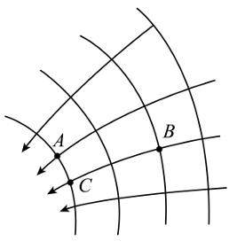
> > [!opts1]
> > - A. $E_A>E_B$
> > - B. $\varphi_A<\varphi_B$
> > - C. 把同一电荷由 $B$ 移到 $C$ 和由 $B$ 移到 $A$ 静电力做功一样多
> > - D. 同一电荷在 $B$ 点的电势能一定大于在 $C$ 点的电势能

> [!ti] *例题*
> 如图所示，实线表示某静电场的电场线，虚线表示该电场的等势面。下列判断正确的是（　　）
> 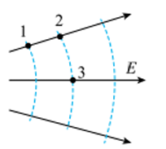
> > [!opts2]
> > - A. 1、2 两点的场强相同
> > - B. 2、3 两点的场强相同
> > - C. 1、2 两点的电势相等
> > - D. 2、3 两点的电势相等

## 4级：电场中各物理量间的关系

> [!ti] *2023学年北京通州区高二上学期期中模拟第11题*
> 关于电场强度、电场线、电势，以下各种说法中正确的是（　　）
> > [!opts1]
> > - A. 电场线方向，是电势降落最快的方向
> > - B. 电场强度相同的地方，电势也相同
> > - C. 电场强度大的地方，电势也一定高
> > - D. 电势降落的方向，一定是电场强度的方向

> [!ti] *2025~2026 学年北京大兴区大兴区第一中学高二上学期期中模拟*
> 如图所示，带有等量异种电荷、相距 $10\,\mathrm{cm}$ 的平行板 $A$ 和 $B$ 之间有匀强电场，电场强度方向向下。电场中 $C$ 点距 $B$ 板 $3\,\mathrm{cm}$，$D$ 点距 $A$ 板 $2\,\mathrm{cm}$。已知一个电子从 $C$ 点移动到 $D$ 点的过程中，受到的电场力大小为 $3.2\times10^{-15}\,\mathrm{N}$。（已知电子电荷量大小 $e=1.6\times10^{-19}\,\mathrm{C}$）
> 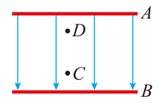
> （1）求电场强度 $E$ 的大小；
>
> （2）求 $C$、$D$ 两点间的电势差 $U_{CD}$；
>
> （3）若将平行板 $B$ 接地，求电子在 $D$ 点的电势能 $E_{pD}$。

> [!ti] *2024~2025 学年北京朝阳区北京市和平街第一中学莲葩园校区高二上学期期中*
> 下列物理量中与试探电荷有关的是（　　）
> > [!opts4]
> > - A. 电场力 $F$
> > - B. 电场强度 $E$
> > - C. 电势 $\varphi$
> > - D. 电势差 $U_{AB}$

> [!ti] *例题*
> 关于电场强度、电场线、电势，以下各种说法中正确的是（　　）
> > [!opts1]
> > - A. 电场线方向，是电势降落最快的方向
> > - B. 电场强度相同的地方，电势也相同
> > - C. 电场强度大的地方，电势也一定高
> > - D. 电势降落的方向，一定是电场强度的方向

> [!ti] *2024~2025 学年北京通州区高二上学期期中*
> 图为描述某静电场的电场线，$a$、$b$、$c$ 是同一条电场线上的三个点，$ab=bc$，其电场强度大小分别为 $E_a$、$E_b$、$E_c$，电势分别为 $\varphi_a$、$\varphi_b$、$\varphi_c$。
>
> （1）关于 $E_a$、$E_b$、$E_c$ 的大小，下列说法正确的是（　　）
> 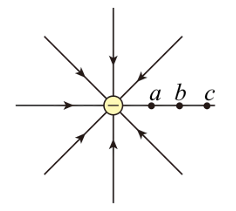
> > [!opts2]
> > - A. $E_a<E_b<E_c$
> > - B. $E_a=E_b=E_c$
> > - C. $E_a>E_b>E_c$
> > - D. $E_a=E_b$，$E_b>E_c$
>
> （2）把带正电的点电荷沿电场线由 $a$ 点移至 $c$ 点的过程中，该点电荷所受的静电力（　　）
> > [!opts4]
> > - A. 先变大后变小
> > - B. 越来越大
> > - C. 保持不变
> > - D. 越来越小
>
> （3）关于 $\varphi_a$、$\varphi_b$、$\varphi_c$ 的高低，下列说法正确的是（　　）
> > [!opts2]
> > - A. $\varphi_a<\varphi_b<\varphi_c$
> > - B. $\varphi_a=\varphi_b=\varphi_c$
> > - C. $\varphi_a>\varphi_b>\varphi_c$
> > - D. $\varphi_a<\varphi_b$，$\varphi_b=\varphi_c$
>
> （4）设 $b$、$a$ 两点间电势差为 $U_{ba}$，$c$、$b$ 两点间电势差为 $U_{cb}$，下列关于 $U_{ba}$ 和 $U_{cb}$ 的大小关系说法正确的是（　　）
> > [!opts4]
> > - A. $U_{ba}<U_{cb}$
> > - B. $U_{ba}=U_{cb}$
> > - C. $U_{ba}>U_{cb}$
> > - D. 无法判断
>
> （5）把带负电的点电荷沿电场线由 $a$ 点移至 $b$ 点的过程中，关于静电力对电荷所做的功及电荷电势能的变化，下列说法中正确的是（　　）
> > [!opts2]
> > - A. 静电力做正功，电势能增加
> > - B. 静电力做正功，电势能减少
> > - C. 静电力做负功，电势能增加
> > - D. 静电力做负功，电势能减少

> [!ti] *2024~2025 学年北京丰台区高二上学期期中*
> 如图所示，空间有一匀强电场，方向与水平方向成 $60^\circ$ 夹角。该电场中 $A$、$B$ 两点在同一水平直线上，间距为 $2\,\mathrm{cm}$，一个电荷量为 $q=+1.0\times10^{-6}\,\mathrm{C}$ 的试探电荷在该匀强电场中所受电场力的大小为 $F=3.0\times10^{-4}\,\mathrm{N}$，求：
> 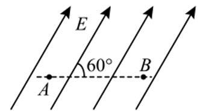
> （1）电场强度的大小 $E$；
>
> （2）$A$、$B$ 两点间的电势差 $U_{AB}$；
>
> （3）将该试探电荷从 $A$ 点移至 $B$ 点的过程中，电场力所做的功 $W_{AB}$。

## 5级：静电平衡

> [!ti] *2022学年北京海淀区北京一零一中学高二上学期期中第3题3分*
> 一个不带电的金属导体在电场中处于静电平衡状态，下列说法正确的是（       ）
> > [!opts1]
> > - A. 导体内部场强处处为零
> > - B. 导体上各点的电势不相等
> > - C. 导体外表面的电荷一定均匀分布
> > - D. 在导体外表面，越尖锐的位置单位面积上分布的电荷量越少

> [!ti] *2023~2024 学年 10 月北京怀柔区北京市怀柔区第一中学高二上学期月考*
> （多选）不带电的金属导体 $MNPQ$ 的内部电荷包括自由电子和金属离子（即金属原子失去自由电子后的剩余部分），如图所示为导体内部电荷的简化示意图，其中“$\ominus$”表示自由电子，“$\oplus$”表示金属离子。把导体放到电场强度为 $E_0$ 的匀强电场中，由于库仑力的作用，导体内部的电荷将重新分布。图是同学们画出的四幅图，其中 A、B 两图描述了导体刚放入电场未达到静电平衡状态时，自由电子和金属离子的定向运动情况（图中箭头代表它们定向运动的方向）；C、D 两图描述了导体达到静电平衡后，自由电子和金属离子的分布情况。则下列的四幅图中，可能正确的是（　　）
> 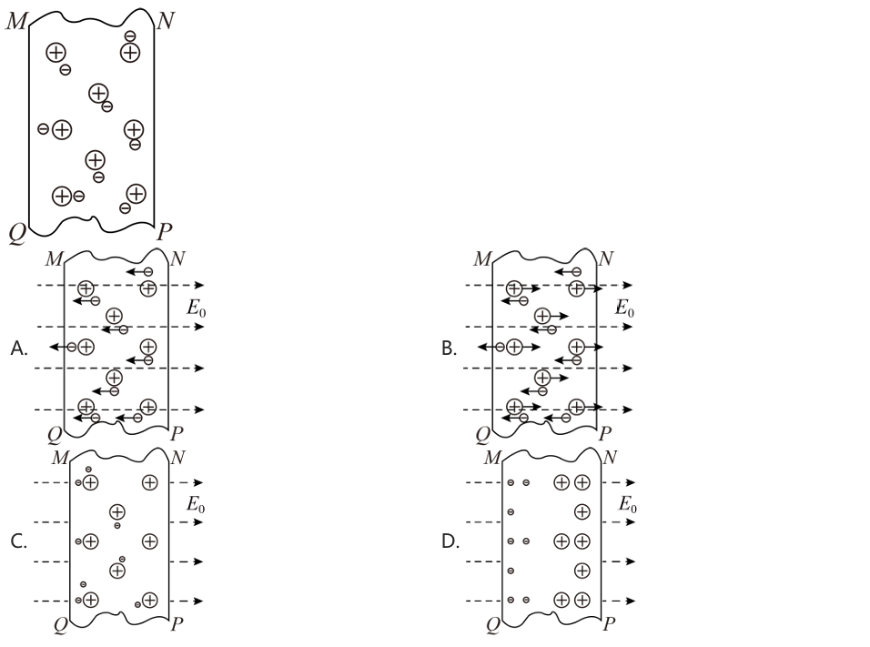

> [!ti] *2024~2025 学年北京顺义区北京市顺义区第一中学高二上学期期末*
> （多选）一个不带电的空腔导体放入匀强电场 $E_0$ 中，达到静电平衡后，导体外部电场线分布如图所示。$W$ 为导体壳壁，$A$、$B$ 为空腔内两点。下列说法正确的是（　　）
> 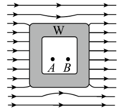
> > [!opts1]
> > - A. 感应电荷在 $A$、$B$ 两点场强相等
> > - B. 金属导体内外表面存在电势差
> > - C. 金属发生感应起电，左端外表面的感应电荷为负，右端外表面的感应电荷为正
> > - D. 金属处于静电平衡时，金属内部的电场强度与静电场 $E_0$ 大小相等、方向相反

> [!ti] *2022~2023 学年北京海淀区北京一零一中学高二上学期期中*
> 把一个架在绝缘座上的导体放在负电荷形成的电场中，导体处于静电平衡时，导体表面上感应电荷的分布如图所示，这时导体（　　）
> 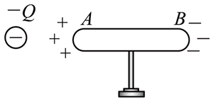
> > [!opts1]
> > - A. 导体内部场强为零
> > - B. $A$ 端的电势比 $B$ 端的电势高
> > - C. $A$ 端的电势与 $B$ 端的电势低
> > - D. 导体内部电场线从 $A$ 端指向 $B$ 端

> [!ti] *2023~2024 学年北京丰台区北京市第十二中学高二上学期期中*
> 如图所示，将带负电荷 $Q$ 的导体球靠近不带电的导体棒。若沿虚线将导体分成 $A$、$B$ 两部分，这两部分所带电荷量分别为 $Q_A$、$Q_B$，导体棒两端的电势分别为 $\varphi_A$ 和 $\varphi_B$，则下列判断正确的是（　　）
> 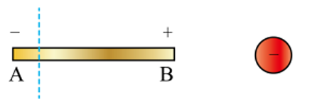
> > [!opts1]
> > - A. $Q_A$ 为负电荷，且 $Q_A<Q_B$
> > - B. $Q_A$ 为负电荷，且 $Q_A=Q_B$
> > - C. 导体棒两端的电势 $\varphi_A<\varphi_B$
> > - D. $A$ 部分的各点的电场强度普遍小于 $B$ 部分的各点电场强度

> [!ti] *2024~2025 学年 10 月北京东城区北京市第一七一中学高二上学期月考*
> 如图所示，一对用绝缘柱支撑的导体 $A$ 和 $B$ 彼此接触。起初它们不带电，手握绝缘棒，把带正电荷的带电体 $C$ 移近导体 $A$。下列说法正确的是（　　）
> 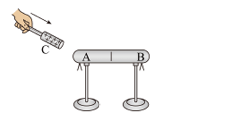
> > [!opts1]
> > - A. 导体 $A$ 的电势等于导体 $B$ 的电势
> > - B. 导体 $A$ 带正电，导体 $B$ 带负电
> > - C. 导体 $A$ 的电荷量大于导体 $B$ 的电荷量
> > - D. 导体 $A$ 内部的电场强度大于导体 $B$ 内部的电场强度

## 6级：静电屏蔽

> [!ti] *2024学年北京丰台区北京市第十二中学高二下学期期末第3题*
> 关于静电屏蔽，下列说法不正确的是（　　）
> 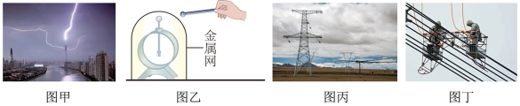
> > [!opts1]
> > - A. 图甲中建筑物顶端的避雷针必须通过导线与大地保持良好接触
> > - B. 图乙中，为了实现屏蔽作用，金属网必须与大地保持良好接触
> > - C. 图丙中三条高压输电线上方的两条导线与大地相连，可把高压线屏蔽起来，免遭雷击
> > - D. 图丁中带电作业工人穿着含金属丝织物制成的工作服，是为了屏蔽高压线周围的电场

> [!ti] *2025~2026 学年 12 月北京海淀区北京市海淀外国语实验学校高三上学期月考*
> （多选）如图所示，用金属网把不带电的验电器罩起来，再使带电金属球靠近金属网，则下列说法正确的是（　　）
> 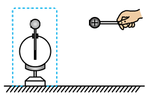
> > [!opts2]
> > - A. 箔片张开
> > - B. 箔片不张开
> > - C. 金属球带电电荷足够大时才会张开
> > - D. 金属网罩内部电场强度为零

> [!ti] *例题*
> （多选）如图所示，电力工作人员在几百万伏的高压线上进行带电作业，电工全身穿戴带电作业用的屏蔽服，屏蔽服是用导电金属材料与纺织纤维混纺交织成布后再做成的服装，下列说法正确的是（　　）
> 
> > [!opts1]
> > - A. 采用金属材料编织衣服的目的是使衣服不易扯破
> > - B. 采用金属材料编织衣服的目的是利用静电屏蔽
> > - C. 电工穿上屏蔽服后，体内场强为零
> > - D. 电工穿上屏蔽服后，体内电势为零

> [!ti] *2025~2026 学年北京朝阳区中国人民大学附属中学朝阳学校高二上学期期中（选考）*
> 如图所示，先用金属网把不带电的验电器罩起来，再使带正电金属球靠近金属网。下列说法中正确的是（　　）
> 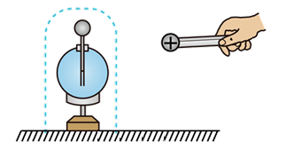
> > [!opts2]
> > - A. 验电器的箔片会张开
> > - B. 金属网外表面带负电荷，内表面带正电荷
> > - C. 金属网罩内部电场强度为零
> > - D. 金属网的电势比验电器箔片的电势高

> [!ti] *例题*
> 如图所示，两平行带电金属板相距为 $d$，两板间有 $A$、$B$、$C$ 三点，$AC$ 连线平行于两板，$BC$ 连线垂直于两板。$AB$ 间距为 $d_{AB}$，$BC$ 间距为 $d_{BC}$，$AC$ 间距为 $d_{AC}$。已知两板间的电场可视为匀强电场，且电场强度大小为 $E$，则下列说法正确的是（　　）
> 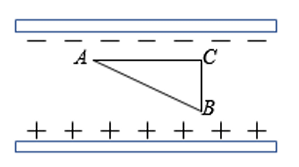
> > [!opts1]
> > - A. $AB$ 两点间电势差为 $Ed_{AB}$
> > - B. $BC$ 两点间电势差为 $Ed_{BC}$
> > - C. $AC$ 两点间电势差为 $\dfrac{E}{d_{AC}}$
> > - D. 两板间电势差为 $\dfrac{E}{d}$

> [!ti] *例题*
> 关于等势面的说法，正确的是（　　）
> > [!opts1]
> > - A. 电荷在等势面上移动时，由于不受电场力作用，所以说电场力不做功
> > - B. 在同一个等势面上各点的场强大小相等
> > - C. 两个不等电势的等势面可能相交
> > - D. 若相邻两等势面的电势差相等，则等势面的疏密程度能反映场强的大小

> [!ti] *例题*
> 如图所示，带箭头的实线表示某电场的电场线，虚线表示该电场的等势面。其中 $A$、$B$、$C$ 三点的电场强度大小分别为 $E_A$、$E_B$、$E_C$，电势分别为 $\varphi_A$、$\varphi_B$、$\varphi_C$。关于这三点的电场强度大小和电势高低的关系，下列说法中正确的是（　　）
> 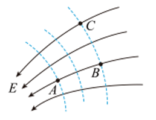
> > [!opts4]
> > - A. $E_A=E_B$
> > - B. $E_A>E_C$
> > - C. $\varphi_A=\varphi_B$
> > - D. $\varphi_A>\varphi_C$

> [!ti] *例题*
> 关于静电场，下列结论普遍成立的是（　　）
> > [!opts1]
> > - A. 电场强度大的地方电势高，电场强度小的地方电势低
> > - B. 电场中任意两点之间的电势差只与这两点的场强有关
> > - C. 在正电荷或负电荷产生的静电场中，场强方向都指向电势降低最快的方向
> > - D. 将正点电荷从场强为零的一点移动到场强为零的另一点，电场力做功为零

> [!ti] *例题*
> 带正电荷的导体球 $O$ 靠近某不带电的枕形导体。枕形导体的左右两端分别记为 $M$、$N$，$P$、$Q$ 分别为枕形导体内部和外表面上的两点，枕形导体处于静电平衡状态，如图所示。下列说法正确的是（　　）
> 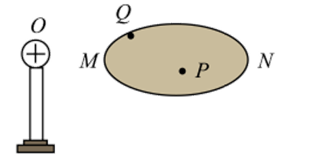
> > [!opts2]
> > - A. $M$ 端感应出正电荷，$N$ 端感应出负电荷
> > - B. $P$ 点电场强度方向沿 $OP$ 连线由 $O$ 指向 $P$
> > - C. $Q$ 点的电场方向与 $Q$ 点所在表面垂直
> > - D. 枕形导体上 $Q$ 点的电势比 $P$ 点的电势高

