# 第6讲 电流与电阻 #h0
# 知识讲解
电路模块
## 1. 电流
### 1.1. 电流的定义
```horizontal
电荷无规则运动
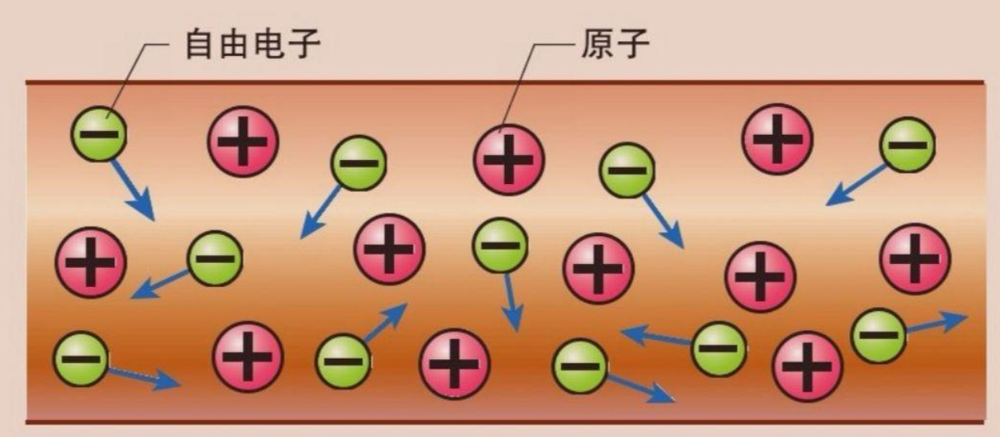
---
电荷定向移动
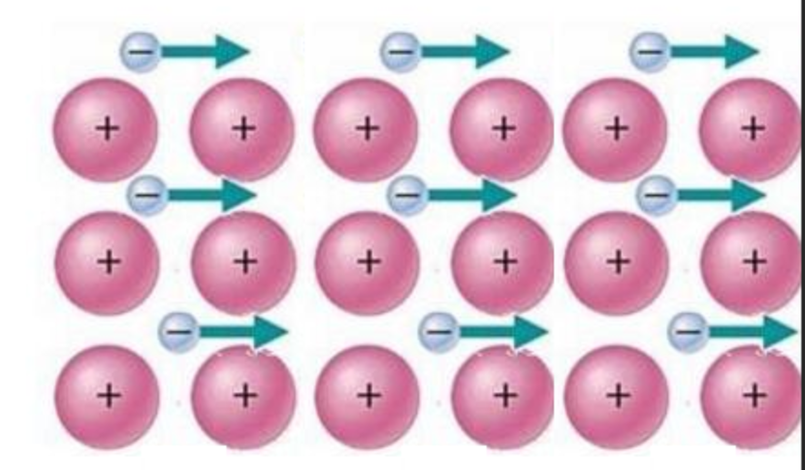
```
1. 电荷的定向移动形成电流。这里的电荷可以是正电荷，也可以是负电荷。
### 1.2. 几种电流
1. 恒定电流与瞬时电流
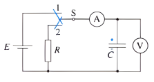
2. 环形电流
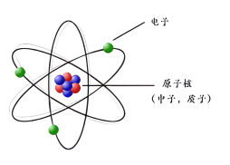
3. 非电路电流
       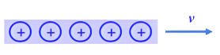
> [!question] 两个"电流"
> A 电流的电流比 B 电流的电流大. 这句话中的两个电流是一个意思吗?


### 1.3. 电流的描述
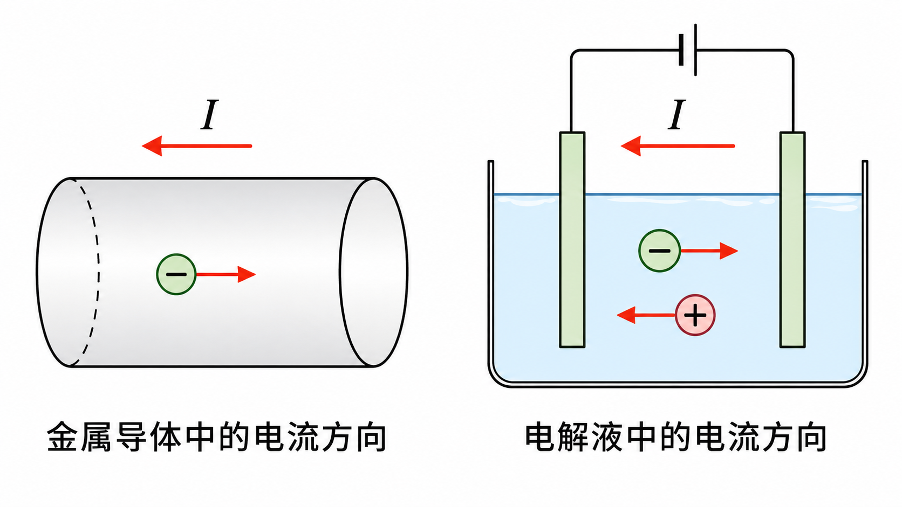 
1. 定义：通过导体横截面的电荷量 $Q$ 与通过这些电荷所用时间 $t$ 的比值。
2. 定义式：$I=\frac{Q}{t}$
> [!question] 电流强度与横截面积的关系.
> 假设相同时间通过某一横截面的电荷量相等, 但两导线横截面积不同, 电流强度会不同吗?
3. 方向：规定正电荷定向移动的方向规定为电流的方向。电子移动的方向是电流的反方向.
电流是 $\_\_\_\_\_\_$(标量/矢量).
4. 载流子:
金属导体中, 只有电子可以自由移动, 电流的载流子是电子.
电解液中, 正负粒子都可以移动, 总电流应该等于正负粒子形成的电流的和.
5. 单位：在国际单位制中，电流的单位是安培（ ampere），简称安，符号是 $\_\_\_\_\_\_$。从上述公式可知： $1 \mathrm{C}= \_\_\_\_\_\_$ 常用的电流单位还有毫安 $(m A)$ 和微安 $(\mu A)$ ，它们与安培的关系是 $1mA=\_\_\_\_A,1\mu A=\_\_\_\_A$.

### 1.4. 电量
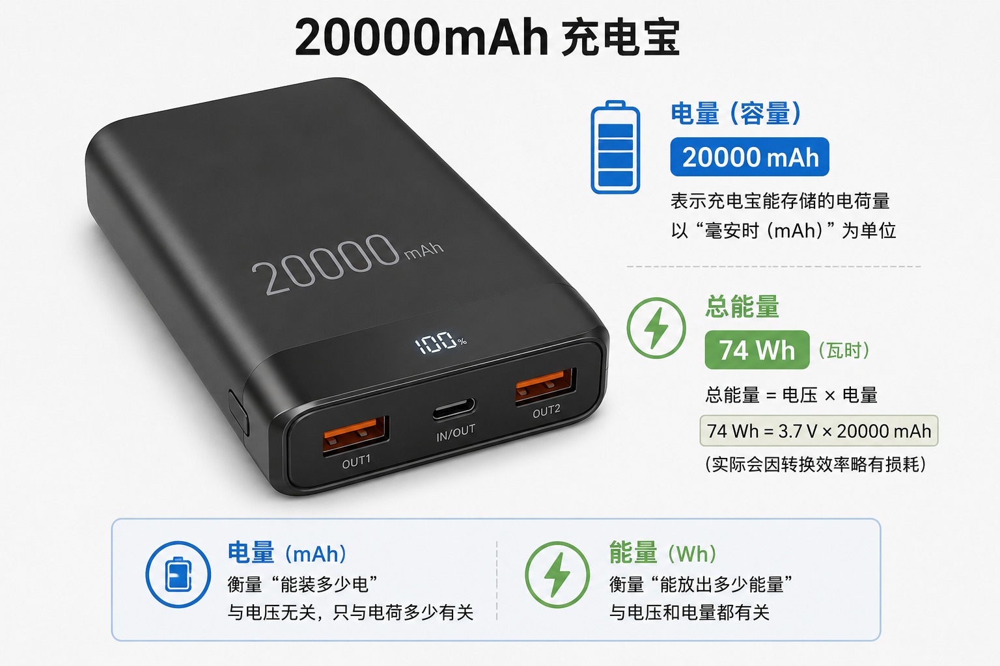
某充电宝的容量为 20000 $mA \cdot h$, $mA \cdot h$ 这个单位对应的物理量是 $\_\_\_\_\_\_$. 此物理量的另一个单位是 $\_\_\_\_\_\_$.
电量与能量是不同的物理量, 但都反映充电宝储电的本领.
### 1.5. 恒定电流
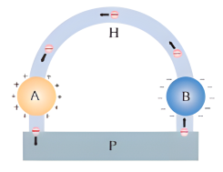
详尽的分析表明， $\mathrm{A} 、 \mathrm{~B}$ 周围空间的电场是由电源、导线等电路元件所积累的电荷共同形成的。尽管这些电荷也在运动，但有的流走了，另外的又来补充，电荷的分布是稳定的，不随时间变化，电场的分布也不会随时间变化。这种由稳定分布的电荷所产生的稳定的电场，叫作**恒定电场**（steady electric field）。
在恒定电场的作用下，导体中的自由电荷做定向运动，在运动过程中与导体内不动的粒子不断碰撞，碰撞阻碍了自由电荷的定向运动，结果是大量**自由电荷定向运动的平均速率不随时间变化**。
如果我们在这个电路中串联一个电流表，电流表的示数将保持恒定。我们把**大小、方向都不随时间变化的电流**叫作**恒定电流**（steady current）。这一章我们研究恒定电流。
### 1.6. 电流的三种速率
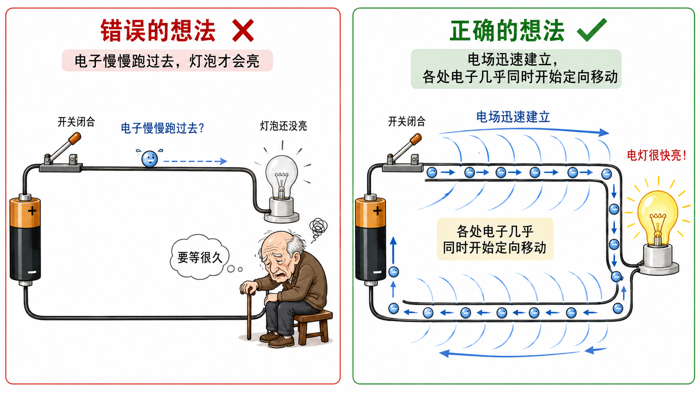
1. 自由电荷热运动速率:金属中自由电子做无规则运动，典型速率约为 $10^6\ \mathrm{m/s}$
2. 自由电荷定向移动速率:形成电流时，电子定向移动的平均速率通常约为 $10^{-4}\sim10^{-3}\ \mathrm{m/s}$，即每秒零点几毫米到几毫米。
3. 电流传导速率 (电场传播速率):电场变化或电信号沿导线传播的速率通常约为 $10^8\ \mathrm{m/s}$，接近光速，但具体数值与导线及周围绝缘介质有关。
## 2. 电流的微观解释
### 2.1. 从微观的角度追问为什么
我们初中学习过电路的宏观知识. 例如 $U=IR$, $U_总=U_1+U_2$. 但这些公式为什么会成立呢?
高中学习电路与初中学习电路的一个重要区别, 就是初中是从**宏观**的"**路**"的角度研究电路, 而高中要从**微观**的"**场**"的角度研究电路. 电路本质上是恒定电场作用下产生的. 
### 2.2. 微观表达式的推导
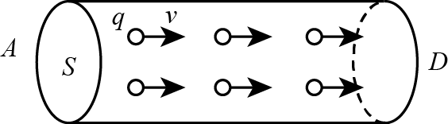
取一段时间 $\Delta t$, 研究通过导线某一横截面的电荷量 $Q$, 并通过 $I=\frac{Q}{\Delta t}$ 求电流的微观表达式.
圆柱体中的自由电荷总数 $N=\_\_\_\_\_\_=\_\_\_\_\_\_=\_\_\_\_\_\_$. (分别用单位体积内的电荷个数 $n_1$, 单位长度的电荷个数 $n_2$, 单位时间的电荷个数 $n_3$ 表示).
总电荷量 $Q=\_\_\_\_\_\_$.
电流的微观表达式 $I=\_\_\_\_\_\_$.
### 2.3. 环形电流
假设一个电子绕核旋转, 则该电子的等效电流大小是 $\_\_\_\_\_\_$.

## 3. 电阻
### 3.1. 电阻的定义式
1. 电阻的定义：
通过实验作图发现，金属导体的$U-I$图线是一条过原点的直线，这表明，同一导体，不管电流电压怎样变化，电压与电流的比值总是一个常数，这一结论可以写为$R=\frac{U}{I}$。我们把这个比值叫做导体的电阻。
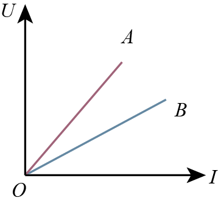
2. 在电压 $U$ 相同时，$R$ 越大的导体电流 $I$ 越小。$R$ 的值反映了导体对电流的阻碍作用。例如图中的两条直线的不同倾斜程度就表示两个不同的电阻。
3. 电阻的单位是欧姆，符号是 $\Omega$ 。
4. 电阻是导体本身的性质，与导体两端的电压和是否有电流通过均无关。
### 3.2. 伏安特性曲线
```horizontal
1. 伏安特性曲线

定义：建立平面直角坐标系，用纵轴表示 $\_\_\_\_\_\_$，用横轴表示 $\_\_\_\_\_\_$ ，画出的导体的 $I-U$ 图线叫做导体的伏安特性曲线．

2. 线性元件．

在温度没有显著变化时，金属导体的电阻几乎是恒定的，它的伏安特性曲线是 $\_\_\_\_\_\_$，具有这种伏安特性的电学元件叫作线性元件。
---

```

```horizontal
3. 非线性元件．欧姆定律对气态导体和半导体元件并不适用，在这些情况下电流与电压 $\_\_\_\_\_\_$(不成正比/成正比)，这类电学元件叫作非线性元件，它们的伏安特性曲线不是直线．

如图，状态 $A$ 时，电压为 $U_1$ 、电流为 $I_1$ ，电阻阻值 $R=\_\_\_\_\_\_$ ，该阻值不等于伏安特性曲线在 $A$ 点的切线斜率的倒数。
---

```

## 4. 影响电阻的因素
### 4.1. 类比与猜测
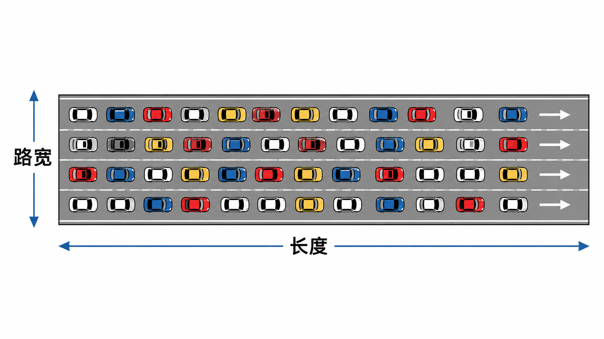
类比堵车通过类比研究影响电阻的因素：在马路上行驶的车辆如果遇到比较宽的路段，行驶的会较为畅通；遇到堵车的时候，随着堵车的路段不断增长，拥堵的时间也会逐渐增加。这就好比电流经过电阻时，如果电阻的横截面积比较大，电荷就更容易通过；如果电阻越长，则电荷遭遇阻碍的时间就会越长。所以我们猜想电阻与导体的横截面积和长度有关。
### 4.2. 实验探究
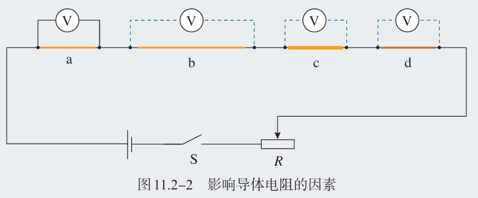
1. 导体电阻与长度的关系：$b$ 与 $a$ 长度不同，横截面积、材料相同。
2. 导体电阻与横截面积的关系：$c$ 与 $a$ 横截面积不同，长度、材料相同。
3. 导体电阻与材料的关系：$d$ 与 $a$ 材料不同，长度、横截面积相同。
### 4.3. 电阻的决定式
1. 内容：在温度不变时，同种材料的导体，其电阻与其 $\_\_\_\_\_\_$ 成正比，与其 $\_\_\_\_\_\_$ 成反比。
2. 表达式：$R=\_\_\_\_\_\_$
3. 电阻率 $\rho$ ：反映导体材料导电性能的物理量，仅与导体的材料和温度有关。单位：$\Omega \cdot \mathrm{m}$.电阻率越大,导电性能越 $\_\_\_\_\_\_$ (强/弱).
> [!quote] 不同电阻率材料的应用
> 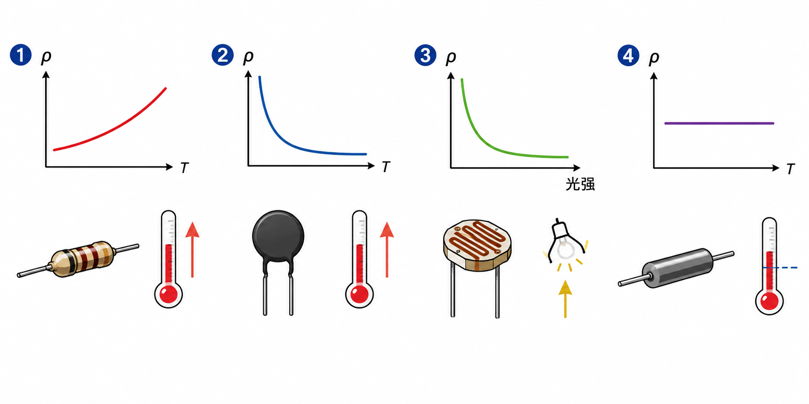
> 1. 同一材料的电阻率随温度而变化，一般金属的电阻率随温度升高而增大，可用于制作电阻温度计；
> 2. 某些半导体材料的电阻率随温度的变化而急剧地变化，称为热敏电阻；
> 3. 有的半导体材料的电阻率随人射光的强弱而急剧地变化，称为光敏电阻。
> 4. 有些合金的电阻率几乎不受温度变化的影响，可用来制作标准电阻。
4. 超导现象：当温度降低到一定程度时，某些材料的电阻率变为零的现象。
### 4.4. (选) 电阻的微观解释
如图所示是一段金属导体，我们假设两端的电压为 $U$，通过它的电流为 $I$，电子的电荷量为 $e$，单位体积内的电荷数目为 $n$，横截面积为 $S$，长度为 $l$，电荷定向移动的速率为 $v$。假设导体中的电荷受到阻力为 $f=kv$。
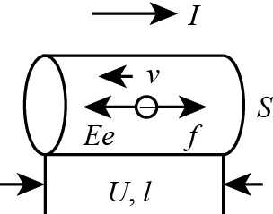
当导体中的电荷受到的电场力及阻力达到平衡时，即$Ee=f=kv$时，电荷定向移动的速率保持恒定，电流稳定。
由电流的微观表达式$I=nqSv$，电场强度的定义式$E=U/l$，及电阻的定义式 $R=\frac{U}{I}$
可得：$R=\dfrac{U}{I}=\dfrac{E\cdot l}{neSv}=\dfrac{\dfrac{kv}{e}l}{neSv}=\dfrac{k}{ne^{2}}\cdot\dfrac{l}{S}$
从上边的式子可以看出来，当导体中的电荷在运动时，电场力会使得电荷运动加快，但是运动极短时间后又会与导体中的其他物质发生碰撞而减速，我们在这里只是将电荷的运动简化为一个匀速运动的基础上才推导出这样的结果。这个表达式说明了在导体内部的力与运动的关系，可以更好的理解能量的转化过程。
# 题目练习

## 1. 1级：电流的定义

> [!ti] *2023学年北京丰台区北京市第十二中学高二上学期期中第1题*
> 关于对电流的理解，下列说法正确的是（　　）
> > [!opts1]
> > - A. 电流的方向就是自由电子定向移动的方向
> > - B. 电流有大小，也有方向，所以电流是矢量
> > - C. 金属导体内的电流是自由电子在导体内的电场作用下形成的
> > - D. 电流的传导速率就是导体内自由电子的定向移动速率

> [!ti] *2024~2025 学年北京海淀区高二上学期期末*
> 关于电流，下列说法中正确的是（　　）
> > [!opts1]
> > - A. 通过导体横截面的电荷量越多，电流越大
> > - B. 电子运动的速率越大，电流越大
> > - C. 因为电流有方向，所以电流是矢量
> > - D. 单位时间内通过导体横截面的电荷量越多，导体中的电流越大


> [!ti] *2024 年北京东城区北京市第二中学高二会考（合格考）*
> 铜是良好的导电材料。在一段通电铜导线内，定向移动形成电流的微粒是（　　）
> > [!opts2]
> > - A. 电子
> > - B. 原子核
> > - C. 既有电子也有原子核
> > - D. 原子


> [!ti] *2023~2024 学年北京怀柔区北京市怀柔区第一中学高二下学期开学考试*
> 若在 $2\,\mathrm{s}$ 内共有 $2\times10^{19}$ 个 $2$ 价正离子和 $4\times10^{19}$ 个 $1$ 价负离子同时向相反方向定向移动通过某截面，那么通过这个截面的电流是（取 $e=1.6\times10^{-19}\,\mathrm{C}$）（　　）
> > [!opts4]
> > - A. $1.5\,\mathrm{A}$
> > - B. $6.4\,\mathrm{A}$
> > - C. $4.8\,\mathrm{A}$
> > - D. $3\,\mathrm{A}$

> [!ti] *例题*
> 一条导线中的电流为 $50\,\mu\mathrm{A}$，在 $3.2\,\mathrm{s}$ 内通过这条导线某一横截面的电荷量是多少库仑？有多少个电子通过该横截面？


## 2. 2级：电流的微观解释

> [!ti] *2022年重庆高三上学期高考模拟（重庆市缙云教育联盟第O次诊断性检测）第16题*
> 电荷的定向移动形成电流，电流是物理量中的基本量之一，求解电流有很多物理模型．如图，有一段粗细均匀的一段导棒，横截面积为$S$．现两端加一定的电压，导体中的自由电荷沿导体定向移动的平均速率为$v$，金属中单位体积内的自由电子数量为$n$，自由电子的质量为$m$，带电量为$e$，现利用电流的定义式推导电流的决定式．
> 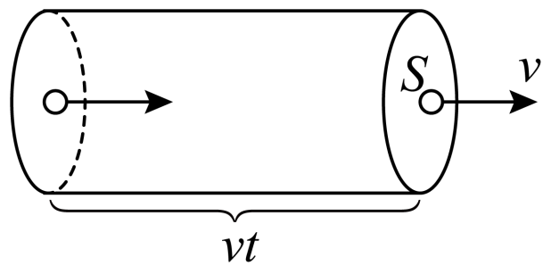

> [!ti] *2025~2026 学年北京东城区北京市第五十五中学高二上学期期中第 20 题*
> 一段金属直导线的横截面积为 $S$，单位体积内自由电子数为 $n$，已知电子的质量为 $m$，电荷量为 $e$。给导线两端加恒定电压，导线内将产生恒定电流。此时自由电子在金属中的运动可以看作：电子在恒定电场力和恒定阻力的共同作用下做匀速直线运动。设电子定向移动的速度为 $\bar v$。
>
> （1）求此时导线中的电流 $I$；
>
> （2）若导线两端的电压为 $U$，长度为 $L$，求电子所受的恒定阻力 $f$。


> [!ti] *2025~2026 学年 3 月北京西城区北京市第一六一中学高二下学期月考*
> （多选）有一横截面积为 $S$ 的铜导线，流经其中的电流为 $I$，设每单位体积的导线有 $n$ 个自由电子，电子的电荷量为 $q$，此时电子的定向移动速率为 $v$，在 $t$ 时间内，通过导线横截面的自由电子数目可表示为（　　）
> > [!opts4]
> > - A. $nvSt$
> > - B. $nvt$
> > - C. $\dfrac{It}{q}$
> > - D. $\dfrac{It}{Sq}$


> [!ti] *2023~2024 学年北京海淀区北京市八一学校高二上学期期中（11 月选考）*
> 如图所示，一根横截面积为 $S$ 的均匀长直橡胶棒上带有均匀的负电荷，每单位长度上电荷量为 $q$，当此棒沿轴线方向做速度为 $v$ 的匀速直线运动时，由于棒运动而形成的等效电流大小为（　　）
> 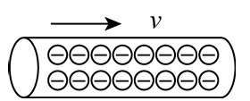
> > [!opts4]
> > - A. $qv$
> > - B. $\dfrac{q}{v}$
> > - C. $qvS$
> > - D. $\dfrac{qv}{S}$


> [!ti] *2023~2024 学年北京密云区北京市密云区第二中学高二上学期期中*
> （多选）一段粗细均匀的导线的横截面积为 $S$，导线内自由电子的电荷量为 $e$，导线单位长度内自由电子数为 $n_1$，导线单位体积内自由电子数为 $n_2$，自由电子定向运动的速率为 $v$，单位时间内通过某一横截面的自由电子数为 $n_3$。则导线中的电流为（　　）
> > [!opts4]
> > - A. $n_1eSv$
> > - B. $n_1ev$
> > - C. $n_2eSv$
> > - D. $n_3e$


## 3. 3级：环形电流

> [!ti] *2025学年北京石景山区北京大学附属中学石景山学校高二上学期期中第17题9分*
> 在氢原子中模型中，核外电子绕核做半径为r的匀速圆周运动．已知电子的质量为m，电荷量为e，静电力常量为k．可以认为电子绕核旋转所需要的向心力由库仑力提供．


> [!ti] *2025~2026 学年北京高二上学期月考*
> 电子绕核运动可等效为一环形电流，如图所示。氢原子的电子绕核运动的半径为 $R$，电子质量为 $m$，电荷量为 $e$，静电力常量为 $k$，则此环形电流的大小为（　　）
> 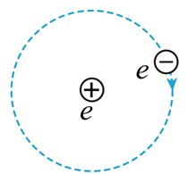
> > [!opts2]
> > - A. $\dfrac{e^2}{2\pi R}\sqrt{\dfrac{mR}{k}}$
> > - B. $\dfrac{2\pi R}{e^2}\sqrt{\dfrac{k}{mR}}$
> > - C. $\dfrac{e^2}{2\pi R}\sqrt{\dfrac{k}{mR}}$
> > - D. $\dfrac{2\pi R}{e^2}\sqrt{\dfrac{mR}{k}}$


> [!ti] *2025~2026 学年 12 月北京海淀区北京市第十九中学高二上学期月考*
> 安培提出了著名的分子电流假说，根据这一假说，电子绕原子核运动可等效为一环形电流。如图为一分子电流模型，电子以角速度 $\omega$ 绕原子核沿顺时针方向在水平面内做匀速圆周运动，已知电子的电量为 $e$，则该环形电流的大小和电流的方向为（　　）
> 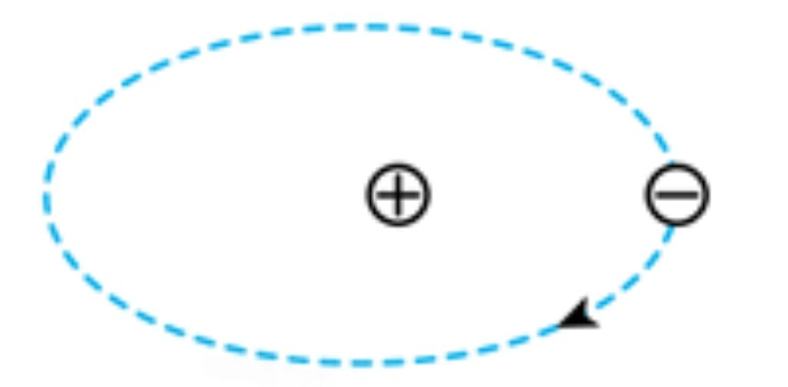
> > [!opts2]
> > - A. $\dfrac{e\omega}{2\pi}$，逆时针
> > - B. $\dfrac{e\omega}{2\pi}$，顺时针
> > - C. $\dfrac{2\pi e}{\omega}$，逆时针
> > - D. $\dfrac{\pi e}{2\omega}$，顺时针


> [!ti] *2024~2025 学年北京海淀区北京一零一中学高二上学期期中（选考）*
> （多选）原子中的电子绕原子核的圆周运动可以等效为环形电流，设氢原子的电子以速率 $v$ 在半径为 $r$ 的圆周轨道上绕核转动，周期为 $T$，已知电子的电荷量为 $e$、质量为 $m$，静电力常量为 $k$，则其等效电流大小为（　　）
> > [!opts2]
> > - A. $\dfrac{2\pi e}{T}$
> > - B. $\dfrac{ev}{2\pi r}$
> > - C. $\dfrac{e}{2\pi r}\sqrt{\dfrac{k}{mr}}$
> > - D. $\dfrac{e^2}{2\pi r}\sqrt{\dfrac{k}{mr}}$


> [!ti] *2024~2025 学年北京顺义区北京市顺义区牛栏山第一中学高二上学期期中*
> 均匀带电绝缘圆环电荷量为 $Q$，半径为 $R$。现使圆环绕如图所示过圆心的轴以线速度 $v$ 匀速转动，则圆环转动产生的等效电流为（　　）
> 
> > [!opts4]
> > - A. $Qv$
> > - B. $\dfrac{QR}{v}$
> > - C. $\dfrac{2\pi Qv}{R}$
> > - D. $\dfrac{Qv}{2\pi R}$


## 4. 4级：伏安特性曲线

> [!ti] *2024学年北京房山区高二上学期期中*
> 某导体中的电流随其两端电压的变化如图所示，则下列说法中正确的是（    ）
> 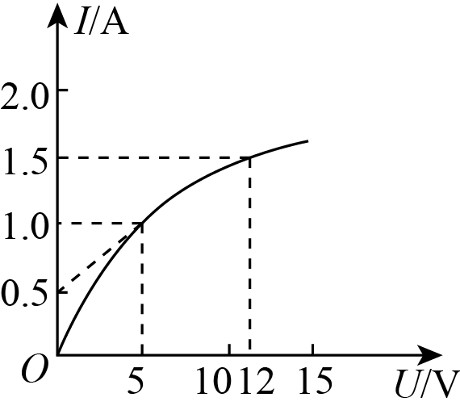
> > [!opts1]
> > - A. 由图可知，随着电压的增大，导体的电阻不断减小
> > - B. 由图可知，随着电流的减小，导体的电阻不断增大
> > - C. 加$5\text{V}$电压时，导体的电阻为$10\Omega$
> > - D. 加$12\text{V}$电压时，导体的电阻为$8\Omega$


> [!ti] *2024~2025 学年北京海淀区北京市十一学校高二上学期期中（顺义学校）*
> 如图所示是某导体的伏安特性曲线，由图可知下列说法正确的是（　　）
> 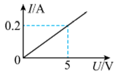
> > [!opts1]
> > - A. 导体的电阻是 $25\,\Omega$
> > - B. 导体的电阻是 $0.04\,\Omega$
> > - C. 当导体两端的电压是 $10\,\mathrm{V}$ 时，通过导体的电流是 $2\,\mathrm{A}$
> > - D. 当通过导体的电流是 $0.1\,\mathrm{A}$ 时，导体两端的电压是 $0.004\,\mathrm{V}$


> [!ti] *2025~2026 学年北京顺义区北京市顺义区第一中学高二上学期期中第 10 题*
> 通过两粗细相同的同种金属电阻丝 $R_1$、$R_2$ 的电流和其两端的电压 $U$ 的关系图线如图所示，则下列说法正确的是（　　）
> 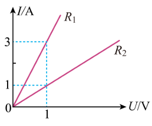
> > [!opts1]
> > - A. 两电阻丝的电阻大小之比为 $R_1:R_2=3:1$
> > - B. 两电阻丝的电阻大小之比为 $R_1:R_2=1:3$
> > - C. 两电阻丝长度之比为 $L_1:L_2=3:1$
> > - D. 两电阻丝长度之比为 $L_1:L_2=1:3$


> [!ti] *2025~2026 学年 10 月北京海淀区北京市第二十中学高二上学期月考*
> （多选）如图所示为某金属导体的伏安特性曲线，$MN$ 是曲线上的两点，过 $M$ 点的切线和 $M$、$N$ 两点对应坐标图中已标出，下列说法正确的是（　　）
> 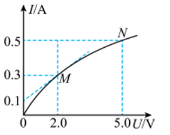
> > [!opts1]
> > - A. 该金属导体的电阻是 $10\,\Omega$
> > - B. 该金属导体两端的电压是 $2.0\,\mathrm{V}$ 时对应的电阻是 $10\,\Omega$
> > - C. 该金属导体的电阻随电压的增大而增大
> > - D. 该金属导体在 $M$ 点和 $N$ 点对应的电阻之比是 $2:3$


## 5. 5级：探究影响电阻的因素

> [!ti] *例题*
> 探究影响电阻因素的实验
>
> （1）如图所示的电路，$AB$ 和 $CD$ 均为镍铬合金线。闭合开关后，通过观察________，可以比较出合金线电阻的大小，这种研究方法叫________（填“等效替代法”或“转换法”）。这个实验装置是研究电阻大小与导体________的关系。
> 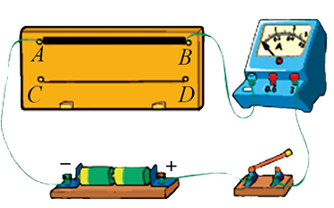
> （2）为探究影响导体电阻大小的因素，小明找到不同规格的电阻丝如下表所示。
>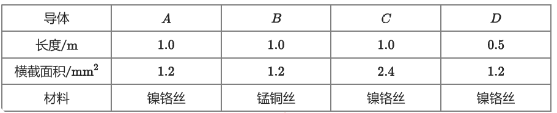
>
> ① 选用 $A$、$B$ 两根导体，可探究导体电阻大小与________是否有关。
>
> ② 要探究导体电阻大小与长度是否有关，应选用________两根导体。
>
> ③ 选用 $B$、$C$ 两根导体，不能探究导体电阻大小与横截面积是否有关，原因是________。

> [!ti] *2025~2026 学年北京高二上学期期中（北京师范大学第二附属中学）*
> 如图所示，将灯泡的灯丝与小灯泡串联接入电路，闭合开关使小灯泡发光。用酒精灯给灯丝加热，下列正确的是（　　）
> 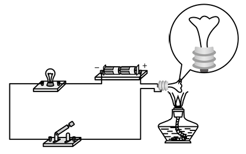
> > [!opts2]
> > - A. 小灯泡变暗，灯丝电阻率变大
> > - B. 小灯泡变暗，灯丝电阻率变小
> > - C. 小灯泡变亮，灯丝电阻率变大
> > - D. 小灯泡变亮，灯丝电阻率变小


> [!ti] *2023~2024 学年北京海淀区北京市中关村中学高二上学期期中*
> 人体含水量约为 $70\%$，水中有钠离子、钾离子等离子存在，因此容易导电，脂肪则不容易导电。某脂肪测量仪如图所示，其原理就是根据人体电阻的大小来判断人体脂肪所占比例。（　　）
> 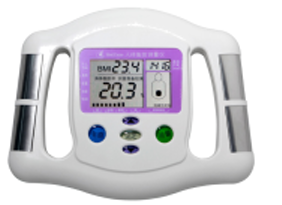
> > [!opts1]
> > - A. 人体电阻很大，所以测量时，人体中没有电流通过
> > - B. 消瘦的人脂肪含量少，人体电阻小
> > - C. 肥胖的人钠、钾离子多，导电性能好，所以电阻小
> > - D. 激烈运动之后、沐浴之后测量，不会影响测量数据

> [!ti] *例题*
> （多选）关于电阻率，下列说法中正确的是（　　）
> > [!opts1]
> > - A. 有些材料的电阻率随温度的升高而减小
> > - B. 电阻率大的导体，电阻一定大
> > - C. 用来制作标准电阻的材料的电阻率几乎不随温度的变化而变化
> > - D. 电阻率与导体的长度和横截面积无关


## 6. 6级：电阻定律

> [!ti] *2025学年北京朝阳区三里屯一中高二上学期期中第5题2分*
> 如图，$R_{1}、R_{2}$是材料相同、厚度相同、表面为正方形的金属导体，正方形的边长之比为$2\colon 1$，通过这两个导体的电流方向如图所示，不考虑温度对电阻率的影响，则两个导体$R_{1}$与$R_{2}$（       ）
> 
> > [!opts1]
> > - A. 电阻率之比为$2\colon 1$
> > - B. 电阻之比为$4\colon 1$
> > - C. 串联在电路中，两端的电压之比为$1\colon 1$
> > - D. 串联在电路中，自由电子定向移动的速率之比为$2\colon 1$


> [!ti] *2025~2026 学年 12 月北京大兴区大兴区第一中学高二上学期月考（模拟（一））*
> 如图 1 所示，将横截面积相同、材料不同的两根金属丝 $a$、$b$ 焊接成长直导体 $AB$，$A$ 为金属丝 $a$ 的左端点，$B$ 为金属丝 $b$ 的右端点，$P$ 是金属丝上可移动的接触点。保持金属丝中电流不变，电压表示数 $U$ 随 $AP$ 间距离 $x$ 的变化关系如图 2 所示。金属丝 $a$、$b$ 的电阻和电阻率分别是 $R_a$、$R_b$、$\rho_a$、$\rho_b$。则（　　）
> 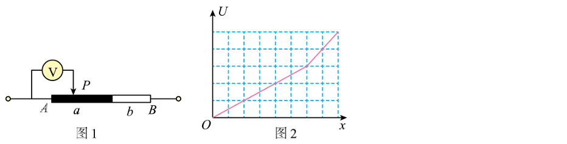
> > [!opts2]
> > - A. $R_a>R_b$，$\rho_a>\rho_b$
> > - B. $R_a<R_b$，$\rho_a<\rho_b$
> > - C. $R_a>R_b$，$\rho_a<\rho_b$
> > - D. $R_a<R_b$，$\rho_a>\rho_b$


> [!ti] *2025~2026 学年北京海淀区北京理工大学附属中学高二上学期期中（等级考）*
> 把电阻是 $1\,\Omega$ 的一根金属丝，均匀拉长为原来的 $2$ 倍，则导体的电阻是（　　）
> > [!opts4]
> > - A. $1\,\Omega$
> > - B. $2\,\Omega$
> > - C. $3\,\Omega$
> > - D. $4\,\Omega$


> [!ti] *2024~2025 学年北京西城区北京市第四中学高二上学期期中*
> 如图 $R_1$ 和 $R_2$ 是材料相同、厚度相同、表面均为正方形的两个导体，正方形的边长之比为 $2:1$，通过两导体的电流方向如图所示。不考虑温度对电阻率的影响，则这两个导体（　　）
> 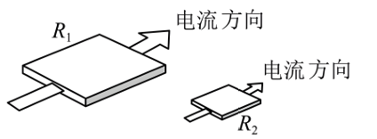
> > [!opts1]
> > - A. 电阻率之比为 $2:1$
> > - B. 电阻之比为 $4:1$
> > - C. 串联在电路中，两端的电压之比为 $1:1$
> > - D. 并联在电路中，流过两导体的电流之比为 $1:4$

> [!ti] *2024~2025 学年北京西城区北京市铁路第二中学高二上学期期中*
> （多选）如图所示，一块均匀的长方体样品，长为 $a$，宽为 $b$，厚为 $c$，电流沿 $AB$ 方向时测得该样品电阻为 $R$，则下列说法正确的是（　　）
> 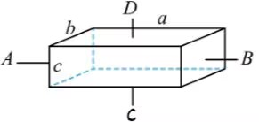
> > [!opts1]
> > - A. 该材料的电阻率为 $\rho=\dfrac{bcR}{a}$
> > - B. 温度不变，减小沿 $AB$ 方向的电流时，该材料的电阻率变大
> > - C. 若电流沿 $CD$ 方向时，该样品的电阻为 $\dfrac{c^2}{a^2}R$
> > - D. 若电流沿 $CD$ 方向时，该样品的电阻为 $\dfrac{b^2}{a^2}R$


> [!ti] *2024~2025 学年北京延庆区高二上学期期末*
> 如图 3 所示，一根长为 $L$、横截面积为 $S$ 的金属棒，棒内单位体积内自由电子数为 $n$，电子的电荷量为 $e$。在棒两端加上恒定电压 $U$ 时，棒内自由电子定向运动的平均速率为 $v$，则金属棒的电阻率为（　　）
> 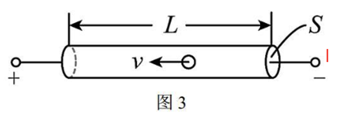
> > [!opts4]
> > - A. $\rho=\dfrac{U}{nevL}$
> > - B. $\rho=\dfrac{UL}{nev}$
> > - C. $\rho=\dfrac{nevL}{U}$
> > - D. $\rho=\dfrac{nev}{UL}$


> [!ti] *例题*
> 关于对电流的理解，下列说法正确的是（　　）
> > [!opts1]
> > - A. 电流的方向就是自由电子定向移动的方向
> > - B. 电流有大小，也有方向，所以电流是矢量
> > - C. 金属导体内的电流是自由电子在导体内的电场作用下形成的
> > - D. 电流的传导速率就是导体内自由电子的定向移动速率


> [!ti] *例题*
> （多选）有一横截面积为 $S$ 的铜导线，流经其中的电流为 $I$，设单位体积中有 $n$ 个自由电子，电子的电荷量为 $q$，电子的定向移动速率为 $v$，在 $t$ 时间内，通过导线横截面的自由电子数可表示为（　　）
> > [!opts4]
> > - A. $nvSt$
> > - B. $nvt$
> > - C. $\dfrac{It}{q}$
> > - D. $\dfrac{It}{nq}$


> [!ti] *例题*
> 如图所示，橡胶圆环的横截面积 $S$ 远小于圆环的半径，圆环均匀带电，总的带电量为 $q$，现在使圆环绕过圆心 $O$ 所在的轴（轴与圆环所在的平面垂直）以某一角速度做匀速转动，已知圆环上的某个电荷的线速度为 $v$，弧 $AB$ 对应的弧长为 $L$，对应的圆心角为 $\theta$（用弧度制来表示的），则圆环产生的等效电流为（　　）
> 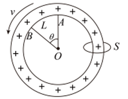
> > [!opts4]
> > - A. $\dfrac{\theta qv}{2\pi L}$
> > - B. $\dfrac{\theta qv}{\pi L}$
> > - C. $\dfrac{\theta qv}{2L}$
> > - D. $\dfrac{\theta qv}{L}$


> [!ti] *例题*
> 如图为电阻 $R_1$、$R_2$ 的 $I-U$ 图像，把 $R_1$、$R_2$ 并联接入电路中，通过它们的电流大小分别为 $I_1$、$I_2$，则下列说法正确的是（　　）
> 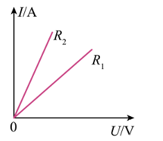
> > [!opts2]
> > - A. $R_1>R_2$，$I_1>I_2$
> > - B. $R_1<R_2$，$I_1<I_2$
> > - C. $R_1<R_2$，$I_1>I_2$
> > - D. $R_1>R_2$，$I_1<I_2$


> [!ti] *例题*
> 一段粗细均匀的镍铬丝，横截面的面积是 $S$，电阻是 $R$，把它拉制成横截面的面积为 $\dfrac{S}{10}$ 的均匀细丝后，它的电阻变为（　　）
> > [!opts4]
> > - A. $\dfrac{R}{10000}$
> > - B. $10000R$
> > - C. $100R$
> > - D. $\dfrac{R}{100}$
