# 01-常见力和计算 #h0

# 知识体系

## 力的定义

### 力

**力的概念**
（1）概念：力是$\_\_\_\_$（1）之间的相互作用．
（2）性质：

| 物质性 | 力不能脱离物体单独存在 |
| --- | --- |
| 相互性 | 力的作用是相互的，施力物体同时也是受力物体 |
| 方向性 | 力既有大小，也有方向，是矢量 |
（3）作用效果：
①改变物体的$\_\_\_\_$（2）；
②使物体发生$\_\_\_\_$（3）．
（4）力的单位：在国际单位制里，力的单位是牛顿，简称牛，符号$\_\_\_\_$（4）．
（5）力的分类：
①按性质分：重力（万有引力）、弹力、摩擦力、分子力、电场力、磁场力、核力……（按现代物理学理论，物体间的相互作用分四类：长程相互作用有引力相互作用、电磁相互作用；短程相互作用有强相互作用和弱相互作用．宏观物体间只存在前两种相互作用．）
②按效果分：压力、支持力、拉力、动力、阻力、向心力、回复力等；
③按产生条件分：
非接触力：重力、分子力、电场力、磁场力；
接触力：弹力（拉力、压力、支持力）、摩擦力．

### 四种基本相互作用

（1）$\_\_\_\_$（5）：存在于一切有质量的物体之间，作用强度随距离的增大而减弱；
（2）$\_\_\_\_$（6）：存在于电荷间和磁体间，作用强度随距离的增大而减弱；
（3）$\_\_\_\_$（7）：存在于原子核内部粒子间，作用范围约
$10^{-15}\text{m}$，距离增大时，作用强度急剧减弱；
（4）$\_\_\_\_$（8）：存在于微观粒子间，其作用范围小于
$10^{-18}\text{m}$．

## 重力

（1）定义：由于地球的吸引而使物体受到的力叫做重力．重力是由于地球吸引而产生的，但重力不是地球对物体的吸引力，地球对物体的吸引力是万有引力，重力是万有引力的一个分量；
（2）重力的大小：
$G=mg$（$g=9.8\text{N/kg}$），$g$与地球密切相关，在地球上的不同地点，$g$的大小是不同的；
（3）重力的方向：$\_\_\_\_$（9）；
（4）重力的作用点：重心．从效果上看，可认为各部分受到的作用均集中于重心．
关于重心的几个注意事项：
①质量分布均匀且形状规则的物体的重心在其$\_\_\_\_$（10）处；
②重心不一定在物体上；
③形状不规则的薄板状物体，可以用悬挂法寻找重心位置．

## 弹力

弹力基础知识
（1）形变：物体在力的作用下形状或体积发生改变，叫做形变。撤去作用力后能恢复原状的形变叫做$\_\_\_\_$（11）形变。
（2）弹力的产生条件：① 两物体相互$\_\_\_\_$（12）；② 两物体间产生$\_\_\_\_$（13）形变。
（3）弹力的方向：与施力物体$\_\_\_\_$（14）形变的方向相同。
（4）相互接触的物体是否存在弹力的判断方法：
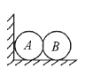
判断图中A、B各自受到几个弹力的作用？
微小形变弹力
（1）方向：接触面上的弹力方向为：$\_\_\_\_$（15）；轻绳上的弹力方向为：$\_\_\_\_$（16）；轻刚杆上的弹力方向为：$\_\_\_\_$（17）。
（2）大小：微小形变弹力的形变的大小不可见，故微小形变弹力需要根据$\_\_\_\_$（18）来计算。
胡克定律
（1）实验表明，弹簧发生形变时，在弹性限度内，弹力的大小
$F$跟$\_\_\_\_$（19）成正比，即$\_\_\_\_$（20）．$k$为弹簧的劲度系数，单位是$\_\_\_\_$（21）。
（2）弹簧弹力的方向：沿弹簧指向$\_\_\_\_$（22）的方向。

## 摩擦力

1.1静摩擦力
（1）产生条件：Ｉ相互接触的物体间有$\_\_\_\_$（23）；Ⅱ接触面$\_\_\_\_$（24）；Ⅲ两物体间有$\_\_\_\_$（25）；
（2）方向：$\_\_\_\_$（26）；
（3）大小：
$0<{}f\leqslant {{f}_{\max }}$，${{f}_{\max }}$称作$\_\_\_\_$（27），它和滑动摩擦力的关系为：$\_\_\_\_$（28）。
1.2滑动摩擦力
（1）产生条件：Ｉ相互接触的物体间有$\_\_\_\_$（29）；Ⅱ接触面$\_\_\_\_$（30）；Ⅲ两物体间有$\_\_\_\_$（31）；
（2）方向：$\_\_\_\_$（32）；
（3）大小：$\_\_\_\_$（33），
$\mu$为滑动摩擦因数。滑动摩擦力的大小跟$\_\_\_\_$（34）成正比。

## 受力分析

步骤：
（1）明确研究对象：
在进行受力分析时，研究对象可以是某一个物体，也可以是若干个物体．研究对象确定以后，只分析研究对象以外的物体施予研究对象的力（既研究对象所受的外力），而不分析研究对象施予外界的力；
（2）隔离对象，找出接触面
（3）按顺序找力：
①画外力
②画$\_\_\_\_$（35）（重力、电场力、磁场力）
③画$\_\_\_\_$（36），接触力中必须先弹力，后摩擦力（只有在有弹力的接触面之间才可能有摩擦力）
（4）检查
①是否符合当前状态
②力是否有来源

（1）只画$\_\_\_\_$（37），不画$\_\_\_\_$（38）．画受力图时，只能按力的性质分类画力，不能按作用效果（拉力、压力、向心力等）画力，否则将出现重复；
（2）在解同一个问题时，分析了合力就不能再分析$\_\_\_\_$（39）；分析了分力就不能再分析$\_\_\_\_$（40），千万不可重复．

本讲目标：
1.掌握弹力、摩擦力的产生条件、大小和方向的判断；
2.掌握受力分析的步骤和注意事项；

## 平衡

（1）平衡状态：物体保持$\_\_\_\_$（41）或做$\_\_\_\_$（42）状态；
（2）共点力平衡条件：在共点力作用下物体的平衡条件是$\_\_\_\_$（43）．
①二力平衡时，两个力必$\_\_\_\_$（44）、$\_\_\_\_$（45）、$\_\_\_\_$（46）；
②三力平衡时，若是非平行力，则三力作用线必$\_\_\_\_$（47），三力的矢量图必为一$\_\_\_\_$（48）；
③多个力共同作用处于平衡状态时，这些力在任一方向上的合力必为$\_\_\_\_$（49）；
④多个力作用平衡时，其中任一力必与其它力的合力$\_\_\_\_$（50）；
⑤若物体有加速度，则在垂直加速度的方向上的合力为$\_\_\_\_$（51）．

# 知识点填空答案
1. 物体与物体； 2. 运动状态； 3. 形变； 4. $\text{N}$； 5. 万有引力； 6. 电磁相互作用； 7. 强相互作用； 8. 弱相互作用； 9. 竖直向下； 10. 几何中心； 11. 弹性； 12. 接触； 13. 弹性； 14. 恢复； 15. 垂直于接触面指向受力物体； 16. 沿绳子指向绳子收缩方向； 17. 任意，根据物体受力判断； 18. 物体受力情况； 19. 弹簧的形变量$x$； 20. $F=kx$； 21. 牛顿每米（$\text{N/m}$）； 22. 弹簧恢复原长； 23. 弹力； 24. 粗糙； 25. 相对运动趋势； 26. 与相对运动趋势方向相反； 27. 最大静摩擦力； 28. 最大静摩擦力略大于滑动摩擦力，高中阶段一般认为二者相等； 29. 弹力； 30. 粗糙； 31. 相对运动； 32. 与相对运动方向相反； 33. $f=\mu N$； 34. 压力的大小； 35. 场力； 36. 接触力； 37. 性质力； 38. 效果力； 39. 分力； 40. 合力； 41. 静止； 42. 匀速直线运动； 43. 合力为零； 44. 等大； 45. 反向； 46. 共线； 47. 交于一点； 48. 闭合三角形； 49. 零； 50. 平衡； 51. 零

# 题目

## 弹力方向和有无的判断

### 典型例题1

> [!ti] *例题*
> 下列四种情景中，物体（球或轻杆）均处于静止状态，它与外界的接触面（接触点）均光滑，则物体所受弹力示意图正确的是（ ）
> > [!opts4]
> > - A. 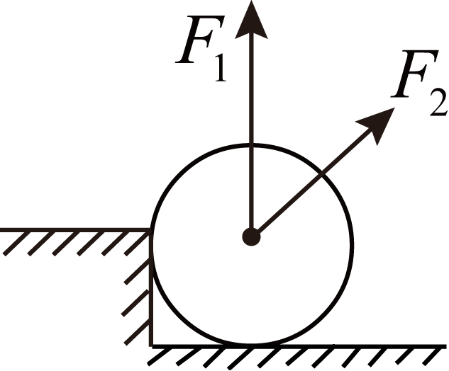
> > - B. 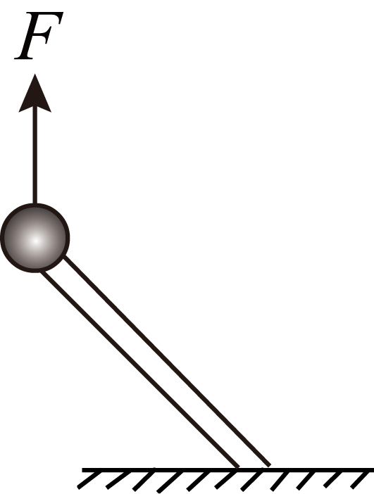
> > - C. 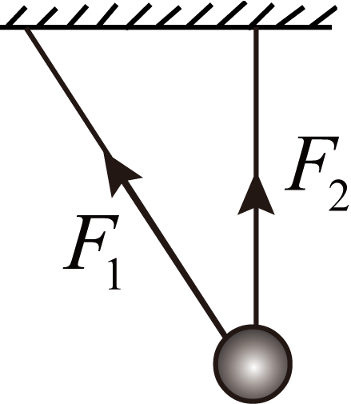
> > - D. 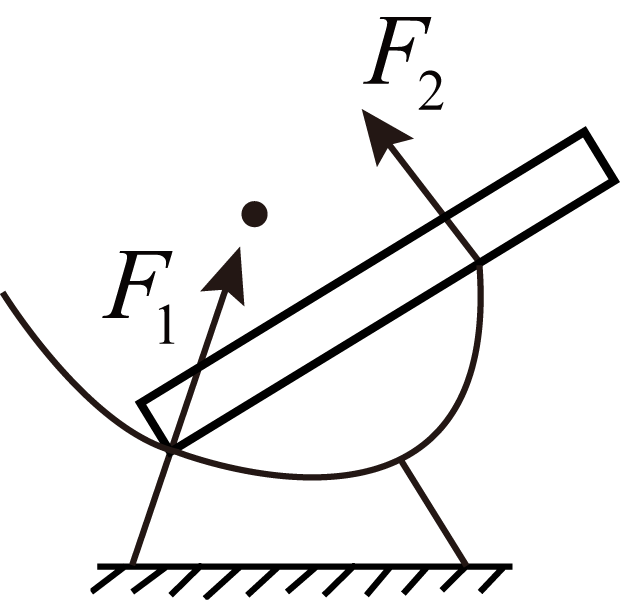

> [!ti] *例题*
> 如图所示，固定在小车上的支架的斜杆与竖直杆的夹角为$\theta$，在斜杆下端固定有质量为m的小球，下列关于杆对球的作用力F的判断中，正确的是（　　）
> 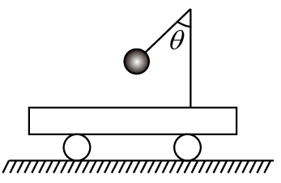
> > [!opts1]
> > - A. 小车静止时，$F=mg$，方向竖直向上
> > - B. 小车匀速时，$F=mgco\mathrm{s}\theta$，方向垂直杆向上
> > - C. 小车向右匀加速运动，加速度大小为a时，可能有$F=\frac{ma}{\sin \theta }$，方向沿着杆斜向上
> > - D. 小车向右匀减速运动，加速度大小为a时，$F=\sqrt{（ma）^{2}+（mg）^{2}}$，方向斜向左上方

### 自主练习1

> [!ti] *例题*
> 麦克风静止在水平桌面上，下列能表示支架对话筒作用力的方向的是（ ）
> > [!opts4]
> > - A. 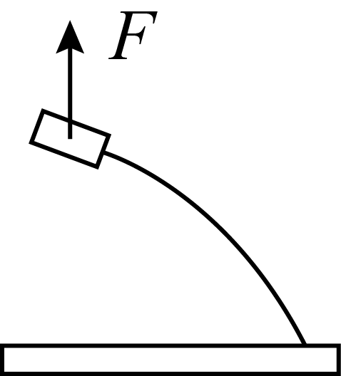
> > - B. 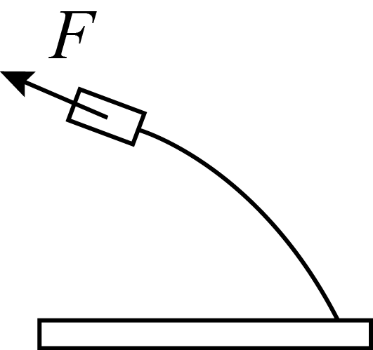
> > - C. 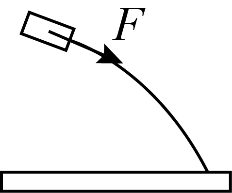
> > - D. 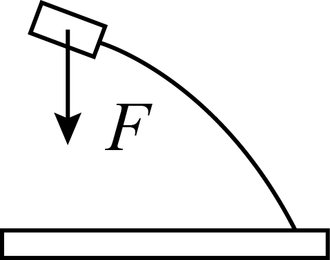

## 弹力的计算

### 典型例题2

> [!ti] *例题*
> 餐厅暖盘车的储盘装置示意图如图所示，三根完全相同的弹簧等间距竖直悬挂在水平固定圆环上，下端连接托盘．托盘上叠放若干相同的盘子，取走一个盘子，稳定后余下的正好升高补平．已知单个盘子的质量为
> $\rm 300g$，相邻两盘间距$\rm 1.0cm$，重力加速度大小取$10\text{m/s}^2$．弹簧始终在弹性限度内，每根弹簧的劲度系数为（ ）
> 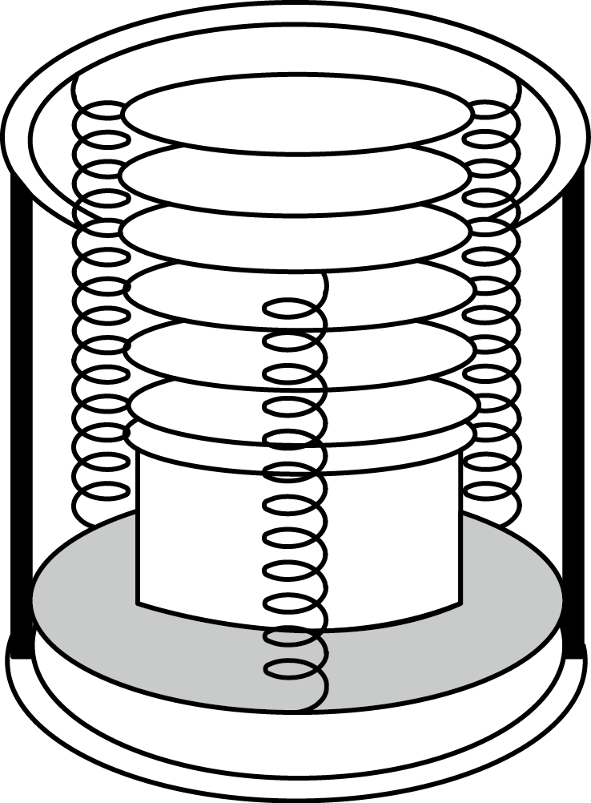
> > [!opts4]
> > - A. $\rm 10N/m$
> > - B. $\rm 100N/m$
> > - C. $\rm 200N/m$
> > - D. $\rm 300N/m$

> [!ti] *例题*
> 如图甲所示，轻绳
> $AD$跨过固定在水平横梁$BC$右端的定滑轮挂住一个质量为$m_1$的物体，$\angle ACB=30^\circ$；图乙所示的轻杆$HG$一端用铰链固定在竖直墙上，另一端$G$通过细绳$EG$拉住，$EG$与水平方向成$30^\circ$角，轻杆的$G$点用细绳$GF$拉住一个质量为$m_2$的物体，重力加速度为$g$，则下列说法正确的是（ ）
> 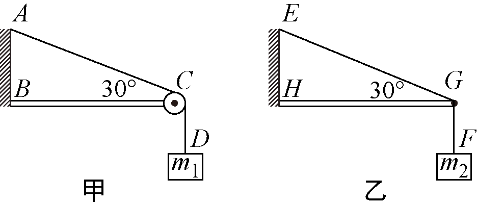
> > [!opts1]
> > - A. 图甲中 $BC$对滑轮的作用力为$\frac{{{m}_{1}}g}{2}$
> > - B. 图乙中 $HG$杆受到绳的作用力为${{m}_{2}}g$
> > - C. 细绳 $AC$段的拉力${{T}_{AC}}$与细绳$EG$段的拉力${{T}_{EG}}$之比为$1:1$
> > - D. 细绳 $AC$段的拉力${{T}_{AC}}$与细绳$EG$段的拉力${{T}_{EG}}$之比为${{m}_{1}}:2{{m}_{2}}$

### 自主练习2

> [!ti] *例题*
> 三个木块
> $a$、$b$、$c$和两个劲度系数均为$\text{500N/m}$的相同轻弹簧$p$、$q$用轻绳连接如图，$a$放在光滑水平桌面上，$a$、$b$质量均为$1\text{kg}$，$c$的质量为$2\text{kg}$．开始时$p$弹簧处于原长，木块都处于静止．现用水平力缓慢地向左拉$p$弹簧的左端，直到$c$木块刚好离开水平地面为止，$g$取$10\text{m/}{{\text{s}}^{2}}$．该过程$p$弹簧的左端向左移动的距离是（ ）
> 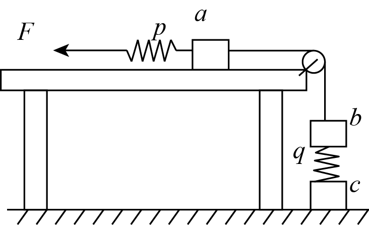
> > [!opts4]
> > - A. $6\text{cm}$
> > - B. $8\text{cm}$
> > - C. $10\text{cm}$
> > - D. $12\text{cm}$

> [!ti] *2022~2023学年北京西城区北京师范大学附属中学高三上学期期中第4题*
> 某实验小组在“探究弹簧弹力与其伸长量关系”的实验中，使用两根不同的轻质弹簧1和2进行研究。在弹性限度内，两根弹簧的弹力F与其长度l的关系如图所示。设两根弹簧的原长分别为$l_{1}$和$l_{2}$，劲度系数分别为$k_{1}$和$k_{2}$。则下列关系正确的是（　　）
> 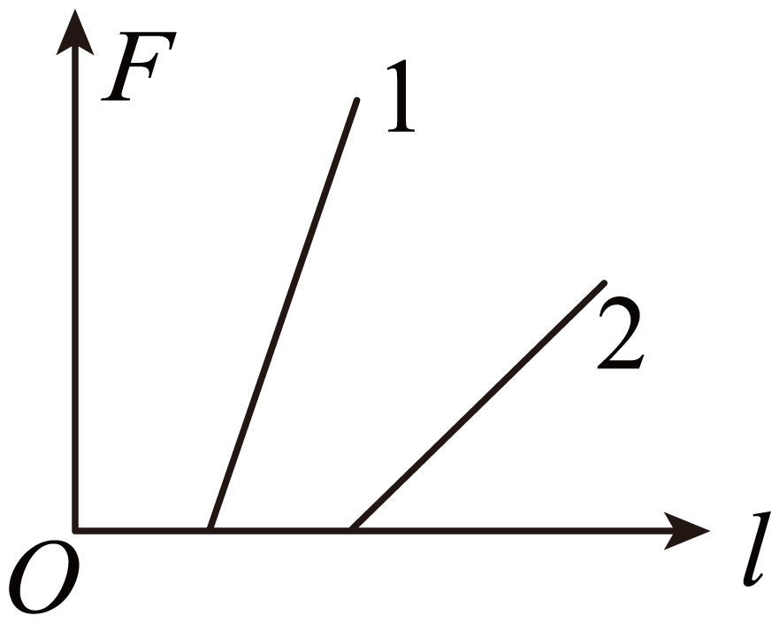
> > [!opts2]
> > - A. $l_{1}< l_{2},k_{1}> k_{2}$
> > - B. $l_{1}> l_{2},k_{1}< k_{2}$
> > - C. $l_{1}< l_{2},k_{1}< k_{2}$
> > - D. $l_{1}> l_{2},k_{1}> k_{2}$

> [!ti] *2022~2023学年10月北京通州区潞河中学高三上学期月考第4题*
> 如图所示，两木块的质量分别是${{m}_{1}}$和${{m}_{2}}$，两轻质弹簧的劲度系数分别为${{k}_{1}}$和${{k}_{2}}$，整个系统处于平衡状态。则下面弹簧的形变量为（　　）
> 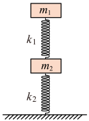
> > [!opts4]
> > - A. $\frac{{{m}_{1}}g}{{{k}_{1}}}$
> > - B. $\frac{{{m}_{2}}g}{{{k}_{2}}}$
> > - C. $\frac{{{m}_{1}}g}{{{k}_{1}}}+\frac{{{m}_{2}}g}{{{k}_{2}}}$
> > - D. $\frac{{{m}_{1}}g+{{m}_{2}}g}{{{k}_{2}}}$

## 摩擦力的有无和方向的判断

### 典型例题3

> [!ti] *例题*
> 利用砚台将墨条磨成墨汁，墨条速度方向水平向左时，（　　）
> 
> > [!opts1]
> > - A. 砚台对墨条的摩擦力方向水平向左
> > - B. 桌面对砚台的摩擦力方向水平向左
> > - C. 桌面和墨条对砚台的摩擦力是一对平衡力
> > - D. 桌面对砚台的支持力与墨条对砚台的压力是一对平衡力

> [!ti] *例题*
> （改编题）图(a)、图(b)分别为皮带运输机和商场扶梯的示意图,A、B是可视为质点的物体，物体与接触面之间始终无相对滑动，则下列说法正确的是（ ）
> 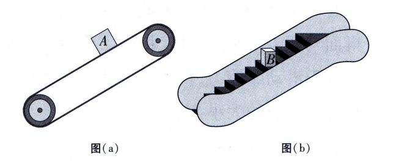
> > [!opts1]
> > - A. 当皮带运输机向上匀速运输物体时，物体A受 到沿传送带向上的摩擦力
> > - B. 当皮带运输机向下匀速运输物体时，物体A受 到沿传送带向下的摩擦力
> > - C. 当商场扶梯向上匀速运输物体时，物体B受到 水平向右的摩擦力
> > - D. 当商场扶梯向下匀速运输物体时，物体B不受 摩擦力

### 自主练习3

> [!ti] *2022~2023学年10月北京通州区潞河中学高三上学期月考第8题*
> 如图所示，一个与水平方向夹角为$\theta$的传送带，现将一物块轻轻地放在传送带最上端，各接触面粗糙。关于物块刚放上传送带的一小段时间内，下列说法正确的是（　　）
> 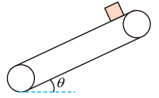
> > [!opts1]
> > - A. 当传输带逆时针转动时，物块受到的摩擦力方向沿斜面向上
> > - B. 当传输带顺时针转动时，物块受到的摩擦力方向沿斜面向上
> > - C. 如果传送带不运动，物块可能不受摩擦力作用
> > - D. 无论传送带怎样运动，物块受到的摩擦力方向都沿斜面向上

> [!ti] *2020~2021学年10月北京朝阳区北京市第八十中学高三上学期月考第3题*
> 如图所示，节目《激情爬竿》在春晚受到观众的好评．当杂技演员用双手握住固定在竖直方向的竿匀速攀上和匀速下滑时，他所受的摩擦力分别是
> ${{F}_{f1}}$和${{F}_{f2}}$，那么（ ）
> 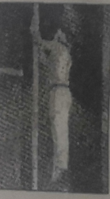
> > [!opts1]
> > - A. ${{F}_{f1}}$向下，${{F}_{f2}}$向上，且${{F}_{f1}}={{F}_{f2}}$
> > - B. ${{F}_{f1}}$向下，${{F}_{f2}}$向上，且${{F}_{f1}}>{{F}_{f2}}$
> > - C. ${{F}_{f1}}$向上，${{F}_{f2}}$向上，且${{F}_{f1}}={{F}_{f2}}$
> > - D. ${{F}_{f1}}$向上，${{F}_{f2}}$向下，${{F}_{f1}}={{F}_{f2}}$

## 摩擦力的计算

### 典型例题4

> [!ti] *2024~2025学年北京海淀区北京一零一中学高三上学期开学考试第2题*
> 研究滑动摩擦力大小的实验装置如图所示，木块和木板叠放于水平桌面上，弹簧测力计的一端水平固定，另一端通过水平细绳与木块相连，用缓慢增大的力拉动木板，使之在桌面上滑动（木块始终未脱离木板）．弹簧测力计示数稳定后（ ）
> 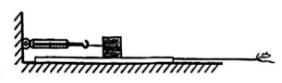
> > [!opts1]
> > - A. 木块相对桌面静止，弹簧测力计示数与木板的运动状态有关
> > - B. 木块相对桌面静止，弹簧测力计示数与木板的运动状态无关
> > - C. 木板相对桌面运动，弹簧测力计示数与木板和桌面间的动摩擦因数有关
> > - D. 木板相对桌面运动，弹簧测力计示数与木板和桌面间的动摩擦因数无关

> [!ti] *例题*
> 如图所示，倾角
> $\theta$的斜面上有一重为$G$的物体，在与斜面底边平行的水平推力作用下在斜面上做匀速直线运动，则（　　）
> 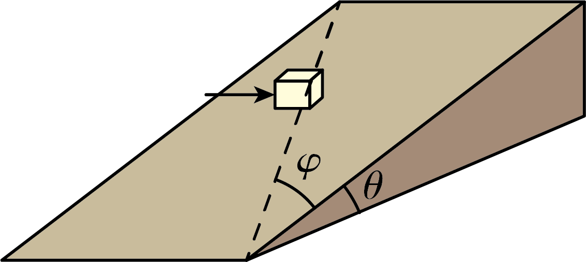
> > [!opts1]
> > - A. 物体可能沿虚线运动
> > - B. 物体可能沿水平方向运动
> > - C. 物体与斜面间的动摩擦因数 $\mu =\tan \theta$
> > - D. 物体与斜面间的动摩擦因数 $\mu >\tan \theta$

> [!ti] *例题*
> 表面粗糙的长直木板的上表面的一端放有一个木块，如图所示，木板由水平位置缓慢向上转动(即木板与地面的夹角
> $\alpha$变大，最大静摩擦力大于滑动摩擦力)，另一端不动，则木块受到的摩擦力${{F}_{f}}$随角度$\alpha$变化的图象是下列图中的（ ）
> 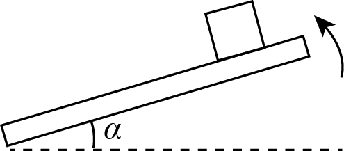
> > [!opts4]
> > - A. 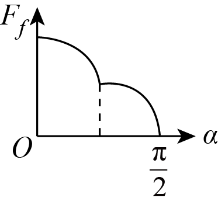
> > - B. 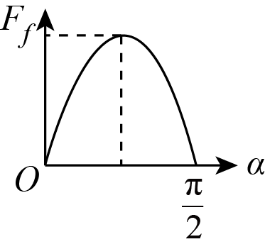
> > - C. 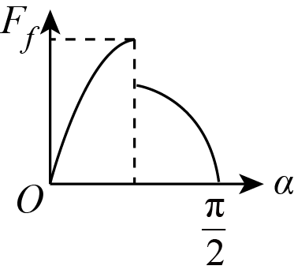
> > - D. 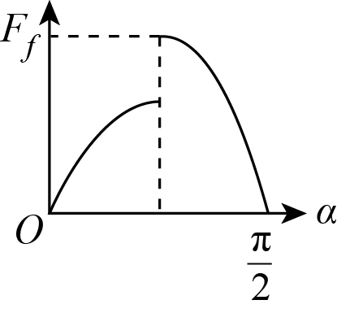

### 自主练习4

> [!ti] *2024年北京通州区高三一模（4月）第7题*
> 如图1所示，磁铁将一张厚纸片压在竖直磁性黑板上保持不动．若将这张厚纸片两次折叠后仍能被该磁铁压在黑板上保持不动，如图2所示．图1中黑板对厚纸片的摩擦力为$F_{1}$，最大静摩擦力为$F_{1\max }$，图2中黑板对厚纸片的摩擦力为$F_{2}$．最大静摩擦力为$F_{2\max }$下列判断正确的是（  ）
> 
> > [!opts2]
> > - A. $F_{1}> F_{2}$
> > - B. $F_{1}< F_{2}$
> > - C. $F_{1\max }> F_{2\max }$
> > - D. $F_{1\max }< F_{2\max }$

> [!ti] *2024年北京丰台区高三一模第7题*
> 如图所示，木块A、B分别重50N和60N，与水平地面之间的动摩擦因数均为0.2。夹在A、B之间的轻弹簧被压缩了2cm，弹簧的劲度系数为400N/m。用$F=2\mathrm{N}$的水平拉力拉木块B，木块A、B均保持静止。最大静摩擦力近似等于滑动摩擦力，下列说法正确的是（　　）
> 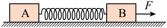
> > [!opts2]
> > - A. 弹簧的弹力大小为80N
> > - B. 木块A受到的摩擦力大小为10N
> > - C. 木块B受到的摩擦力大小为6N
> > - D. 地面给A、B组成的系统的摩擦力大小为2N

> [!ti] *2024~2025学年北京海淀区北京大学附属中学高一上学期期中第8题*
> 某同学利用图甲所示装置研究摩擦力的变化情况．实验台上固定一个力传感器，传感器用棉线拉住物块，物块放置在粗糙的长木板上．水平向左拉木板，传感器记录的
> $F-t$图像如图乙所示．下列说法正确的是（ ）
> 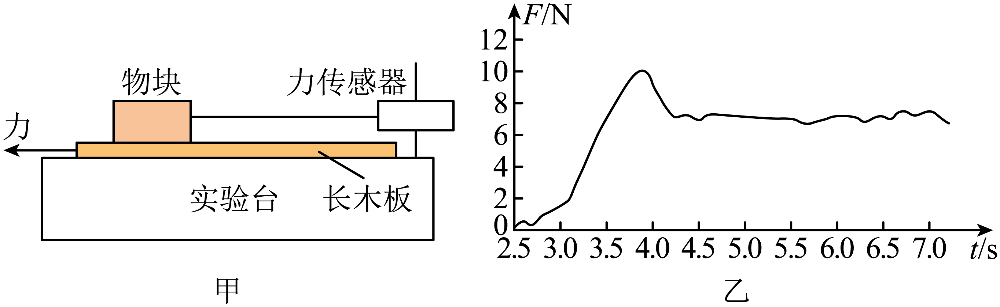
> > [!opts1]
> > - A. 实验中必须让木板保持匀速运动
> > - B. 图乙中曲线就是摩擦力随时间的变化曲线
> > - C. 最大静摩擦力与滑动摩擦力之比约为10:7
> > - D. 只用图乙中数据可得出物块与木板间的动摩擦因数

> [!ti] *2022~2023学年北京顺义区高三上学期期中（第四中学）第14题*
> 如图所示，质量为$M$，倾角$\theta =30^\circ$的粗糙斜面置于水平面上，质量为$m$的物块在水平向右的推力$F$作用下，沿斜面向上匀速运动，物块上滑过程中斜面体始终静止．下列结论正确的是 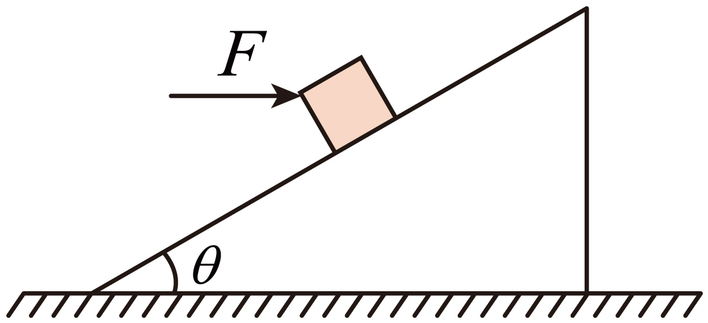
> > [!opts1]
> > - A. 物块一定不受摩擦力作用
> > - B. 由于不知道F的大小，所以物块可能受到沿斜面向上的摩擦力
> > - C. 水平面对斜面体的摩擦力大小为F
> > - D. 水平面对斜面体的支持力大小为$Mg+mg\cos \theta$

> [!ti] *例题*
> 如图所示，一斜面体置于水平地面上，一物块在平行于斜面向上的外力F作用下相对斜面保持静止，该过程中斜面体相对水平地面也保持静止。下列说法正确的是（ ）
> 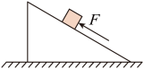
> > [!opts1]
> > - A. 斜面对物块一定有摩擦力作用
> > - B. 地面对斜面体一定有摩擦力作用
> > - C. 地面对斜面体的支持力大于物块与斜面所受重力之和
> > - D. 地面对斜面体的支持力等于物块与斜面所受重力之和

> [!ti] *2021年北京海淀区高三一模第13题*
> 如图甲所示，质量为
> $\rm 0.4kg$的物块在水平力$F$作用下可沿竖直墙面滑动，物块与竖直墙面间的动摩擦因数为$0.5$，力$F$随时间$t$变化的关系如图乙所示．若$t=0$时物块的速度为$0$，设物块所受最大静摩擦力等于滑动摩擦力，$g$取$\rm 10m/s^2$．下列图像中，能正确反映物块所受摩擦力$f$大小与时间$t$变化关系的是（ ）
> 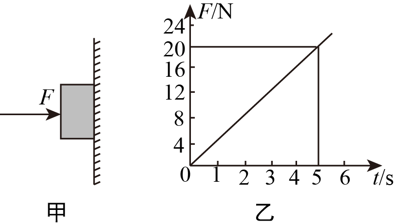
> > [!opts4]
> > - A. 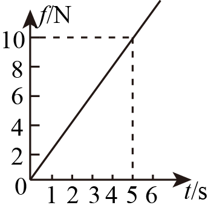
> > - B. 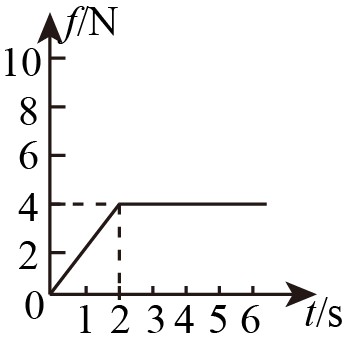
> > - C. 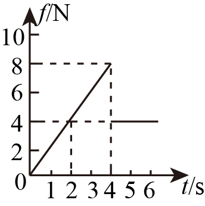
> > - D. 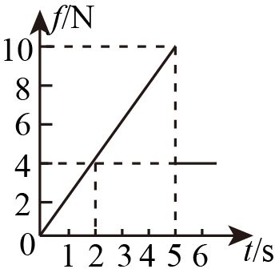

> [!ti] *2024~2025学年9月北京朝阳区北京陈经纶中学高三上学期月考第6题*
> 如图所示，一光滑的轻滑轮用细绳$OO^\prime$悬挂于$O^\prime$点；另一细绳跨过滑轮，其一端悬挂小球A，另一端系一位于水平粗糙面上的物体B，$OO^\prime$绳与竖直方向的夹角为$\alpha$，下列说法正确的是（ ）
> 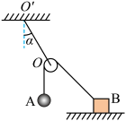
> > [!opts1]
> > - A. 将B向左移动少许，若B仍能保持静止，则B与地面的摩擦力变大
> > - B. 增大小球A的质量，若B仍能保持静止，则B与地面的摩擦力变大
> > - C. 无论物体B在水平面上左移还是右移，只要移动后B仍能保持静止且移动距离很小，$\alpha$角将不变
> > - D. 无论物体B在水平面上左移还是右移，只要移动后B仍能保持静止，$OO^\prime$绳上的张力大小不变

> [!ti] *例题*
> 顶端装有滑轮的粗糙斜面固定在地面上，A、B两物体通过细绳如图连接，并处于静止状态（不计绳的质量和绳与滑轮间的摩擦）．现用水平力F作用于悬挂的物体B上，使其缓慢拉动一小角度，发现A物体仍然静止。则在此过程中说法不正确的是（ ）
> 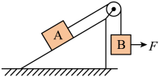
> > [!opts2]
> > - A. 水平力F一定变大
> > - B. 物体A所受斜面给的摩擦力一定变大
> > - C. 物体A所受斜面给的支持力一定不变
> > - D. 细绳对物体A的拉力一定变大

## 受力分析

### 典型例题5

> [!ti] *例题*
> 如图所示，倾斜直杆的左端固定在水平地面上，与水平面成
> $\theta$角，杆上穿有质量为$m$的小球$a$和轻质圆环$b$，两者通过一条细绳跨过定滑轮相连接，当$a$、$b$静止时，$Oa$段绳与杆的夹角也为$\theta$，不计一切摩擦，重力加速度为$g$．则下列说法正确的是（ ）
> 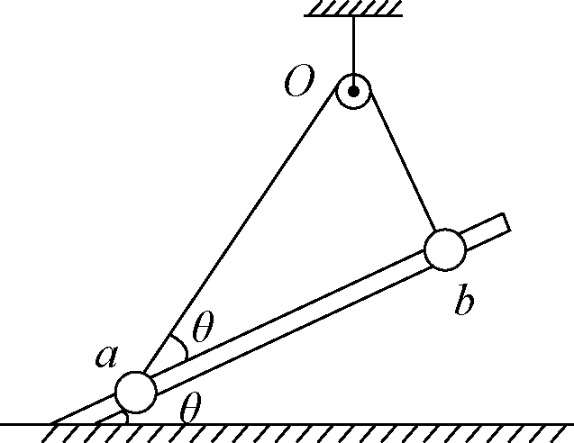
> > [!opts1]
> > - A. $a$可能受到$2$个力的作用
> > - B. $b$可能受到$3$个力的作用
> > - C. 绳对 $a$的拉力大小为$mg\tan\theta$
> > - D. 杆对 $a$的支持力大小为$mg~\cos ~\theta$

> [!ti] *2023年北京西城区高三三模第9题*
> 如图所示，在斜面上，木块A与B的接触面是水平的。连接木块A的绳子呈水平状态，两木块均保持静止。则木块A和木块B可能的受力个数分别为（　　）
> 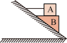
> > [!opts4]
> > - A. 2个和4个
> > - B. 3个和4个
> > - C. 4个和5个
> > - D. 4个和6个

> [!ti] *2022~2023学年4月北京东城区北京市第五十中学高三下学期月考第7题*
> 如图所示，有一倾角θ＝30°的斜面体B，质量为M．物体A质量为m，弹簧对物体A施加一个始终保持水平的作用力，调整A在B上的位置， A始终能和B保持静止．对此过程下列说法正确的是(　　)
> 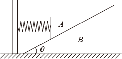
> > [!opts1]
> > - A. A、B之间的接触面可能是光滑的
> > - B. 弹簧弹力越大，A、B之间的摩擦力越大
> > - C. A、B之间的摩擦力为0时，弹簧弹力为$\frac{\sqrt{3}}{3}$mg
> > - D. 弹簧弹力为$\frac{\sqrt{3}}{2}$mg时，A所受摩擦力大小为$\frac{1}{4}$mg

### 自主练习5

> [!ti] *2023~2024学年北京西城区北京师范大学附属中学高一上学期期中第14题*
> 如图所示，壁虎沿竖直墙面斜向上匀速爬行，速度为$v，$壁虎所受的重力为$G$，与墙面之间的摩擦力 为关于壁虎在竖直墙面内的受力分析，下列示意图中正确的是
> 
> > [!opts4]
> > - A. 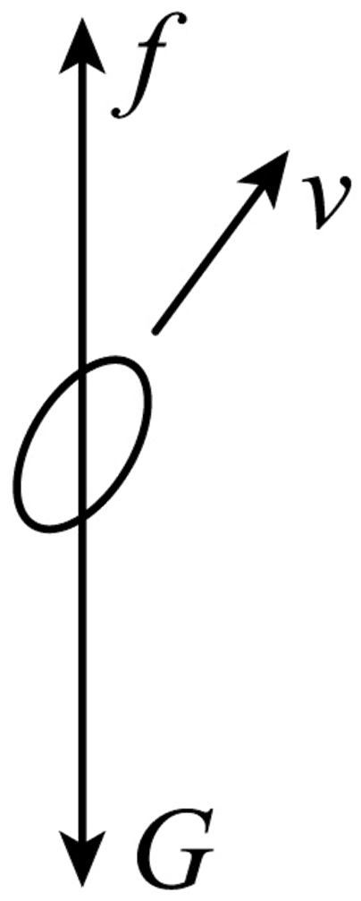
> > - B. 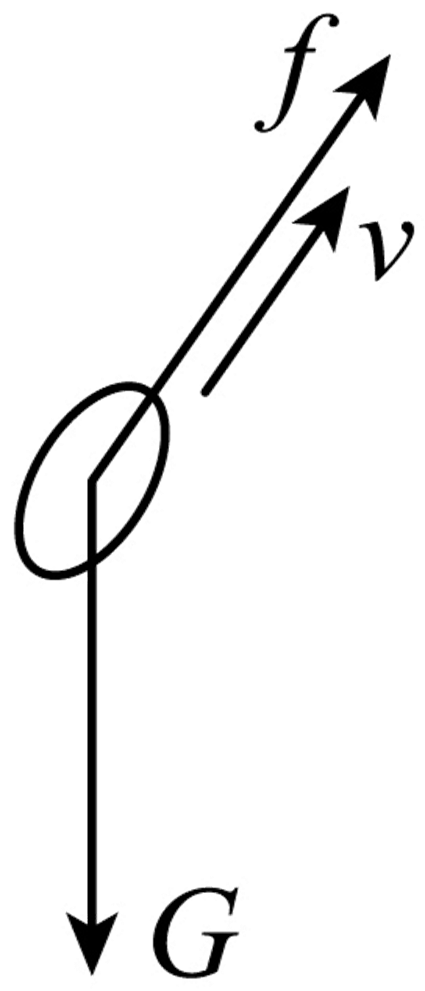
> > - C. 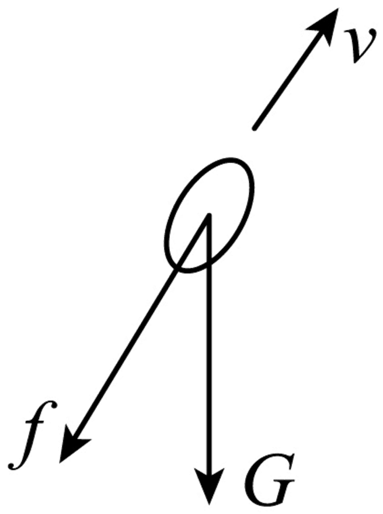
> > - D. 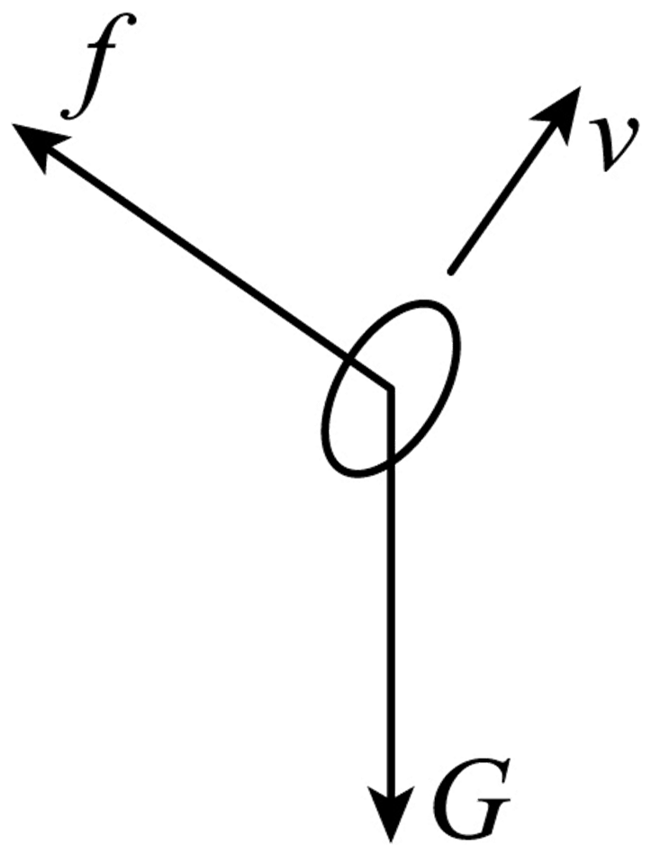

> [!ti] *例题*
> 如图所示，物体在斜面上匀速下滑，将光滑斜面上的物体的重力$mg$分解为$F_1$、$F_2$两个力，下列结论正确的是（ ）
> 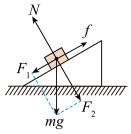
> > [!opts1]
> > - A. $F_2$就是物体对斜面的正压力
> > - B. 物体受$F_{1}$不一定等于$f$
> > - C. 物体受$mg$、$N$、$f$、$F_{1}$、$F_{2}$五个力作用
> > - D. $F_{1}$、$F_{2}$二个分力共同作用的效果跟重力$mg$的作用效果相同

> [!ti] *2022~2023学年北京海淀区北京医学院附属中学高三下学期月考第4题*
> 绿化工人在街道旁边栽种大树时，为了确保树干不倾斜，需要用铁杆来支撑。通常是用一个铁环紧套在树干上，三根长度不同的铁杆一端均匀分布在固定的铁环上，另一端固定在同一个水平地面上，大树栽好后竖直压在地上，如图所示。由于树刚栽，地面对大树的作用力，除了竖直向上的支持力以外，其它力可以不考虑。则下列说法中正确的是（　　）
> 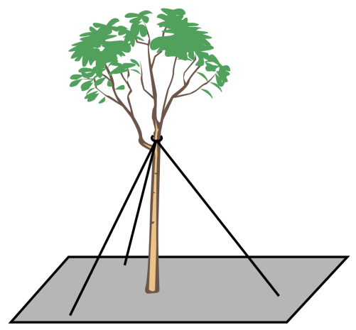
> > [!opts1]
> > - A. 三根铁杆对大树的作用力大小一定相等
> > - B. 大树对地面的作用力一定大于自身的重力
> > - C. 铁杆对大树的作用力与地面对大树的支持力是一对平衡力
> > - D. 铁杆对大树的作用力在水平方向的合力为零

> [!ti] *2024~2025学年北京通州区高三上学期期中第9题*
> 如图所示，两个质量均为m的长方体木块$A$、$B$叠放在水平地面上，$A$、$B$间及$B$、地面间的动摩擦因数均为$\mu$．$B$木块受到一个水平方向的拉力F，但仍然保持静止．已知当地重力加速度为g，下列说法正确的是（ ）
> 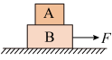
> > [!opts1]
> > - A. A木块受到的静摩擦力方向与拉力F的方向相同
> > - B. B木块受到4个力的作用
> > - C. B与地面间的摩擦力大小为$\mu mg$
> > - D. 若想拉动B木块，拉力F应大于$2\mu mg$

## 利用静态平衡计算力

### 典型例题6

> [!ti] *例题*
> 如图所示，可视为质点的机器人通过磁铁吸附在船舷外壁面检测船体．壁面可视为斜面，与竖直方向夹角为$\theta$．船和机器人保持静止时，机器人仅受重力$G$、支持力$F_{\text{N}}$、摩擦力$F_{\text{f}}$和磁力$F$的作用，磁力垂直壁面．下列关系式正确的是（ ）
> 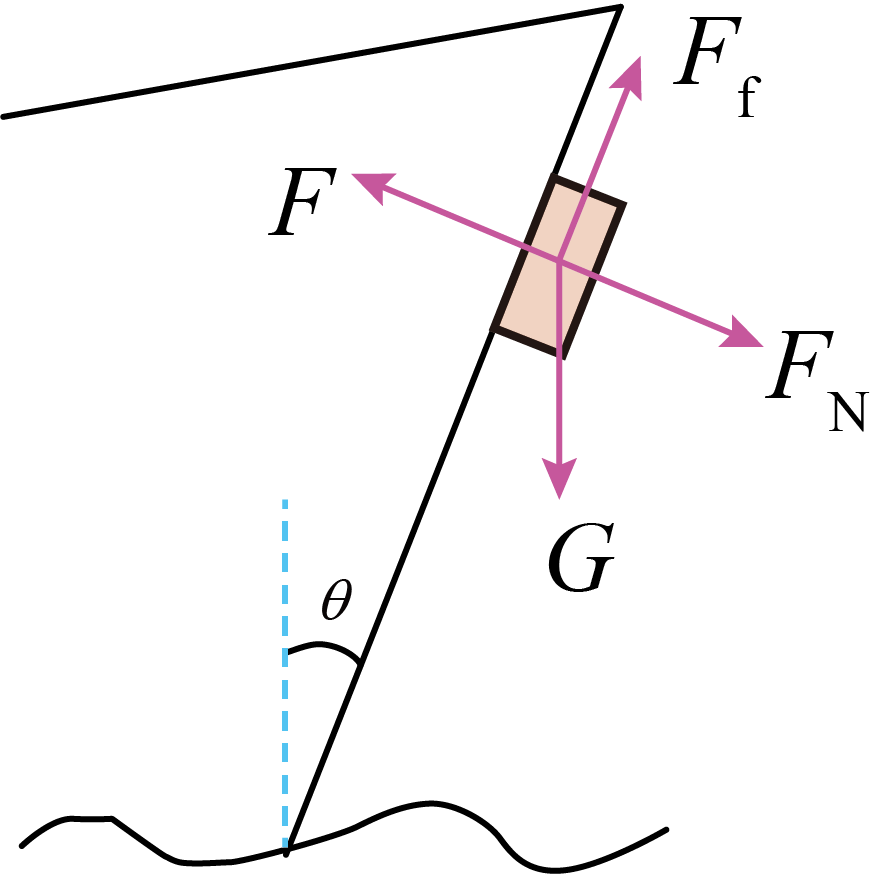
> > [!opts2]
> > - A. $F_{\text{f}}=G$
> > - B. $F=F_{\text{N}}$
> > - C. $F_{\text{f}}=G\cos \theta$
> > - D. $F=G\sin \theta$

> [!ti] *2023~2024学年10月北京海淀区清华大学附属中学高三上学期月考第1题*
> 如图所示，质量为m的箱子在恒力F作用下向右匀速运动。F与水平方向夹角为α，箱子与地面间的动摩擦因数为μ。下列说法正确的是（　　）
> 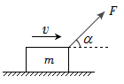
> > [!opts2]
> > - A. 箱子受到的支持力大小为mg
> > - B. 箱子受到的支持力大小为Fsinα
> > - C. 箱子受到的摩擦力大小为Fcosα
> > - D. 箱子受到的摩擦力大小为 μmg

### 自主练习6

> [!ti] *2022~2023学年北京顺义区高三上学期期中第2题*
> 如图所示，用三段不可伸长的轻质细绳OA、OB、OC共同悬挂一重物使其静止，其中 OA与竖直方向的夹角为30°，OB沿水平方向，A端、B端固定．若重物的质量是m，则
> 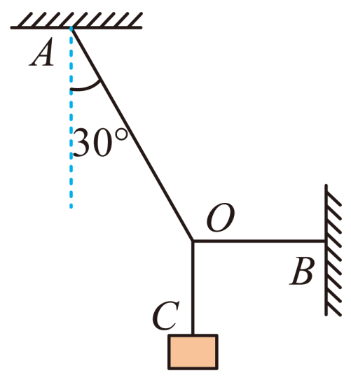
> > [!opts2]
> > - A. OA绳的拉力等于2mg
> > - B. OB绳的拉力等于mg/2
> > - C. OC绳的拉力小于OB绳的拉力
> > - D. OA绳的拉力大于OB绳的拉力

> [!ti] *例题*
> 如图所示，在竖直光滑墙壁上用网兜把足球挂在A点，足球与墙壁的接触点为B．足球的质量为m，悬绳与墙壁的夹角为$\alpha$，网兜的质量不计．下列说法中正确的是（ ）
> 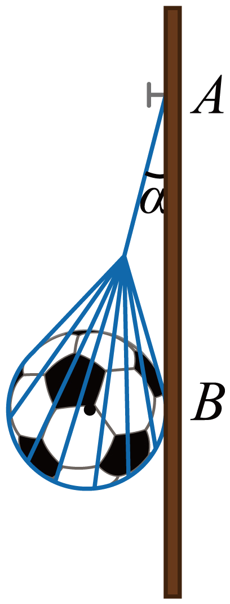
> > [!opts1]
> > - A. 悬绳对足球的拉力大小为$mg\tan \alpha$
> > - B. 墙壁对足球的弹力大小为$mg\tan \alpha$
> > - C. 足球所受合力的大小为$mg\cos \alpha$
> > - D. 悬绳和墙壁对足球的合力大小为$mg\cos \alpha$

> [!ti] *例题*
> 三段不可伸长的细绳$OA$、$OB$、$OC$能承受的最大拉力相同，它们共同悬挂一物体$P$，如图所示．其中$OB$是水平的，$A$端、$B$端固定．若逐渐增加物体$P$的质量，最先被拉断的绳是（ ）
> 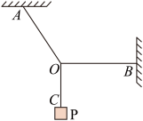
> > [!opts2]
> > - A. 一定是$OA$
> > - B. 一定是$OB$
> > - C. 一定是$OC$
> > - D. 可能是$OA$，也可能是$OC$
