# 25秋北京市第一六六中学高二上期中 #h0
北京市第一六六中学 2025—2026 学年度第一学期期中测试  
高二年级　物理学科　考试时长：90 分钟  
班级：____________　姓名：____________

考查目标：
- 知识：静电场及其应用、静电场中的能量、电路及其应用、电能、能量守恒定律。
- 能力：物理观念、科学思维、科学态度与责任。

%% 来源：25.11北京166中期中试卷.pdf。仅转录印刷试题，不收录手写作答与批注。图片由用户自行处理；图位以注释标记。原卷第15题所述“图1”未见于扫描正文。 %%

# 单选

下列各小题均有四个选项，其中只有一个选项符合题意。

###### 例题第1题

> [!ti] *2024~2025学年北京石景山区北京大学附属中学石景山学校高二上学期期中第1题3分*
> 关于各种“电荷”，下列说法中正确的是（　　）
> > [!opts1]
> > - A. 元电荷就是电子
> > - B. 公式 $E=\frac{kQ}{r^2}$ 中，$Q$ 指的是试探电荷的电荷量
> > - C. 体积很小的带电小球一定可以看成点电荷
> > - D. 检验电荷既要求电量足够小，又要求体积足够小

###### 例题第2题

> [!ti] *2024~2025学年北京东城区北京市第五中学高二上学期期中第4题3分*
> 如图所示，两个等量异号的点电荷在其连线的中垂线上有与连线中点 $O$ 等距离的两点 $a$、$b$，在连线上有距中点 $O$ 等距离的两点 $c$、$d$，则下列说法正确的是（　　）
> %% 图位：PDF第1页，第2题图。 %%
> 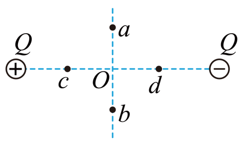
> > [!opts1]
> > - A. $O$ 点的电势以及电场强度均为零
> > - B. $c$、$d$ 两点的电势以及电场强度均相同
> > - C. $a$、$b$ 两点的电势以及电场强度均相同
> > - D. 将一正试探电荷由无穷远处移到 $c$ 点，其电势能减少

###### 例题第3题

> [!ti] *2024~2025学年北京海淀区北京交通大学附属中学高二上学期期中第1题*
> 某区域静电场的电场线分布如图所示，$a$、$b$、$c$ 是电场中的三个点。下列说法错误的是（　　）
> %% 图位：PDF第2页，第3题图。 %%
> 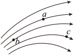
> > [!opts1]
> > - A. $a$、$b$、$c$ 三点电场强度大小关系为 $E_b>E_a>E_c$
> > - B. $a$、$b$、$c$ 三点电势关系为 $\varphi_b>\varphi_a>\varphi_c$
> > - C. 电子在 $a$、$b$、$c$ 三点的电势能关系为 $E_{\mathrm{p}c}>E_{\mathrm{p}a}>E_{\mathrm{p}b}$
> > - D. 将质子从 $b$ 点由静止释放，仅在静电力作用下它将沿电场线运动

###### 例题第4题

> [!ti] *2025~2026学年12月北京顺义区北京市顺义区牛栏山第一中学高二上学期月考（板桥学校）第11题*
> 如图所示，一带正电的点电荷固定于 $O$ 点，图中虚线为以 $O$ 为圆心的一组等间距的同心圆。一带电粒子以一定初速度射入点电荷的电场，实线为粒子仅在静电力作用下的运动轨迹，$a$、$b$、$c$ 为运动轨迹上的三点。则该粒子（　　）
> %% 图位：PDF第2页，第4题图。 %%
> 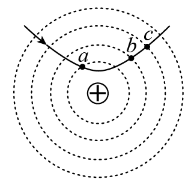
> > [!opts1]
> > - A. 带负电
> > - B. 在 $c$ 点受静电力最大
> > - C. 在 $a$ 点的电势能小于在 $b$ 点的电势能
> > - D. 由 $a$ 点到 $b$ 点的动能变化量大于由 $b$ 点到 $c$ 点的动能变化量

###### 例题第5题

> [!ti] *2024~2025学年北京石景山区北京大学附属中学石景山学校高二上学期期中第12题3分*
> 如图所示，原来不带电、长为 $l$ 的导体棒水平放置，现将一个电荷量为 $+q$（$q>0$）的点电荷放在棒的中心轴线上距离棒的左端 $R$ 处，$A$、$B$ 分别为导体棒左右两端的一点，静电力常量为 $k$。当棒达到静电平衡后，下列说法正确的是（　　）
> 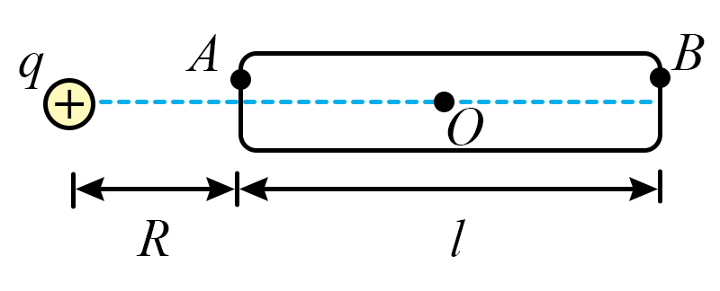
> > [!opts1]
> > - A. 棒上感应电荷在棒的中心 $O$ 处产生的电场强度大小 $E=k\frac{q}{\left(R+\frac{l}{2}\right)^2}$
> > - B. 棒上感应电荷在棒的中心 $O$ 处产生的电场强度方向水平向右
> > - C. 棒的两端都感应出负电荷
> > - D. 若用一根导线将 $A$、$B$ 相连，导线上会产生电流

###### 例题第6题

> [!ti] *2024~2025学年北京西城区北京师范大学附属实验中学高二上学期期中第7题*
> 如图甲所示，在某电场中建立 $x$ 坐标轴，$O$ 为坐标原点，$A$ 点坐标为 $x_1$，一电子仅在电场力作用下沿 $x$ 轴运动，其电势能 $E_{\mathrm p}$ 随其坐标 $x$ 变化的关系如图乙所示。下列说法中不正确的是（　　）
> 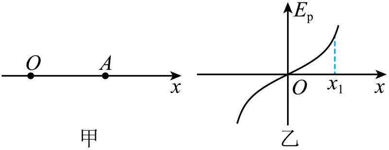
> > [!opts1]
> > - A. 过 $O$ 点的电场线一定与 $x$ 轴重合
> > - B. $A$ 点电场强度的方向沿 $x$ 轴负方向
> > - C. 该电子在 $A$ 点受到的电场力大于其在 $O$ 点受到的电场力
> > - D. 该电子在 $O$ 点的动能大于其在 $A$ 点的动能

###### 例题第7题

> [!ti] *2025~2026学年北京海淀区北京市育英学校高二上学期期中第6题*
> 物理学中，对于多因素（多变量）的问题，可采用控制因素（变量）的方法，把多因素的问题变成多个单因素的问题。如图所示，影响平行板电容器电容的因素有两极板的正对面积 $S$、极板间的距离 $d$ 以及极板间的介质。若极板所带电荷量不变，则关于静电计指针偏角 $\theta$ 的变化，下列说法正确的是（　　）
> 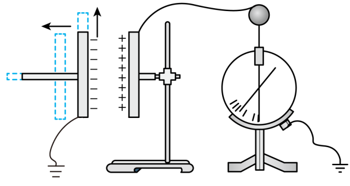
> > [!opts1]
> > - A. 两极板间的电压越大，$\theta$ 越小
> > - B. 保持 $S$、$d$ 不变，在极板间插入介质，则 $\theta$ 变大
> > - C. 保持 $S$ 以及极板间的介质不变，减小 $d$，则 $\theta$ 变小
> > - D. 保持 $d$ 以及极板间的介质不变，减小 $S$，则 $\theta$ 变小

###### 例题第8题

> [!ti] *2024~2025学年北京东城区北京市第一七一中学高二上学期期中第6题*
> 已知光敏电阻在没有光照射时电阻很大，光照越强其阻值越小。利用光敏电阻作为传感器设计了如图所示的电路，电源电动势 $E$、内阻 $r$ 及电阻 $R$ 的阻值均不变。当光照强度增强时，则（　　）
> 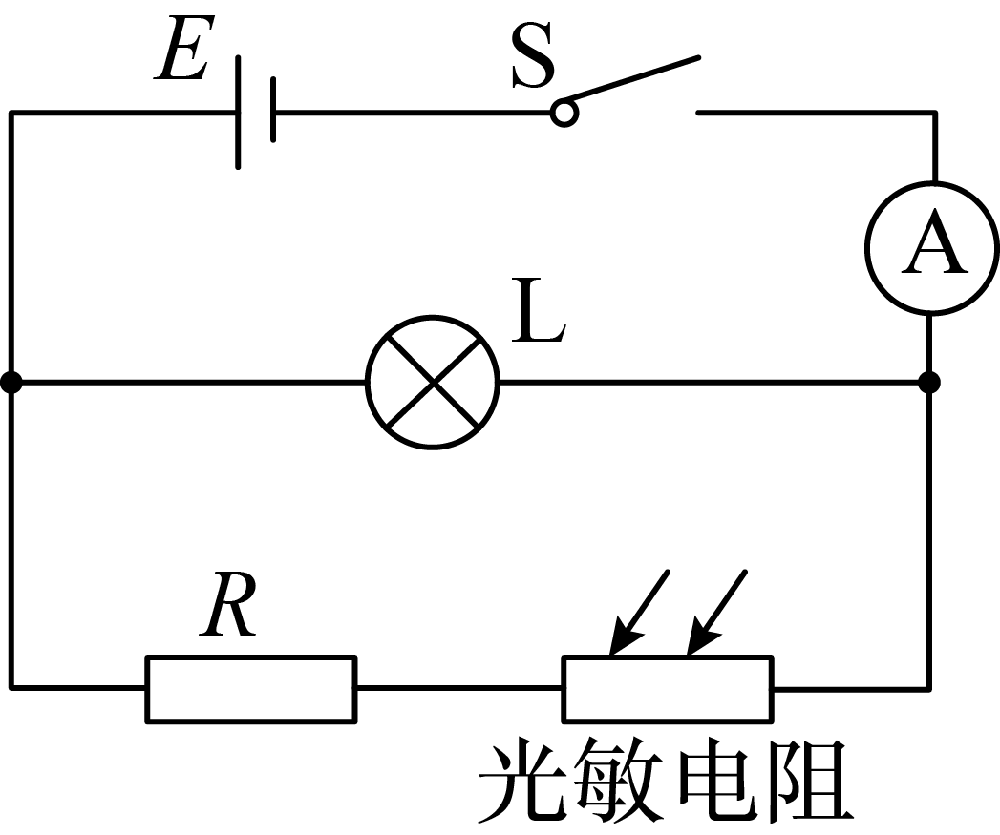
> > [!opts2]
> > - A. 电灯 $L$ 变亮
> > - B. 电流表读数减小
> > - C. 电阻 $R$ 的功率增大
> > - D. 电路的路端电压增大

###### 例题第9题

> [!ti] *2023~2024学年北京丰台区北京市第十二中学高二上学期期中第10题3分*
> 如图所示，其中电流表 $A$ 的量程为 $0.6\ \mathrm A$，表盘均匀划分为 30 个小格，每一小格表示 $0.02\ \mathrm A$；$R_1$ 的阻值等于电流表内阻阻值的一半；$R_2$ 的阻值等于电流表内阻的 2 倍。若用电流表 $A$ 的表盘刻度表示流过接线柱 1 的电流值，则下列分析正确的是（　　）
> 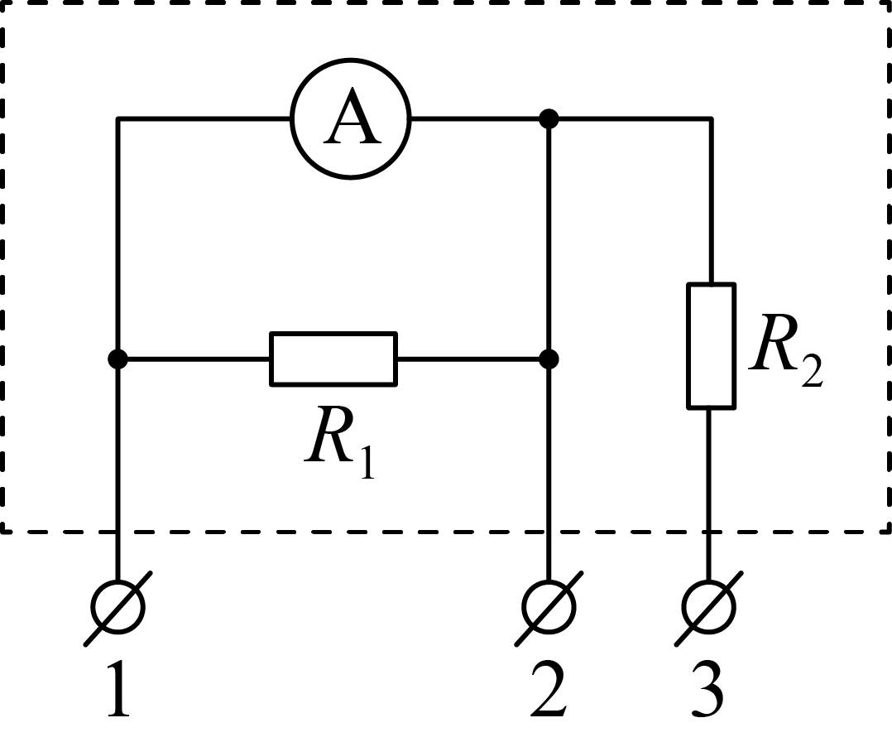
> > [!opts1]
> > - A. 将接线柱 1、2 接入电路时，每一小格表示 $0.04\ \mathrm A$
> > - B. 将接线柱 1、2 接入电路时，每一小格表示 $0.02\ \mathrm A$
> > - C. 将接线柱 1、3 接入电路时，每一小格表示 $0.06\ \mathrm A$
> > - D. 将接线柱 1、3 接入电路时，每一小格表示 $0.01\ \mathrm A$

###### 例题第10题

> [!ti] *2024~2025学年北京东城区北京市第五十中学高二上学期期中（选考）第2题3分*
> 如图所示，在直角三角形 $\triangle abc$ 中，$\angle bac=30^\circ$，$ab=10\ \mathrm{cm}$，匀强电场的电场线平行于 $\triangle abc$ 所在的平面，且 $a$、$b$、$c$ 三点的电势分别为 $6\ \mathrm V$、$-2\ \mathrm V$、$6\ \mathrm V$。下列说法正确的是（　　）
> 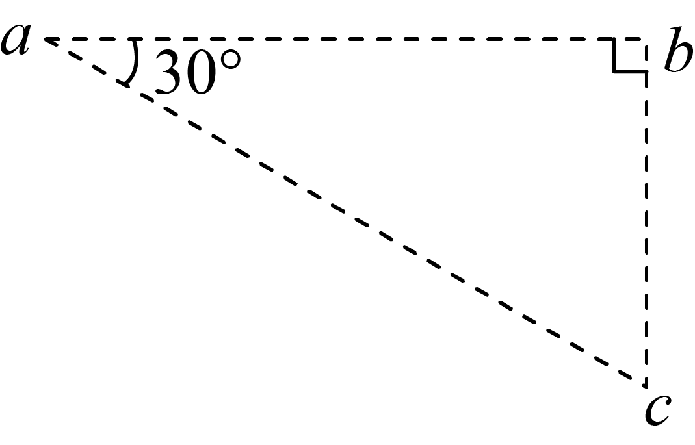
> > [!opts1]
> > - A. $a$、$c$ 中点的电势为 $-2\ \mathrm V$
> > - B. 电场强度的大小为 $160\ \mathrm{V/m}$
> > - C. 电场强度的方向沿 $ab$ 由 $a$ 指向 $b$
> > - D. 电场强度的方向垂直于 $ab$ 斜向下

###### 例题第11题

> [!ti] *2022~2023学年北京西城区北京市第四中学高二上学期期中第14题*
> 如图所示，在地面上方的水平匀强电场中，一个质量为 $m$、电荷量为 $+q$ 的小球，系在一根长为 $L$ 的绝缘细线一端，可以在竖直平面内绕 $O$ 点做圆周运动。$AB$ 为圆周的水平直径，$CD$ 为竖直直径。已知重力加速度为 $g$，电场强度 $E=\frac{mg}{q}$。下列说法正确的是（　　）
> 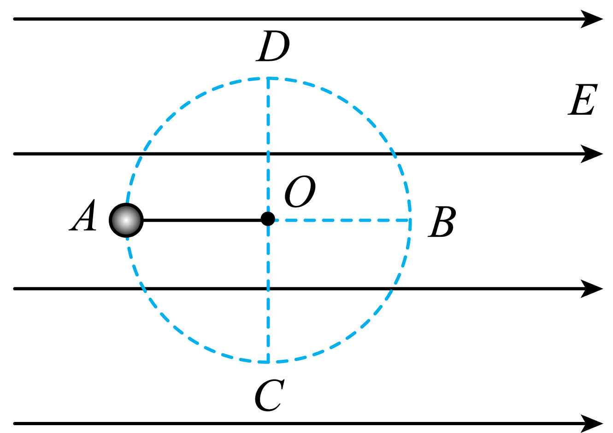
> > [!opts1]
> > - A. 若小球在竖直平面内绕 $O$ 点做圆周运动，则它运动的最小速度为 $\sqrt{gL}$
> > - B. 若小球在竖直平面内绕 $O$ 点做圆周运动，则小球在 $C$ 点动能最大
> > - C. 若将小球在 $A$ 点由静止开始释放，它将沿圆弧运动到 $C$ 点
> > - D. 若将小球在 $A$ 点以大小为 $\sqrt{gL}$ 的速度竖直向上抛出，它将不能沿半圆 $ADB$ 到达 $B$ 点

###### 例题第12题

> [!ti] *2023~2024学年北京西城区北京市第十五中学高二上学期期中第14题3分*
> 在如图所示的 $U-I$ 图中，直线 $a$ 为某电源的路端电压与电流的关系，直线 $b$ 为某电阻 $R$ 的电压与电流的关系。现用该电源直接与电阻 $R$ 连接成闭合电路，由图可知（　　）
> %% 图位：PDF第4页，第12题图。 %%
> 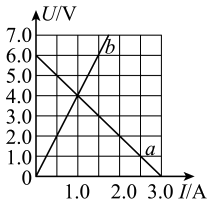
> > [!opts1]
> > - A. 该电阻的阻值为 $2.0\ \Omega$
> > - B. 该电源的电动势为 $6.0\ \mathrm V$，内阻为 $0.5\ \Omega$
> > - C. 电源此时的路端电压为 $4.0\ \mathrm V$，电源消耗的功率为 $6.0\ \mathrm W$
> > - D. 把电阻 $R$ 换成阻值更大的电阻，该电源的输出功率可能增大

###### 例题第13题

> [!ti] *2024~2025学年北京东城区北京市第一七一中学高二上学期期中第12题*
> 如图所示，一个正电荷由静止开始经加速电场加速后，沿平行于板面的方向射入偏转电场，并从另一侧射出。已知电荷质量为 $m$，电荷量为 $q$，加速电场电压为 $U_0$。偏转电场可看做匀强电场，极板间电压为 $U$，极板长度为 $L$，板间距为 $d$。不计正电荷所受重力，下列说法正确的是（　　）
> 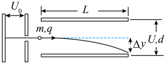
> > [!opts1]
> > - A. 正电荷从偏转电场射出时速度与水平方向夹角的正切值 $\tan\alpha=\frac{UL}{2U_0d}$
> > - B. 正电荷从偏转电场射出时具有的动能 $E_{\mathrm k}=qU_0+qU$
> > - C. 正电荷从加速电场射出时具有的速度 $v_0=\sqrt{\frac{2qU}{m}}$
> > - D. 正电荷从偏转电场射出时沿垂直板面方向的偏转距离 $y=\frac{L^2}{4d}$

###### 例题第14题

> [!ti] *2025~2026学年北京朝阳区中国人民大学附属中学朝阳学校高二上学期期中（选考）第10题*
> 金属导电是一个典型的导电模型，值得深入研究。一金属直导线电阻率为 $\rho$，若其两端加电压，自由电子将在静电力作用下定向加速，但电子加速运动很短时间就会与晶格碰撞而发生散射，紧接着又定向加速，这个周而复始的过程可简化为电子以速度 $v$ 沿导线方向匀速运动。我们将导线中电流与导线横截面积的比值定义为电流密度，其大小用 $j$ 表示，可以“精细”描述导线中各点电流的强弱。设该导线内电场强度为 $E$，单位体积内有 $n$ 个自由电子，电子电荷量为 $e$，电子在导线中定向运动时受到的平均阻力为 $f$。则下列表达式正确的是（　　）
> > [!opts4]
> > - A. $E=\rho j$
> > - B. $\rho=nev$
> > - C. $j=nv\rho$
> > - D. $f=nev\rho$

# 实验

本大题共 2 小题，共 18 分。

###### 例题第15题

> [!ti] *2022~2023学年北京顺义区北京四中顺义分校高二上学期期中第17题*
> 某同学用传感器做“观察电容器的充放电”实验，采用的实验电路如图 1 所示。
> %% 原扫描正文未见题干所述图1，待补。 %%
>
> （1）将开关先与“1”端闭合，电容器进行 $\_\_\_\_\_\_$（选填“充电”或“放电”），稍后再将开关与“2”端闭合。
>
> 在下列四个图像中，表示以上过程中，通过传感器的电流随时间变化的图像为 $\_\_\_\_\_\_$，电容器两极板间的电压随时间变化的图像为 $\_\_\_\_\_\_$ （填选项对应的字母）
> 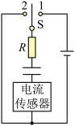
> > [!opts4 ]
>>  	- A. 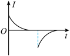
>> - B. 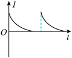
>> - C. 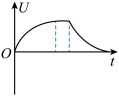
>>  - D. 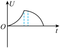
>
> ![[Pasted image 20260918230755.png|150]]
> （2）该同学用同一电路分别给两个不同的电容器充电，电容器的电容 $C_1<C_2$，充电时通过传感器的电流随时间变化的图像如图 2 中①②所示，其中对应电容为 $C_1$ 的电容器充电过程 $I-t$ 图像的是____________（选填①或②）。请说明你的判断依据____________。

###### 例题第16题

> [!ti] *2024~2025学年北京西城区北京师范大学附属实验中学高二上学期期中第15题*
> 在“测量电源的电动势和内阻”的实验中，待测电池的电动势约 $1.5\ \mathrm V$，内阻约 $1\ \Omega$。某同学利用图 a 所示的电路进行测量，已知实验室除待测电池、开关、导线外，还有下列器材可供选用：
>
> 电流表 $A_1$：量程 $0\sim0.6\ \mathrm A$，内阻约 $0.125\ \Omega$
>
> 电流表 $A_2$：量程 $0\sim3\ \mathrm A$，内阻约 $0.025\ \Omega$
>
> 电压表 $V$：量程 $0\sim3\ \mathrm V$，内阻约 $3\ \mathrm{k\Omega}$
>
> 滑动变阻器 $R_1$：$0\sim20\ \Omega$，额定电流 $2\ \mathrm A$
>
> 滑动变阻器 $R_2$：$0\sim100\ \Omega$，额定电流 $1\ \mathrm A$
> %% 图位：PDF第6页，第16题图a。 %%
>
> （1）为了调节方便，测量结果尽量准确，实验中电流表应选用____________，滑动变阻器应选用____________（填仪器的字母代号）。
>
> （2）请在答题卡相应位置完成图 b 中实物间的连线。
> %% 图位：PDF第7页，第16题图b。 %%
>
> （3）调节滑动变阻器的滑片，记录多组电压表和电流表的示数，在坐标纸上以“+”标出相应的数据点，绘制出的 $U-I$ 图线如图 c 所示。根据图线，该电源的电动势 $E=$____________ $\mathrm V$，内阻 $r=$____________ $\Omega$。（结果均保留 2 位有效数字）
> %% 图位：PDF第7页，第16题图c。 %%
>
> （4）由于电表并非理想电表，导致____________（填“电压”或“电流”）的测量存在系统误差。
>
> （5）在图 c 上定性画出无电表内阻影响的理想情况的 $U-I$ 图线，绘制的图线要标出与横、纵坐标轴的交点。
> 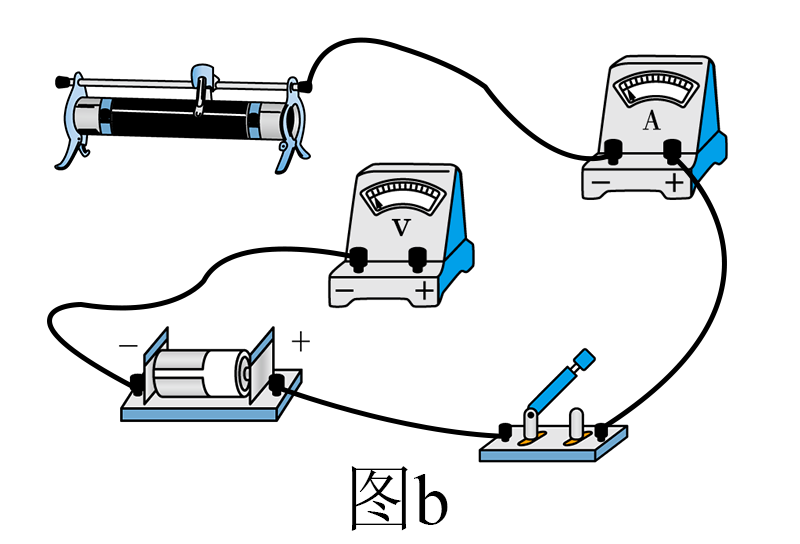
> 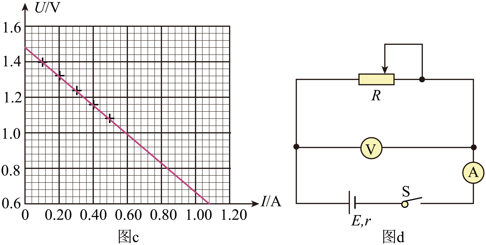

# 计算

本大题共 40 分。

###### 例题第17题

> [!ti] *2025~2026学年10月北京朝阳区北京市第八十中学高二上学期月考第15题*
> 如图所示，长为 $l$ 的绝缘细线一端悬于 $O$ 点，另一端系一质量为 $m$、电荷量为 $-q$ 的小球（可视为质点）。现将此装置放在水平的匀强电场中，小球静止在 $A$ 点，此时细线与竖直方向成 $37^\circ$ 角。已知电场的范围足够大，空气阻力可忽略不计，重力加速度为 $g$，$\sin37^\circ=0.6$，$\cos37^\circ=0.8$。
> %% 图位：PDF第7页，第17题图。 %%
>
> （1）请判断电场强度的方向，并求电场强度 $E$ 的大小；
>
> （2）求 $A$、$O$ 两点间的电势差 $U_{AO}$；
>
> （3）若在 $A$ 点对小球施加一个拉力，将小球从 $A$ 点沿圆弧缓慢向左拉起至与 $O$ 点处于同一水平高度且该过程中细线始终张紧，则所施拉力至少要做多少功。
> 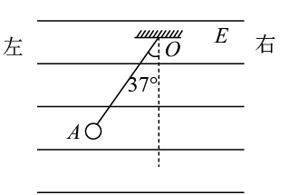

###### 例题第18题

> [!ti] *2025~2026学年12月北京顺义区北京市顺义区牛栏山第一中学高二上学期月考（板桥学校）第19题*
> 如图所示电路，电源电动势为 $E=15\ \mathrm V$，内阻为 $r=1\ \Omega$，电阻 $R_1=2\ \Omega$，$R_2=30\ \Omega$。开关闭合后，电动机恰好正常工作。已知电动机额定电压 $U=12\ \mathrm V$，线圈电阻 $R_{\mathrm M}=0.5\ \Omega$，求：
> %% 图位：PDF第8页，第18题图。 %%
>
> （1）流过电源的电流；
>
> （2）电动机消耗的电功率；
>
> （3）电动机正常工作时输出的机械功率。
> 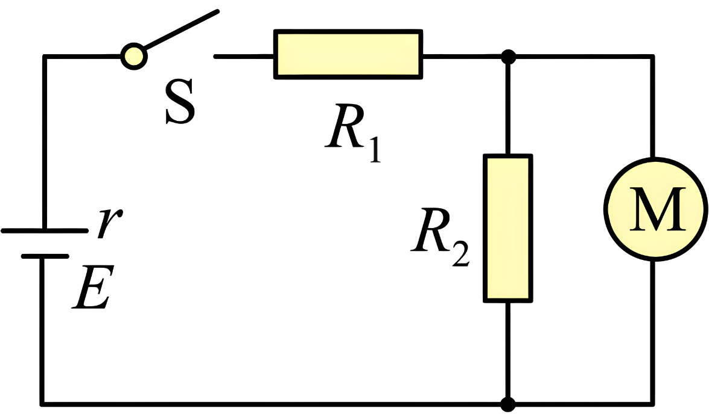

###### 例题第19题

> [!ti] *例题第19题*
> 如图所示，已知电源电动势 $E=6\ \mathrm V$，内阻 $r=1\ \Omega$，保护电阻 $R_0=0.5\ \Omega$，电表为理想电表。
> %% 图位：PDF第8页，第19题图。 %%
>
> （1）当电阻箱 $R$ 阻值为多少时，保护电阻 $R_0$ 消耗的电功率最大，并求这个最大值；
>
> （2）当电阻箱 $R$ 阻值为多少时，电阻箱 $R$ 消耗的功率 $P_R$ 最大，并求这个最大值；
>
> （3）电源的最大输出功率；
>
> （4）若电阻箱 $R$ 的最大值为 $3\ \Omega$，$R_0=5\ \Omega$，当电阻箱 $R$ 阻值为多少时，电阻箱 $R$ 的功率最大，并求这个最大值。
> 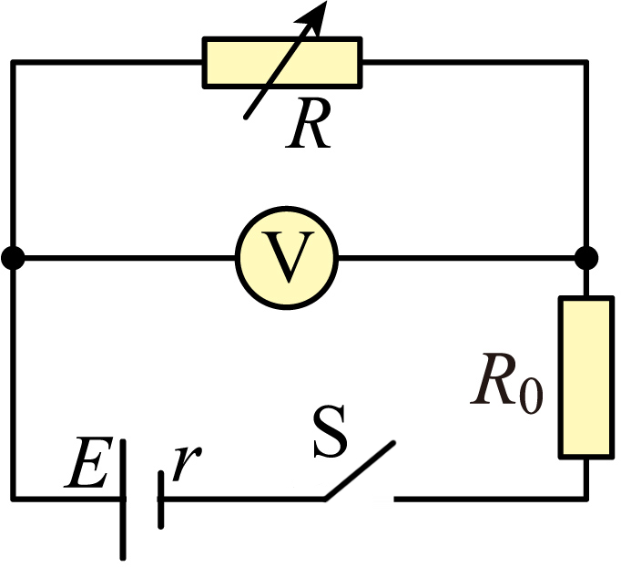

###### 例题第20题

> [!ti] *2024~2025学年北京西城区北京师范大学附属实验中学高二上学期期中第21题*
> 如图甲所示，静电除尘装置中有一长为 $L$、宽为 $b$、高为 $d$ 的矩形通道，其前、后面板使用绝缘材料，上、下面板使用金属材料。图乙是装置的截面图，上、下面板间距为 $d$，与路端电压为 $U_0$ 的高压直流电源相连。质量为 $m$、电荷量为 $-q$、分布均匀的尘埃以水平速度 $v_0$ 进入矩形通道，当带负电的尘埃碰到下面板后其所带电荷被中和，同时被收集。忽略尘埃所受重力及尘埃间的相互作用。
> %% 图位：PDF第9页，第20题图甲、乙。 %%
>
> （1）求尘埃在电场中的加速度大小。
>
> （2）面板收集的尘埃数占总尘埃数的百分比称为面板的收集效率 $\eta$，调整上下面板的间距 $d$ 可以改变面板的收集效率。
>
> ①如图乙所示，假设左侧距下面板 $y$ 处的尘埃恰好能到达下面板的右边缘，请写出收集效率的表达式；
>
> ②已知上下面板间距 $d=d_0$ 时 $\eta=64\%$，求收集效率达 $100\%$ 时上下面板的最大间距 $d_{\mathrm m}$（结果用 $d_0$ 表示）。
>
> （3）若单位体积内的尘埃数为 $n$，求稳定工作时单位时间内下面板收集的尘埃质量 $\frac{\Delta M}{\Delta t}$ 与上下面板间距 $d$ 的函数关系，并绘出函数图线。注：函数关系可用（2）中给出的 $d_0$ 表示。
> 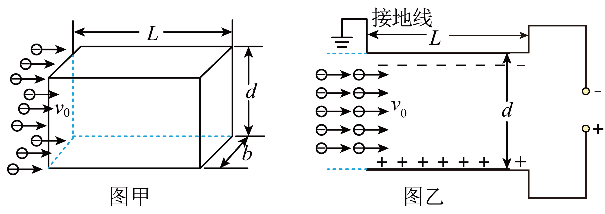

