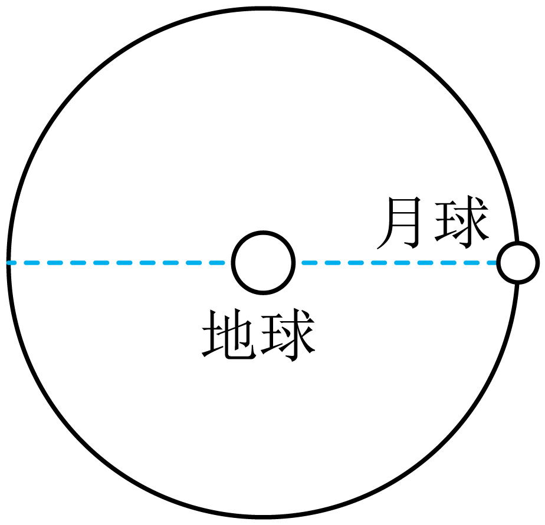
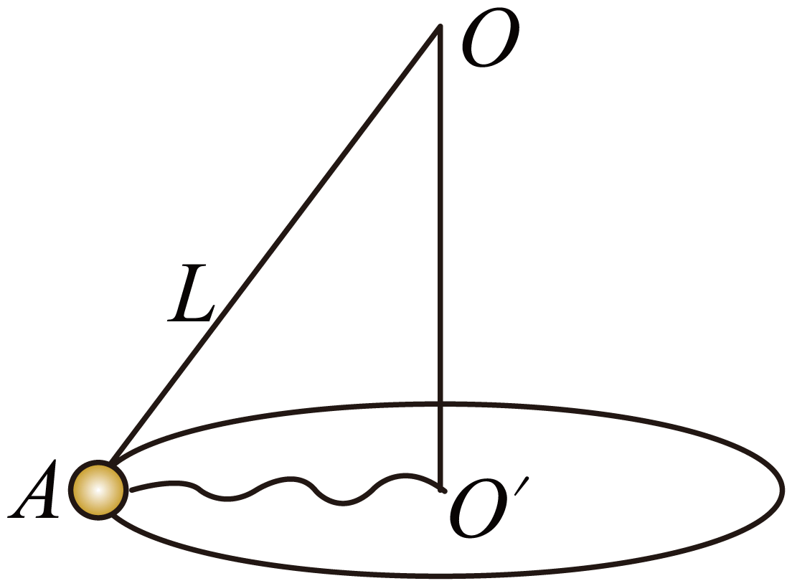
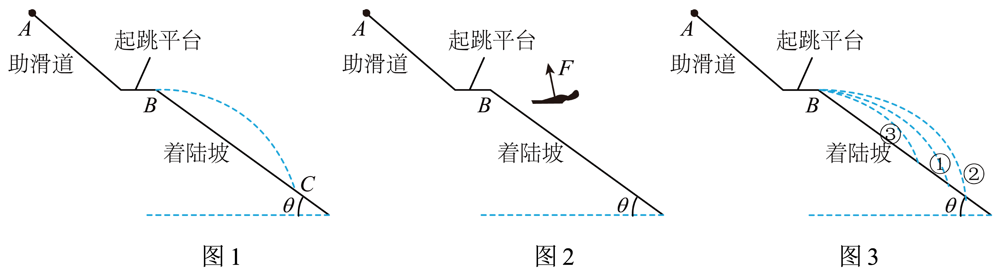

# 26春北京市东直门中学高一下期中 #h0
# 单选
> [!ti] *26春北京市东直门中学高一下期中第1题*
> 如图所示描绘的四条虚线轨迹，可能是人造地球卫星无动力飞行轨道的是（　　）
> > [!opts2]
![[Pasted image 20260522153709.png]]

> [!ti] *26春北京市东直门中学高一下期中第2题*
> 关于平抛运动，下列说法正确的是（　　）
> > [!opts2]
> > - A. 平抛运动是变加速运动
> > - B. 平抛物体在空中运动时间可能因其质量大而增大
> > - C. 平抛物体任意相等时间内的速度变化量相同
> > - D. 平抛物体单位时间内的速度变化量逐渐增大

> [!ti] *26春北京市东直门中学高一下期中第3题*
> 如图甲所示，修正带是通过两个齿轮的相互咬合进行工作的，其原理可简化为图乙所示。下列说法正确的是（　　）
> ![[Pasted image 20260522153733.png|400]]
> > [!opts2]
> > - A. $B$ 点线速度比 $A$ 点大，是因为 $B$ 点所在齿轮半径大
> > - B. $A$、$B$ 两点线速度大小相等，是因为在相同时间内 $A$、$B$ 两点通过的弧长相等
> > - C. $B$ 点角速度比 $A$ 点大，是因为在相同时间内 $B$ 点转过的角度更大
> > - D. $A$、$B$ 两点角速度大小相等，是因为两齿轮在相同时间内转过的角度相等

> [!ti] *26春北京市东直门中学高一下期中第4题*
> 如图所示，用一根绕过定滑轮的细绳把两个物块 $P$ 和 $Q$ 拴在一起，用水平力拉物块 $Q$，使其沿水平面向右以速度 $v$ 匀速移动，在 $P$ 到达滑轮之前，下列说法正确的是（　　）
> ![[Pasted image 20260522153809.png|200]]
> > [!opts2]
> > - A. $P$ 匀速上升，速度比 $v$ 大
> > - B. $P$ 匀速上升，速度比 $v$ 小
> > - C. $P$ 减速上升
> > - D. $P$ 加速上升

> [!ti] *26春北京市东直门中学高一下期中第5题*
> 如图，一个小球在细线的牵引下，在水平光滑桌面上绕一个点做匀速圆周运动。下列说法正确的是（　　）
> ![[Pasted image 20260522153830.png|200]]
> > [!opts2]
> > - A. 小球的线速度越小，细线越容易断
> > - B. 小球的角速度越小，细线越容易断
> > - C. 小球的周期越小，细线越容易断
> > - D. 小球的质量越小，细线越容易断

> [!ti] *26春北京市东直门中学高一下期中第6题*
> 利用风洞实验室可以模拟运动员比赛时所受风阻情况，帮助运动员提高成绩。为了更加直观的研究周围的流场环境，可以借助烟尘辅助观察。如图甲所示，在某次实验中将烟尘颗粒做曲线运动的轨迹如图乙所示，下列说法正确的是（　　）
> ![[Pasted image 20260522153844.png|400]]
> > [!opts2]
> > - A. 烟尘颗粒速度可能不变
> > - B. 烟尘颗粒可能做匀变速曲线运动
> > - C. $Q$ 处的合力方向可能竖直向上
> > - D. $P$ 处的加速度方向可能竖直向上

> [!ti] *26春北京市东直门中学高一下期中第7题*
> 北斗卫星导航系统，简称 $BDS$，是我国自行研制的全球卫星导航系统。北斗系统中包含多种卫星，如地球表面附近飞行的近地卫星，以及地球同步卫星等。图为某时刻从北极上空俯瞰的地球同步卫星 $A$、近地卫星 $B$ 和位于赤道地面上的观察点 $C$ 的位置示意图。地球可看作质量分布均匀的球体，卫星 $A$、$B$ 绕地球在同一平面内，不考虑空气阻力及其他天体的影响。（在此基础上完成 7、8 题）
> ![[Pasted image 20260522153909.png|200]]
> 若从图所示位置开始计时，则经过时间 $t$ 后，图中各个卫星的位置合理的是（　　）
> ![[Pasted image 20260522153946.png|800]]
> > [!opts2]
> > - A. A
> > - B. B
> > - C. C
> > - D. D

> [!ti] *26春北京市东直门中学高一下期中第8题*
> 若已知卫星位置，那么要确定地球的质量，只需要再测量（　　）
> > [!opts2]
> > - A. 卫星 $A$ 的质量
> > - B. 卫星 $B$ 的质量
> > - C. 卫星 $A$ 的运行周期
> > - D. 卫星 $B$ 的运行周期

> [!ti] *26春北京市东直门中学高一下期中第9题*
> 一部叫“旋转飞椅”的游乐项目如图甲所示，其坐椅等距穿过其中心的轻绳做圆锥摆。钢绳一端系着座椅，另一端固定在半径为 $r$ 的水平转盘边缘。转盘绕其中心竖直轴转动。钢绳沿竖直方向自由下垂；转盘匀速转动时，钢绳与转轴在同一竖直平面内，且与竖直方向的夹角为 $\theta$。将游客和座椅看作一个质点，不计钢绳重力和空气阻力，重力加速度大小为 $g$。下列说法不正确的是（　　）
> ![[Pasted image 20260522154018.png|400]]
> > [!opts2]
> > - A. 匀速转动时，游客和座椅受到的合力始终沿水平方向
> > - B. 当 $\theta$ 稳定时，游客和座椅的角速度 $\omega=\sqrt{\frac{g}{L\cos\theta}}$
> > - C. 转速缓慢增大，角 $\theta$ 总小于 $90^\circ$
> > - D. 转速缓慢增大，钢绳上的拉力的竖直分量保持不变

> [!ti] *26春北京市东直门中学高一下期中第10题*
> 跳台滑雪是一种勇敢者的滑雪运动，运动员借助专用滑雪板，在滑道上获得一定速度后从跳台飞出，在空中飞行一段距离后着陆。现有某运动员从跳台 $A$ 处沿水平方向飞出，在斜坡 $B$ 处着陆，如图所示。$AB$ 可以看作倾斜坡面，如果已知斜坡与水平方向的夹角 $\theta$、重力加速度为 $g$，下列说法正确的是（　　）
> ![[Pasted image 20260522154038.png|200]]
> > [!opts2]
> > - A. 可求出运动员在空中的飞行时间和落地位移
> > - B. 可求出运动员在空中离坡面的最大距离
> > - C. 如果运动员飞出跳台的速度变小，则他着陆时的速度与水平方向夹角不变
> > - D. 如果运动员飞出跳台的速度变小，则他着陆时的速度与水平方向夹角变大

> [!ti] *26春北京市东直门中学高一下期中第11题*
> 如图所示，I 轨道和 II 轨道为某火星探测器的两个轨道，相切于 $P$ 点，图中两阴影部分为探测器与火星的连线在相等时间内扫过的面积，$P$ 点的加速度大小为 $a$。下列说法正确的是（　　）
> ![[Pasted image 20260522154105.png|200]]
> > [!opts2]
> > - A. 两阴影部分的面积一定相等
> > - B. 探测器在 II 轨道上通过 $P$ 点时的加速度小于在 I 轨道上通过 $P$ 点时的加速度
> > - C. 探测器在 II 轨道上通过 $P$ 点时的速度小于在 I 轨道上通过 $P$ 点时的速度
> > - D. 探测器在 I 轨道运行的周期小于在 II 轨道运行的周期

> [!ti] *26春北京市东直门中学高一下期中第12题*
> 有 $a$、$b$、$c$、$d$ 四颗地球卫星，$a$ 还未发射，在赤道表面上随地球一起转动，$b$ 是近地轨道卫星，$c$ 是地球同步卫星，$d$ 是高空探测卫星，它们均做匀速圆周运动，各卫星排列位置如图所示，则（　　）
> ![[Pasted image 20260522154126.png|200]]
> > [!opts2]
> > - A. $a$ 的向心加速度等于重力加速度 $g$，$c$ 的向心加速度大于 $d$ 的向心加速度
> > - B. 在相同时间内 $b$ 转过的弧长最长，$a$、$c$ 转过的角度相等
> > - C. $c$ 在 $4$ 小时的圆心角是 $\frac{\pi}{6}$
> > - D. $b$ 的周期一定小于 $24$ 小时

> [!ti] *26春北京市东直门中学高一下期中第13题*
> 1772 年，法国著名数学家拉格朗日在论文《三体问题》中指出：两个质量相差悬殊的天体（如太阳和地球）所在同一平面上有 5 个特殊点，如图中的 $L_1$、$L_2$、$L_3$、$L_4$、$L_5$ 所示，人们称为拉格朗日点。若飞行器位于这些点上，会在太阳与地球共同引力作用下，可以几乎不消耗燃料而保持与地球同步绕太阳做圆周运动。若发射一颗卫星位于 $L_2$ 点，下列说法正确的是（　　）
> ![[Pasted image 20260522154143.png|200]]
> > [!opts2]
> > - A. 该卫星绕太阳运动周期大于地球绕太阳运动的周期
> > - B. 该卫星绕太阳运动的向心加速度大于地球绕太阳运动的向心加速度
> > - C. 该卫星在 $L_2$ 点处于平衡状态
> > - D. 该卫星在 $L_2$ 点处受到太阳和地球引力的合力比在 $L_1$ 处小

> [!ti] *26春北京市东直门中学高一下期中第14题*
> 根据高中所学知识可知，做自由落体运动的小球，将落在正下方位置。但实际上，在赤道上方 $200\ \mathrm{m}$ 处无初速度释放的小球将落在正下方位置偏东约 $6\ \mathrm{cm}$ 处。这一现象可解释为，除重力外，由于地球自转，小球还受到一个水平方向的“力”，该“力”与竖直方向的速度大小成正比，且方向水平向东。若考虑这种影响，不考虑其他影响，则小球（　　）
> > [!opts2]
> > - A. 到达地面时，水平方向的加速度最大
> > - B. 到达地面时，水平方向的速度最大
> > - C. 从物体出发到落地的过程中，做匀变速曲线运动
> > - D. 由于对称性，落地点仍在抛出点

# 实验
> [!ti] *26春北京市东直门中学高一下期中第15题*
> 用图甲所示装置探究加速度与力、质量的关系。
> ![[Pasted image 20260522154205.png|200]]
> （1）关于本实验，下列说法正确的是______
> 
> > [!opts1]
> > - A. 细线可以与长木板不平行
> > - B. 将长木板左侧垫高的目的是让小车受到的阻力为零
> > - C. 平衡小车所受到的阻力时，小车应连接穿过打点计时器的纸带
> 
> （2）实验中打出的一条纸带如图乙所示，$A$、$B$、$C$、$D$、$E$ 为依次选取的计数点，相邻计数点间的时间间隔为 $0.1\ \mathrm{s}$，则打下计数点 $C$ 时小车的速度大小 $v_C=$______ $\mathrm{m/s}$；小车的加速度 $a=$______ $\mathrm{m/s^2}$。（结果均保留 2 位有效数字）
> ![[Pasted image 20260522154244.png|500]]
> （3）甲、乙两同学在研究加速度 $a$ 与拉力 $F$ 的关系时未平衡阻力，分别得到如图丙所示的图线。设甲、乙两组的小车质量分别为 $M_\text{甲}$、$M_\text{乙}$，小车运动中受到的阻力大小分别为 $f_\text{甲}$、$f_\text{乙}$，由图可知，$M_\text{甲}$______$M_\text{乙}$，$f_\text{甲}$______$f_\text{乙}$。（选填“大于”、“小于”或“等于”）
> ![[Pasted image 20260522154303.png|200]]
> （4）实验中平衡阻力后，小车在小桶及磁码的牵引下做初速度为零的匀加速直线运动，设小车的质量为 $M$，小桶及磁码的总质量为 $m$，请利用牛顿运动定律论证：当 $m$ 远小于 $M$ 时，细线上的拉力大小 $F$ 近似等于小桶及磁码的总重力 $mg$。

> [!ti] *26 春北京市东直门中学高一下期中第 15 题*
> 某同学探究平抛运动的特点．
> （1）用如图 1 所示装置探究平抛运动竖直分运动的特点．用小锤打击弹性金属片后， A 球沿水平方向飞出，同时 B 球被松开并自由下落，比较两球的落地时间．
> ![[Pasted image 20260429200950.png|100]]
> （1）关于该实验，下列说法正确的是 $\_\_\_\_$ （选填选项前的字母）．
>
> > [!opts1]
> > - A. 打击弹性金属片后两球需要溚在同一水平面上
> > - B. 比较两球落地时间必须要测量两球下落的高度
> > - C. 利用实验结果可以说明平抛运动竖直分运动的特点
> > - D.利用实验结果可以说明平抛运动水平分运动的特点
>  > - E.两球应选用体积小，质量大的小球
> 
（2）小明同学用如图 2 所示装置研究平抛运动，将白纸和复写纸对齐重型并固定在竖直的硬板上，钢球沿斜槽轨道 $P Q$ 滑下后从 $Q$ 点水平飞出，落在水平挡板 $M N$ 上．由于挡板靠近硬板一侧较低，钢球落在挡板上时，钢球侧面会在白纸上挤压出一个痕迹点．移动挡板，重新释放钢球，如此重复，白纸上将留下一系列痕迹点。
![[Pasted image 20260429201545.png|200]]
（1）若小明第一次将小球从图中＂甲＂位置静止释放，描下了轨迹上的一点，第二次释放小球的位置应是下图中的 $\_\_\_\_$ （选填＂甲＂、 ＂乙＂或＂丙＂）．
![[Pasted image 20260429201603.png|200]]
（2）该实验中，在取下白纸前，应确定坐标轴原点，并建立直角坐标系，下列图像坐标原点和坐标系的选择正确的是 $\_\_\_\_$ ．（选填选项下的字母代号）
> > [!opts4]
> > - A. ![[Pasted image 20260429201630.png|200]]
> > - B. ![[Pasted image 20260429201639.png|200]]
> > - C. ![[Pasted image 20260429201650.png|200]]
> 
> 
（3）小明经过正确操作，多次释放小球，得到如图 3 所示的点迹，下图中的各种拟合图线中，最合理的是 $\_\_\_\_$ （选填＂A＂、＂B＂或 ＂C＂）．
![[Pasted image 20260429201711.png]]
> > [!opts4]
> > - A. ![[Pasted image 20260429201742.png|100]]
> > - B. ![[Pasted image 20260429201751.png|100]]
> > - C. ![[Pasted image 20260429201802.png|100]]
> 
> 
（4）以平抛起点 $O$ 为坐标原点，在轨迹上取一些点，测量它们的水平坐标 $x$ 和坚直坐标 $y$ ，作出如图所示的 $y-x^2$ 图像，图像的斜率为 $k$ ，则小球平抛的初速度为 $\_\_\_\_$。
![[Pasted image 20260522154801.png|200]]
（5）若遗漏记录平抛轨迹的起始点，也可按下述方法处理数据：如图所示，在轨迹上取 $A 、 B 、 C$ 三点，$A B$ 和 $B C$ 的水平间距相等且均为 $x$ ，测得 AB 和 BC 的坚直间距分别是 $y_1$ 和 $y_2$ ，则 $\frac{y_1}{y_2} \_\_\_\_\_\_\frac{1}{3}$（选＂大于＂、＂等于＂或者＂小于＂）．
![[Pasted image 20260522154833.png|200]]
（3）如图所示为一个小球做平抛运动时某同学拍摄的频闪照片．照片中，小球在其前方，紧贴（但未接触）背景板做平抛运动，正方格为竖直平面内的背景板，但 $y$ 轴不在竖直方向，方格中最小方格的边长均为 $L$ ．已知重力加速度为 $g$ ．根据平抛运动规律，利用运动的合成与分解的方法，则 $y$ 轴正方向与竖直向下方向间夹角的正切值为 $\_\_\_\_$ ，小球平抛的初速度大小为 $\_\_\_\_$。
![[Pasted image 20260429202308.png|200]]

# 计算

> [!ti] *26春北京市东直门中学高一下期中第17题*
> 某火星探测器登陆火星后，在火星表面以速度 $v_0$ 竖直向上抛出一小球，经时间 $t$ 落地，已知火星半径为 $R$，引力常量为 $G$。求：
> 
> （1）火星表面的重力加速度；
> 
> （2）火星的质量；
> 
> （3）若该探测器要再次起飞成为火星的卫星，需要的最小发射速度的大小。

> [!ti] *26春北京市东直门中学高一下期中第18题*
> 利用物理模型对问题进行分析，是重要的科学思维方法。
> 
> （1）某行星与太阳的连线在任意相等时间内扫过的面积相等。判断 $v_1$、$v_2$ 的大小关系，并根据开普勒第二定律说明该行星绕太阳运动的轨迹不是圆。
> 
> （2）设行星绕太阳的轨迹为圆，轨道半径为 $r$，请根据开普勒第三定律（$\frac{r^3}{T^2}=k$）及向心力相关知识，证明太阳对行星的作用力 $F$ 与 $r$ 的平方成反比。
> 
> （3）将地球和月球看作一个孤立系统，忽略地球自转。二者仅在万有引力的作用下，绕地月球心连线上某一点 $O$ 做匀速圆周运动，并且周期相同。已知引力常量 $G$，地球半径为 $R$，地球质量大约为月球质量的 $81$ 倍，地心间距大约为地球半径的 $60$ 倍。请估算 $O$ 点距离地球球心的距离 $d_0$。
> 

> [!ti] *26春北京市东直门中学高一下期中第19题*
> 如图所示，长 $L=1\ \mathrm{m}$ 的细线 $OA$ 一端吊着一个质量 $m=0.3\ \mathrm{kg}$ 的小球（视为质点），另一端系于竖直杆顶端 $O$ 点，使小球在水平面内绕竖直杆做匀速圆周运动，重力加速度大小 $g=10\ \mathrm{m/s^2}$。
> 
> （1）若小球转动的角速度 $\omega=\frac{5\sqrt{2}}{2}\ \mathrm{rad/s}$ 时，细线 $OA$ 与竖直方向的夹角 $\theta$；
> 
> （2）若竖直杆底端 $O'$ 点与小球间系一长 $L'=0.8\ \mathrm{m}$ 的细线 $O'A$，让竖直杆带动小球转动，当 $O'A$ 恰好与 $OO'$ 垂直，细线能承受的最大拉力大小为 $F=20\ \mathrm{N}$，求小球转动的最大角速度 $\omega_\text{max}$。
> 

> [!ti] *26春北京市东直门中学高一下期中第20题*
> 如图所示为跳台滑雪赛道的简化示意图，助滑道与起跳平台平滑连接，长直着陆坡与水平面的夹角 $\theta=37^\circ$。质量为 $m=60\ \mathrm{kg}$ 的运动员（含装备）沿助滑道从 $A$ 点下滑，到达起跳平台末端 $B$ 点沿水平方向飞出，在空中平行一段距离后落在着陆坡上的 $C$ 点。从起跳平台末端到着陆点之间的距离是评判运动员比赛成绩的重要依据。取重力加速度 $g=10\ \mathrm{m/s^2}$，$\sin37^\circ=0.6$，$\cos37^\circ=0.8$。
> 
>  
> （1）不考虑空气对运动员的作用。运动员从 $B$ 点运动到 $C$ 点的过程中，在空中飞行时间 $t=3.0\ \mathrm{s}$。求：
> 
> a. $B$、$C$ 两点之间的距离 $L$；
> 
> b. 运动员从 $B$ 点水平飞出时的速度大小 $v_0$。
> 
> （2）考虑空气对运动员的作用。运动员在空中飞行的过程中，假设空气对运动员的作用力 $F$ 的方向与竖直方向夹角 $\alpha$ 恒为 $11^\circ$，如图所示，力 $F$ 的大小恒为运动员所受重力的 $\frac{1}{5}$。取 $\sin11^\circ=0.20$，$\cos11^\circ=0.98$。
> 
> ①若空气作用力方向如图中①所示，若不考虑空气对运动员的作用，运动员恰好可以从 $B$ 点水平飞出，若考虑空气对运动员的作用，运动员可能落在图中的______（选填“①”、“②”或“③”）。
> 
> ②请通过计算说明判断依据。

