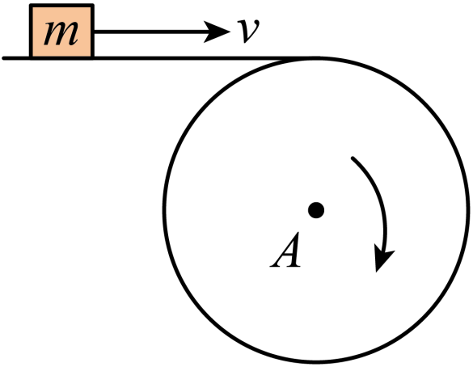
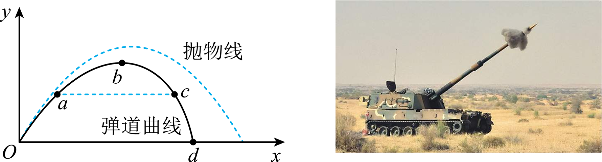
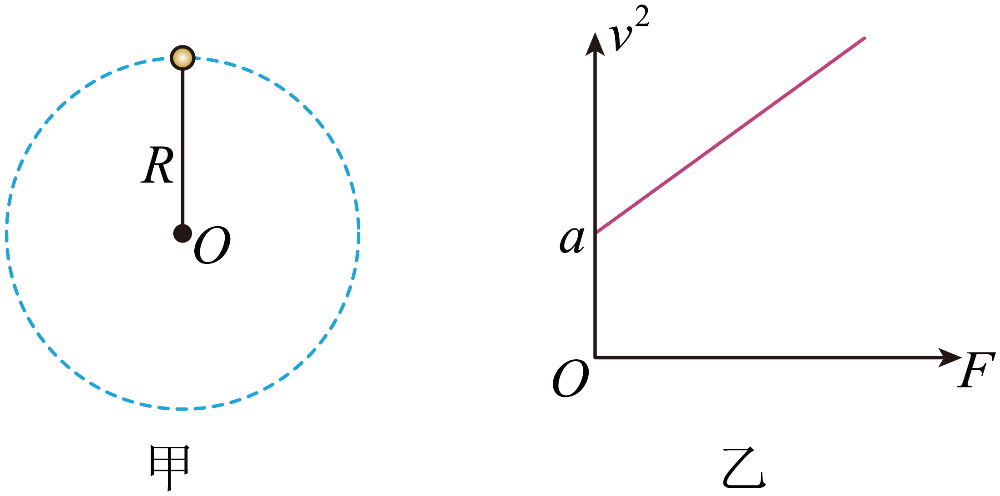
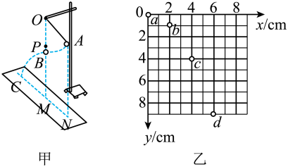
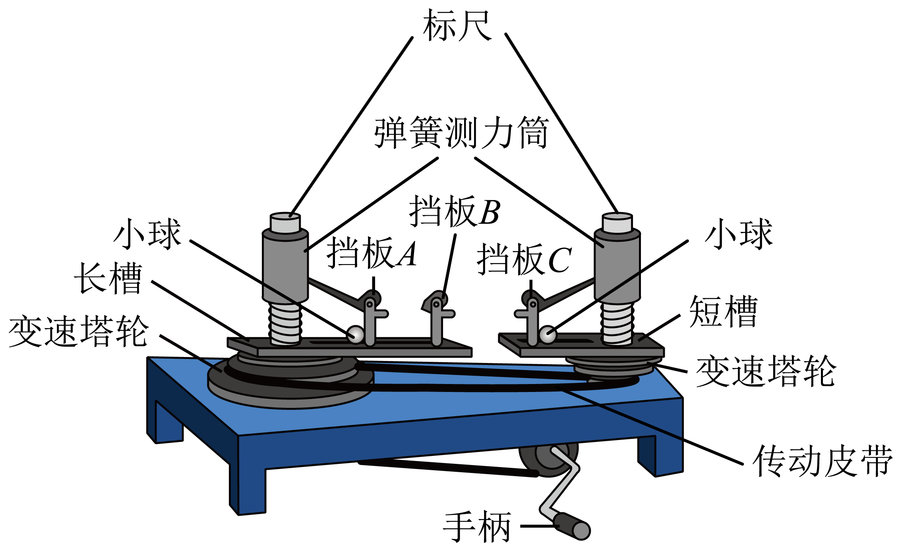
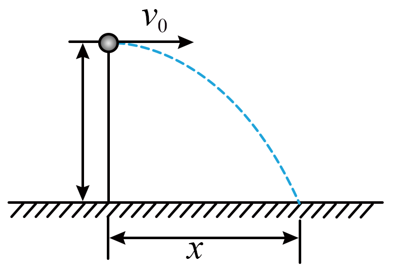
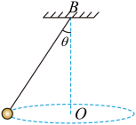
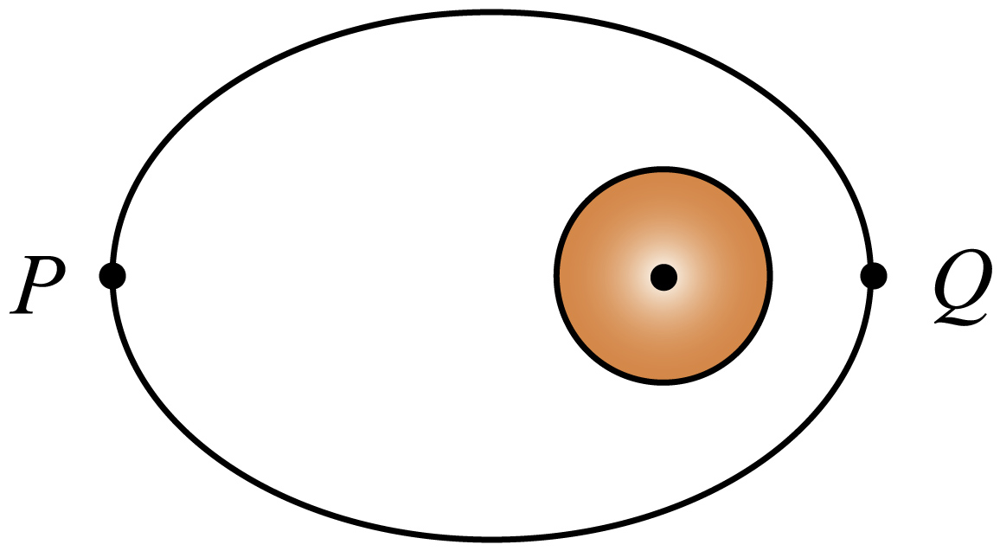
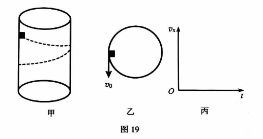

# 26春北京市人大附中通州校区高一下期中 #h0
# 单选
> [!ti] *26春北京市人大附中通州校区高一下期中第1题*
> 蜜蜂可以通过“舞蹈”轨迹向同伴传递信息，如图所示，摄像机记录下了一个可视为质点的蜜蜂沿轨迹甲乙丙丁飞行，图中画出了蜜蜂在甲、乙、丙和丁四处所受合力 $F$ 和速度 $v$ 的方向，可能正确的是（　　）
> ![[Pasted image 20260430194511.png|200]]
> > [!opts4]
> > - A. 甲
> > - B. 乙
> > - C. 丙
> > - D. 丁

> [!ti] *26春北京市人大附中通州校区高一下期中第2题*
> 某勇士依托一条小木船横渡大渡河。若河面宽 $300\ \mathrm{m}$，水流速 $3\ \mathrm{m/s}$，木船相对静水速度 $2\ \mathrm{m/s}$，则渡河所需的最短时间为（　　）
> > [!opts4]
> > - A. $60\ \mathrm{s}$
> > - B. $100\ \mathrm{s}$
> > - C. $150\ \mathrm{s}$
> > - D. $300\ \mathrm{s}$

> [!ti] *26春北京市人大附中通州校区高一下期中第3题*
> 学校门口的车牌自动识别系统如图所示，闸杆在竖直面内绕转轴 $O$ 向上转动，关于在闸杆上的 $A$、$B$ 两点，下列说法正确的是（　　）
> ![[Pasted image 20260430194634.png|200]]
> > [!opts2]
> > - A. 线速度 $v_A<v_B$
> > - B. 转速 $n_A<n_B$
> > - C. 角速度 $\omega_A<\omega_B$
> > - D. 周期 $T_A<T_B$

> [!ti] *26春北京市人大附中通州校区高一下期中第4题*
> 中国选手刘诗颖在 2020 年东京奥运会田径女子标枪决赛中获得金牌。刘诗颖的“冠军一投”的运动简化图如图所示。投出去的标枪做曲线运动，忽略空气阻力作用，下列关于标枪的运动及曲线运动说法正确的是（　　）
> ![[Pasted image 20260430194654.png|200]]
> > [!opts1]
> > - A. 出手后标枪的加速度是变化的
> > - B. 标枪在相同时间内速度变化量相同
> > - C. 标枪升到最高点时速度为零
> > - D. 曲线运动不可能是匀变速运动

> [!ti] *26春北京市人大附中通州校区高一下期中第5题*
> 人站在平台上平抛一小球，球离手时速度为 $v_1$，落地时速度为 $v_2$，不计空气阻力，下图中能表示出速度矢量的演变过程的是（　　）
> ![[Pasted image 20260430194815.png]]
> 

> [!ti] *26春北京市人大附中通州校区高一下期中第6题*
> 某地发生地震，一架装载救灾物资的直升飞机以 $10\ \mathrm{m/s}$ 的速度水平飞行，在距地面 $180\ \mathrm{m}$ 的高度处，欲将救灾物资准确投放至地面目标，若不计空气阻力，$g$ 取 $10\ \mathrm{m/s^2}$，则（　　）
> > [!opts1]
> > - A. 物资投出后经过 $6\ \mathrm{s}$ 到达地面目标
> > - B. 物资投出后经过 $180\ \mathrm{s}$ 到达地面目标
> > - C. 应在距地面目标水平距离 $600\ \mathrm{m}$ 处投出物资
> > - D. 应在距地面目标水平距离 $180\ \mathrm{m}$ 处投出物资

> [!ti] *26春北京市人大附中通州校区高一下期中第7题*
> 如图所示，甲、乙两车在水平地面上匀速过圆弧形弯道（从 1 位置至 2 位置），已知两车速率相等，下列说法正确的是（　　）
> ![[Pasted image 20260430194835.png|200]]
> > [!opts1]
> > - A. 甲乙两车过弯道的时间可能相同
> > - B. 甲乙两车角速度可能相同
> > - C. 甲乙两车向心加速度大小可能相同
> > - D. 甲乙两车向心力大小可能相同

> [!ti] *26春北京市人大附中通州校区高一下期中第8题*
> 如图所示为某中国运动员在短道速滑比赛中勇夺金牌的精彩瞬间。假定此时她正沿圆弧形弯道匀速率滑行，则她（　　）
> ![[Pasted image 20260430194852.png|200]]
> > [!opts1]
> > - A. 所受的合力为零，做匀速运动
> > - B. 所受的合力恒定，做匀加速运动
> > - C. 所受的合力恒定，做变加速运动
> > - D. 所受的合力变化，做变加速运动

> [!ti] *26春北京市人大附中通州校区高一下期中第9题*
> 壁球是一种对墙击球的室内运动，如图所示，某同学分别在同一直线上相同高度的 $A$、$B$、$C$ 三个位置先后击打壁球，结果都使壁球垂直击中墙壁同一位置。设三次击打后球到达墙壁前在空中飞行的时间分别为 $t_1$、$t_2$、$t_3$，到达墙壁时的速度分别为 $v_1$、$v_2$、$v_3$，不计空气阻力，则（　　）
> ![[Pasted image 20260430194914.png|200]]
> > [!opts1]
> > - A. $t_1>t_2>t_3$，$v_1>v_2>v_3$
> > - B. $t_1>t_2>t_3$，$v_1=v_2=v_3$
> > - C. $t_1=t_2=t_3$，$v_1>v_2>v_3$
> > - D. $t_1=t_2=t_3$，$v_1=v_2=v_3$

> [!ti] *26春北京市人大附中通州校区高一下期中第10题*
> 质量为 $m$ 的飞机以恒定速率 $v$ 在空中水平盘旋，如图所示，其做匀速圆周运动的半径为 $R$，重力加速度为 $g$，则此时空气对飞机的作用力大小为（　　）
> ![[Pasted image 20260430195015.png|200]]
> > [!opts2]
> > - A. $m\frac{v^2}{R}$
> > - B. $mg$
> > - C. $m\sqrt{g^2+\frac{v^4}{R^2}}$
> > - D. $m\sqrt{g^2-\frac{v^4}{R^2}}$

> [!ti] *26春北京市人大附中通州校区高一下期中第11题*
> 在水平传送带上被传送的小物体（可视为质点），$A$ 为终端皮带轮，如图所示，已知皮带轮半径为 $r$，传送带与皮带轮间不会打滑，当 $m$ 可被水平抛出时（　　）
> 
> > [!opts2]
> > - A. 皮带的最小速度为 $\sqrt{gr}$
> > - B. 皮带的最小速度为 $\sqrt{\frac{g}{r}}$
> > - C. $A$ 轮每秒的转数最少是 $2\pi\sqrt{\frac{g}{r}}$
> > - D. $A$ 轮每秒的转数最少是 $2\pi\sqrt{gr}$

> [!ti] *26春北京市人大附中通州校区高一下期中第12题*
> 一些星球由于某种原因而发生收缩，假设该星球的直径缩小到原来的四分之一，若收缩时质量不变，则与收缩前相比（　　）
> > [!opts1]
> > - A. 同一物体在星球表面受到的重力增大到原来的 4 倍
> > - B. 同一物体在星球表面受到的重力增大到原来的 16 倍
> > - C. 星球的第一宇宙速度增大到原来的 4 倍
> > - D. 星球的第一宇宙速度增大到原来的 16 倍

> [!ti] *26春北京市人大附中通州校区高一下期中第13题*
> 为了探测 $X$ 星球，载着登陆舱的探测飞船在以该星球中心为圆心、半径为 $r_1$ 的圆轨道上运动，周期为 $T_1$，总质量为 $m_1$。随后登陆舱脱离飞船，变轨到离星球更近的半径为 $r_2$ 的圆轨道上运动，此时登陆舱的质量为 $m_2$，则（　　）
> > [!opts1]
> > - A. $X$ 星球的质量为 $M=\frac{4\pi^2r_1^3}{GT_1^2}$
> > - B. $X$ 星球表面的重力加速度 $g=\frac{4\pi^2r_1}{T_1^2}$
> > - C. 登陆舱在半径为 $r_1$ 与 $r_2$ 的轨道上运动时的速度大小之比为 $\frac{v_1}{v_2}=\sqrt{\frac{m_1r_2}{m_2r_1}}$
> > - D. 登陆舱在半径为 $r_2$ 的轨道上做圆周运动的周期为 $T_2=T_1\sqrt{\frac{r_2^3}{r_1^3}}$

> [!ti] *26春北京市人大附中通州校区高一下期中第14题*
> 由于空气阻力的影响，炮弹的实际飞行轨迹不是抛物线，而是“弹道曲线”，如图中实线所示。图中虚线为不考虑空气阻力情况下炮弹的理想运动轨迹，$O$、$a$、$b$、$c$、$d$ 为弹道曲线上的五点，其中 $O$ 点为发射点，$d$ 点为落地点，$b$ 点为轨迹的最高点，$a$、$c$ 为运动过程中经过的距地面高度相等的两点。下列说法正确的是（　　）
> 
> > [!opts1]
> > - A. 到达 $b$ 点时，炮弹的速度为零
> > - B. 到达 $b$ 点时，炮弹的加速度为零
> > - C. 炮弹经过 $a$ 点时的速度大小大于经过 $c$ 点时的速度大小
> > - D. 炮弹由 $O$ 点运动到 $b$ 点的时间大于由 $b$ 点运动到 $d$ 点的时间

> [!ti] *26春北京市人大附中通州校区高一下期中第15题*
> 如图甲所示，一长为 $R$ 的轻绳，一端系在过 $O$ 点的水平转轴上，另一端固定一质量未知的小球，整个装置绕 $O$ 点在竖直面内转动，小球通过最高点时，速度平方 $v^2$ 与绳对小球的拉力 $F$ 的关系如图乙所示，图线与纵轴的交点坐标为 $a$，下列判断正确的是（　　）
> 
> > [!opts1]
> > - A. 利用该装置可以得出重力加速度，且 $g=\frac{R}{a}$
> > - B. 绳长不变，用质量较大的球做实验，得到的图线斜率更大
> > - C. 绳长不变，用质量较小的球做实验，得到的图线斜率更大
> > - D. 绳长不变，用质量较小的球做实验，图线与纵轴的交点坐标变大

# 实验

> [!ti] *26春北京市人大附中通州校区高一下期中第16题*
> 未来在一个未知星球上用如图甲所示装置研究平抛运动的规律。悬点 $O$ 正下方 $P$ 点处有水平放置的炽热电热丝，当悬线摆至电热丝处时能轻易被烧断，小球由于惯性向前飞出做平抛运动。现对小球采用频闪数码相机连续拍摄。在有坐标纸的背景屏前，拍下了小球在做平抛运动过程中的多张照片，经合成后，照片如图乙所示，$a$、$b$、$c$、$d$ 为连续四次拍下的小球位置，已知照相机连续拍照的时间间隔是 $0.10\ \mathrm{s}$，照片大小如图中坐标所示，又知该照片的长度与实际背景屏的长度之比为 $1:4$，则：
> 
> （1）由以上信息，可知 $a$ 点________（选填“是”或“不是”）小球的抛出点；
> 
> （2）由以上及图信息，可以推算出该星球表面的重力加速度为________ $\mathrm{m/s^2}$；
> 
> （3）由以上及图信息可以算出小球平抛的初速度是________ $\mathrm{m/s}$。
> 

> [!ti] *26春北京市人大附中通州校区高一下期中第17题*
> 如图所示是探究向心力的大小 $F$ 与质量 $m$、角速度 $\omega$ 和半径 $r$ 之间的关系的实验装置图，转动手柄 1，可使变速轮塔 2 和 3 以及长槽 4 和短槽 5 随之匀速转动。皮带分别套在轮塔 2 和 3 上的不同圆盘上，可使两个槽内的小球 $A$、$B$ 分别以不同的角速度做匀速圆周运动。小球做圆周运动的向心力由横臂 6 的挡板对小球的压力提供，球对挡板的反作用力，通过横臂 6 的杠杆作用使弹簧测力筒 7 下降，从而露出标尺 8，标尺 8 露出的红白相间的等分格显示出两个小球所受向心力的比值。那么：
> 
> （1）现将两小球分别放在两边的槽内，为了探究小球受到的向心力大小和角速度的关系，下列说法中正确的是________。
> 
> > [!opts1]
> > - A. 在小球运动半径相等的情况下，用质量相同的小球做实验
> > - B. 在小球运动半径相等的情况下，用质量不同的小球做实验
> > - C. 在小球运动半径不等的情况下，用质量不同的小球做实验
> > - D. 在小球运动半径不等的情况下，用质量相同的小球做实验
> 
> （2）在该实验中应用了________（选填“理想实验法”“控制变量法”或“等效替代法”）来探究向心力的大小与质量 $m$、角速度 $\omega$ 和半径 $r$ 之间的关系。
> 
> （3）当用两个质量相等的小球做实验，且左边的小球的轨道半径为右边小球轨道半径的 2 倍时，转动时发现右边标尺上露出的红白相间的等分格数为左边的 2 倍，那么，左边轮塔与右边轮塔之间的角速度之比为________。
> 
> （4）航天器绕地球做匀速圆周运动时处于完全失重状态，物体对支持面几乎没有压力，所以在这种环境中已经无法用天平称出物体的质量。假设某同学在这种环境中设计了如图所示的装置（图中 $O$ 为光滑小孔）来间接测量物体的质量：给待测物体一个初速度，使它在水平桌面上做匀速圆周运动，设航天器中具有基本测量工具。
> ![[Pasted image 20260430195259.png|100]]
> ①实验时需要测量的物理量是________；
> 
> ②待测物体质量的表达式为 $m=$________。

# 计算

> [!ti] *26春北京市人大附中通州校区高一下期中第18题*
> 将一个物体以 $20\ \mathrm{m/s}$ 的速度从 $20\ \mathrm{m}$ 的高度水平抛出（不计空气阻力，取 $g=10\ \mathrm{m/s^2}$），求：
> 
> （1）物体落地时间 $t$；
> 
> （2）落地点与抛出点间的水平距离 $x$；
> 
> （3）物体落地时的速度 $v$ 的大小。
> 

> [!ti] *26春北京市人大附中通州校区高一下期中第19题*
> 如图所示，质量为 $m$ 的小球用长为 $l$ 的细线悬于固定点 $P$，使小球在水平面内做匀速圆周运动，细线与竖直方向的夹角是 $\theta$，重力加速度为 $g$。不计空气阻力，求：
> 
> （1）细线对小球的拉力大小 $F$；
> 
> （2）小球做圆周运动的周期 $T$；
> 
> （3）若保持轨迹圆的圆心 $O$ 到悬点 $P$ 的距离 $h$ 不变，改变绳长 $l$，小球运动周期是否变化，并说明理由。
> 

> [!ti] *26春北京市人大附中通州校区高一下期中第20题*
> 开普勒定律的内容是：
> 
> （一）所有行星绕太阳运动的轨道都是椭圆，太阳处在椭圆的一个焦点上；
> 
> （二）对任意一个行星来说，它与太阳的连线在相等的时间内扫过的面积相等；
> 
> （三）所有行星轨道的半长轴的三次方跟它的公转周期的二次方的比都相等。
> 
> 若用 $a$ 代表椭圆轨道的半长轴，$T$ 代表公转周期，开普勒第三定律告诉我们 $\frac{a^3}{T^2}=k$，比值 $k$ 是一个对所有行星都相同的常量。结合开普勒定律及相关知识（提示：行星与太阳的连线转动小角度扫过的面积可等效成三角形的面积），回答下列问题：
> 
> （1）实际上行星绕太阳的运动轨迹非常接近圆，其运动可近似看作匀速圆周运动。设某行星与太阳的距离为 $r$，请根据开普勒第三定律及向心力的相关知识，证明太阳对该行星的作用力 $F$ 与 $r$ 的平方成反比；
> 
> （2）如图所示，某质量为 $m$ 的行星绕太阳运动的轨迹为椭圆，若行星在近日点 $Q$ 与太阳中心的距离为 $r_1$，在远日点 $P$ 与太阳中心的距离为 $r_2$。求行星在近日点和远日点的速度大小之比。
> 

> [!ti] *26春北京市人大附中通州校区高一下期中第21题*
> 合成与分解是物理常用的一种研究问题的方法，如研究复杂的运动时可以将其分解成两个简单的运动来研究。如图甲所示，在圆柱体内表面距离底面高为 $h$ 处，给一质量为 $m$ 的小滑块沿水平切线方向的初速度 $v_0$，俯视如图乙所示，小滑块将沿圆柱体内表面旋转滑下。假设滑块下滑过程中表面与圆柱体内表面紧密贴合，重力加速度为 $g$。
> 
> （1）设圆柱体内表面光滑，求：
> 
> a. 小滑块滑落到圆柱体底面的时间 $t$；
> 
> b. 小滑块滑落到圆柱体底面时速度的大小 $v$。
> 
> （2）真实物境中，圆柱体内表面是粗糙的，小滑块在圆柱体内表面所受到的摩擦力 $F_f$ 正比于两者之间的正压力 $F_N$。请你在图丙中定性画出小滑块在水平方向的速率 $v_x$ 随时间 $t$ 的变化关系图像，并说明画图的依据。
> 

