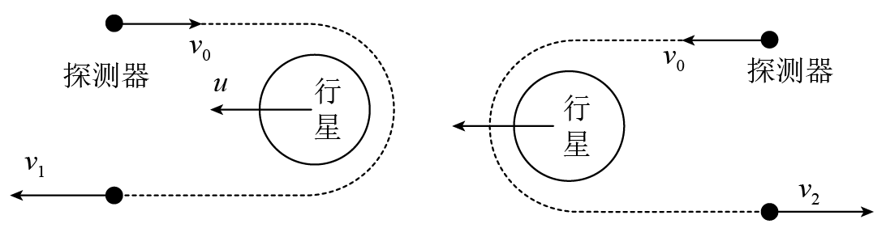
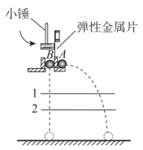
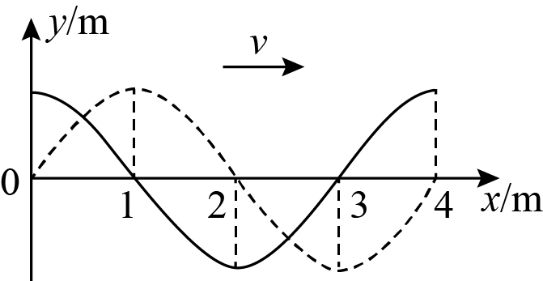
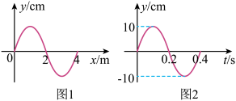
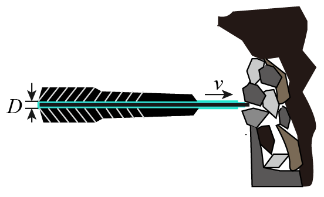
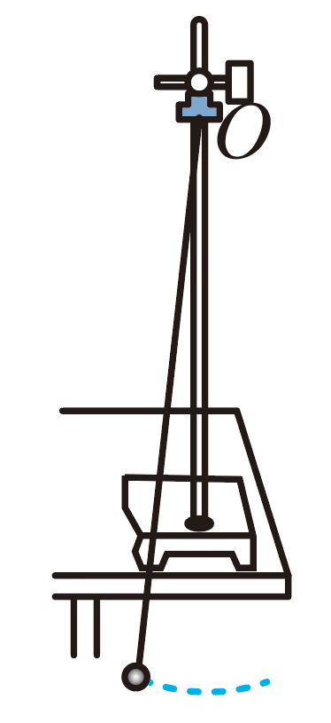
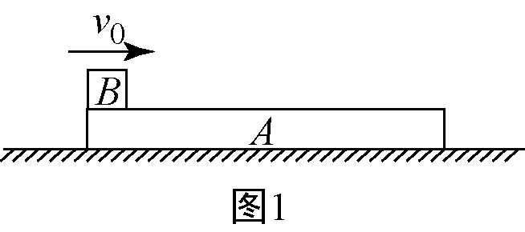

# 26春北京市民大附中高二下期中 #h0
## 单选
> [!ti] *26春北京市民大附中高二下期中第1题*
> 下列现象，不属于波所特有的现象的是（　　）
> > [!opts4]
> > - A. 波的干涉
> > - B. 波的反射
> > - C. 波的衍射
> > - D. 多普勒效应

> [!ti] *26春北京市民大附中高二下期中第2题*
> 如图，挡板 $M$ 是固定的，挡板 $N$ 可以上下移动。现在把 $M$、$N$ 两块挡板中的空隙当作一个“小孔”做水波的衍射实验，出现了图示中的图样，$P$ 点的水没有振动起来。为了使挡板左边的振动传到 $P$ 点，可以采用的方法有（　　）
> ![[Pasted image 20260430201051.png|100]]
> > [!opts1]
> > - A. 增加波源的振动振幅
> > - B. 减小波源水波的波长
> > - C. 将挡板 $N$ 上移一段距离
> > - D. 将挡板 $N$ 下移一段距离

> [!ti] *26春北京市民大附中高二下期中第3题*
> 如图所示为一个水平弹簧振子做简谐运动的振动图像，由图像可知（　　）
> ![[Pasted image 20260430201143.png|200]]
> > [!opts1]
> > - A. 在 $0.1\ \mathrm{s}$ 时，振子的动能最小
> > - B. 在 $0.1\ \mathrm{s}$ 时，弹簧的势能最大
> > - C. 在 $0.2\ \mathrm{s}$ 时，振子加速度方向沿 $x$ 轴负方向
> > - D. 从 $0\sim0.2\ \mathrm{s}$ 时间内，振子运动的路程为 $10\ \mathrm{cm}$

> [!ti] *26春北京市民大附中高二下期中第4题*
> 如图所示，光滑水平面上静止一质量为 $M=80\ \mathrm{kg}$ 的平板小车，现有一质量为 $m=40\ \mathrm{kg}$ 的小孩站立于小车右端。小孩以对地 $v_0=2\ \mathrm{m/s}$ 的速度向右跳离小车后，小车的运动情况为（　　）
> ![[Pasted image 20260430201238.png|200]]
> > [!opts1]
> > - A. 小车向左运动，速度大小为 $1\ \mathrm{m/s}$
> > - B. 小车向左运动，速度大小为 $2\ \mathrm{m/s}$
> > - C. 小车向右运动，速度大小为 $1\ \mathrm{m/s}$
> > - D. 小车向右运动，速度大小为 $2\ \mathrm{m/s}$

> [!ti] *26春北京市民大附中高二下期中第5题*
> 质量为 $m$ 的小球在半径为 $R$ 的光滑球面上的 $A$、$B$ 之间来回运动，圆弧 $AB\ll R$，则小球在 $A$ 点时回复力的大小为（　　）
> ![[Pasted image 20260430201354.png|100]]
> > [!opts1]
> > - A. $mg\sin\theta$
> > - B. $mg\cos\theta$
> > - C. $mg\tan\theta$
> > - D. $mg(1-\cos\theta)$

> [!ti] *26春北京市民大附中高二下期中第6题*
> 水平面上，对于正在做匀速直线运动的物体，要用恒力使它停下来，所需的时间取决于物体的（　　）
> > [!opts1]
> > - A. 初速度
> > - B. 加速度
> > - C. 初动量
> > - D. 质量

> [!ti] *26春北京市民大附中高二下期中第7题*
> 如图所示，五个摆悬挂于同一根绷紧的水平绳上，其中 $A$、$E$ 摆长相等，$A$ 的摆球质量较大，先让 $A$ 摆动起来，让其带动其他摆振动起来，下列结论正确的是（　　）
> ![[Pasted image 20260430201456.png|150]]
> > [!opts1]
> > - A. 其他各摆的振幅都相等
> > - B. 其他各摆的振幅不同，$E$ 摆的振幅最小
> > - C. 其他各摆的振动周期相同
> > - D. 只有 $E$ 摆的振动周期与 $A$ 摆相同

> [!ti] *26春北京市民大附中高二下期中第8题*
> 如图所示，$S_1$、$S_2$ 是两个周期为 $T$ 的相干波源，它们振动同步且振幅相同，实线和虚线分别表示波的波峰和波谷，关于图中所标的 $a$、$b$、$c$、$d$ 四点，下列说法中正确的是（　　）
> ![[Pasted image 20260430201523.png|200]]
> > [!opts1]
> > - A. 此时质点 $a$ 的位移最大
> > - B. 质点 $b$ 和 $c$ 振动都最强
> > - C. 质点 $d$ 是振动减弱点
> > - D. 再过 $\frac{T}{2}$ 后 $b$ 点振动减弱

> [!ti] *26春北京市民大附中高二下期中第9题*
> 某绳波形成过程如图所示，$t=0$ 时质点 1 开始沿竖直方向做周期为 $T$ 的简谐运动。$t=\frac{T}{4}$ 时，质点 5 开始运动。下列说法正确的是（　　）
> ![[Pasted image 20260430201548.png|300]]
> > [!opts1]
> > - A. $t=\frac{T}{4}$ 时，质点 4 正在向下运动
> > - B. $t=\frac{T}{4}$ 时，质点 1 的加速度为零
> > - C. 从 $t=\frac{T}{2}$ 到 $t=\frac{3T}{4}$，质点 7 的速度先增大后减小
> > - D. 从 $t=\frac{T}{2}$ 到 $t=\frac{3T}{4}$，质点 7 的加速度先增大后减小

> [!ti] *26春北京市民大附中高二下期中第10题*
> 随着科幻电影《流浪地球》的热映，“引力弹弓效应”进入了公众的视野。“引力弹弓效应”是指在太空运动的探测器，借助行星的引力来改变自己的速度。为了分析这个过程，可以提出以下两种模式：探测器分别从行星运动的反方向或同方向接近行星，分别因相互作用改变了速度。如图所示，以太阳为参考系，设行星运动的速度为 $u$，探测器的初速度大小为 $v_0$，行星质量远大于探测器的质量，在图示的两种情况下，探测器在远离行星后速度大小分别为 $v_1$ 和 $v_2$。探测器和行星虽然没有发生直接的碰撞，但是在行星的运动方向上，其运动规律可以与两个质量不同的钢球在同一直线上发生的弹性碰撞规律作类比。那么下列判断中正确的是（　　）
> 
> > [!opts1]
> > - A. $v_1>v_0$
> > - B. $v_1=v_0$
> > - C. $v_2>v_0$
> > - D. $v_2=v_0$

## 多选

> [!ti] *26春北京市民大附中高二下期中第11题*
> $A$、$B$ 两个物体质量相等，距离地面高度相等。用小锤快速敲击弹片后，$B$ 自由落下，$A$ 做平抛运动，不计空气阻力，则两物体（　　）
> 
> > [!opts1]
> > - A. 落地时动量相同
> > - B. 下落过程所受冲量相同
> > - C. 下落过程在任意相等的时间 $\Delta t$ 内的动量变化量相同
> > - D. 下落过程在任意相等的时间 $\Delta t$ 内的动能变化量 $\Delta E_k$ 相同

> [!ti] *26春北京市民大附中高二下期中第12题*
> 如图所示，实线为一列沿 $x$ 轴正方向传播的简谐横波在 $t=0$ 时刻的波形，虚线是该波在 $t=0.20\ \mathrm{s}$ 时刻的波形，则此列波的周期可能为（　　）
> 
> > [!opts2]
> > - A. $0.16\ \mathrm{s}$
> > - B. $0.80\ \mathrm{s}$
> > - C. $1.60\ \mathrm{s}$
> > - D. $2.40\ \mathrm{s}$

> [!ti] *26春北京市民大附中高二下期中第13题*
> 一列沿 $x$ 轴传播的简谐横波，某时刻波形如图 1 所示，以该时刻为计时零点，$x=2\ \mathrm{m}$ 处 $B$ 质点的振动图像如图 2 所示。根据图中信息，下列说法正确的是（　　）
> 
> > [!opts1]
> > - A. 波的传播速度 $v=10\ \mathrm{m/s}$
> > - B. 波沿 $x$ 轴负方向传播
> > - C. $A$ 质点比 $P$ 质点先回到平衡位置
> > - D. $t=0.2\ \mathrm{s}$ 时，位于 $x=2\ \mathrm{m}$ 处的 $B$ 质点水平向右运动 $2\ \mathrm{m}$ 的距离

> [!ti] *26春北京市民大附中高二下期中第14题*
> 如图所示，工人手持高压水枪，用其喷出的强力水柱冲击煤层，设水柱直径为 $D$，水流速度大小为 $v$，方向水平向右。水柱垂直煤层表面，水柱冲击煤层后水的速度变为零，水的密度为 $\rho$，高压水枪的重力不可忽略，手持高压水枪操作。下列说法正确的是（　　）
> 
> > [!opts1]
> > - A. 水枪单位时间内喷出水的质量为 $\rho v\pi D^2$
> > - B. 高压水枪的喷水功率为 $\frac{\rho v^3\pi D^2}{8}$
> > - C. 水柱对煤层的平均冲击力大小为 $\frac{\rho v^2\pi D^2}{8}$
> > - D. 为使高压水枪保持静止，两手对高压水枪的作用力的合力方向为斜向右上方

## 实验

> [!ti] *26春北京市民大附中高二下期中第15题*
> 用单摆测定重力加速度的实验装置如图 1 所示。
> 
> （1）对于单摆的制作，下列所给器材中可以选用________（填写器材前面的字母）。
> 
> ![[Pasted image 20260430201913.png|200]]
> > [!opts1]
> > - A. 长约 $1\ \mathrm{m}$ 不可伸缩的细线
> > - B. 长约 $1\ \mathrm{m}$ 的橡皮绳
> > - C. 直径约 $2\ \mathrm{cm}$ 带孔的小乒乓球
> > - D. 直径约 $2\ \mathrm{cm}$ 带孔的实心铁球
> 
> （2）选用合适的器材组装成单摆后，主要步骤如下：
> 
> ①将单摆上端固定在铁架台上。
> 
> ②用刻度尺测出悬点到球心的距离，即摆长为 $L$。
> 
> ③记录小球完成 $n$ 次全振动所用的总时间 $t$。
> 
> ④根据单摆周期公式计算重力加速度 $g$ 的大小。
> 
> 重力加速度测量值表达式 $g=$________（用 $L$、$n$、$t$ 表示）。
> 
> （3）为减小实验误差，多次改变摆长 $L$，测量对应的单摆周期 $T$，用多组实验数据绘制 $T^2-L$ 图像，如图 2 所示。由图可知重力加速度 $g=$________（用图中字母表示）。
> 
> （4）关于实验操作或结果分析，下列说法正确的是________（选填选项前的字母）。
> > [!opts1]
> > - A. 测量摆长时，要让小球静止悬挂时测量
> > - B. 摆长一定的情况下，摆的振幅越大越好
> > - C. 开始计时时，若过早按下秒表，则测得的重力加速度值比正常值偏小

> [!ti] *26春北京市民大附中高二下期中第16题*
> 某小组同学用图中实验装置验证动量守恒定律。已知入射小球质量为 $m_1$、半径为 $r_1$，被碰小球质量为 $m_2$、半径为 $r_2$。记录小球抛出点在水平地面上的垂直投影点 $O$ 及碰撞前后两小球的平均落地点的位置 $M$、$P$、$N$，其中 $P$ 点为不放被碰小球时 $m_1$ 的落点。
> 
> （1）对于两球的质量 $m$ 和半径 $r$ 的要求为：________。
>![[Pasted image 20260430202100.png|300]]
>
> > [!opts1]
> > - A. $m_1>m_2$，$r_1>r_2$
> > - B. $m_1>m_2$，$r_1=r_2$
> > - C. $m_1<m_2$，$r_1>r_2$
> > - D. $m_1<m_2$，$r_1=r_2$
> 
> （2）实验中，需要测量的物理量有________。
> > [!opts1]
> > - A. 小球开始释放的高度 $h$
> > - B. 小球抛出点距地面的高度 $H$
> > - C. 用天平测量两个小球的质量 $m_1$、$m_2$
> > - D. 小球做平抛运动的射程 $\overline{OM}$、$\overline{OP}$、$\overline{ON}$
> 
> （3）入射小球从轨道上滑下时，轨道的粗糙程度对实验结论________（“有影响”或“无影响”）。
> 
> （4）若要验证两球相碰前后的动量是否守恒，则应验证的表达式可表示为________（用 $m_1$、$m_2$、$\overline{OM}$、$\overline{OP}$、$\overline{ON}$ 表示）。
> 
> （5）某同学在上述实验中更换了两个小球的材质重新实验，且入射小球和被碰小球的质量关系为 $m_1=2m_2$，其它条件不变。两小球在记录纸上留下三处落点痕迹如下图所示。他将米尺的零刻线与 $O$ 点对齐，两球的平均落点 $A$、$B$、$C$ 距离 $O$ 点的读数见放大图。该同学通过测量和计算发现，两小球在碰撞前后动量是守恒的。由此可以判断出下图中落点 $B$ 是________。
> ![[Pasted image 20260430202245.png|300]]
> > [!opts1]
> > - A. 未放被碰小球时，入射小球的落地点
> > - B. 被碰小球碰撞后的落地点
> > - C. 入射小球碰撞后的落地点

## 计算

> [!ti] *26春北京市民大附中高二下期中第17题*
> 如图是一个单摆的共振曲线。（估算时可能用到的数据：$\pi^2\approx9.8$，$g=9.8\ \mathrm{m/s^2}$）
> ![[Pasted image 20260430203700.png|150]]
> （1）共振时单摆的振幅为多大？
> 
> （2）试估算此单摆的摆长。
> 
> （3）若摆长增大，共振曲线振幅最大值所对应的横坐标将向哪个方向移动？
>

> [!ti] *26春北京市民大附中高二下期中第18题*
> 生活中经常出现手机滑落而导致损坏的现象。手机套能有效地保护手机。现有一部质量为 $m=0.2\ \mathrm{kg}$ 的手机（包括手机套），从离地面高 $h_1=1.8\ \mathrm{m}$ 处无初速度下落，落到地面后，反弹的高度为 $h_2=0.05\ \mathrm{m}$，由于手机套的缓冲作用，手机与地面的作用时间为 $\Delta t=0.1\ \mathrm{s}$。不计空气阻力，取 $g=10\ \mathrm{m/s^2}$，求：
> 
> （1）手机在空中下落过程中重力冲量的大小；
> 
> （2）手机与地面作用过程中手机动量的变化量的大小；
> 
> （3）手机对地面的平均作用力。

> [!ti] *26春北京市民大附中高二下期中第19题*
> 如图，在光滑地面上，两物块 $A$、$B$ 用轻弹簧相连后静止在地面上，$A$、$B$ 质量 $m_A=m_B=2\ \mathrm{kg}$，初始时弹簧处于原长，质量为 $m_C=1\ \mathrm{kg}$ 的物块 $C$ 以 $v_0=3\ \mathrm{m/s}$ 的速度与 $A$ 发生弹性碰撞，$A$、$C$ 碰撞时间极短，求：
> 
> （1）$A$、$C$ 碰撞后瞬间 $A$ 获得的速度 $v_1$ 的大小；
> 
> （2）当弹簧的弹性势能最大时，物块 $A$ 速度 $v_2$ 的大小；
> 
> （3）弹簧中弹性势能 $E_p$ 的最大值。
>![[Pasted image 20260430203123.png|300]]

> [!ti] *26春北京市民大附中高二下期中第20题*
> 如图 1 所示，木板 $A$ 静止在光滑水平面上，一小滑块 $B$（可视为质点）以某一水平初速度从木板的左端冲上木板。
> 
> （1）若木板 $A$ 的质量为 $M$，滑块 $B$ 的质量为 $m$，初速度为 $v_0$，且滑块 $B$ 没有从木板 $A$ 的右端滑出，求木板 $A$ 最终的速度 $v$。
> 
> （2）若滑块 $B$ 以 $v_1=3.0\ \mathrm{m/s}$ 的初速度冲上木板 $A$，木板 $A$ 最终速度的大小 $v=1.5\ \mathrm{m/s}$；若滑块 $B$ 以初速度 $v_2=7.5\ \mathrm{m/s}$ 冲上木板 $A$，木板 $A$ 最终速度的大小也为 $v=1.5\ \mathrm{m/s}$。已知滑块 $B$ 与木板 $A$ 间的动摩擦因数 $\mu=0.3$，$g$ 取 $10\ \mathrm{m/s^2}$。求木板 $A$ 的长度 $L$。
> 
> （3）若改变滑块 $B$ 冲上木板 $A$ 的初速度 $v_0$，木板 $A$ 最终速度 $v$ 的大小将随之变化。请你在图 2 中定性画出 $v-v_0$ 图线。
> 
> ![[Pasted image 20260430203214.png|200]]

