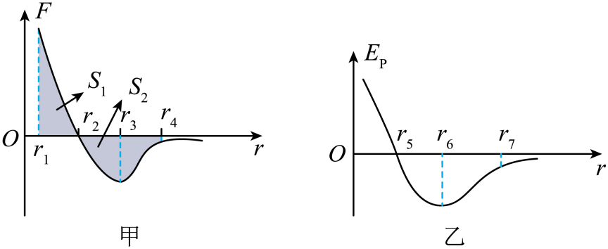
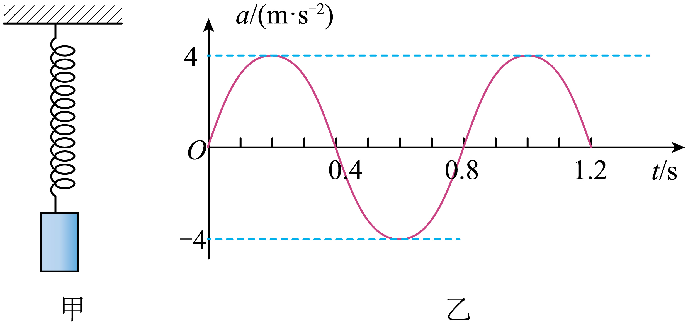
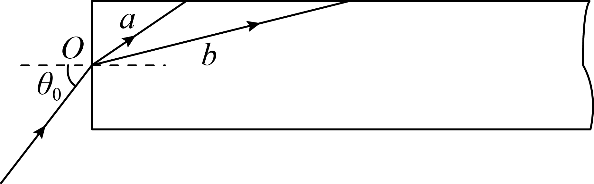
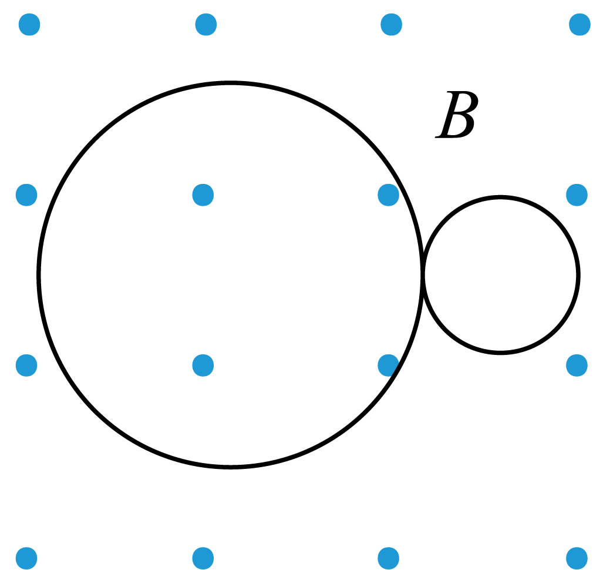
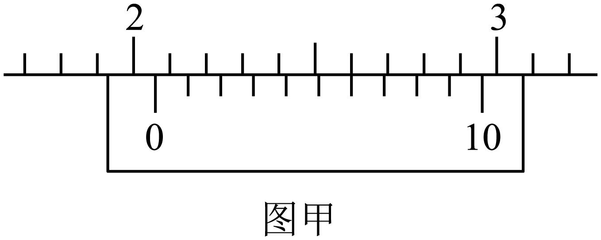
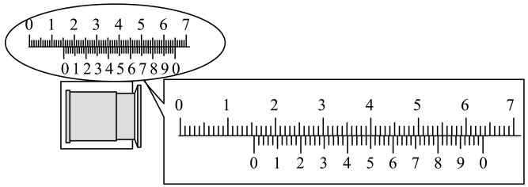
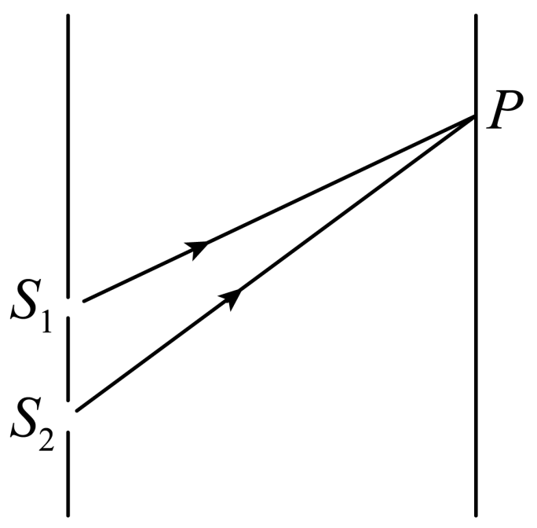
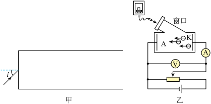

# 26春北京市第一七一中学高一下期中 #h0
# 单选
> [!ti] *26春北京市第一七一中学高一下期中第1题*
> 关于布朗运动，下列说法正确的是（　　）
> > [!opts1]
> > - A. 布朗运动是液体分子的无规则运动
> > - B. 悬浮在液体中的颗粒越小、液体温度越高，布朗运动越明显
> > - C. 悬浮颗粒越大，在某一瞬间撞击它的分子数越多，布朗运动越明显
> > - D. 布朗运动的无规则性反映了颗粒内部分子运动的无规则性

> [!ti] *26春北京市第一七一中学高一下期中第2题*
> 卢瑟福指导他的助手进行的 $\alpha$ 散射实验所用仪器的示意图如图所示。放射源发射的 $\alpha$ 粒子打在金箔上，通过显微镜观察散射的 $\alpha$ 粒子。实验发现，绝大多数 $\alpha$ 粒子穿过金箔后，基本上仍沿原来方向前进，但少数 $\alpha$ 粒子发生了大角度偏转，极少数的角度甚至大于 $90^\circ$。于是，卢瑟福大胆猜想（　　）
> ![[Pasted image 20260430190944.png|200]]
> > [!opts2]
> > - A. 原子核内存在中子
> > - B. 原子核内存在质子
> > - C. 电子围绕原子核运动
> > - D. 原子内部有体积很小、质量很大的核

> [!ti] *26春北京市第一七一中学高一下期中第3题*
> 下列选项中，属于光的衍射现象的是（　　）
> > [!opts4]
> > - A. ![[Pasted image 20260430191019.png|140]]泊松亮斑
> > - B. ![[Pasted image 20260430191027.png|240]]沙漠蜃景
> > - C. ![[Pasted image 20260430191033.png|200]]等间距条纹
> > - D. ![[Pasted image 20260430191038.png|140]]太阳光下的肥皂膜

> [!ti] *26春北京市第一七一中学高一下期中第4题*
> 在“用油膜法估测分子的大小”的实验中，下列说法中正确的是（　　）
> ![[Pasted image 20260430191148.png|200]]
> > [!opts1]
> > - A. 用油膜法可以精确测量分子的大小
> > - B. 油酸分子直径近似等于纯油酸体积除以相应油膜面积
> > - C. 计算油膜面积时，应舍去所有不足一格的方格
> > - D. 实验时应先将一滴油酸酒精溶液滴入水中，再把痱子粉均匀地撒在水面上

> [!ti] *26春北京市第一七一中学高一下期中第5题*
> 对于一定质量的理想气体，下列说法正确的是（　　）
> > [!opts1]
> > - A. 气体压强只与气体分子的密集程度有关
> > - B. 气体温度升高，每一个气体分子的动能都增大
> > - C. 气体的温度升高，气体内能一定增大
> > - D. 若气体膨胀对外做功 $50\ \mathrm{J}$，则内能一定减少 $50\ \mathrm{J}$

> [!ti] *26春北京市第一七一中学高一下期中第6题*
> 一列沿 $x$ 轴传播的简谐横波，波速为 $4\ \mathrm{m/s}$。某时刻波形如图所示，此时 $x=4\ \mathrm{m}$ 处质点沿 $y$ 轴负方向运动。下列说法正确的是（　　）
> ![[Pasted image 20260430191211.png|200]]
> > [!opts2]
> > - A. 这列波沿 $x$ 轴负方向传播
> > - B. 这列波的振幅是 $4\ \mathrm{cm}$
> > - C. 这列波的周期为 $8\ \mathrm{s}$
> > - D. 此时 $x=8\ \mathrm{m}$ 处质点的速度为 0

> [!ti] *26春北京市第一七一中学高一下期中第7题*
> 一个单摆在地面上做受迫振动，其共振曲线（振幅 $A$ 与驱动力频率 $f$ 的关系）如图所示，则下列说法不正确的是（　　）
> ![[Pasted image 20260430191236.png|200]]
> > [!opts2]
> > - A. 此单摆的固有周期约为 $2\ \mathrm{s}$
> > - B. 此单摆的摆长约为 $1\ \mathrm{m}$
> > - C. 若摆长增大，单摆的固有频率减小
> > - D. 若摆长增大，共振曲线的峰将向右移动

> [!ti] *26春北京市第一七一中学高一下期中第8题*
> 如图所示，一束可见光经过玻璃三棱镜折射后分为 $a$、$b$ 两束单色光。下列说法正确的是（　　）
> ![[Pasted image 20260430191251.png|200]]
> > [!opts2]
> > - A. 玻璃对 $a$ 光的折射率小于对 $b$ 光的折射率
> > - B. 玻璃中 $a$ 光的传播速度大于 $b$ 光的传播速度
> > - C. 真空中 $a$ 光的波长大于 $b$ 光的波长
> > - D. 如用 $b$ 光照射某金属能发生光电效应，则用 $a$ 光照射该金属也一定发生光电效应

> [!ti] *26春北京市第一七一中学高一下期中第9题*
> 如图所示，一定量的理想气体由状态 $A$ 经过过程①到达状态 $B$，再由状态 $B$ 经过过程②到达状态 $C$，其中过程①图线与横轴平行，过程②图线与纵轴平行。对于这个变化过程，下列说法中正确的是（　　）
> ![[Pasted image 20260430191307.png|200]]
> > [!opts1]
> > - A. 从状态 $A$ 到状态 $B$ 的过程，气体放出热量
> > - B. 从状态 $A$ 到状态 $B$ 的过程，气体分子热运动的平均动能在减小
> > - C. 从状态 $B$ 到状态 $C$ 的过程，气体分子对容器壁撞击的频繁程度增加
> > - D. 从状态 $B$ 到状态 $C$ 的过程，气体吸收热量

> [!ti] *26春北京市第一七一中学高一下期中第10题*
> 如图甲、乙所示，分别表示两分子间的作用力、分子势能与两分子间距离的关系。分子 $a$ 固定在坐标原点 $O$ 处，分子 $b$ 从 $r=r_4$ 处以某一速度向分子 $a$ 运动（运动过程中仅考虑分子间作用力），假定两个分子的距离为无穷远时它们的分子势能为 0，则（　　）
> 
> > [!opts2]
> > - A. 图甲中分子间距从 $r_2$ 到 $r_3$，分子间的引力增大，斥力减小
> > - B. 分子 $b$ 运动至 $r_3$ 和 $r_1$ 位置时动能可能相等
> > - C. 图乙中 $r_5$ 一定大于图甲中 $r_2$
> > - D. 若图甲中阴影面积 $S_1=S_2$，则两分子间最小距离等于 $r_1$

> [!ti] *26春北京市第一七一中学高一下期中第11题*
> 甲为手机和轻弹簧制作的振动装置。手机加速度传感器记录了手机在竖直方向的振动情况，以向上为正方向，得到手机振动过程中加速度 $a$ 随时间 $t$ 变化的曲线为正弦曲线，如图乙所示。下列说法正确的是（　　）
> 
> > [!opts2]
> > - A. $t=0$ 时，弹簧弹力为 0
> > - B. $t=0.2\ \mathrm{s}$ 时，手机位于平衡位置下方
> > - C. 从 $t=0$ 至 $t=0.2\ \mathrm{s}$，手机的动能增大
> > - D. $a$ 随 $t$ 变化的关系式为 $a=4\sin(0.8t)\ \mathrm{m/s^2}$

> [!ti] *26春北京市第一七一中学高一下期中第12题*
> 光纤通信采用光导纤维，可简化为半径为 $r$、长为 $L$（$L\gg r$）的圆柱形长玻璃丝。为简化可认为玻璃丝外为空气，其沿轴线的侧剖面如图所示。一束含红、绿两种颜色的复色光以入射角 $\theta_0$ 从轴心射入后分为 $a$、$b$ 两束，两单色光在玻璃中多次全反射后从光导纤维另一端射出，已知该玻璃材料对 $a$ 光的折射率为 $n$，真空中的光速为 $c$。下列说法正确的是（　　）
> 
> > [!opts2]
> > - A. $a$ 光为绿光，$b$ 光为红光
> > - B. 该玻璃材料对 $b$ 光的折射率小于 $n$
> > - C. 若 $a$ 光恰好发生全反射，则 $a$ 光在该玻璃丝中的传播时间 $t=\frac{n^2L}{c}$
> > - D. 若 $n<\sqrt{2}$，则 $a$ 光以任意入射角入射均能在玻璃丝内发生全反射

> [!ti] *26春北京市第一七一中学高一下期中第13题*
> 如图所示，在足够大的匀强磁场中，一个静止的氡原子核（$^{222}_{86}\mathrm{Rn}$）发生衰变，放出一个粒子后成为一个新核。已知粒子与新核的运动轨迹是两个相外切的圆，下列说法正确的是（　　）
> 
> > [!opts2]
> > - A. 大圆与小圆的直径之比可能为 $43:1$
> > - B. 大圆与小圆的直径之比可能为 $87:1$
> > - C. 大圆是粒子的轨迹，该粒子可能是 $\alpha$ 粒子
> > - D. 小圆是粒子的轨迹，该粒子可能是 $\alpha$ 粒子

> [!ti] *26春北京市第一七一中学高一下期中第14题*
> 2026 年 1 月 2 日，中国科学院合肥物质科学研究院等离子体物理研究所科研团队宣布，我国重大科学工程有“人造太阳”之称的全超导托卡马克核聚变实验装置（EAST）实验证实托卡马克密度自由区的存在，找到突破密度极限的方法，为磁约束核聚变装置高密度运行提供重要的物理依据。其中我国“人造太阳”主要是将氢的同位素氘或氚的核聚变反应释放的能量用来发电，有一种核聚变反应的方程为 $^2_1\mathrm{H}+^2_1\mathrm{H}\to x+^1_0\mathrm{n}$。已知氘核的质量为 $m_1$，比结合能为 $E$，中子的质量为 $m_2$，反应中释放的核能为 $\Delta E$，光速为 $c$，下列说法正确的是（　　）
> > [!opts2]
> > - A. 反应产物 $x$ 为 $^4_2\mathrm{He}$
> > - B. $x$ 核的质量为 $\frac{\Delta E}{c^2}+m_2-2m_1$
> > - C. $x$ 的比结合能为 $\frac{4}{3}E+\frac{\Delta E}{3}$
> > - D. 提升等离子体的密度，在常温常压下也能发生聚变反应

# 实验

> [!ti] *26春北京市第一七一中学高一下期中第15题*
> 甲、乙两同学利用单摆测定当地重力加速度。
> 
> （1）甲同学用 10 分度的游标卡尺测量摆球的直径，如图所示，他测量的读数应该是______ $\mathrm{cm}$。接着他正确测量了摆线长，加上摆球半径，得到了摆长 $l_0$。
> 
> （2）为了测定该单摆的振动周期 $T$，下列做法中正确的是______。
> 
> > [!opts1]
> > - A. 将摆球拉离平衡位置一个小角度，从静止释放开始计时，小球第一次回到释放点停止计时，以这段时间作为周期
> > - B. 将摆球拉离平衡位置一个小角度，从静止释放开始计时，小球第 30 次回到释放点停止计时，以这段时间除以 30 作为周期
> > - C. 将摆球拉离平衡位置一个小角度，从静止释放摆球，当小球某次通过最低点时开始计时，并数为 0，以后小球每次经过最低点时，他依次数为 1、2、3……，数到 60 时停止计时，以这段时间除以 30 作为周期
> > - D. 将摆球拉离平衡位置一个小角度，从静止释放摆球，当小球某次向右通过最低点时开始计时，并同时数 30，以后小球每次向右经过最低点时，他依次计数为 29、28、27……，数到 0 时停止计时，以这段时间除以 30 作为周期
> 
> （3）他根据正确方法测出了摆长 $l$ 和周期 $T$，计算当地的重力加速度的表达式为 $g=$______。
> 
> （4）甲同学用上述方法测量重力加速度 $g$，你认为最需要改进的是______。
> 
> （5）乙同学没有测量摆球直径，只正确测得了摆线长为 $l$，和对应的单摆振动周期为 $T$。然后通过改变摆线的长度，共测得 6 组 $l$ 和对应的周期 $T$，计算出 $T^2$，作出 $l-T^2$ 图线，在图线上选取相距较远的 $A$、$B$ 两点，读出与这两点对应的坐标，如图所示。乙同学计算重力加速度的表达式为 $g=$______。
> ![[Pasted image 20260430191651.png|200]]
> （6）乙同学没有测量摆球直径，把摆线长当成了摆长。你认为他这种做法会不会引起实验的系统误差______（填“会”或“不会”）。

> [!ti] *26春北京市第一七一中学高一下期中第16题*
> （1）用双缝干涉测量光的波长实验装置如图所示，单缝前放置绿色滤光片。
> 
> ①某次实验中将测量头的分划板中心刻线与某亮纹中心对齐，并将该亮纹定为第 1 条亮纹，此时手轮上的示数为 $x_1$；然后转动测量头，使分划板中心刻线与第 $n$ 条亮纹中心对齐，此时手轮上的示数为 $x_n$。若双缝间距为 $d$、双缝到光屏距离为 $L$，则光的波长可表示为______。
> 
> ②若实验中发现条纹太密，可采取的改善方法有______。
> 
> > [!opts1]
> > - A. 将绿色滤光片更换为红色滤光片
> > - B. 增大单缝到双缝的距离
> > - C. 更换间距更小的双缝
> > - D. 缩短双缝到毛玻璃屏的距离
> 
> （2）用“插针法”测定玻璃的折射率，所用的玻璃砖两面平行。正确操作后，作出的光路图及测出的相关角度如图所示。
> 
> ①这块玻璃砖的折射率 $n=$______（用图中字母表示）。
> 
> ②如果有几块宽度 $d$ 不同的玻璃砖可供选择，为了减小误差，应选用宽度 $d$ 较______（选填“大”或“小”）的玻璃砖来测量。
> 
> ③在用两面平行的玻璃砖测定玻璃折射率的实验中，其实验光路图如下图所示，对实验中的一些具体问题，下列说法正确的有（　　）
> > [!opts1]
> > - A. 为了减少作图误差，$P_3$ 和 $P_4$ 的距离应适当取大些
> > - B. 为减少测量误差，$P_1$、$P_2$ 连线与玻璃砖界面的夹角应适当取大一些
> > - C. 若 $P_1$、$P_2$ 的距离较大时，通过玻璃砖会看不到 $P_1$、$P_2$ 的像
> > - D. 若 $P_1$、$P_2$ 连线与法线 $NN'$ 间夹角较大时，在 $bb'$ 一侧也不会发生全反射，能看到 $P_1$、$P_2$ 的重合像
> 
> ④在测定玻璃的折射率的实验中，某同学由于没有量角器，他在完成了光路图后，以 $O$ 点为圆心，以 $10\ \mathrm{cm}$ 为半径画圆，分别交线段 $OA$ 于 $A$ 点，交线段 $OO'$ 的延长线于 $C$ 点，过 $O$ 点作法线 $NN'$ 的垂线 $AB$ 交 $NN'$ 于 $B$ 点，过 $C$ 点作法线 $NN'$ 的垂线 $CD$ 交 $NN'$ 于 $D$ 点，如图所示用刻度尺量得 $OB=8\ \mathrm{cm}$，$CD=4\ \mathrm{cm}$，由此可得出玻璃的折射率 $n=$______。
> 
> ⑤某同学在“测量玻璃的折射率”实验中，为了防止笔尖碰到玻璃砖面而损伤玻璃砖，该同学画出的玻璃砖面 $aa'$、$bb'$ 如图所示。若其他操作正确，玻璃砖折射率的测量值比真实值______（填“偏大”、“偏小”、“不变”）。

# 计算

> [!ti] *26春北京市第一七一中学高一下期中第17题*
> 如图所示，在双缝干涉实验中，$S_1$ 和 $S_2$ 为双缝，$P$ 是光屏上的一点，已知 $P$ 点与 $S_1$、$S_2$ 距离之差为 $2.1\times10^{-6}\ \mathrm{m}$，分别用 $A$、$B$ 两种单色光在空气中做双缝干涉实验，问 $P$ 点是亮条纹还是暗条纹？
> 
> （1）若已知 $A$ 光在空气中的波长为 $6\times10^{-7}\ \mathrm{m}$；
> 
> （2）已知 $B$ 光在某种介质中波长为 $3.15\times10^{-7}\ \mathrm{m}$，当 $B$ 光从这种介质射向空气时，临界角为 $37^\circ$（$\sin37^\circ=0.6$）。
> 

> [!ti] *26春北京市第一七一中学高一下期中第18题*
> 光纤通信有传输容量大、衰减小、抗干扰性及保密性强等多方面的优点。如图甲是光纤的示意图，简化成由内芯和包层组成（内芯简化为长直玻璃丝，包层简化为真空），设玻璃丝折射率为 $n$。
> 
> （1）若某单色光从真空以入射角 $60^\circ$ 从左端面入射后恰好发生全反射通过此光纤，求折射率 $n$；
> 
> （2）经过传输的单色光照射在光电管上，此时电流表示数不为零。移动滑动变阻器滑片，求电流表示数刚好为零时的电压 $U_c$（已知单色光波长 $\lambda$、光电管阴极材料逸出功 $W_0$、普朗克常量 $h$、元电荷 $e$、光速 $c$）。
> 

> [!ti] *26春北京市第一七一中学高一下期中第19题*
> 自然界中的物体由于具有一定的温度，会不断的向外辐射电磁波（电磁能量），这种辐射，因与温度相关，称为热辐射。处于一定温度的物体在向外辐射电磁能量的同时，也要吸收由其他物体辐射的电磁能量，如果它处在平衡状态，则能量保持不变。若不考虑物体表面性质对辐射与吸收的影响，我们定义一种理想的物体，它能 $100\%$ 地吸收入射到其表面的电磁辐射，这样的物体称为黑体。单位时间内从黑体表面单位面积辐射的电磁波的总能量与黑体绝对温度的四次方成正比，即 $P_0=\sigma T^4$，其中 $\sigma$ 为已知常量。在下面的问题中，把研究对象（太阳、火星）都近似看作黑体。已知太阳半径为 $R_s$，太阳表面温度为 $T_s$，火星半径为 $r$。
> 
> （1）每秒从太阳表面辐射的总能量为多少？
> 
> （2）已知太阳到火星的距离约为太阳半径的 400 倍，忽略其它天体及宇宙空间的辐射，试估算火星的平均温度。

> [!ti] *26春北京市第一七一中学高一下期中第20题*
> 1913 年，玻尔建立氢原子模型时，仍然把电子的运动看作经典力学描述下的轨道运动。他认为，氢原子中的电子在库仑力的作用下，绕原子核做匀速圆周运动。已知电子质量为 $m$，电荷量为 $-e$，静电力常量为 $k$，氢原子处于基态时电子的轨道半径为 $r_1$。不考虑相对论效应。
> 
> （1）氢原子处于基态时，电子绕原子核运动，求电子的动能。
> 
> （2）氢原子的能量等于电子绕原子核运动的动能、电子与原子核系统的电势能的总和。已知当取无穷远处电势为零时，点电荷电场中距场源电荷 $Q$ 为 $r$ 处的各点的电势 $\varphi=k\frac{Q}{r}$。求处于基态的氢原子的能量。
> 
> （3）许多情况下光是由原子内部电子的运动产生的，因此光谱研究是探索原子结构的一条重要途径。利用氢气放电管可获得氢原子光谱。1885 年，巴尔末对当时已知的在可见光区的四条谱线做了分析，发现这些谱线的波长能够用巴尔末公式表示，写做 $\frac{1}{\lambda}=R\left(\frac{1}{2^2}-\frac{1}{n^2}\right)$（$n=3,4,5\cdots$），式中 $R$ 叫做里德伯常量。玻尔回忆说：“当我看到巴尔末公式时，我立刻感到一切都明白了。”根据玻尔理论可知，氢原子的基态能量为 $E_1$，激发态能量为 $E_n=\frac{E_1}{n^2}$，其中 $n=2,3,4\cdots$。用 $h$ 表示普朗克常量，$c$ 表示真空中的光速，请根据玻尔理论推导里德伯常量 $R$。

