# 26秋北京市第一六六中学高三物理试卷 #h0
# 单选
> [!ti] *26秋北京市第一六六中学高三物理试卷第1题*
> 关于自由落体运动，下列选项正确的是（　　）
> > [!opts1]
> > - A. 自由落体运动是初速度为零的匀加速直线运动
> > - B. 在空气中，不考虑空气阻力的运动是自由落体运动
> > - C. 质量大的物体受到的重力大，落到地面时的速度也大
> > - D. 物体做自由落体运动时不受任何外力作用

> [!ti] *26秋北京市第一六六中学高三物理试卷第2题*
> 如图所示，用同样大小的力 $F_1$、$F_2$ 提一桶水沿水平路面做匀速直线运动。已知两个力 $F_1$、$F_2$ 在同一竖直平面内。下列说法中正确的是（　　）
> 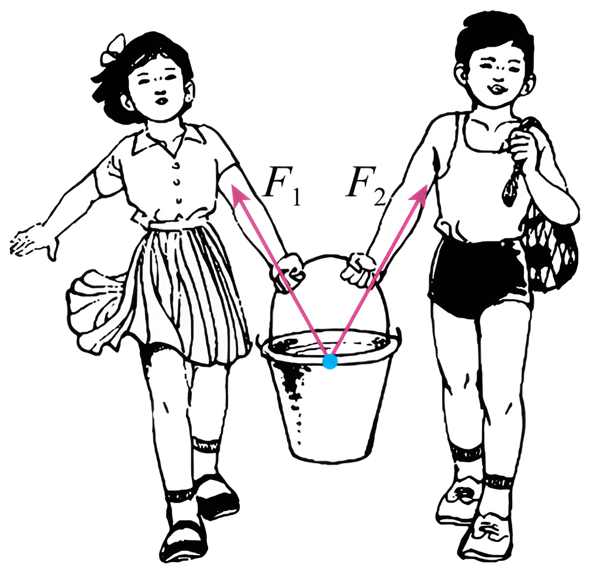
> > [!opts2]
> > - A. 两个力间的夹角大些比小些省力
> > - B. 两个力间的夹角小些比大些省力
> > - C. 两个力间的夹角变大，$F_1$、$F_2$ 的合力也变大
> > - D. 两个力间的夹角变大，$F_1$、$F_2$ 的合力会变小

> [!ti] *26秋北京市第一六六中学高三物理试卷第3题*
> 地铁在水平直轨道上运行时某节车厢的示意图如图所示。某段时间内，车厢内两拉手 $A$、$B$ 分别向前进方向偏离竖直方向角度 $\alpha$ 和 $\beta$ 并保持不变。重力加速度为 $g$。则该段时间内（　　）
> 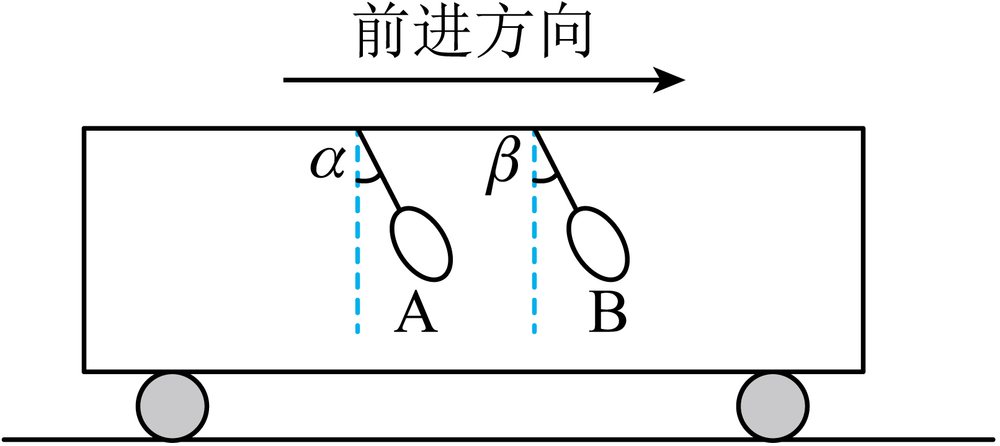
> > [!opts2]
> > - A. 拉手所受合力的方向不一定沿水平方向
> > - B. 两拉手偏离竖直方向的角度满足 $\alpha=\beta$
> > - C. 列车的加速度大小为 $g\sin\alpha$
> > - D. 列车正在加速行驶

> [!ti] *26秋北京市第一六六中学高三物理试卷第4题*
> 某航拍仪从地面由静止启动，在升力作用下匀加速竖直向上起飞。当上升到一定高度时，航拍仪失去动力。假设航拍仪在运动过程中沿竖直方向运动且机身保持姿态不变，其 $v-t$ 图像如图所示。由此可以判断（　　）
> 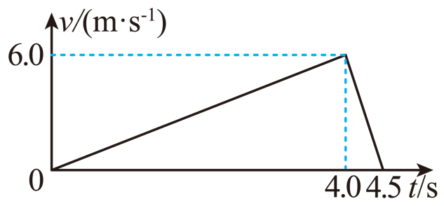
> > [!opts2]
> > - A. $t=4.0\ \mathrm{s}$ 时，航拍仪离地面最远
> > - B. $t=4.5\ \mathrm{s}$ 时，航拍仪回到地面
> > - C. 航拍仪在运动过程中上升的最大高度为 $12\ \mathrm{m}$
> > - D. 航拍仪在上升过程中加速度最大值为 $12\ \mathrm{m/s^2}$

> [!ti] *26秋北京市第一六六中学高三物理试卷第5题*
> 如图所示，不可伸长的轻质细绳的一端固定于 $O$ 点，另一端系一个小球，在 $O$ 点的正下方钉一个钉子 $A$，小球从右侧某一高度，由静止释放后摆下，不计空气阻力和细绳与钉子相碰时的能量损失。下列说法中正确的是（　　）
> 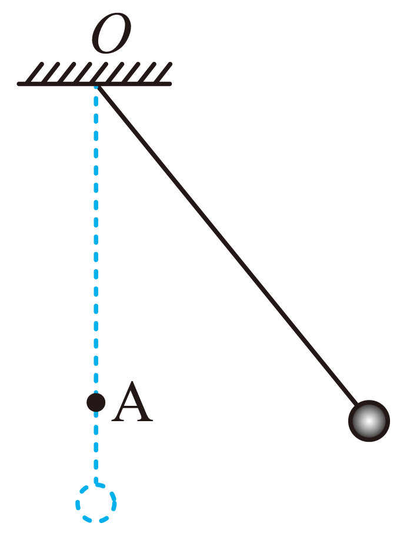
> > [!opts2]
> > - A. 小球摆动过程中，所受合力大小保持不变
> > - B. 小球在左侧所能达到的最大高度可能大于在右侧释放时的高度
> > - C. 当细绳与钉子碰后的瞬间，小球的向心加速度突然变小
> > - D. 钉子的位置越靠近小球，在细绳与钉子相碰时绳就越容易断

> [!ti] *26秋北京市第一六六中学高三物理试卷第6题*
> “中国天眼”（FAST）设施已发现脉冲星数量超过 240 颗。脉冲星是快速自转的中子星，每自转一周，就向外发射一次电磁脉冲信号，因此而得名。若观测到某中子星发射电磁脉冲信号的周期为 $T$。已知该中子星的半径为 $R$，引力常量为 $G$。则根据上述条件可以求出（　　）
> > [!opts2]
> > - A. 该中子星的密度
> > - B. 该中子星的第一宇宙速度
> > - C. 该中子星表面的重力加速度
> > - D. 该中子星赤道上的物体随中子星转动的线速度

> [!ti] *26秋北京市第一六六中学高三物理试卷第7题*
> 取一根较长的轻质软绳，用手握住一端 $O$，将绳拉平后在竖直平面内连续向上、向下抖动长绳，手上下振动的周期是 $T$，可以看到一列波产生和传播的情形，如图所示。在绳上做个标记 $P$（图中未标出），且 $O$、$P$ 的平衡位置间距为 $L$。$t=0$ 时，$O$ 位于最高点，$P$ 离开平衡位置的位移恰好为零，振动方向竖直向上。若该波可以看作是简谐波，下列判断正确的是（　　）
> 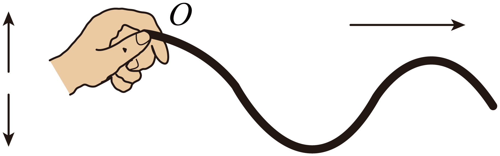
> 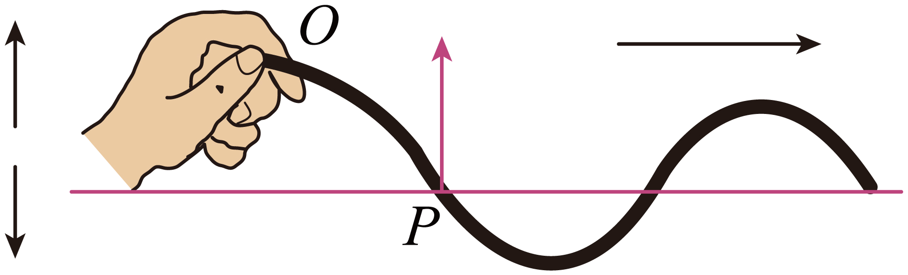
> > [!opts2]
> > - A. 该波是纵波
> > - B. 该波的最大波长为 $4L$
> > - C. $t=\frac{3T}{8}$ 时，$P$ 的振动方向竖直向上
> > - D. 若手上下振动加快，该简谐波的波长将变大

> [!ti] *26秋北京市第一六六中学高三物理试卷第8题*
> 场地自行车比赛中某段圆形赛道如图所示，赛道与水平面的夹角为 $\theta$，某运动员骑自行车在该赛道上做水平面内的匀速圆周运动。当自行车的速度为 $v_0$ 时，自行车不受侧向摩擦力作用；当自行车的速度为 $v_1$（$v_1>v_0$）时，自行车受到侧向摩擦力作用。不考虑空气阻力。重力加速度为 $g$。已知自行车和运动员的总质量为 $m$。则（　　）
> 
> > [!opts2]
> > - A. 速度为 $v_0$ 时，自行车所受的支持力大小为 $mg\cos\theta$
> > - B. 速度为 $v_0$ 时，自行车和运动员的向心力大小为 $mg\sin\theta$
> > - C. 速度为 $v_1$ 时，自行车和运动员的向心力大于 $mg\tan\theta$
> > - D. 速度为 $v_1$ 时，自行车所受的侧向摩擦力方向沿赛道向外

> [!ti] *26秋北京市第一六六中学高三物理试卷第9题*
> 某探究小组设计了一种新的交通工具，乘客的座椅能随着坡度的变化而自动调整，使座椅始终保持水平，让乘客乘坐更为舒适，如图所示。下列选项正确的是（　　）
> 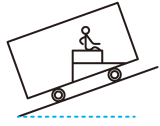
> > [!opts2]
> > - A. 当此车匀速上坡时，乘客受到三个力的作用
> > - B. 当此车匀速上坡时，乘客受到两个力的作用
> > - C. 当此车加速上坡时，乘客受到向后的摩擦力作用
> > - D. 当此车减速上坡时，乘客所受合力沿斜坡向上

> [!ti] *26秋北京市第一六六中学高三物理试卷第10题*
> 将一个物体竖直向上抛出，若物体所受空气阻力大小与物体速率成正比，下图中可能正确反映小球抛出后上升过程中速度 $v$、加速度 $a$ 随时间 $t$ 的变化关系，以及其动能 $E_k$、重力势能 $E_p$ 随上升高度 $h$ 的变化关系的是（　　）
> 
>
> 
> 
> > [!opts4]
> > - A. 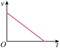
> > - B.  
> > - C. 
> > - D. 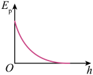

> [!ti] *26秋北京市第一六六中学高三物理试卷第11题*
> 如图甲所示，把两个质量相等的小车 $A$ 和 $B$ 静止地放在光滑的水平地面上。它们之间装有被压缩的轻质弹簧，用不可伸长的轻细线把它们系在一起。如图乙所示，让 $B$ 紧靠墙壁，其他条件与图甲相同。烧断细线后，下列说法中正确的是（　　）
> 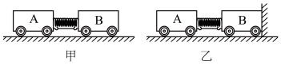
> > [!opts2]
> > - A. 当弹簧的压缩量减小到原来一半时，甲图中小车 $A$ 和 $B$ 组成的系统的动量不为零
> > - B. 当弹簧的压缩量减小到原来一半时，乙图中小车 $A$ 和 $B$ 组成的系统的动量为零
> > - C. 当弹簧恢复原长时，乙图中 $A$ 车速度是甲图中 $A$ 车速度的 2 倍
> > - D. 从烧断细线到弹簧恢复原长的过程中，乙图中弹簧对 $B$ 车的冲量是甲图中弹簧对 $B$ 车的冲量的 $\sqrt{2}$ 倍

> [!ti] *26秋北京市第一六六中学高三物理试卷第12题*
> 一辆质量为 $m$ 的汽车，启动后沿平直路面行驶，行驶过程中受到的阻力大小一定，如果发动机的输出功率恒为 $P$，经过时间 $t$，汽车能够达到的最大速度为 $v$。则（　　）
>
> > [!opts2]
> > - A. 当汽车的速度大小为 $\frac{v}{2}$ 时，汽车的加速度的大小为 $\frac{P}{mv}$
> > - B. 汽车速度达到 $\frac{v}{2}$ 的过程中，牵引力做的功为 $\frac{Pt}{2}$
> > - C. 汽车速度达到 $v$ 的过程中，汽车行驶的距离为 $\frac{v}{2}t$
> > - D. 汽车速度达到 $v$ 的过程中，牵引力做的功为 $\frac{1}{2}mv^2$

> [!ti] *26秋北京市第一六六中学高三物理试卷第13题*
> 如图 1 所示，一长木板静止于光滑水平桌面上，$t=0$ 时，小物块（可视为质点）以速度 $v_0$ 滑到长木板上，$t_1$ 时刻小物块恰好滑至长木板的最右端。图 2 为物块与木板运动的 $v-t$ 图像，图中 $t_1$、$v_0$、$v_1$ 已知，重力加速度大小为 $g$。下列说法正确的是（　　）
> 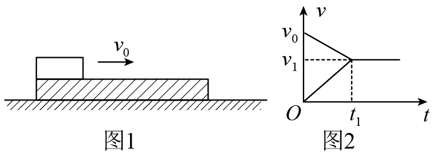
> > [!opts2]
> > - A. 木板的长度为 $v_0t_1$
> > - B. 物块与木板的质量之比为 $\frac{v_1}{v_0}$
> > - C. 物块与木板之间的动摩擦因数为 $\frac{v_0-v_1}{2gt_1}$
> > - D. $0\sim t_1$ 这段时间内，物块动能的减少量与木板动能的增加量之比为 $\frac{v_0+v_1}{v_1}$

> [!ti] *26秋北京市第一六六中学高三物理试卷第14题*
> 一水平放置的圆盘绕竖直轴转动，如图甲所示。圆盘上开有一条宽度均匀的狭缝。将激光器与传感器上下对准，使二者间连线与转轴平行，分别置于圆盘的上下两侧，且沿圆盘半径方向匀速移动，传感器接收到一个激光信号，并将其输入计算机，经处理后画出光信号强度 $I$ 随时间 $t$ 变化的图像，如图乙所示，图中 $\Delta t_1=1.0\times10^{-3}\ \mathrm{s}$，$\Delta t_2=0.8\times10^{-3}\ \mathrm{s}$。根据上述信息判断，下列选项正确的是（　　）
> 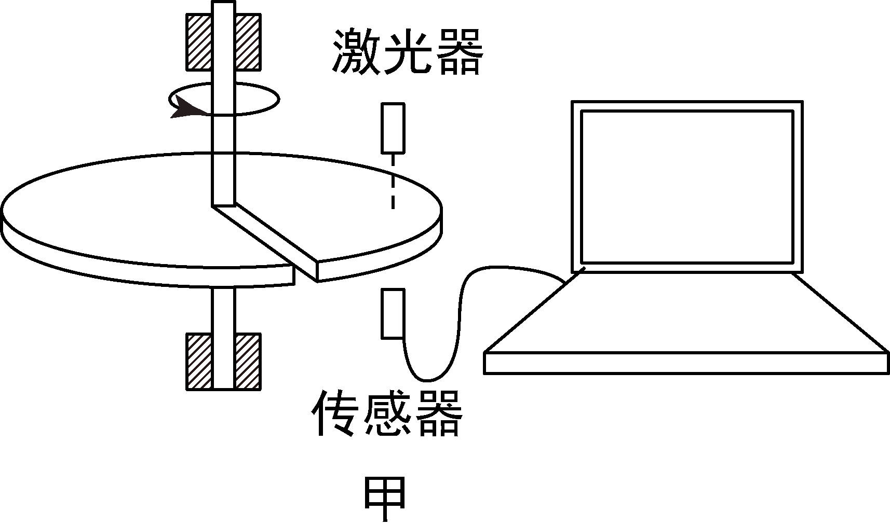
> 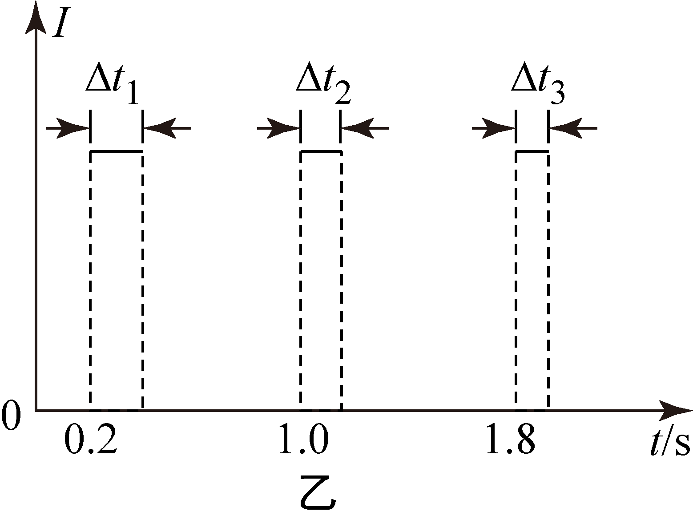
> > [!opts2]
> > - A. 圆盘在做加速转动
> > - B. 圆盘的角速度 $\omega=10\pi\ \mathrm{rad/s}$
> > - C. 激光器与传感器一起沿半径向圆心运动
> > - D. 图乙中 $\Delta t_3=0.67\times10^{-3}\ \mathrm{s}$

# 计算

> [!ti] *26秋北京市第一六六中学高三物理试卷第15题*
> 如图所示，一个质量 $m=4\ \mathrm{kg}$ 的物体放在水平地面上。对物体施加一个水平拉力 $F=10\ \mathrm{N}$，使物体做初速度为零的匀加速直线运动。已知物体与水平地面间的动摩擦因数 $\mu=0.20$，取重力加速度 $g=10\ \mathrm{m/s^2}$。
> 
> （1）求物体运动的加速度大小 $a$；
> 
> （2）求物体在 $4.0\ \mathrm{s}$ 时的速率 $v$；
> 
> （3）若经过 $4.0\ \mathrm{s}$ 后撤去拉力 $F$，求撤去拉力后物体可以滑行的最大距离 $x$。
> 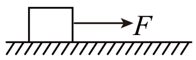

> [!ti] *26秋北京市第一六六中学高三物理试卷第16题*
> 如图所示，半径 $R=0.2\ \mathrm{m}$ 的竖直半圆形光滑轨道 $bc$ 与水平面 $ab$ 相切。质量 $m=0.1\ \mathrm{kg}$ 的小滑块 $B$ 放在半圆形轨道最低点 $b$ 处，另一质量也为 $m=0.1\ \mathrm{kg}$ 的小滑块 $A$，由 $a$ 点以 $v_0=7\ \mathrm{m/s}$ 的水平初速度向右滑行并与 $B$ 相碰，碰撞时间极短，碰后 $A$、$B$ 粘在一起运动。已知 $a$、$b$ 间距离 $x=3.25\ \mathrm{m}$，$A$ 与水平面之间的动摩擦因数 $\mu=0.2$，取重力加速度 $g=10\ \mathrm{m/s^2}$，$A$、$B$ 均可视为质点。
> 
> （1）求 $A$ 与 $B$ 碰撞前瞬间速度的大小 $v_A$；
> 
> （2）求 $A$ 与 $B$ 碰撞后瞬间速度的大小 $v_{\text{共}}$；
> 
> （3）判断碰撞后 $AB$ 能否沿半圆形轨道到达最高点 $c$。若能到达，求轨道最高点对 $AB$ 的作用力 $F_N$ 的大小；若不能到达，说明 $AB$ 将做何种运动。
> 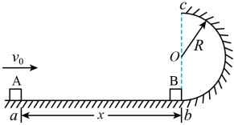

> [!ti] *26秋北京市第一六六中学高三物理试卷第17题*
> 如图所示，一根长为 $L$ 不可伸长的轻绳一端固定于 $O$ 点，另一端系有一质量为 $m$ 的小球（可视为质点），小球在竖直平面内以 $O$ 点为圆心做圆周运动。已知重力加速度为 $g$，忽略空气阻力的影响。
> 
> （1）若小球经过圆周最高点 $A$ 点时速度大小 $v_0=\sqrt{2gL}$，求：
> 
> a. 小球经过圆周最低点 $B$ 点时的速度大小 $v$；
> 
> b. 小球从 $A$ 点运动至最低点 $B$ 点过程中，其所受合外力的冲量大小 $I$。
> 
> （2）若轻绳能承受的最大拉力为 $F_m=9mg$，当小球运动到最低点 $B$ 点时绳恰好被拉断。已知 $B$ 点距水平地面的高度为 $h$（图中未画出），求小球落地点与 $B$ 点之间的水平距离 $x$。
> 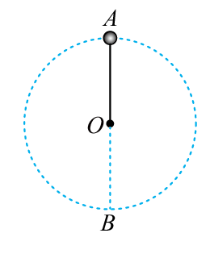

> [!ti] *26秋北京市第一六六中学高三物理试卷第18题*
> 如图所示，内壁粗糙、半径 $R=0.4\ \mathrm{m}$ 的四分之一圆弧轨道 $AB$ 在最低点 $B$ 与光滑水平轨道 $BC$ 相切。质量 $m_2=0.2\ \mathrm{kg}$ 的小球 $b$ 左端连接一轻质弹簧，静止在光滑水平轨道上，另一质量 $m_1=0.2\ \mathrm{kg}$ 的小球 $a$ 自圆弧轨道顶端由静止释放，运动到圆弧轨道最低点 $B$ 时对轨道的压力为小球 $a$ 重力的 2 倍，忽略空气阻力，重力加速度 $g=10\ \mathrm{m/s^2}$。求：
> 
> （1）小球 $a$ 由 $A$ 点运动到 $B$ 点的过程中，摩擦力做功 $W_f$；
> 
> （2）小球 $a$ 通过弹簧与小球 $b$ 相互作用的过程中，弹簧的最大弹性势能 $E_p$；
> 
> （3）小球 $a$ 通过弹簧与小球 $b$ 相互作用的整个过程中，弹簧对小球 $b$ 的冲量 $I$。
> 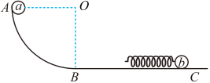

> [!ti] *26秋北京市第一六六中学高三物理试卷第19题*
> 开普勒用二十年的时间研究第谷的行星观测数据，分别于 1609 年和 1619 年发表了下列定律：
> 
> 开普勒第一定律：所有行星绕太阳运动的轨道都是椭圆，太阳处在椭圆的一个焦点上。
> 
> 开普勒第二定律：对任意一个行星来说，它与太阳的连线在相等的时间内扫过的面积相等。
> 
> 开普勒第三定律：所有行星轨道的半长轴 $a$ 的三次方跟它的公转周期 $T$ 的二次方的比都相等，即 $\frac{a^3}{T^2}=k$，$k$ 是一个对所有行星都相同的常量。
> 
> （1）在研究行星绕太阳运动的规律时，将行星轨道简化为一半径为 $r$ 的圆轨道。
> 
> a. 如图所示，设行星与太阳的连线在一段非常非常小的时间 $\Delta t$ 内，扫过的扇形面积为 $\Delta S$。求行星绕太阳运动的线速度的大小 $v$，并结合开普勒第二定律证明行星做匀速圆周运动；（提示：扇形面积 $=\frac{1}{2}\times$ 半径 $\times$ 弧长）
> 
> b. 请结合开普勒第三定律、牛顿运动定律，证明太阳对行星的引力 $F$ 与行星轨道半径 $r$ 的平方成反比。
> 
> （2）牛顿建立万有引力定律之后，人们可以从动力学的视角，理解和解释开普勒定律。已知太阳质量为 $M_S$、行星质量为 $M_P$、太阳和行星间距离为 $L$、引力常量为 $G$，不考虑其它天体的影响。
> 
> a. 通常认为，太阳保持静止不动，行星绕太阳做匀速圆周运动。请推导开普勒第三定律中常量 $k$ 的表达式；
> 
> b. 实际上太阳并非保持静止不动，如图所示，太阳和行星绕二者连线上的 $O$ 点做周期均为 $T_0$ 的匀速圆周运动。依照此模型，开普勒第三定律形式上仍可表达为 $\frac{L^3}{T_0^2}=k'$。请推导 $k'$ 的表达式（用 $M_S$、$M_P$、$L$、$G$ 和其它常数表示），并说明 $k'\approx k$ 需满足的条件。
> 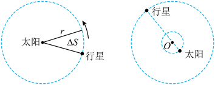

> [!ti] *26秋北京市第一六六中学高三物理试卷第20题*
> 热气球的飞行原理是通过改变热气球内气体的温度以改变热气球内气体的质量，从而控制热气球的升降，可认为热气球在空中运动过程中体积及形状保持不变。设热气球在体积、形状不变的条件下受到的空气阻力 $f=kv^2$，其方向与热气球相对空气的速度 $v$ 相反，$k$ 为已知常量。已知热气球的质量（含载重及热气球内的热空气）为 $m$ 时，可悬浮在无风的空中，重力加速度为 $g$。不考虑热气球所处环境中空气密度的变化。
> 
> （1）若热气球初始时悬浮在无风的空中，现将热气球的质量调整为 $0.9m$（忽略调整时间），设向上为正，请在图中定性画出此后热气球的速度 $v$ 随时间 $t$ 变化的图像。
> 
> （2）若热气球初始时处在速度为 $v_0$ 的水平气流中，且相对气流静止。将热气球质量调整为 $1.1m$（忽略调整时间），热气球下降距离 $h$ 时趋近平衡（可视为达到平衡状态）。
> 
> ①求热气球平衡时的速率 $v_1$ 及下降距离 $h$ 过程中空气对热气球做的功 $W$。
> 
> ②热气球达到平衡速率 $v_1$ 后，若水平气流速度突然变为 0，经过时间 $t$ 热气球再次达到平衡状态，求该过程中空气对热气球的冲量大小 $I$。
> 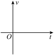

