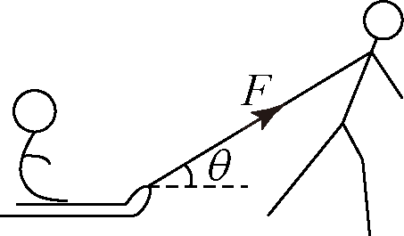
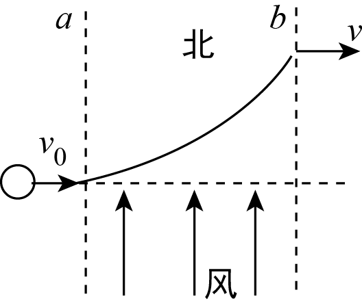
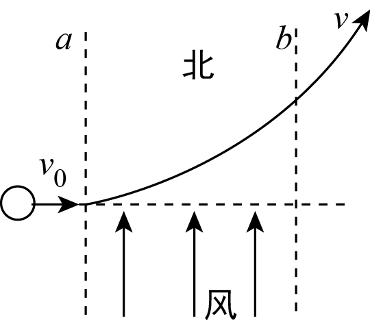

# 学生版

## 1. 2019~2020学年北京高一下学期单元测试第6题

> [!ti] *2019~2020学年北京高一下学期单元测试第6题*
> 如图所示，坐在雪橇上的人与雪橇的总质量为 $m$ ，在与水平面成 $theta$ 角的恒定拉力 $F$ 作用下，沿水平地面向右移动了一段距离 $s$ ．已知雪橇与地面间的动摩擦因数为 $mu$ ，则雪橇受到的（ ）
> 
> > [!opts2]
> > - A. 支持力做功为 $mgs$
> > - B. 重力做功为 $mgs$
> > - C. 拉力做功为 $Fscos theta$
> > - D. 滑动摩擦力做功为 $mu mgs$

## 2. 2023~2024学年北京海淀区中国人民大学附属中学高一上学期期末第2题3分

> [!ti] *2023~2024学年北京海淀区中国人民大学附属中学高一上学期期末第2题3分*
> 风洞实验室，是以人工的方式产生并且控制气流，用来模拟飞行器或实体周围气体的流动情况，它是进行空气动力实验常用的工具．一小球在光滑的水平面上以 $v _ { 0 }$ 穿过风洞中的一段风带(图中虚线 $a、b$ 之间的区域，其余区域无风),经过风带时风会给小球一个与 $v_{0}$ 方向垂直、水平向北的恒力，下面四幅俯视图中，小球穿过风带过程的运动轨迹及穿过风带后的速度方向表示正确的是
> > [!opts2]
> > - A. 
> > - B. 
> > - C. 
> > - D. 

## 3. 2024~2025学年北京西城区西城外国语学校高一下学期期中第8题

> [!ti] *2024~2025学年北京西城区西城外国语学校高一下学期期中第8题*
> 如图所示，餐桌中心有一个圆盘，可绕其中心轴转动，现在圆盘上放相同的茶杯，茶杯可看作质点，茶杯与圆盘间动摩擦因数为µ。现使圆盘匀速转动，则下列说法正确的是（　　）
> 
> > [!opts2]
> > - A. 每个茶杯均受重力、支持力、静摩擦力、向心力四个力作用
> > - B. 如果茶杯相对圆盘静止，茶杯受到圆盘的摩擦力沿半径指向圆心
> > - C. 若缓慢增大圆盘转速，离中心轴近的空茶杯相对圆盘先滑动
> > - D. 若缓慢增大圆盘转速，到中心轴距离相同的空茶杯比有茶水茶杯相对圆盘先滑动
