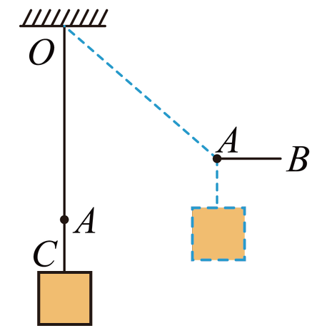

# 2025-2026北京市第一七一中学高一下期中

## 题目来源

- [2025-2026北京市第一七一中学高一下期中](https://xbresource.jiaoyanyun.com/#/boutique/search?sid=4&gid=3&queId=ff733ea130f1458f98c26e92610d77e1)  
  省市: 北京；区县: 北京市；学校: 第一七一中学；年级: 高一；学期: 下期；考试: 期中
- [全国高三专题练习（24版高中总复习第二轮（新教材新高考））第11题](https://xbresource.jiaoyanyun.com/#/boutique/search?sid=4&gid=3&queId=ff733ea130f1458f98c26e92610d77e1)  
  省市: 全国；年级: 高三；考试: 专题练习；备注: （24版高中总复习第二轮（新教材新高考））；题号: 11
- [2022~2023学年湖南长沙宁乡市高一上学期期末第6题](https://xbresource.jiaoyanyun.com/#/boutique/search?sid=4&gid=3&queId=ff733ea130f1458f98c26e92610d77e1)  
  学年: 2022~2023；省市: 湖南；城市: 长沙；区县: 宁乡市；年级: 高一；学期: 上学期；考试: 期末；题号: 6
- [全国高三专题练习《第一讲 力与物体的平衡》（24版高中总复习第二轮（新教材新高考））第11题](https://xbresource.jiaoyanyun.com/#/boutique/search?sid=4&gid=3&queId=ff733ea130f1458f98c26e92610d77e1)

## 标签

- #物理
- #选择题
- #北京
- #北京市
- #第一七一中学
- #高一
- #下期
- #期中
- #全国
- #高三
- #专题练习
- #2022-2023学年
- #湖南
- #长沙
- #宁乡市
- #上学期
- #期末

## 题目

> [!ti] *2025-2026北京市第一七一中学高一下期中*
> 如图所示，物体所受重力为40N，用细绳 $8$ 悬于O点，绳 $8$ 所能承受的最大拉力为50N。现用细绳绑住绳 $8$ 的A点，再用水平力向右方缓慢牵引A点，下列说法正确的是（　　）
> 
> > [!opts2]
> > - A. 水平力向右一定恒力
> > - B. 逐渐右拉的过程中，AB绳拉力大小逐渐减小
> > - C. 绳的拉力为10N时， $8$ 段刚被拉断
> > - D. 绳的拉力为30N时， $8$ 段刚被拉断

## 答案

D

## 详解

设 $OA$ 段绳与竖直方向夹角为 $\theta$ ，则根据结点A处于动态平衡状态对结点A受力分析可以知三段绳上的力 ${{F}_{OA}}$ 、 ${{F}_{AB}}$ 、 ${{F}_{AC}}$ 分别为
${{F}_{AC}}=G=40\text{N}$ ， ${{F}_{OA}}=\frac{{{F}_{AC}}}{\cos \theta }$ ， ${{F}_{AB}}={{F}_{AC}}\tan \theta$ 
A．水平向右的力 ${{F}_{AB}}$ 随 $OA$ 绳与竖直方向夹角的增大而增大。故A为错误选项；B为错误选项；
CD． $OA$ 段刚被拉断时 ${{F}_{OA}}=50\text{N}$ ，则 $\cos \theta =\frac{4}{5}$ ，即 $\theta =37{}^\circ$ 。此时
${{F}_{AB}}={{F}_{AC}}\tan \theta =30\text{N}$ 
故C为错误选项，D为正确选项。
故答案为D。

## 检索信息

- 相似度: 17.77
- 选择依据: 已搜索到候选题，直接采用评分最高的一条
- 搜索词: $C$ $力8$
