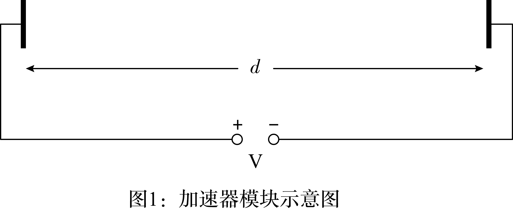
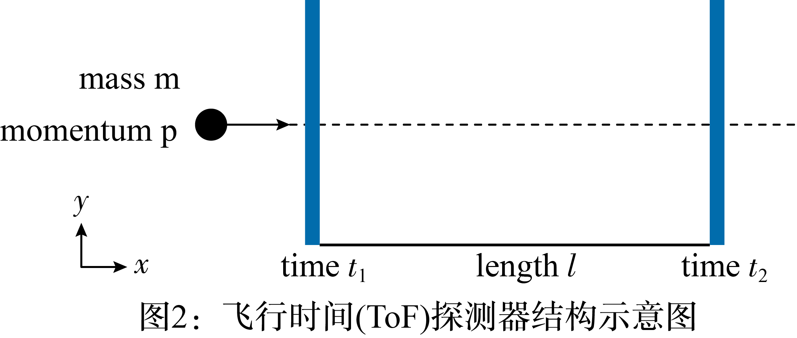
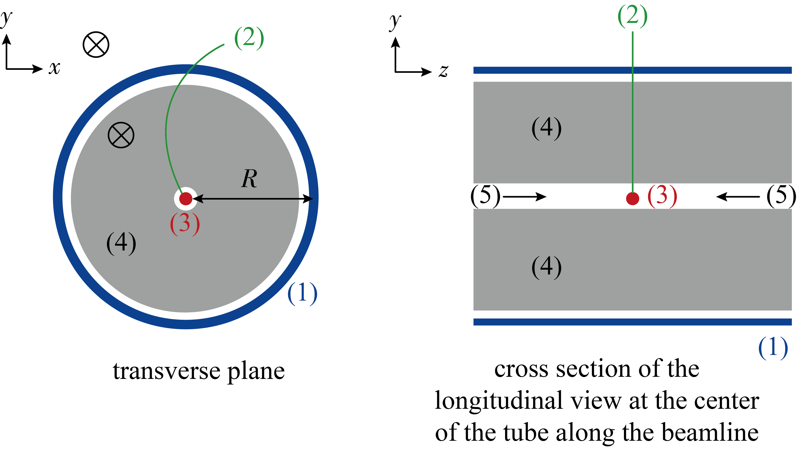

# 2025-2026北京市第一七一中学高一下期中

## 题目来源

- [2025-2026北京市第一七一中学高一下期中](https://xbresource.jiaoyanyun.com/#/boutique/search?sid=4&gid=3&queId=8046297d590c47a89089475741421371)  
  省市: 北京；区县: 北京市；学校: 第一七一中学；年级: 高一；学期: 下期；考试: 期中
- [2016学年竞赛第3题](https://xbresource.jiaoyanyun.com/#/boutique/search?sid=4&gid=3&queId=8046297d590c47a89089475741421371)  
  学年: 2016；考试: 竞赛；题号: 3
- [2016年第47届全国高中物理竞赛竞赛第3题](https://xbresource.jiaoyanyun.com/#/boutique/search?sid=4&gid=3&queId=8046297d590c47a89089475741421371)

## 标签

- #物理
- #复合题
- #北京
- #北京市
- #第一七一中学
- #高一
- #下期
- #期中
- #2016学年
- #竞赛
- #圆周运动
- #功
- #功率
- #动量
- #电场
- #磁场

## 题目

> [!ti] *2025-2026北京市第一七一中学高一下期中*
> 大型强子对撞机
> 在开始答题前，请阅读另外一个信封中的理论考试指南．
> 本题讨论在欧洲核子研究中心（ $\text{CERN}$ ）的粒子加速器： $\text{LHC}$ （大型强子对撞机）中的物理问题． $\text{CERN}$ 是世界上最大的粒子物理实验室．它的主要研究目标是观测自然的基本规律．通过强磁场下的加速器圆环，两束粒子加速到很高的能量，然后相互碰撞．粒子在加速器圆周上的分布虽然是不均匀的，但是它们会聚集形成所谓的粒子束．由此碰撞而产生的新的粒子，可以通过一些大型探测器进行观测．表 $1$ 给出了 $\text{LHC}$ 的一些参数．
> $\text{LHC}$ 圆环
> 圆环的周长 $\text{26659 m}$ 
> 质子流包含的束数 $2808$ 
> 每一束包含的质子数目 $1.15\times {{10}^{11}}$ 
> 质子流
> 质子的能量 $7\text{.00 TeV}$ 
> 质心能量 $14\text{.0 TeV}$ 
> 表 $1$ ： $\text{LHC}$ 相关参数的典型值
> 粒子物理学家对能量、动量和质量采取简便的单位: 能量以电子伏特【 $\text{eV}$ 】为单位．根据定义， $\text{1 eV}$ 是一个带有基本电荷电量 $\text{e}$ 的粒子穿过一伏特的电位差后所获得的能量．（ $\text{1 eV }= 1.602\cdot {{10}^{-19}}\text{ kg }{{\text{m}}^2}/{{\text{s}}^2}$ ．）
> 动量以 $\frac{\text{eV}}{c}$ 为单位，质量以 $\frac{\text{eV}}{{{c}^2}}$ 为单位，这里 $\text{c}$ 是真空中的光速．因为 $\text{1ev}$ 是相当小的能量，粒子物理学家通常使用 $\text{MeV}(\text{1 MeV=}{{10}^6}\text{ eV})$ 、 $\text{GeV}(\text{1 GeV}=1{0^9}\text{ eV})$ 和 $\text{TeV}(\text{1 TeV}=1{0^{12}}\text{ eV})$ ．
> 题目的（1）部分研究质子或电子的加速．（2）部分关注于如何识别欧洲核子研究中心碰撞产生的各种粒子．
> (1)
> $\text{LHC}$ 加速器
> 加速：
> 假设质子在加速电压 $V$ 下被加速到速度非常接近光速，忽略由于辐射和与其他粒子碰撞引起的任何能量损失．
> (1)
> 求质子的末速度 $v$ 的确切表达式，以加速电压 $V$ 和一些物理常量表示．
> (2)
> 设计一个未来在欧洲核子研究中心的实验计划，利用 $\text{LHC}$ 产生的质子与能量为 $60\text{.0 GeV}$ 的电子碰撞．
> 对于具有高速能量和低质量的粒子，末速度 $v$ 与光速的相对偏差 $\Delta =\frac{(c-v)}{c}$ 是很小的．求出 $\Delta$ 的一阶近似表达式，用加速电压 $V$ 和一些物理常数来表示．对于能量为 $60\text{.0 GeV}$ 电子，计算 $\Delta$ 的值．
> (3)
> 我们现在接着研究 $\text{LHC}$ 中的质子．假设质子束流的截面是圆形．
> 要使质子束在保持在圆形轨道上，求出均匀磁感应强度 $B$ 的表达式．表达式应该只包含质子的能量 $E$ ，周长 $L$ ，一些基本常数和数字．如果能保证对计算结果的影响小于有效数字的最少位数物理量所给出的精度，你可以采取适当的近似．
> 要获得 $E=7\text{.00 TeV}$ 能量的质子，求出均匀磁感应强度 $B$ 的值，计算中忽略质子间的相互碰撞．
> (4)
> 辐射功率
> 加速带电粒子以电磁波的形式向外辐射能量．一个具有恒定角速度做圆周运动的带电粒子，其辐射功率 ${{P}_{\text{rad}}}$ 仅仅只取决于加速度 $a$ , 所带电荷 $q$ ，光速 $c$ 和自由空间的介电常数 ${{\varepsilon }_0}$ ．
> 用量纲分析法，求出辐射功率 ${{P}_{\text{rad}}}$ 的表达式．
> (5)
> 真实的辐射功率公式还包含一个因子 $\frac1{6\pi }$ 并且由全相对论可以推导出，还需要再乘以一个额外因子 ${{\gamma }^4}$ ，这里 $\gamma ={{\left( 1-\frac{{{v}^2}}{{{c}^2}} \right)}^{-\frac12}}$ ．
> $\text{LHC}$ 的一个质子的能量 $E=7\text{.00 TeV}$ （在表 $1$ 中已给出），计算这个质子的总辐射功率 ${{P}_{\text{tot}}}$ 的值，计算中可以使用适当的近似．
> (6)
> 直线加速：
> 在 $\text{CERN}$ ，质子由静止状态，经过长度 $d=30\text{.0 m}$ ，电位差 $V=\text{500 MV}$ 的直线加速器加速．假定加速电场是均匀的，这个线性加速器由两个平板组成，图 $1$ 为其示意图．
> 求出质子通过这个场的时间 $T$ 的数值．
> 
> (2)
> 粒子的识别
> 飞行时间
> 对碰撞中生成的高能粒子进行识别，对解释碰撞相互作用过程是很重要的．识别粒子的一个简单的方法，是测量一个已知动量的粒子通过长度为 $l$ 的一种叫做飞行时间（ $\text{ToF}$ ）探测器所需要的时间（ $t$ ）．通过探测器的典型粒子的质量见表 $2$ ．
> 粒子
> 质量 $\left[ \text{MeV/}{{\text{c}}^2} \right]$ 
> 氘核
> $1876$ 
> 质子
> $938$ 
> 带电 $\text{K}$ 介子
> $494$ 
> 带电 $\pi$ 介子
> $140$ 
> 电子
> $0.511$ 
> 表 $2$ ： 各种粒子及其质量 ．
> 
> 图中英文含义： $\text{mass}$ 质量， $\text{momentum}$ 动量， $\text{time}$ 时间， $\text{length}$ 长度
> (1)
> 假设带有基本电荷电量 $e$ 的粒子以接近光速 $c$ 的速度，沿直线匀速通过 $\text{ToF}$ 探测器，并且飞行的直线轨迹与探测器的两个探测平面垂直（见图 $2$ ）．求粒子的静止质量 $m$ 的函数表达式，用动量 $p$ 、飞行长度 $l$ 和飞行时间 $t$ 表示．
> (2)
> 要准确分辨动量均为 $1\text{.00 GeV/c}$ 的带电 $k$ 介子和带电 $\pi$ 介子，计算 $\text{ToF}$ 探测器所需的最小长度 $l$ ．为了很好区分这两种粒子，要求飞行时间的差异大于 $\text{ToF}$ 探测器分辨时间的三倍．对于 $\text{ToF}$ 探测器，分辨时间的典型值是 $\text{150 ps(1 ps}={{10}^{-12}}\text{s)}$ ．
> 在后面的题目中，对产生粒子进行探测的典型 $\text{LHC}$ 探测器分为两个：一个是轨迹探测器，另一个是 $\text{ToF}$ 探测器．图 $3$ 在与质子束流平行的和垂直的两个平面内展示了装置结构．两个探测器是位于相互作用区的一些管子，粒子束流通过这些管子的中心．轨迹探测器测量带电粒子通过磁场时的运行轨迹，磁场的方向平行于质子束流的方向．通过运行轨道的半径 $r$ 可以确定粒子的横向动量 ${{\text{p}}_{\text{T}}}$ ．因为碰撞时间已知， $\text{ToF}$ 探测器只需要用一个管子进行飞行时间测量（从碰撞到被 $\text{ToF}$ 管探测到所经过的时长）．这个 $\text{ToF}$ 管位于轨道探测器后面．在本任务中，你可以假设所有由碰撞产生的粒子，其运动方向垂直于质子束流，这意味着新生成的粒子没有沿着质子流方向的纵向动量．
> 
> （1）— $\text{ToF}$ 管
> （2）— 轨迹
> （3）—碰撞点
> （4）—轨迹探测管
> （5）— 质子流
> $\otimes$ — 磁场
> 图 $3$ ：具有一个轨迹探测器和一个 $\text{TOF}$ 探测器的粒子探测实验装置结构图．两个探测器是以碰撞区为中心分布的一些管子．左图：与束流方向垂直的截面上的横向示意图；右图：与束流方向平行的截面上的纵向示意图．
> 图中英文含义：transverse plane 横向垂直平面，cross section of the longitudinal view at the center along the beam line of the tube 沿束流方向的过探测管中心的纵向视图
> (3)
> 求粒子质量表达式，用磁感应强度 $B$ ， $\text{ToF}$ 管半径 $R$ ，基本常数，轨迹半径 $r$ 和飞行时间 $t$ （后两个物理量可以测量得到）来表示．
> (4)
> 我们探测到四种粒子，现在要对它们进行辨别．轨迹探测器的磁感应强度为 $B=0\text{.500 T}$ ． $\text{ToF}$ 管的半径 $R$ 为 $3\text{.70 m}$ ．以下是测量结果（ $\text{1 ns}={{10}^{-9}}\text{ s}$ ）：
> 粒子
> 轨迹半径 $r\left[ m \right]$ 
> 飞行时间 $t\left[ \text{ns} \right]$ 
> A
> $5.10$ 
> $20$ 
> B
> $2.94$ 
> $14$ 
> C
> $6.06$ 
> $18$ 
> D
> $2.31$ 
> $25$ 
> 通过对粒子质量的计算，分辨出这四种粒子．

## 答案

(1) (1) 
见解析
(2) 见解析
(3) 见解析
(4) 见解析
(5) 见解析
(6) 见解析
(2) (1) 见解析
(2) 见解析
(3) 见解析
(4) 见解析

## 详解

(1) (1) 
Find the exact expression for the final velocity $v$ of the protons as a function of the accelerating voltage $V$ , and fundamental constan ts.
Conservation of energy:
${{m}_{p}}\cdot {{c}^{2}}+V\cdot e={{m}_{p}}\cdot {{c}^{2}}\cdot \gamma =\frac{{{m}_{p}}\cdot {{c}^{2}}}{\sqrt{1-\frac{{{v}^{2}}}{{{c}^{2}}}}}$ 
Penalties
No or incorrect total energy
Missin g rest mass
Solve for velocity:
$v=c\cdot \sqrt{1-{{\left( \frac{{{m}_{p}}\cdot {{c}^{2}}}{{{m}_{p}}\cdot {{c}^{2}}+V\cdot e} \right)}^{2}}}$ 
without proton rest mass:
$V\cdot e\simeq {{m}_{p}}\cdot {{c}^{2}}\cdot \gamma =\frac{{{m}_{p}}\cdot {{c}^{2}}}{\sqrt{1-\frac{{{v}^{2}}}{{{c}^{2}}}}}$ 
Solve for velocity:
$v=c\cdot \sqrt{1-{{\left( \frac{{{m}_{p}}\cdot {{c}^{2}}}{V\cdot e} \right)}^{2}}}$ 
Classical solution:
$v=\sqrt{\frac{2\cdot e\cdot V}{{{m}_{p}}}}$ ．
(2) For particles with high energy and low rest mass the relative deviation
$\Delta ~=\frac{(c-v)}{c}$ of the final velocity $v$ from the speed of light is very small. Find a suitable approximation for $\Delta$ and calculate $\Delta$ for electrons with an energy of $60\text{.0 GeV}$ .
velocity (from previous question):
$v=c\cdot \sqrt{1-{{\left( \frac{{{m}_{e}}\cdot {{c}^{2}}}{{{m}_{e}}\cdot {{c}^{2}}+V\cdot e} \right)}^{2}}}$ or $c\cdot \sqrt{1-{{\left( \frac{{{m}_{e}}\cdot {{c}^{2}}}{V\cdot e} \right)}^{2}}}$ 
relative difference:
$\to \Delta \simeq \frac{1}{2}{{\left( \frac{{{m}_{e}}\cdot {{c}^{2}}}{{{m}_{e}}\cdot {{c}^{2}}+V\cdot e} \right)}^{2}}$ or $\frac{1}{2}{{\left( \frac{{{m}_{e}}\cdot {{c}^{2}}}{V\cdot e} \right)}^{2}}$ 
relative difference
$\Delta =3.63\cdot {{10}^{-11}}$ 
classical solution gives no points．
(3) Derive an expression for the uniform magnetic flux density $B$ necessary to keep the proton beam on a circular track. The expression should only contain the energy of the protons $E$ , the circumference $L$ , fundamental constan ts and numbers. You may use suitable approximations if their effect is smaller than the precision given by the least number of significant digits. Calculate the magnetic flux density $B$ for a proton energy of $E=\text{7:00 TeV}$ .
Balance of forces:
$\frac{\lambda \cdot {{m}_{p}}\cdot {{v}^{2}}}{r}=\frac{{{m}_{p}}\cdot {{v}^{2}}}{r\cdot \sqrt{1-\frac{{{v}^{2}}}{{{c}^{2}}}}}=e\cdot v\cdot B$ mp v2
In case of a mistake, partial points can be given for intermediate steps (up to max $0.2$ ).
Examples:
Example: Lorentz force
Example: $\frac{\gamma \cdot {{m}_{p}}\cdot {{v}^{2}}}{r}$ 
Energy: $E=(\gamma -1)\cdot {{m}_{p}}\cdot {{c}^{2}}\simeq \gamma \cdot {{m}_{p}}\cdot {{c}^{2}}\to \gamma =\frac{E}{{{m}_{p}}{{c}^{2}}}$ 
Therefore: $\frac{E\cdot v}{{{c}^{2}}\cdot r}=e\cdot B$ 
With
$v\simeq c$ and $r=\frac{L}{2\pi }$ 
follows:
$\to B=\frac{2\pi \cdot E}{e\cdot c\cdot L}$ 
Solution:
$B=5\text{.50T}$ 
Penalty for $<{}$ $2$ or $>4$ significant digits
Calculation without approximations is also correct but does not give more points
$B=\frac{2\pi \cdot {{m}_{p}}\cdot c}{e\cdot L}\cdot \sqrt{{{\left( \frac{E}{{{m}_{p}}\cdot {{c}^{2}}} \right)}^{2}}-{{\left( 1+\frac{m\cdot {{c}^{2}}}{E} \right)}^{2}}}$ 
Penalty for each algebraic mistake
Classical calulation gives completely wrong result and maximum $0\text{.3 pt}$ 
$\frac{{{m}_{p}}\cdot {{v}^{2}}}{r}=e\cdot v\cdot B$ 
$B=\frac{2\pi }{L\cdot e}\sqrt{2\cdot {{m}_{p}}\cdot E}$ 
Penalty for $<{}2$ or $>4$ significant digits．
(4) An accelerated charged particle radiates energy in the form of electromagnetic waves. The radiated power ${{P}_{rad}}$ of a charged particle that circulates with a constan tangular velocity depends only on its acceleration a, its charge $q$ , the speed of light c and the permittivity of free space ${{\in }_{0}}$ . Use a dimensional analysis to find an expression for the radiated power ${{P}_{rad}}$ .
Ansatz:
${{P}_{rad}}={{a}^{\alpha }}\cdot {{q}^{\beta }}\cdot {{c}^{\gamma }}\cdot \in _{0}^{\delta }$ 
Dimensions: $~\left[ \text{a} \right]=\text{m}{{\text{s}}^{-2}}$ , $~\left[ \text{q} \right]\text{=C=A}s$ , $\left[ \text{c} \right]=\text{m}{{\text{s}}^{-1}}$ ,
$\left[ {{\in }_{0}} \right]=\text{As}{{\left( \text{Vm} \right)}^{-1}}={{\text{A}}^{2}}{{\text{s}}^{2}}{{\left( \text{N}{{\text{m}}^{2}} \right)}^{-1}}={{\text{A}}^{2}}{{\text{s}}^{4}}{{\left( \text{kg}{{\text{m}}^{3}} \right)}^{-1}}$ 
All dimensions correct
Three dimensions correct
Two dimensions correct
if dimensions: $\text{N}$ and Coulomb $~\left[ {{\in }_{0}} \right]= {{\text{C}}^{2}}{{\left( \text{N}{{\text{m}}^{2}} \right)}^{-1}}$ 
$\frac{{{\text{m}}^{\alpha }}}{{{\text{s}}^{2\alpha }}}\cdot {{\text{C}}^{\beta }}\cdot \frac{{{\text{m}}^{\gamma }}}{{{\text{s}}^{\gamma }}}\cdot \frac{{{\text{C}}^{2\delta }}}{{{\text{N}}^{\delta }}\cdot {{\text{m}}^{2\delta }}}=\frac{\text{N}\cdot \text{m}}{\text{s}}$ 
From this follows:
$\text{N:}\to \delta =-1$ , $\text{C}:\to \beta +2\cdot \delta =0$ , $\text{m}:\to \alpha +\gamma -2\delta =1$ , $\text{s}:\to 2\cdot \alpha +\gamma =1$ 
Two equations correct
And therefore:
$\to \alpha =2$ , $\beta =2$ , $\gamma =-3$ , $\delta =-1$ 
if dimensions: $\text{N}$ and As $~\left[ {{\in }_{0}} \right]={{\text{A}}^{2}}{{\text{s}}^{2}}{{\left( \text{N}{{\text{m}}^{2}} \right)}^{-1}}$ 
$\frac{{{\text{m}}^{\alpha }}}{{{\text{s}}^{2\alpha }}}\cdot {{\text{A}}^{\beta }}\cdot {{\text{s}}^{\beta }}\cdot \frac{{{\text{m}}^{\gamma }}}{{{\text{s}}^{\gamma }}}\cdot \frac{{{\text{A}}^{2\delta }}\cdot {{\text{s}}^{4\delta }}}{\text{k}{{\text{g}}^{\delta }}\cdot {{\text{m}}^{3\delta }}}=\frac{\text{kg}\cdot {{m}^{2}}}{{{s}^{3}}}$ 
From this follows:
$\text{kg}:\to \delta =-1$ , $\text{A}:\to \beta +2\cdot \delta =0$ , $\text{m}:\to \alpha +\gamma -3\delta =2$ ,
$\text{s}:\to -2\cdot \alpha +\beta -\gamma +4\delta =-3$ 
Two equations correct
And therefore:
$\to \alpha =2$ , $\beta =2$ , $\gamma =-3$ , $\delta =-1$ 
Radiated Power:
${{P}_{rad}}\infty \frac{{{a}^{2}}\cdot {{q}^{2}}}{{{c}^{3}}\cdot {{\in }_{0}}}$ 
Other solutions with other units are possible and are accepted
No solution but realise that unit of charge must vanish $\beta =2\delta$ ．
(5) Calculate the total radiated power ${{P}_{tot}}$ of the $\text{LHC}$ for a proton energy of
$E=7\text{.00 TeV}$ (Note table $1$ ). You may use appropriate approximations.
Radiated Power:
${{P}_{rad}}=\frac{{{\gamma }^{4}}\cdot {{a}^{2}}\cdot {{e}^{2}}}{6\pi \cdot {{c}^{3}}\cdot {{\in }_{0}}}$ 
Energy:
$E=(\gamma -1){{m}_{p}}\cdot {{c}^{2}}$ or equally valid $E\simeq \gamma \cdot {{m}_{p}}\cdot {{c}^{2}}$ 
Acceleration:
$a\simeq \frac{{{c}^{2}}}{r}$ with $r=\frac{L}{2\pi }$ 
Therefore: ${{P}_{rad}}={{\left( \frac{E}{{{m}_{p}}{{c}^{2}}}+1 \right)}^{4}}\cdot \frac{{{e}^{2}}\cdot c}{6\pi {{\in }_{0}}\cdot {{r}^{2}}}$ or ${{\left( \frac{E}{{{m}_{p}}{{c}^{2}}} \right)}^{4}}\cdot \frac{{{e}^{2}}\cdot c}{6\pi {{\in }_{0}}\cdot {{r}^{2}}}$ 
(not required ${{P}_{rad}}=7.94\cdot ~{{10}^{-12}}\text{W}$ )
Total radiated power:
${{P}_{tot}}=2~\cdot 2808\cdot ~1.15\cdot ~{{10}^{11}}~\cdot {{P}_{rad}}=5\text{.13kW}$ 
penalty for missin g factor 2 (for the two beams): $-0.1$ 
penalty for wrong numbers $2808$ and/or $1.15\cdot {{10}^{11}}$ (numbers come from table $1$ ): $-0.1$ ．
(6) Determine the time $T$ that the protons need to pass through this field.
2nd Newton’s law
$F=\frac{dp}{dt}$ leads to $\frac{V\cdot e}{d}=\frac{{{p}_{f}}-{{p}_{i}}}{T}$ with ${{p}_{i}}=0$ 
Conservation of energy: ${{E}_{tot}}=m\cdot {{c}^{2}}+e\cdot V$ 
Since
$E_{tot}^{2}={{(m\cdot {{c}^{2}})}^{2}}+{{({{p}_{f}}\cdot c)}^{2}}$ 
$\to {{p}_{f}}=\frac{1}{c}\cdot \sqrt{{{(m\cdot {{c}^{2}}+e\cdot V)}^{2}}-{{(m\cdot {{c}^{2}})}^{2}}}=\sqrt{2e\cdot m\cdot V+{{\left( \frac{e\cdot V}{c} \right)}^{2}}}$ 
$\to T=\frac{d\cdot {{p}_{f}}}{V\cdot e}=\frac{d}{V\cdot e}\sqrt{2e\cdot {{m}_{p}}\cdot V+{{\left( \frac{e\cdot V}{c} \right)}^{2}}}$ 
$T=\text{218ns}$ 
Alternative solution
$\text{2nd}$ Newton’s law
$F=\frac{dp}{dt}$ leads to $\frac{V\cdot e}{d}=\frac{{{p}_{f}}-{{p}_{i}}}{T}$ with ${{p}_{i}}=0$ 
velocity from $\text{A1}$ or from conservation of energy
$v=c\cdot \sqrt{1-{{\left( \frac{{{m}_{p}}\cdot {{c}^{2}}}{{{m}_{p}}\cdot {{c}^{2}}+V\cdot e} \right)}^{2}}}$ 
and hence for $\gamma$ 
$\gamma =\frac{1}{\sqrt{1-\frac{{{v}^{2}}}{{{c}^{2}}}}}=1+\frac{e\cdot V}{{{m}_{p}}\cdot {{c}^{2}}}$ 
$\to {{p}_{f}}=\gamma \cdot {{m}_{p}}\cdot v=\left( 1+\frac{e\cdot V}{{{m}_{p}}\cdot {{c}^{2}}} \right)\cdot {{m}_{p}}\cdot c\cdot \sqrt{1-{{\left( \frac{{{m}_{p}}\cdot {{c}^{2}}}{{{m}_{p}}\cdot {{c}^{2}}+V\cdot e} \right)}^{2}}}$ 
$\to T=\frac{d\cdot {{p}_{f}}}{V\cdot e}=\frac{d\cdot {{m}_{p}}\cdot c}{V\cdot e}\cdot \sqrt{{{\left( \frac{{{m}_{p}}\cdot {{c}^{2}}+e\cdot V}{{{m}_{p}}\cdot {{c}^{2}}} \right)}^{2}}-1}=\frac{d}{V\cdot e}\sqrt{2e\cdot {{m}_{p}}\cdot V+{{\left( \frac{e\cdot V}{c} \right)}^{2}}}$ 
$T=\text{218ns}$ 
Alternative solution: integrate time
Energy increases linearly with distan ce $\text{x}$ 
$E(x)=\frac{e\cdot V\cdot x}{d}$ 
$t=\int{dt=\int_{0}^{d}{\frac{dx}{v(x)}}}$ 
$v(x)=c\cdot \sqrt{1-{{\left( \frac{{{m}_{p}}\cdot {{c}^{2}}}{{{m}_{p}}\cdot {{c}^{2}}+\frac{e\cdot V\cdot x}{d}} \right)}^{2}}}=c\cdot \frac{\sqrt{{{\left( {{m}_{p}}\cdot {{c}^{2}}+\frac{e\cdot V\cdot x}{d} \right)}^{2}}-{{({{m}_{p}}\cdot {{c}^{2}})}^{2}}}}{{{m}_{p}}\cdot {{c}^{2}}+\frac{e\cdot V\cdot x}{d}}$ 
$=c\cdot \frac{\sqrt{{{\left( 1+\frac{e\cdot V\cdot x}{d\cdot {{m}_{p}}\cdot {{c}^{2}}} \right)}^{2}}-1}}{1+\frac{e\cdot V\cdot x}{d\cdot {{m}_{p}}\cdot {{c}^{2}}}}$ 
Substitution : $\xi =\frac{e\cdot V\cdot x}{d\cdot {{m}_{p}}\cdot {{c}^{2}}}\frac{d\xi }{dx}=\frac{e\cdot V}{d\cdot {{m}_{p}}\cdot {{c}^{2}}}$ 
$\to t=\frac{1}{c}\int_{0}^{b}{\frac{1+\xi }{\sqrt{{{(1+\xi )}^{2}}-1}}\frac{d\cdot {{m}_{p}}\cdot {{c}^{2}}}{e\cdot V}d\xi }$ , $b=\frac{e\cdot V}{{{m}_{p}}\cdot {{c}^{2}}}$ 
$1+\xi :=\cos h (s)\frac{d\xi }{ds}=\sin h (s)$ 
$t=\frac{{{m}_{p}}\cdot c\cdot d}{e\cdot V}\int{\frac{\cos h (s)\cdot \sin h (s)ds}{\sqrt{{{\cos h }^{2}}(s)-1}}=\frac{{{m}_{p}}\cdot c\cdot d}{e\cdot V}\left[ \sin h (s) \right]_{b1}^{b2}}$ 
with $b1={{\cos h }^{-1}}(1)$ , ${{b}_{2}}={{\cos h }^{-1}}\left( 1+\frac{e\cdot V}{{{m}_{p}}\cdot {{c}^{2}}} \right)$ 
$T=\text{218ns}$ 
Alternative: differential equation
$F=\frac{dp}{dt}$ 
$\to \frac{V\cdot e}{d}=\frac{d}{dt}\left( \frac{m\cdot v}{\sqrt{1-\frac{{{v}^{2}}}{{{c}^{2}}}}} \right)=\frac{m\cdot a\left( 1-\frac{{{v}^{2}}}{{{c}^{2}}} \right)+m\cdot a\frac{{{v}^{2}}}{{{c}^{2}}}}{\left( 1-\frac{{{v}^{2}}}{{{c}^{2}}} \right)}={{\gamma }^{3}}\cdot m\cdot a$ 
$a=\ddot{s}=\frac{V\cdot e}{d\cdot m}{{\left( 1-\frac{{{{\dot{s}}}^{2}}}{{{c}^{2}}} \right)}^{\frac{3}{2}}}$ 
Ansatz : $s(t)=\sqrt{{{i}^{2}}\cdot {{t}^{2}}+k}-l$ with boundary conditions $s(0)=0$ ， $v(0)=0$ 
$\to s(t)=\frac{c}{V\cdot e}\left( \sqrt{{{e}^{2}}\cdot {{V}^{2}}\cdot {{t}^{2}}+{{c}^{2}}\cdot {{m}^{2}}\cdot {{d}^{2}}}-c\cdot m\cdot d \right)$ 
$s=d\to T=\frac{d}{V\cdot e}\sqrt{{{\left( \frac{V\cdot e}{c} \right)}^{2}}+2V\cdot e\cdot m}$ 
$T=\text{218ns}$ 
classical solution:
$F=\frac{V\cdot e}{d}\to$ acceleration $a=\frac{F}{{{m}_{p}}}=\frac{V\cdot e}{{{m}_{p}}\cdot d}$ 
$d=\frac{1}{2}\cdot a\cdot {{T}^{2}}\to T=\sqrt{\frac{2d}{a}}$ 
And hence for the time
$T=d\cdot \sqrt{\frac{2\cdot {{m}_{p}}}{V\cdot e}}$ 
$T=\text{194ns }$ ．
(2) (1) Express the particle rest mass m in terms of the momentum $p$ , the flight length $l$ and the flight time $t$ assuming that the particles with elementary charge e travel with velocity close to c on straight tracks in the ToF detector and that it travels perpendicular to the two detection planes (see Figure $2$ ).
with velocity
$v=\frac{l}{t}$ 
relativistic momentum
$p=\frac{m\cdot v}{\sqrt{1-\frac{{{v}^{2}}}{{{c}^{2}}}}}$ 
Gets $p=\frac{m\cdot l}{t\cdot \sqrt{1-\frac{{{l}^{2}}}{{{t}^{2}}\cdot {{c}^{2}}}}}$ 
$\to$ mass $m=\frac{p\cdot t}{l}\cdot \sqrt{1-\frac{{{l}^{2}}}{{{t}^{2}}\cdot {{c}^{2}}}}=\frac{p}{l\cdot e}\cdot \sqrt{{{t}^{2}}\cdot {{c}^{2}}-{{l}^{2}}}$ 
Alternative with flight distan ce: $~l$ , flight time $t$ gets:
$t=\frac{l}{(c\cdot \beta )}$ 
relativistic momentum
$p=\frac{m\cdot \beta \cdot c}{\sqrt{1-{{\beta }^{2}}}}$ 
therefore the velocity:
$\beta =\frac{p}{\sqrt{{{m}^{2}}\cdot {{c}^{2}}+{{p}^{2}}}}$ 
Insert into the expression for $t$ :
$t=l\frac{\sqrt{{{m}^{2}}\cdot {{c}^{2}}+{{p}^{2}}}}{c\cdot p}$ 
$\to$ mass:
$m=\sqrt{{{\left( \frac{p\cdot t}{l} \right)}^{2}}-{{\left( \frac{p}{c} \right)}^{2}}}=\frac{p}{l\cdot c}\sqrt{{{(t\cdot c)}^{2}}-{{(l)}^{2}}}$ 
non-relativistic solution:
flight time: $t=\frac{l}{v}$ velocity:
$v=\frac{p}{m}\to t=\frac{l\cdot m}{p}$ and $m=\frac{p\cdot t}{l}$ 
this solution gives no points．
(2) Calculate the minimal length of a $\text{ToF}$ detector that allows to safely distinguish a charged kaon from a charged pion given both their momenta are measured to be $1\text{.00GeV/c}$ . For a good separation it is required that the difference in the time-of-flight is larger than three times the time resolution of the detector. The typical resolution of a $\text{ToF}$ detector is $\text{150 ps}$ ( $\text{1 ps}={{10}^{-12}}\text{s}$ ).
Flight time difference between kaon and pion
$\Delta t=\text{450ps}=450\cdot {{10}^{-12}}\text{s }$ 
Flight time difference between kaon and pion
$\Delta t=\frac{l}{cp}\left( \sqrt{m_{\pi }^{2}\cdot {{c}^{2}}+{{p}^{2}}}-\sqrt{m_{K}^{2}\cdot {{c}^{2}}+{{p}^{2}}} \right)=\text{450ps}=450\cdot {{10}^{-12}}\text{s}$ 
$\to l=\frac{\Delta t\cdot p}{\sqrt{m_{K}^{2}+\frac{{{p}^{2}}}{{{c}^{2}}}}-\sqrt{m_{\pi }^{2}+\frac{{{p}^{2}}}{{{c}^{2}}}}}$ 
$\sqrt{m_{K}^{2}+\frac{{{p}^{2}}}{{{c}^{2}}}}=1\text{.115GeV}/{{c}^{2}}$ and $\sqrt{m_{\pi }^{2}+\frac{{{p}^{2}}}{{{c}^{2}}}}=1\text{.010GeV/}{{\text{c}}^{2}}$ 
$l=450\cdot {{10}^{-12}}\cdot \frac{1}{1.115-1.010}\text{s GeV}{{\text{c}}^{2}}\text{/(GeVc)}$ 
$l={{4285.710}^{-12}}\text{s}\cdot c=4285.7\cdot {{10}^{-12}}\cdot 2.998\cdot 1{{0}^{8}}\text{m}=1\text{.28m}$ 
Penalty for $<{}2$ or $>$ 4 significant digits
Non-relativistic solution:
Flight time difference between kaon and pion
$\Delta t=\frac{l}{p}({{m}_{K}}-{{m}_{\pi }})=450ps=450\cdot {{10}^{-12}}\text{s}$ 
length:
$l=\frac{\Delta tp}{{{m}_{K}}-{{m}_{\Pi }}}=\frac{450\cdot {{10}^{-12}}\text{s}\cdot \text{1GeV}/c}{(0.498-0.135)\text{GeV}/{{c}^{2}}}$ 
$l=\frac{450\cdot {{10}^{-12}}}{0.363\cdot cs}=\frac{450\cdot {{10}^{-12}}}{0.363\cdot 2.998\cdot {{10}^{8}}}\text{m}$ 
$l=371.6\cdot {{10}^{-4}}\text{m}=0\text{.372m}$ 
Penalty for $<{}2$ or $>4$ significant digits．
(3) Express the particle mass as a function of the magnetic flux density $B$ , the radius R of the $\text{ToF}$ tube, fundamental constan ts and the measured quantities: radius r of the track and time-of-flight $t$ .
Particle is travelling perpendicular to the beam line hence the track length is given by the length of the arc
Lorentz force→transverse momentum，sin ce there is no longitudinal momentum，the momentum is the same as the transverse momentum
Use formula from B1to calculate the mass track length：length of arc
$l=2\cdot r\cdot a\sin \frac{R}{2\cdot r}$ 
penalty for just taking a straight track( $l=R$ )
partial points for intermediate steps，maximum $0.4$ 
Lorentz force
$\frac{\gamma \cdot m\cdot v_{t}^{2}}{r}=e\cdot {{v}_{t}}\cdot B\to {{p}_{T}}=r\cdot e\cdot B$ 
partial points for intermediate steps，maximum $0.3$ 
longitudinal momentum $=0\to p={{p}_{T}}$ 
momentum
$p=e\cdot r\cdot B$ 
$m=\sqrt{{{\left( \frac{p\cdot t}{l} \right)}^{2}}-{{\left( \frac{p}{c} \right)}^{2}}}=e\cdot r\cdot B\cdot \sqrt{{{\left( \frac{t}{2r\cdot a\sin \frac{R}{2r}} \right)}^{2}}-{{\left( \frac{1}{c} \right)}^{2}}}$ 
partial points for intermediate steps，maximum $0.5$ 
Non-relativistic: track length: length of arc
$l=2\cdot r\cdot a\sin \frac{R}{2\cdot r}$ 
penalty for just taking a straight track ( $l=R$ )
partial points for intermediate steps, maximum $0.4$ 
$m=\frac{p\cdot t}{l}=\frac{e\cdot r\cdot B\cdot t}{2r\cdot a\sin \frac{R}{2r}}=\frac{e\cdot B\cdot t}{2\cdot a\sin \frac{R}{2r}}$ 
partial points for intermediate steps, maximum $~0.3$ ．
(4) Identify the four particles by calculating their mass.
Particle
Radius r $\left[ \text{m} \right]$ 
Time of flight $\left[ \text{ns} \right]$ 
A
$5.10$ 
$20$ 
B
$2.94$ 
$14$ 
C
$6.06$ 
$18$ 
D
$2.32$ 
$25$ 
Particle
Arc
$\left[ \text{m} \right]$ 
$P$ $P$ 
$\left[ \frac{\text{MeV}}{c} \right]$ $\left[ \frac{m\text{kg}}{s} \right]$ 
${{10}^{-19}}$ 
$\begin{matrix} \frac{\text{pt}}{\text{l}} \\ \left[ \frac{\text{MeVs}}{\text{cm}} \right] \\ {{10}^{-6}} \\\end{matrix}$ $\begin{matrix} \frac{\text{pt}}{\text{l}} \\ \left[ \frac{\text{MeVs}}{\text{cm}} \right] \\ {} \\\end{matrix}$ $\begin{matrix} \frac{\text{pt}}{\text{l}} \\ \left[ \text{kg} \right] \\ {{10}^{-27}} \\\end{matrix}$ 
$\begin{matrix} \text{Mass} \\ \left[ \frac{\text{MeV}}{{{c}^{2}}} \right] \\ {} \\\end{matrix}$ $\begin{matrix} \text{Mass} \\ \left[ \text{kg} \right] \\ {{10}^{-27}} \\\end{matrix}$ 
A
$3.786$ 
$764.47$ $4.0855$ 
$4.038$ $1210.6$ $2.158$ 
$938.65$ $1.673$ 
B
$4.002$ 
$440.69$ $2.3552$ 
$1.542$ $462.2$ $0.824$ 
$139.32$ $0.248$ 
C
$3.760$ 
$908.37$ $4.8546$ 
$4.349$ $1303.7$ $2.324$ 
$935.10$ $0.890$ 
D
$4.283$ 
$347.76$ $1.8585$ 
$2.030$ $608.6$ $1.085$ 
$499.44$ $0.890$ 
Particles A and Care protons，B is a Pion and Da Kaon
correct mass and identification：per particle
penalty for correct mass but no or wrong identification for $1$ or $2$ particles
penalty for correct mass but no or wrong identification for $3$ or $4$ particles
Wrong mass，correct momentum：per particle
wrong momentum，correct arc for $3$ or $4$ particles
wrong momentum，correct arc for $1$ or $2$ particles
non relativistic solution $m=\frac{pt}{l}$ Particle identification is not possible
Particle
arc
$\left[ \text{m} \right]$ 
$P$ $P$ 
$\left[ \frac{\text{MeV}}{c} \right]$ $\left[ \frac{m\text{kg}}{s} \right]$ 
${{10}^{-19}}$ 
$\begin{matrix} m=\frac{p\cdot t}{l} \\ \left[ \frac{\text{MeVs}}{\text{cm}} \right] \\ {{10}^{-6}} \\\end{matrix}$ $\begin{matrix} m=\frac{p\cdot t}{l} \\ \left[ \frac{\text{MeV}}{{{c}^{2}}} \right] \\ {} \\\end{matrix}$ $\begin{matrix} m=\frac{p\cdot t}{l} \\ \left[ \text{kg} \right] \\ {{10}^{-27}} \\\end{matrix}$ 
A
$3.786$ 
$764.47$ $4.0855$ 
$4.038$ $1210.6$ $2.158$ 
B
$4.010$ 
$440.69$ $2.3552$ 
$1.542$ $462.2$ $0.824$ 
C
$3.760$ 
$908.37$ $4.8546$ 
$4.349$ $1303.7$ $2.324$ 
D
$4.283$ 
$347.76$ $1.8585$ 
$2.030$ $608.6$ $1.085$ 
correct mass or correct momentum：per particle
wrong momentum，correct arc for $3$ or $4$ particles
Wrong momentum，correct arc for $1$ or $2$ particles．

## 检索信息

- 相似度: 27.88
- 选择依据: 已搜索到候选题，直接采用评分最高的一条
- 搜索词: ! https://storage.simpletex.cn/view/fhocoSMDT9AIs0WP4GfZNRku7wS9Ix4Kc ! https://storage.simpletex.cn/view/fEGu9BALVR3EdG
