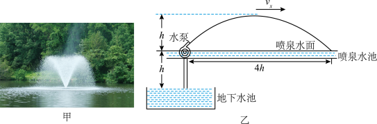

# 2025-2026 北京市第一七一中学高一下期中第 19 题

## 题目来源

- [2025-2026北京市第一七一中学高一下期中](https://xbresource.jiaoyanyun.com/#/boutique/search?sid=4&gid=3&queId=f6ceff2db2a14ef78739de2486c9050a)  
  省市: 北京；区县: 北京市；学校: 第一七一中学；年级: 高一；学期: 下期；考试: 期中
- [2023~2024学年江西高三下学期月考（六校第二次）第14题](https://xbresource.jiaoyanyun.com/#/boutique/search?sid=4&gid=3&queId=f6ceff2db2a14ef78739de2486c9050a)  
  学年: 2023~2024；省市: 江西；年级: 高三；学期: 下学期；考试: 月考；备注: （六校第二次）；题号: 14

## 标签

- #物理
- #试题
- #北京
- #北京市
- #第一七一中学
- #高一
- #下期
- #期中
- #2023-2024学年
- #江西
- #高三
- #下学期
- #月考
- #平抛运动
- #功
- #功率

## 题目

> [!ti] *2025-2026 北京市第一七一中学高一下期中第 19 题*
> 如图甲所示，校园中的“喷泉”从水面以相同倾斜角度和相同速率向四周喷射而出，水滴下落击打水面形成层层涟漪甚为美观。水滴的运动与一般的抛体运动，它的受力情况与平抛运动相同，在水平方向不受力，在竖直方向只受重力，我们可以仿照研究平抛运动的方法来研究一般的抛体运动。图甲中的喷泉水滴的运动轨迹如图乙所示，上升的最大高度为 h，水滴下落在水面的位置距喷水口的水平距离为 4 h。已知喷水口的流量 Q（流量 Q 定义为单位时间内喷出水的体积） ，水的密度为ρ，重力加速度大小为 g。
> （1） 求喷泉中的水从喷水口喷出时的速度大小 v；
> （2）如图乙所示，若该“喷泉”是采用水泵将水先从距水面下深度为 h 处由静止提升至水面，然后再喷射出去。已知：水泵提升水的效率为η，求水泵抽水的平均功率 P。
> 

## 答案

（1） $v=2\sqrt{gh}$ ；（2） $P=\frac{3\rho gQh}{\eta }$

## 详解

【详解】
由运动的合成与分解及平抛运动规律可知，竖直方向上有
$h=\frac{1}{2}gt^{2}$ 
水平方向上有
$2h=v_{\mathrm{x}}t$ 
解得
$v_{x}=\sqrt{2gh}$ 
水从喷口喷出时竖直方向
$v_{\mathrm{y}}=\sqrt{2gh}$ 
所以水从喷口喷出时的速度大小为
$v=\sqrt{{v}_{x}^{2}+{v}_{y}^{2}}=2\sqrt{gh}$ 
（2）在时间 $\Delta t$ 内，喷射出水的质量
$\Delta m=\rho Q\Delta t$ 
在最高点的动能为 $\frac{1}{2}\Delta m{v}_{x}^{2}$ ，由功能关系可得
$\eta P\Delta t=\Delta mg2h+\frac{1}{2}\Delta m{v}_{x}^{2}$ 
解得
$P=\frac{3\rho gQh}{\eta }$

## 检索信息

- 相似度: 58.77
- 选择依据: 已搜索到候选题，直接采用评分最高的一条
- 搜索词: $ A$ 19. 如图甲所示 校园中的“喷泉”从水面以相同倾斜角度和速度大小喷射而出 水滴下落击打水面形成层层涟漪甚为美观. 水滴的运动 它的要力情况与平地运动相同 在水平方向不受力 在竖直方向只受重力 我们可以仿照研究平抛运动的方法来研究
