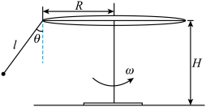

# 2025-2026北京市第一七一中学高一下期中第214题

## 题目来源

- [2025-2026北京市第一七一中学高一下期中第214题](https://xbresource.jiaoyanyun.com/#/boutique/search?sid=4&gid=3&queId=3ce8fb4aca90479abe4c8704cc6bd6f5)  
  省市: 北京；区县: 北京市；学校: 第一七一中学；年级: 高一；学期: 下期；考试: 期中；题号: 214
- [2023~2024学年黑龙江哈尔滨高一下学期期中（五校4月）第15题18分](https://xbresource.jiaoyanyun.com/#/boutique/search?sid=4&gid=3&queId=3ce8fb4aca90479abe4c8704cc6bd6f5)  
  学年: 2023~2024；省市: 黑龙江；城市: 哈尔滨；年级: 高一；学期: 下学期；考试: 期中；备注: （五校4月）；题号: 15；分值: 18
- [2023~2024学年河南商丘高一下学期期中第15题](https://xbresource.jiaoyanyun.com/#/boutique/search?sid=4&gid=3&queId=3ce8fb4aca90479abe4c8704cc6bd6f5)  
  学年: 2023~2024；省市: 河南；城市: 商丘；年级: 高一；学期: 下学期；考试: 期中；题号: 15
- [2023~2024学年6陕西安康高新区安康市高新中学高一下学期月考第16题12分](https://xbresource.jiaoyanyun.com/#/boutique/search?sid=4&gid=3&queId=3ce8fb4aca90479abe4c8704cc6bd6f5)  
  学年: 2023~2024；月份: 6；省市: 陕西；城市: 安康；区县: 高新区；学校: 安康市高新中学；年级: 高一；学期: 下学期；考试: 月考；题号: 16；分值: 12
- [2023~2024学年全国高一单元测试（【单元测试·能力提升卷】单元速记·巧练（人教版2019必修第二册））第18题](https://xbresource.jiaoyanyun.com/#/boutique/search?sid=4&gid=3&queId=3ce8fb4aca90479abe4c8704cc6bd6f5)  
  学年: 2023~2024；省市: 全国；年级: 高一；考试: 单元测试；备注: （【单元测试·能力提升卷】单元速记·巧练（人教版2019必修第二册））；题号: 18
- [2023~2024学年广东佛山禅城区佛山第四中学高一下学期月考第15题](https://xbresource.jiaoyanyun.com/#/boutique/search?sid=4&gid=3&queId=3ce8fb4aca90479abe4c8704cc6bd6f5)  
  学年: 2023~2024；省市: 广东；城市: 佛山；区县: 禅城区；学校: 佛山第四中学；年级: 高一；学期: 下学期；考试: 月考；题号: 15
- [2023~2024学年4山西太原迎泽区太原成成中学高一下学期月考第15题12分](https://xbresource.jiaoyanyun.com/#/boutique/search?sid=4&gid=3&queId=3ce8fb4aca90479abe4c8704cc6bd6f5)  
  学年: 2023~2024；月份: 4；省市: 山西；城市: 太原；区县: 迎泽区；学校: 太原成成中学；年级: 高一；学期: 下学期；考试: 月考；题号: 15；分值: 12
- [2023~2024学年广西钦州高一下学期期中第15题14分](https://xbresource.jiaoyanyun.com/#/boutique/search?sid=4&gid=3&queId=3ce8fb4aca90479abe4c8704cc6bd6f5)  
  学年: 2023~2024；省市: 广西；城市: 钦州；年级: 高一；学期: 下学期；考试: 期中；题号: 15；分值: 14
- [2023~2024学年广东佛山禅城区佛山第四中学高一下学期月考第15题16分](https://xbresource.jiaoyanyun.com/#/boutique/search?sid=4&gid=3&queId=3ce8fb4aca90479abe4c8704cc6bd6f5)  
  学年: 2023~2024；省市: 广东；城市: 佛山；区县: 禅城区；学校: 佛山第四中学；年级: 高一；学期: 下学期；考试: 月考；题号: 15；分值: 16
- [2023~2024学年4黑龙江绥化绥棱县绥棱县第一中学高一下学期月考第15题](https://xbresource.jiaoyanyun.com/#/boutique/search?sid=4&gid=3&queId=3ce8fb4aca90479abe4c8704cc6bd6f5)  
  学年: 2023~2024；月份: 4；省市: 黑龙江；城市: 绥化；区县: 绥棱县；学校: 绥棱县第一中学；年级: 高一；学期: 下学期；考试: 月考；题号: 15
- [2025~2026学年9河南信阳浉河区河南省信阳高级中学高三上学期月考第14题](https://xbresource.jiaoyanyun.com/#/boutique/search?sid=4&gid=3&queId=3ce8fb4aca90479abe4c8704cc6bd6f5)  
  学年: 2025~2026；月份: 9；省市: 河南；城市: 信阳；区县: 浉河区；学校: 河南省信阳高级中学；年级: 高三；学期: 上学期；考试: 月考；题号: 14
- [2022~2023学年广东梅州高一下学期期中（四校4月）第17题](https://xbresource.jiaoyanyun.com/#/boutique/search?sid=4&gid=3&queId=3ce8fb4aca90479abe4c8704cc6bd6f5)  
  学年: 2022~2023；省市: 广东；城市: 梅州；年级: 高一；学期: 下学期；考试: 期中；备注: （四校4月）；题号: 17
- [2023~2024学年黑龙江哈尔滨高一下学期期中（五校4月）第15题18分(每题6分)](https://xbresource.jiaoyanyun.com/#/boutique/search?sid=4&gid=3&queId=3ce8fb4aca90479abe4c8704cc6bd6f5)
- [2023~2024学年河南商丘高一下学期期中B卷第15题](https://xbresource.jiaoyanyun.com/#/boutique/search?sid=4&gid=3&queId=3ce8fb4aca90479abe4c8704cc6bd6f5)
- [2023~2024学年6月陕西安康高新区安康市高新中学高一下学期月考第16题12分(每题4分)](https://xbresource.jiaoyanyun.com/#/boutique/search?sid=4&gid=3&queId=3ce8fb4aca90479abe4c8704cc6bd6f5)
- [2023~2024学年全国高一单元测试《第六章 圆周运动》（【单元测试·能力提升卷】单元速记·巧练（人教版2019必修第二册））第18题](https://xbresource.jiaoyanyun.com/#/boutique/search?sid=4&gid=3&queId=3ce8fb4aca90479abe4c8704cc6bd6f5)
- [2023~2024学年4月山西太原迎泽区太原成成中学高一下学期月考第15题12分](https://xbresource.jiaoyanyun.com/#/boutique/search?sid=4&gid=3&queId=3ce8fb4aca90479abe4c8704cc6bd6f5)
- [2023~2024学年广西钦州高一下学期期中第15题14分(4分,5分,5分)](https://xbresource.jiaoyanyun.com/#/boutique/search?sid=4&gid=3&queId=3ce8fb4aca90479abe4c8704cc6bd6f5)
- [2023~2024学年广东佛山禅城区佛山第四中学高一下学期月考第15题16分(5分,5分,6分)](https://xbresource.jiaoyanyun.com/#/boutique/search?sid=4&gid=3&queId=3ce8fb4aca90479abe4c8704cc6bd6f5)
- [2023~2024学年4月黑龙江绥化绥棱县绥棱县第一中学高一下学期月考第15题](https://xbresource.jiaoyanyun.com/#/boutique/search?sid=4&gid=3&queId=3ce8fb4aca90479abe4c8704cc6bd6f5)
- [2025~2026学年9月河南信阳浉河区河南省信阳高级中学高三上学期月考第14题](https://xbresource.jiaoyanyun.com/#/boutique/search?sid=4&gid=3&queId=3ce8fb4aca90479abe4c8704cc6bd6f5)

## 标签

- #物理
- #复合题
- #北京
- #北京市
- #第一七一中学
- #高一
- #下期
- #期中
- #2023-2024学年
- #黑龙江
- #哈尔滨
- #下学期
- #河南
- #商丘
- #陕西
- #安康
- #高新区
- #安康市高新中学
- #月考
- #全国
- #单元测试
- #广东
- #佛山
- #禅城区
- #佛山第四中学
- #山西
- #太原
- #迎泽区
- #太原成成中学
- #广西
- #钦州
- #绥化
- #绥棱县
- #绥棱县第一中学
- #2025-2026学年
- #信阳
- #浉河区
- #河南省信阳高级中学
- #高三
- #上学期
- #2022-2023学年
- #梅州
- #圆周运动

## 题目

> [!ti] *2025-2026北京市第一七一中学高一下期中第214题*
> 游乐场中的大型娱乐设施旋转飞椅的简化示意图如图所示，圆形旋转支架半径为 $R=5\text{m}$ ，悬挂座椅的绳子长为 $l=5\text{m}$ ，游客坐在座椅上随支架一起匀速旋转时可将其和座椅组成的整体看成质点，旋转飞椅以角速度 $\omega$ 匀速旋转时，绳子与竖直方向的夹角为 $\theta$ ，不计绳子的重力，重力加速度为 $g=10\text{m}/\text{s}^{2}$ ．
> 
> (1)
> 旋转飞椅以角速度 $\omega$ 匀速旋转时，分析角速度 $\omega$ 与夹角 $\theta$ 的关系（关系式用 $\omega$ 、g、R、l、 $\theta$ 等符号表示）；
> (2)
> 当旋转飞椅以最大角速度旋转时，绳子与竖直方向的夹角 $\theta =37{^{\circ}}$ ，求圆形旋转支架边缘游客运动的线速度大小（ $\sin 37{^{\circ}}=0.6$ ，计算结果可用根式表示）；
> (3)
> 为防止游客携带的物品掉落伤人，需以支架的轴心为圆心修建圆形栅栏，圆形栅栏的半径为 $r=10\text{m}$ ，求旋转飞椅角速度最大时，绳子悬点到地面的垂直距离H．

## 答案

(1) 
$\omega =\sqrt{\frac{g\tan \theta }{R+l\sin \theta }}$ ；
(2) $v=2\sqrt{15}\text{m}/\text{s}$ ；
(3) $H=7\text{m}$

## 详解

(1) 
游客和座椅组成的整体受到绳子拉力和重力作用做匀速圆周运动，根据牛顿第二定律可得
$mg\tan \theta =m\omega ^{2}\left(R+l\sin \theta \right)$ 
解得
$\omega =\sqrt{\frac{g\tan \theta }{R+l\sin \theta }}$ 
(2) 当旋转飞椅以最大角速度旋转时，绳子与竖直方向的夹角 $\theta =37{^{\circ}}$ ，根据牛顿第二定律可得
$mg\tan \theta =m\frac{v^{2}}{R+l\sin \theta }$ 
解得
$v=2\sqrt{15}\text{m}/\text{s}$ 
(3) 游客携带的物品掉落后做平抛运动，物品的落点在以轴心为圆心的一个圆周上，竖直方向有
$H-l\cos \theta =\frac{1}{2}gt^{2}$ 
平抛运动的水平距离为
$s=vt$ 
由数学知识有
$r^{2}=s^{2}+\left(R+l\sin \theta \right)^{2}$ 
联立解得
$H=7\text{m}$

## 检索信息

- 相似度: 63.88
- 选择依据: 已搜索到候选题，直接采用评分最高的一条
- 搜索词: $$mw^ 2 r=F\sin\theta.$$ 18.游乐场中的大型娱乐设施旋转飞椅的简化示意图如图所示 圆形旋转支架半径为 R=5m, 悬挂座椅的绳子长为$l=5m$,游客坐在座椅上随支架一起匀速旋转时可将其和座椅组成的整体看成质点 旋
