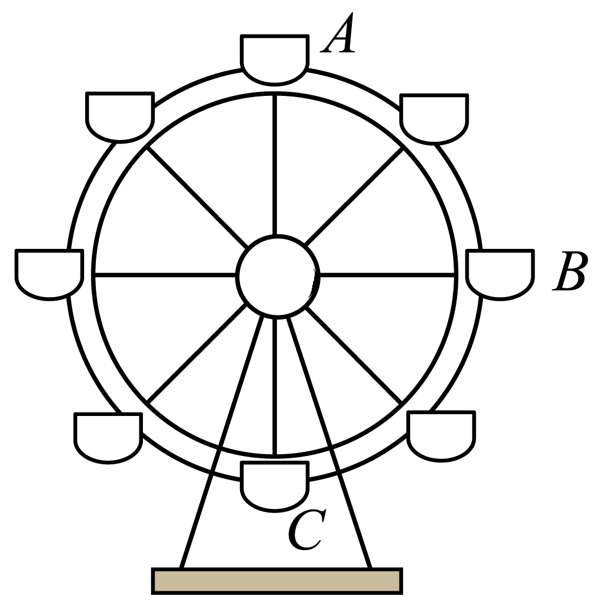

# 2025-2026 北京市第一七一中学高一下期中第 2 题

## 题目来源

- [2025-2026北京市第一七一中学高一下期中第356题](https://xbresource.jiaoyanyun.com/#/boutique/search?sid=4&gid=3&queId=43feccd649ba42edbe1d7216b59fb320)  
  省市: 北京；区县: 北京市；学校: 第一七一中学；年级: 高一；学期: 下期；考试: 期中；题号: 356
- [2026学年广东中山市高三一模第3题](https://xbresource.jiaoyanyun.com/#/boutique/search?sid=4&gid=3&queId=43feccd649ba42edbe1d7216b59fb320)  
  学年: 2026；省市: 广东；城市: 中山市；考试: 高三一模；题号: 3
- [2026年广东中山市高三一模第3题](https://xbresource.jiaoyanyun.com/#/boutique/search?sid=4&gid=3&queId=43feccd649ba42edbe1d7216b59fb320)

## 标签

- #物理
- #选择题
- #北京
- #北京市
- #第一七一中学
- #高一
- #下期
- #期中
- #2026学年
- #广东
- #中山市
- #高三一模
- #高三
- #圆周运动

## 题目

> [!ti] *2025-2026 北京市第一七一中学高一下期中第 2 题*
> 某同学乘坐摩天轮随座舱在竖直平面内做匀速圆周运动，依次从 $A$ 到 $B$ 到 $C$ 的运动过程中，下列说法正确的是（　　）
> 
> > [!opts2]
> > - A. 该同学的机械能守恒
> > - B. 座舱对该同学的作用力大小一直不变
> > - C. 仅减小摩天轮匀速圆周运动的转速，该同学在 $A$ 点受座舱作用力一定减小
> > - D. 仅增大摩天轮匀速圆周运动的转速，该同学在 $A$ 点受座舱作用力一定增大

## 答案

C

## 详解

【详解】A．该同学的重力势能减小，动能不变，则机械能减小，A错误；
B．同学随座舱在竖直平面内做匀速圆周运动，则座舱对该同学的作用力和重力的合力提供向心力，则向心力指向圆心，且大小不变，因重力也不变，所以座舱对该同学的作用力不断变化，故B错误；
C．根据 $P_{G} = mgv_{y}$ ，因竖直速度在B点最大，可知重力对该同学做功的瞬时功率在B点最大，C正确；
D．在A点时，由牛顿第二定律可得 $mg - F = m\omega^{2}r$ ，可知仅增大摩天轮匀速圆周运动的转速，该同学在 $A$ 点受座舱作用力一定减小，D错误。
故选C。

## 检索信息

- 相似度: 53.44
- 选择依据: 已搜索到候选题，直接采用评分最高的一条
- 搜索词: ! https://storage.simpletex.cn/view/fgRYGrlHE2MgDLQxAwlho4eshbqaBP0LS 2.如右图所示 某同学乘坐摩天轮随座舱在竖直平面内做匀速圆周运动 依次从$A$到$B$ 到$C$ 的
