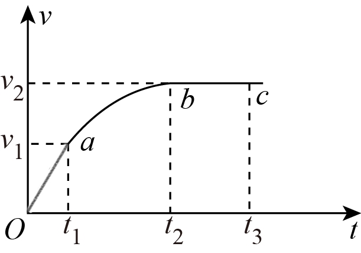

# 2025-2026北京市第一七一中学高一下期中第300题

## 题目来源

- [2025-2026北京市第一七一中学高一下期中第300题](https://xbresource.jiaoyanyun.com/#/boutique/search?sid=4&gid=3&queId=e28f1c1096b44773a333e5aa8f2d3918)  
  省市: 北京；区县: 北京市；学校: 第一七一中学；年级: 高一；学期: 下期；考试: 期中；题号: 300
- [2020~2021学年5陕西西安新城区西安西光中学高一下学期月考第6题4分](https://xbresource.jiaoyanyun.com/#/boutique/search?sid=4&gid=3&queId=e28f1c1096b44773a333e5aa8f2d3918)  
  学年: 2020~2021；月份: 5；省市: 陕西；城市: 西安；区县: 新城区；学校: 西安西光中学；年级: 高一；学期: 下学期；考试: 月考；题号: 6；分值: 4
- [2020~2021学年5月陕西西安新城区西安西光中学高一下学期月考第6题4分](https://xbresource.jiaoyanyun.com/#/boutique/search?sid=4&gid=3&queId=e28f1c1096b44773a333e5aa8f2d3918)

## 标签

- #物理
- #选择题
- #北京
- #北京市
- #第一七一中学
- #高一
- #下期
- #期中
- #2020-2021学年
- #陕西
- #西安
- #新城区
- #西安西光中学
- #下学期
- #月考
- #功
- #功率

## 题目

> [!ti] *2025-2026北京市第一七一中学高一下期中第300题*
> 如图所示为某新型电动汽车在阻力一定的水平路面上进行性能测试时的 $v-t$ 图像， $Oa$ 为过原点的倾斜直线， $bc$ 段是与 $ab$ 段相切的水平直线， $ab$ 段汽车以额定功率 $P$ 行驶，下列说法正确的是（ ）
> 
> > [!opts2]
> > - A. $0\sim t_1$ 时间内汽车的功率减小
> > - B. $t_1\sim t_2$ 时间内汽车的牵引力不变
> > - C. $t_2\sim t_3$ 时间内牵引力不做功
> > - D. 汽车行驶时受到的阻力大小为 $\dfrac{P}{v_{2}}$

## 答案

D

## 详解

暂无

## 检索信息

- 相似度: 52.69
- 选择依据: 已搜索到候选题，直接采用评分最高的一条
- 搜索词: 右图所示为某新型电动汽车在阻力恒定的水平路面上进行性能测试时的$v$-t图像 Oa为过原 点的倾斜线段 $bc$ 段平行于时间轴且与$ab$ 段相切 $ab$ 段汽车的功率为额定功率$P$,下列说 法正确的是 $ 0\sim t_1$时间内
