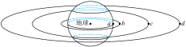

# 2025-2026北京市第一七一中学高一下期中第304题

## 题目来源

- [2025-2026北京市第一七一中学高一下期中第304题](https://xbresource.jiaoyanyun.com/#/boutique/search?sid=4&gid=3&queId=9a648838fbdc44dc91f2fc4f74eb8583)  
  省市: 北京；区县: 北京市；学校: 第一七一中学；年级: 高一；学期: 下期；考试: 期中；题号: 304
- [2024~2025学年重庆渝北区重庆市松树桥中学校高二下学期期中第8题](https://xbresource.jiaoyanyun.com/#/boutique/search?sid=4&gid=3&queId=9a648838fbdc44dc91f2fc4f74eb8583)  
  学年: 2024~2025；省市: 重庆；城市: 重庆；区县: 渝北区；学校: 重庆市松树桥中学校；年级: 高二；学期: 下学期；考试: 期中；题号: 8
- [全国高一课时练习（精选习题鲁科版（2019）必修第二册）第10题](https://xbresource.jiaoyanyun.com/#/boutique/search?sid=4&gid=3&queId=9a648838fbdc44dc91f2fc4f74eb8583)  
  省市: 全国；年级: 高一；考试: 课时练习；备注: （精选习题鲁科版（2019）必修第二册）；题号: 10
- [全国高一假期作业（ 教科版（2019）必修第二册 第三章 万有引力定律 ）第10题](https://xbresource.jiaoyanyun.com/#/boutique/search?sid=4&gid=3&queId=9a648838fbdc44dc91f2fc4f74eb8583)  
  省市: 全国；年级: 高一；考试: 假期作业；备注: （ 教科版（2019）必修第二册 第三章 万有引力定律 ）；题号: 10
- [2023~2024学年4海南文昌市海南省文昌中学高一下学期月考第8题2分](https://xbresource.jiaoyanyun.com/#/boutique/search?sid=4&gid=3&queId=9a648838fbdc44dc91f2fc4f74eb8583)  
  学年: 2023~2024；月份: 4；省市: 海南；城市: 文昌市；学校: 海南省文昌中学；年级: 高一；学期: 下学期；考试: 月考；题号: 8；分值: 2
- [全国高一课时练习《第4章+第2~3节 人类对太空的不懈探索+课时2 宇宙速度》（精选习题鲁科版（2019）必修第二册）第10题](https://xbresource.jiaoyanyun.com/#/boutique/search?sid=4&gid=3&queId=9a648838fbdc44dc91f2fc4f74eb8583)
- [全国高一假期作业《第4~5节人造卫星宇宙速度-太空探索（选学）》（ 教科版（2019）必修第二册 第三章 万有引力定律 ）第10题](https://xbresource.jiaoyanyun.com/#/boutique/search?sid=4&gid=3&queId=9a648838fbdc44dc91f2fc4f74eb8583)
- [2023~2024学年4月海南文昌市海南省文昌中学高一下学期月考B卷第8题2分](https://xbresource.jiaoyanyun.com/#/boutique/search?sid=4&gid=3&queId=9a648838fbdc44dc91f2fc4f74eb8583)

## 标签

- #物理
- #选择题
- #北京
- #北京市
- #第一七一中学
- #高一
- #下期
- #期中
- #2024-2025学年
- #重庆
- #渝北区
- #重庆市松树桥中学校
- #高二
- #下学期
- #全国
- #课时练习
- #假期作业
- #2023-2024学年
- #海南
- #文昌市
- #海南省文昌中学
- #月考
- #圆周运动
- #万有引力

## 题目

> [!ti] *2025-2026北京市第一七一中学高一下期中第304题*
> 有 $a、b、c、d$ 四颗地球卫星，a还未发射，在地球赤道表面随地球一起转动，b处于近地轨道上正常运动，c是地球同步卫星，d是高空探测卫星，地球自转周期为24 h，所有卫星均视为做匀速圆周运动，各卫星排列位置如图所示，则有地球（　　）
> 
> > [!opts2]
> > - A. a的向心加速度等于c的向心加速度
> > - B. b在相同时间内转过的弧长最长
> > - C. c在4 h内转过的圆心角是 $\frac{\pi }{6}$
> > - D. d的运行周期有可能是23 h

## 答案

B

## 详解

【详解】
A．a和c具有相同的角速度和周期，根据
$a=\omega ^{2}r$ 
可知a的向心加速度小于c的向心加速度，选项A错误；
B．根据
$G\frac{Mm}{r^{2}}=m\frac{v^{2}}{r}$ 
可得
$v=\sqrt{\frac{GM}{r}}$ 
可知bcd三颗卫星中b的线速度最大，而由v=ωr可知c的线速度也大于a的线速度，可知四颗卫星中b的线速度最大，则b在相同时间内转过的弧长最长，选项B正确；
C．c的周期为24h，则在4 h内转过的圆心角是 $\frac{2\pi }{24}\times 4=\frac{\pi }{3}$ ，选项C错误；
D．根据开普勒第三定律
$\frac{r^{3}}{T^{2}}=k$ 
可知d的运行周期大于c的周期，即大于24h，不可能是23 h，选项D错误。
故选B。

## 检索信息

- 相似度: 58.76
- 选择依据: 已搜索到候选题，直接采用评分最高的一条
- 搜索词: 有$a$、$b$、c、$d$四颗地球卫星 $a$ 还未发射 在地球赤道表面随地球一起转动 $b$处于近地轨道 上正常运动 $c$是地球同步卫星 $d$是高空探测卫星 地球自转周期为 24 h,所有卫星均视为 $ra$ 做匀速圆周运动 各卫星
