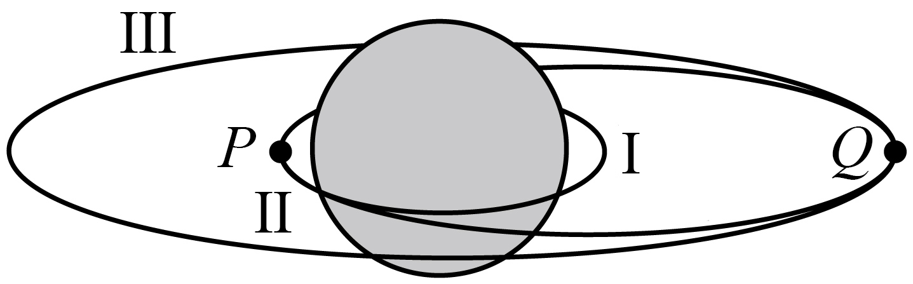

# 2025-2026北京市第一七一中学高一下期中第308题

## 题目来源

- [2025-2026北京市第一七一中学高一下期中第308题](https://xbresource.jiaoyanyun.com/#/boutique/search?sid=4&gid=3&queId=7f55d5bb3f1a40659cf2bba7394b5b2a)  
  省市: 北京；区县: 北京市；学校: 第一七一中学；年级: 高一；学期: 下期；考试: 期中；题号: 308
- [2024~2025学年12云南红河哈尼族彝族自治州开远市开远市第一中学高三上学期月考（开远一中实验学校）第6题](https://xbresource.jiaoyanyun.com/#/boutique/search?sid=4&gid=3&queId=7f55d5bb3f1a40659cf2bba7394b5b2a)  
  学年: 2024~2025；月份: 12；省市: 云南；城市: 红河哈尼族彝族自治州；区县: 开远市；学校: 开远市第一中学；年级: 高三；学期: 上学期；考试: 月考；备注: （开远一中实验学校）；题号: 6
- [2025学年云南昆明五华区云南省昆明市第八中学高三上学期高考模拟第6题5分](https://xbresource.jiaoyanyun.com/#/boutique/search?sid=4&gid=3&queId=7f55d5bb3f1a40659cf2bba7394b5b2a)  
  学年: 2025；省市: 云南；城市: 昆明；区县: 五华区；学校: 云南省昆明市第八中学；年级: 高三；学期: 上学期；考试: 高考模拟；题号: 6；分值: 5
- [2024~2025学年12月云南红河哈尼族彝族自治州开远市开远市第一中学高三上学期月考（开远一中实验学校）第6题](https://xbresource.jiaoyanyun.com/#/boutique/search?sid=4&gid=3&queId=7f55d5bb3f1a40659cf2bba7394b5b2a)
- [2025年云南昆明五华区云南省昆明市第八中学高三上学期高考模拟第6题5分](https://xbresource.jiaoyanyun.com/#/boutique/search?sid=4&gid=3&queId=7f55d5bb3f1a40659cf2bba7394b5b2a)

## 标签

- #物理
- #选择题
- #北京
- #北京市
- #第一七一中学
- #高一
- #下期
- #期中
- #2024-2025学年
- #云南
- #红河哈尼族彝族自治州
- #开远市
- #开远市第一中学
- #高三
- #上学期
- #月考
- #2025学年
- #昆明
- #五华区
- #云南省昆明市第八中学
- #高考模拟
- #模拟
- #功

## 题目

> [!ti] *2025-2026北京市第一七一中学高一下期中第308题*
> 2024年4月26日，“神舟十八号”载人飞船与空间站天和核心舱自主交会对接成功。某同学根据所学知识设计了一种对接方案：载人飞船先在近地圆轨道I上的P点点火加速，然后沿椭圆转移轨道II运动到远地点Q，在Q点再次点火加速，进入圆轨道III并恰好与在圆轨道III上运行的空间站对接。已知地球的半径为 $R$ ，地球表面的重力加速度为 $g$ ，圆轨道III的轨道半径为 $r$ ，引力常量为 $G$ 。不考虑地球自转，则载人飞船（　　）
> 
> > [!opts2]
> > - A. 在轨道 $\text{I}$ 上运行的角速度大小为 $\sqrt{\frac{R}{g}}$
> > - B. 在轨道 $\text{I}$ 上运行的周期为 $2\pi\sqrt{\frac{g}{R}}$
> > - C. 在轨道III上运行的线速度大小为 $\sqrt{gr}$
> > - D. 沿轨道II从 $P$ 点运动到 $Q$ 点的时间为 $\frac{\pi(r + R)}{2R}\sqrt{\frac{r + R}{2g}}$

## 答案

D

## 详解

【详解】AB．载人飞船在轨道I上运行时，由牛顿第二定律可得
$G\frac{Mm}{R^{2}} = mR\omega^{2} = mR\frac{4\pi^{2}}{T_{1}^{2}}$ 
在地球表面
$G\frac{Mm}{R^{2}} = mg$ 
联立解得
$\omega = \sqrt{\frac{g}{R}}$ 
$T_{1} = 2\pi\sqrt{\frac{R}{g}}$ 
选项AB错误；
C．载人飞船在轨道III上运行时，由牛顿第二定律可得
$G\frac{Mm}{r^{2}} = m\frac{v^{2}}{r}$ 
解得
$v = R\sqrt{\frac{g}{r}}$ 
选项C错误；
D．载人飞船始终围绕地球运动，设载人飞船沿轨道II从P点运动到Q点的时间为 $t$ ，由开普勒第三定律可得
$\frac{R^{3}}{T_{1}^{3}} = \frac{a^{3}}{(2t)^{2}}$ 
由题意可得
$a = \frac{r + R}{2}$ 
解得
$t = \frac{\pi(r + R)}{2R}\sqrt{\frac{r + R}{2g}}$ 
选项D正确。
故选D。

## 检索信息

- 相似度: 39.47
- 选择依据: 已搜索到候选题，直接采用评分最高的一条
- 搜索词: 右图为发射“神舟二十号”飞船的示意图 飞船先在近地圆轨道II上做匀速圆 $P$点火加速 进入椭圆轨道II 运动到远地点$\varrho$时再次点火加速 进入圆轨道III 以便和天和核心舱实现交会对接 已知地球半径为$R$, 飞船在轨道I上运
