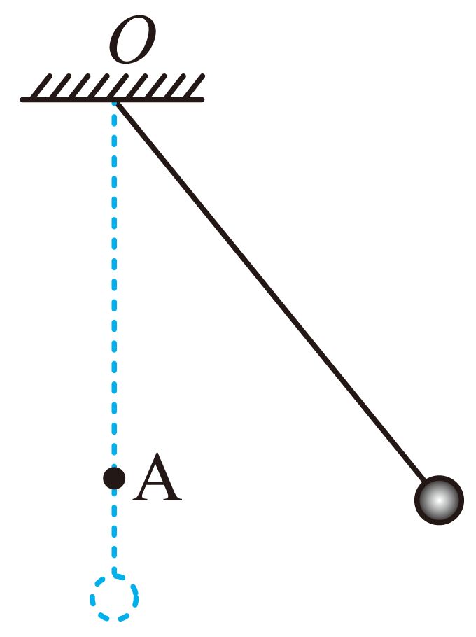

# 2025-2026北京市第一七一中学高一下期中第310题

## 题目来源

- [2025-2026北京市第一七一中学高一下期中第310题](https://xbresource.jiaoyanyun.com/#/boutique/search?sid=4&gid=3&queId=656cac286bcf4d9c817cb3f33cdfd64f)  
  省市: 北京；区县: 北京市；学校: 第一七一中学；年级: 高一；学期: 下期；考试: 期中；题号: 310
- [2021~2022学年北京西城区北京市第一六一中学高一下学期期中第6题](https://xbresource.jiaoyanyun.com/#/boutique/search?sid=4&gid=3&queId=656cac286bcf4d9c817cb3f33cdfd64f)  
  学年: 2021~2022；省市: 北京；城市: 北京；区县: 西城区；学校: 北京市第一六一中学；年级: 高一；学期: 下学期；考试: 期中；题号: 6

## 标签

- #物理
- #选择题
- #北京
- #北京市
- #第一七一中学
- #高一
- #下期
- #期中
- #2021-2022学年
- #西城区
- #北京市第一六一中学
- #下学期

## 题目

> [!ti] *2025-2026北京市第一七一中学高一下期中第310题*
> 如图所示，不可伸长的轻质细绳的一端固定于O点，另一端系一个小球，在O点的正下方钉一个钉子A，小球从某一位置（细绳处于拉直状态），由静止释放后摆下，不计空气阻力和细绳与钉子相碰时的能量损失。下列说法中正确的是（　　）
> 
> > [!opts2]
> > - A. 小球摆动过程中，所受合力大小保持不变
> > - B. 当细绳与钉子碰后的瞬间，小球的角速度不变
> > - C. 当细绳与钉子碰后的瞬间，小球的向心加速度突然变小
> > - D. 钉子的位置越靠近小球，在细绳与钉子相碰时绳就越容易断

## 答案

D

## 详解

【详解】A．小球摆动过程中，速度不断变化，加速度大小不断变化，则所受合力大小不断变化，选项A错误；
BC．当细绳与钉子碰后的瞬间，小球的线速度不变，因半径减小，根据
v=ωr
则角速度变大，根据
$a = \frac{v^{2}}{r}$ 
可知，小球的向心加速度突然变大，选项BC错误；
D．根据
$T = mg + m\frac{v^{2}}{r}$ 
可知，钉子的位置越靠近小球，则半径越小，细绳的拉力越大，即在细绳与钉子相碰时绳就越容易断，选项D正确。
故选D。

## 检索信息

- 相似度: 64.69
- 选择依据: 已搜索到候选题，直接采用评分最高的一条
- 搜索词: 和细绳与钉子相碰时的能量损失 下列说法中企确的是
