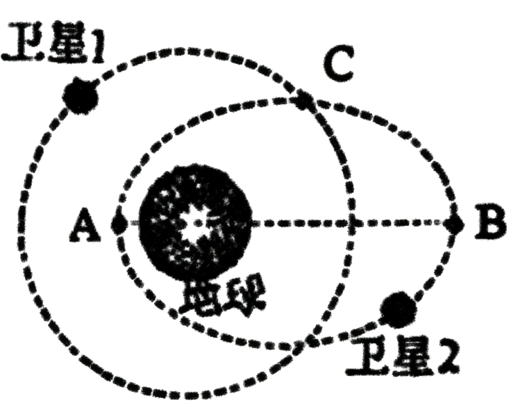

# 2025-2026北京市第一七一中学高一下期中第325题

## 题目来源

- [2025-2026北京市第一七一中学高一下期中第325题](https://xbresource.jiaoyanyun.com/#/boutique/search?sid=4&gid=3&queId=ae342b99424b479ba7c1c9e19f6ce802)  
  省市: 北京；区县: 北京市；学校: 第一七一中学；年级: 高一；学期: 下期；考试: 期中；题号: 325
- [2023~2024学年3吉林长春朝阳区东北师范大学附属中学高一下学期月考第9题6分](https://xbresource.jiaoyanyun.com/#/boutique/search?sid=4&gid=3&queId=ae342b99424b479ba7c1c9e19f6ce802)  
  学年: 2023~2024；月份: 3；省市: 吉林；城市: 长春；区县: 朝阳区；学校: 东北师范大学附属中学；年级: 高一；学期: 下学期；考试: 月考；题号: 9；分值: 6
- [2023~2024学年3月吉林长春朝阳区东北师范大学附属中学高一下学期月考第9题6分](https://xbresource.jiaoyanyun.com/#/boutique/search?sid=4&gid=3&queId=ae342b99424b479ba7c1c9e19f6ce802)

## 标签

- #物理
- #选择题
- #北京
- #北京市
- #第一七一中学
- #高一
- #下期
- #期中
- #2023-2024学年
- #吉林
- #长春
- #朝阳区
- #东北师范大学附属中学
- #下学期
- #月考

## 题目

> [!ti] *2025-2026北京市第一七一中学高一下期中第325题*
> 如图所示，两颗人造地球卫星绕地球顺时针运动，卫星 $1$ 轨道为圆形，卫星 $2$ 轨道为椭圆，卫星 $1$ 轨道半径与卫星 $2$ 轨道半长轴长度相等， $C$ 点为两轨道交点， $A$ 和 $B$ 分别为椭圆轨道的近地点和远地点，不考虑两卫星之间的引力，下列说法正确的是
> 
> > [!opts2]
> > - A. 两卫星绕地球运动的周期相同
> > - B. 卫星 $2$ 运动至 $C$ 点的加速度小于卫星 $1$ 的加速度
> > - C. 卫星 $2$ 运动至 $A$ 点的线速度大于卫星 $1$ 的线速度
> > - D. 卫星 $2$ 从 $A$ 点运动至 $B$ 点的过程中动能不断增大

## 答案

A
C

## 详解

A．根据开普勒第三定律 $\frac{r^3}{T^2}=k$ （对于围绕同一中心天体运动的卫星， $k$ 为常数），这里卫星 $1$ 轨道半径与卫星 $2$ 轨道半长轴长度相等，所以两卫星绕地球运动的周期相同， $A$ 正确.
B．根据牛顿第二定律 $G\frac{Mm}{r^2}=ma$ ，可得 $a=G\frac{M}{r^2}$ ，两卫星在 $C$ 点到地球的距离 $r$ 相同，地球质量 $M$ 不变，所以卫星 $2$ 运动至 $C$ 点的加速度等于卫星 $1$ 的加速度， $B$ 错误.
C．卫星 $2$ 在 $A$ 点做离心运动，说明在 $A$ 点 $v_A>\sqrt{\frac{GM}{r_A}}$ ，卫星 $1$ 做匀速圆周运动， $v_1=\sqrt{\frac{GM}{r_1}}$ ，又因为 $r_A< r_1$ （ $r_A$ 为卫星 $2$ 在 $A$ 点到地球的距离， $r_1$ 为卫星 $1$ 的轨道半径），所以卫星 $2$ 运动至 $A$ 点的线速度大于卫星 $1$ 的线速度， $C$ 正确.
D．卫星 $2$ 从 $A$ 点运动至 $B$ 点的过程中，万有引力做负功，根据动能定理，动能不断减小， $D$ 错误.
故选：AC.

## 检索信息

- 相似度: 33.37
- 选择依据: 已搜索到候选题，直接采用评分最高的一条
- 搜索词: 右图所示为人道卫星沿椭圆轨道绕地球运动的轨迹 设卫星在近地点、远地点的速度分别为10. 右 图 所 示 为 人 进 卫 星 沿 椭 圆 轨 道 绕 地 球 运 动 的 轨 迹 , 设 卫 星 在 近 地 点 、 远 地 点 的 速 度 分
