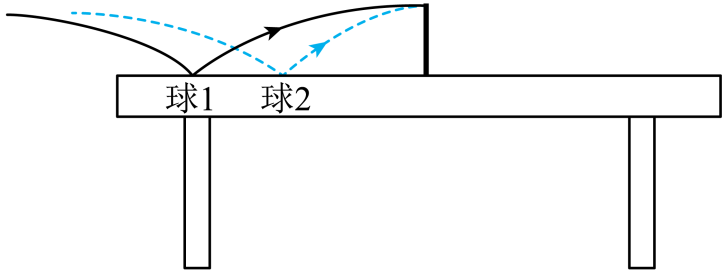

# 2025-2026北京市第一七一中学高一下期中第328题

## 题目来源

- [2025-2026北京市第一七一中学高一下期中第328题](https://xbresource.jiaoyanyun.com/#/boutique/search?sid=4&gid=3&queId=460a9292e42341619459418133cb4e53)  
  省市: 北京；区县: 北京市；学校: 第一七一中学；年级: 高一；学期: 下期；考试: 期中；题号: 328
- [全国高一假期作业（粤教版（2019）必修第二册）第10题](https://xbresource.jiaoyanyun.com/#/boutique/search?sid=4&gid=3&queId=460a9292e42341619459418133cb4e53)  
  省市: 全国；年级: 高一；考试: 假期作业；备注: （粤教版（2019）必修第二册）；题号: 10
- [全国高一假期作业(粤教版（2019）必修第二册)第10题](https://xbresource.jiaoyanyun.com/#/boutique/search?sid=4&gid=3&queId=460a9292e42341619459418133cb4e53)  
  省市: 全国；年级: 高一；考试: 假期作业；备注: (粤教版（2019）必修第二册)；题号: 10
- [全国高一假期作业《4.2功率》（粤教版（2019）必修第二册）第10题](https://xbresource.jiaoyanyun.com/#/boutique/search?sid=4&gid=3&queId=460a9292e42341619459418133cb4e53)
- [全国高一假期作业《4.2 功率 基础巩固》(粤教版（2019）必修第二册)第10题](https://xbresource.jiaoyanyun.com/#/boutique/search?sid=4&gid=3&queId=460a9292e42341619459418133cb4e53)

## 标签

- #物理
- #选择题
- #北京
- #北京市
- #第一七一中学
- #高一
- #下期
- #期中
- #全国
- #假期作业
- #功
- #功率

## 题目

> [!ti] *2025-2026北京市第一七一中学高一下期中第328题*
> 在某次乒乓球比赛中，乒乓球先后两次落台后恰好在等高处水平越过球网，过网时的速度方向均垂直于球网，把两次落台的乒乓球看成完全相同的球1和球2，如图所示。不计乒乓球的旋转和空气阻力。乒乓球自起跳到最高点的过程中，下列说法正确的是（　　）
> 
> > [!opts2]
> > - A. 过网时球1的速度大于球2的速度
> > - B. 球1的速度变化率小于球2的速度变化率
> > - C. 球1的飞行时间大于球2的飞行时间
> > - D. 起跳时，球1的重力功率大于球2的重力功率

## 答案

A

## 详解

【详解】C．把乒乓球的运动看作反向的平抛运动来处理，由 $h = \frac{1}{2}gt^{2}$ 知，两球运动时间相等，故C错误；
A．乒乓球水平方向做匀速直线运动，由于球1水平位移大，故水平速度大，即过网时球1的速度大于球2的速度，故A正确；
B．两球都做平抛运动，只受重力，故加速度相等，即速度变化率相等，故B错误；
D．乒乓球竖直方向上做自由落体运动，由 $v_{y}^{2} = 2gh$ 可知，落台时两球竖直速度相等，落在台上时，重力的瞬时功率为
P=mgvy
又因为重力等大，故落在台上时两球的重力功率相等，故D错误；
故选A。

## 检索信息

- 相似度: 55.8
- 选择依据: 已搜索到候选题，直接采用评分最高的一条
- 搜索词: 在某次乒乓球比赛中 乒乓球先后两次落台后恰好在等高处亦干感过球网 过网时的速度力向均垂直于球网 把两次落台的乒乓球看成完全相同的球 1 和球 2,如图所示 不计兵$_ 54 $ 向均垂直于球网 把网众浴日的一气水目的过程中 下列说法在确$y
