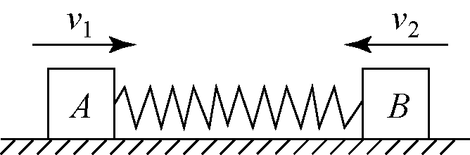

# 2025-2026北京市第一七一中学高一下期中第330题

## 题目来源

- [2025-2026北京市第一七一中学高一下期中第330题](https://xbresource.jiaoyanyun.com/#/boutique/search?sid=4&gid=3&queId=bb3ca81b40964ceca923f3cceee75d5f)  
  省市: 北京；区县: 北京市；学校: 第一七一中学；年级: 高一；学期: 下期；考试: 期中；题号: 330
- [2020~2021学年四川成都双流区双流区华阳中学高二上学期开学考试第12题4分](https://xbresource.jiaoyanyun.com/#/boutique/search?sid=4&gid=3&queId=bb3ca81b40964ceca923f3cceee75d5f)  
  学年: 2020~2021；省市: 四川；城市: 成都；区县: 双流区；学校: 双流区华阳中学；年级: 高二；学期: 上学期；考试: 开学考试；题号: 12；分值: 4
- [2018~2019学年北京海淀区高三上学期期中第9题3分](https://xbresource.jiaoyanyun.com/#/boutique/search?sid=4&gid=3&queId=bb3ca81b40964ceca923f3cceee75d5f)  
  学年: 2018~2019；省市: 北京；区县: 海淀区；年级: 高三；学期: 上学期；考试: 期中；题号: 9；分值: 3

## 标签

- #物理
- #选择题
- #北京
- #北京市
- #第一七一中学
- #高一
- #下期
- #期中
- #2020-2021学年
- #四川
- #成都
- #双流区
- #双流区华阳中学
- #高二
- #上学期
- #开学考试
- #2018-2019学年
- #海淀区
- #高三
- #开学考

## 题目

> [!ti] *2025-2026北京市第一七一中学高一下期中第330题*
> 如图所示，两物块 $A$ 、 $B$ 质量分别为 $m$ 、 $2m$ ，与水平地面的动摩擦因数分别为 $2mu$ 、 $mu$ ，其间用一轻弹簧连接．初始时弹簧处于原长状态，使 $A$ 、 $B$ 两物块同时获得一个方向相反，大小分别为 $v_1$ 、 $v_2$ 的水平速度，弹簧再次恢复原长时两物块的速度恰好同时为零．关于这一运动过程，下列说法正确的是（ ）
> 
> > [!opts2]
> > - A. 两物块 $A$ 、 $B$ 及弹簧组成的系统动量守恒
> > - B. 两物块 $A$ 、 $B$ 及弹簧组成的系统机械能守恒
> > - C. 两物块 $A$ 、 $B$ 初速度的大小关系为 $v_1 = v_2$
> > - D. 两物块 $A$ 、 $B$ 运动的路程之比为 $2:1$

## 答案

A
D

## 详解

AC．由弹簧再测恢复原长时两物块速度恰好同时为零，可知两物体之前运动过程 $f$ 分别 $A$ ： $f_A = 2mu mg$ ， $B$ ： $f_B = mu 2mg$ ，总是等大反向， $A$ 、 $B$ 弹簧组成系统，水平方向合外力为零，满足动量守恒，规定向右为正， $mv_1 - 2mv_2 = 0$ ，可得 $v_1 = 2v_2$ ，故A正确，C错误；
B．因有 $f$ 生热，系统机械能不守恒，故B错误；
D．根据人船模型， $mv_1 - 2mv_2 = 0$ ，两边同时乘 $Delta t$ ，
$mv_1Delta t - 2mv_2Delta t = 0$ ，
$ms_1 - 2ms_2 = 0$ ，
$s_1 = 2s_2$ ，故D正确．
故选AD．

## 检索信息

- 相似度: 26.86
- 选择依据: 已搜索到候选题，直接采用评分最高的一条
- 搜索词: 如图所示 两物块
