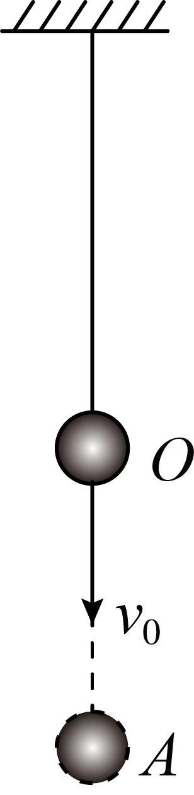

# 2025-2026北京市第一七一中学高一下期中第334题

## 题目来源

- [2025-2026北京市第一七一中学高一下期中第334题](https://xbresource.jiaoyanyun.com/#/boutique/search?sid=4&gid=3&queId=0ff65e53c91e4c7aa8498f20c6cdf2cd)  
  省市: 北京；区县: 北京市；学校: 第一七一中学；年级: 高一；学期: 下期；考试: 期中；题号: 334
- [2024~2025学年全国高三课前预习（【上好课】一轮复习知识清单）第3题](https://xbresource.jiaoyanyun.com/#/boutique/search?sid=4&gid=3&queId=0ff65e53c91e4c7aa8498f20c6cdf2cd)  
  学年: 2024~2025；省市: 全国；年级: 高三；考试: 课前预习；备注: （【上好课】一轮复习知识清单）；题号: 3
- [2024学年北京海淀区中国人民大学附属中学高三一模第12题2分](https://xbresource.jiaoyanyun.com/#/boutique/search?sid=4&gid=3&queId=0ff65e53c91e4c7aa8498f20c6cdf2cd)  
  学年: 2024；省市: 北京；城市: 北京；区县: 海淀区；学校: 中国人民大学附属中学；考试: 高三一模；题号: 12；分值: 2
- [2023~2024学年江苏南京高三下学期期中（汉开书院学校）第11题4分](https://xbresource.jiaoyanyun.com/#/boutique/search?sid=4&gid=3&queId=0ff65e53c91e4c7aa8498f20c6cdf2cd)  
  学年: 2023~2024；省市: 江苏；城市: 南京；年级: 高三；学期: 下学期；考试: 期中；备注: （汉开书院学校）；题号: 11；分值: 4
- [2024~2025学年全国高三课前预习《专题07 机械能》（【上好课】一轮复习知识清单）第3题](https://xbresource.jiaoyanyun.com/#/boutique/search?sid=4&gid=3&queId=0ff65e53c91e4c7aa8498f20c6cdf2cd)
- [2024年北京海淀区中国人民大学附属中学高三一模第12题2分](https://xbresource.jiaoyanyun.com/#/boutique/search?sid=4&gid=3&queId=0ff65e53c91e4c7aa8498f20c6cdf2cd)

## 标签

- #物理
- #选择题
- #北京
- #北京市
- #第一七一中学
- #高一
- #下期
- #期中
- #2024-2025学年
- #全国
- #高三
- #课前预习
- #2024学年
- #海淀区
- #中国人民大学附属中学
- #高三一模
- #2023-2024学年
- #江苏
- #南京
- #下学期
- #机械能

## 题目

> [!ti] *2025-2026北京市第一七一中学高一下期中第334题*
> 如图所示，一根橡皮绳一端固定于天花板上，另一端连接一质量为 $m$ 的小球（可视为质点），小球静止时位于 $O$ 点．现给小球一竖直向下的瞬时速度 $v_0$ ，小球到达的最低点 $A$ 与 $O$ 点之间的距离为 $x$ ．已知橡皮绳中弹力的大小与其伸长量的关系遵从胡克定律．不计橡皮绳的重力及空气阻力．小球运动过程中不会与地板或天花板碰撞．则下列说法正确的是（ ）
> 
> > [!opts2]
> > - A. 小球由 $O$ 点运动至 $A$ 点的过程中，天花板对橡皮绳所做的功为 $-\left(mgx+\frac{1}{2}m{v}_{0}^{2}\right)$
> > - B. 小球由 $O$ 点运动至 $A$ 点的过程中，小球克服合外力做功为 $mgx+\frac{1}{2}m{v}_{0}^{2}$
> > - C. 小球由 $O$ 点运动至 $A$ 点的过程中，小球的动能一直减小
> > - D. 小球此后上升至最高点的位置与 $A$ 点的间距一定等于 $2x$

## 答案

C

## 详解

A．小球由 $O$ 点运动至 $A$ 点的过程中，天花板对橡皮绳的拉力的位移为零，则天花板对橡皮绳做功为零，故A错误；
B．小球由 $O$ 点运动至 $A$ 点的过程中，根据动能定理得
$W_{合}=0-\frac{1}{2}m{v}_{0}^{2}$ ，
则小球克服合外力做功为
$W_{克}=-W_{合}=\frac{1}{2}m{v}_{0}^{2}$ ，
故B错误；
C．小球由 $O$ 点运动至 $A$ 点的过程中，向上的弹力一直大于向下的重力，则合力方向向上，小球向下做减速运动，小球的动能一直减小，故C正确；
D．若小球在 $O$ 点时橡皮绳的伸长量大于或等于 $x$ ，则由对称性可知，小球此后从 $A$ 点上升至最高点的位置与 $A$ 点的间距等于 $2x$ ；若小球在 $O$ 点时橡皮绳的伸长量小于 $x$ ，则小球此后从 $A$ 点上升至最高点的位置与 $A$ 点的间距不等于 $2x$ ，故D错误．
故选C．

## 检索信息

- 相似度: 64.27
- 选择依据: 已搜索到候选题，直接采用评分最高的一条
- 搜索词: 如图所示 一根橡皮绳一端固定于天花板上 另一端连接一质量为$m$ 的小球 可视为质点 ,小球静止时位于$O$点 现给小球一竖直向下的瞬时速度$v_0$, 小球到达的最低点$A$与$O$点之间的距离为x 已知橡皮绳中弹力的大小与其伸长量的关系
