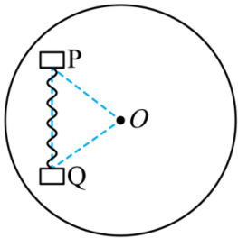

# 2025-2026北京市第一七一中学高一下期中第342题

## 题目来源

- [2025-2026北京市第一七一中学高一下期中第342题](https://xbresource.jiaoyanyun.com/#/boutique/search?sid=4&gid=3&queId=f189bdf55328466ab30ac9537040a329)  
  省市: 北京；区县: 北京市；学校: 第一七一中学；年级: 高一；学期: 下期；考试: 期中；题号: 342
- [2024~2025学年四川德阳旌阳区德阳五中高一下学期期末模拟第7题](https://xbresource.jiaoyanyun.com/#/boutique/search?sid=4&gid=3&queId=f189bdf55328466ab30ac9537040a329)  
  学年: 2024~2025；省市: 四川；城市: 德阳；区县: 旌阳区；学校: 德阳五中；年级: 高一；学期: 下学期；考试: 期末模拟；题号: 7

## 标签

- #物理
- #选择题
- #北京
- #北京市
- #第一七一中学
- #高一
- #下期
- #期中
- #2024-2025学年
- #四川
- #德阳
- #旌阳区
- #德阳五中
- #下学期
- #期末模拟
- #期末
- #模拟
- #圆周运动

## 题目

> [!ti] *2025-2026北京市第一七一中学高一下期中第342题*
> 如图（俯视图），用自然长度为 $x_{0}$ ，劲度系数为k的轻质弹簧，将质量都是m的两个小物块P、Q连接在一起，放置在能绕O点在水平面内转动的圆盘上，物体P、Q和O点恰好组成一个边长为 $2x_{0}$ 的正三角形。已知小物块P、Q和圆盘间的最大静摩擦力均为 $\sqrt{3}kx_{0}$ ，现使圆盘带动两个物体以 $\omega = \sqrt{\frac{k}{2m}}$ 的角速度做匀速圆周运动，则小物块P所受的静摩擦力大小为（ ）
> 
> > [!opts2]
> > - A. $\frac{3}{2}kx_{0}$
> > - B. $kx_{0}$
> > - C. $\frac{\sqrt{3}}{2}kx_{0}$
> > - D. $\frac{1}{2}kx_{0}$

## 答案

B

## 详解

【详解】物体随圆盘转动需要的向心力为 $F_{n} = m\omega^{2} \cdot 2x_{0} = kx_{0}$ 
对物体P受力分析，沿半径方向有 $F_{n} = k \cdot x_{0}\cos 60{^\circ} + f_{1}$ 
$f_{2} = k \cdot x_{0}\sin 60{^\circ} = \frac{\sqrt{3}}{2}kx_{0}$ 
则小物块P所受的静摩擦力大小为 $f = \sqrt{{f_{1}}^{2} + {f_{2}}^{2}}$ 
解得 $f = kx_{0}$ 
故选 B。

## 检索信息

- 相似度: 32.24
- 选择依据: 已搜索到候选题，直接采用评分最高的一条
- 搜索词: 一 甲页压维里 X 间的天系如图 $kx_ 0 =3mg$ $a_0^ * a$
