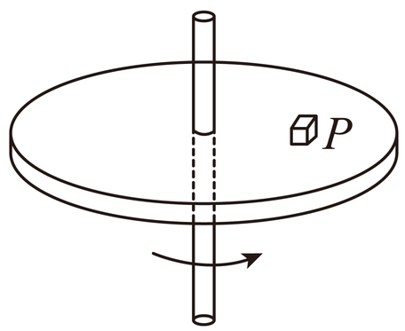

# 2025-2026 北京市第一七一中学高一下期中第 3 题

## 题目来源

- [2025-2026北京市第一七一中学高一下期中第359题](https://xbresource.jiaoyanyun.com/#/boutique/search?sid=4&gid=3&queId=ae21ff257ff94321ac4a10fdd925d6f2)  
  省市: 北京；区县: 北京市；学校: 第一七一中学；年级: 高一；学期: 下期；考试: 期中；题号: 359
- [2021~2022学年江西萍乡高一下学期期末第10题](https://xbresource.jiaoyanyun.com/#/boutique/search?sid=4&gid=3&queId=ae21ff257ff94321ac4a10fdd925d6f2)  
  学年: 2021~2022；省市: 江西；城市: 萍乡；年级: 高一；学期: 下学期；考试: 期末；题号: 10

## 标签

- #物理
- #选择题
- #北京
- #北京市
- #第一七一中学
- #高一
- #下期
- #期中
- #2021-2022学年
- #江西
- #萍乡
- #下学期
- #期末

## 题目

> [!ti] *2025-2026 北京市第一七一中学高一下期中第 3 题*
> 如图所示，圆盘在水平面内以角速度ω绕中心轴匀速转动，圆盘上距轴r处的P点有一质量为m的小物体随圆盘一起转动。某时刻圆盘突然停止转动，小物体由P点滑至圆盘上的某点停止。下列说法正确的是（　　）
> 
> > [!opts1]
> > - A. 圆盘停止转动前，小物体所受摩擦力的方向沿运动轨迹切线方向
> > - B. 圆盘停止转动前，小物体运动一圈所受摩擦力做的功为 0
> > - C. 圆盘停止转动后，小物体沿圆盘半径方向运动
> > - D．圆盘停止转动后，小物体整个滑动过程所受摩擦力做正功，大小为 $\frac{1}{2} m \omega^2 r^2$

## 答案

B

## 详解
无

## 检索信息

- 相似度: 63.94
- 选择依据: 已搜索到候选题，直接采用评分最高的一条
- 搜索词: 如右图所示 圆盘在水平面内以角速度$\omega$绕中心轴匀速转动 圆盘上距轴$r$处的 P点有一质 量为$m$ 的小物体随圆盘一起转动 某时刻圆盘突然停止转动 小物体由P点滑至圆盘上的某 点停止 下列说法正确的是
