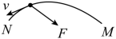
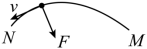
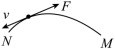

# 2025-2026 北京市第一七一中学高一下期中第 4 题

## 题目来源

- [2025-2026北京市第一七一中学高一下期中第402题](https://xbresource.jiaoyanyun.com/#/boutique/search?sid=4&gid=3&queId=93a9ec90e090402b80aad3a29807bb31)  
  省市: 北京；区县: 北京市；学校: 第一七一中学；年级: 高一；学期: 下期；考试: 期中；题号: 402
- [2023~2024学年广西崇左大新县高一下学期月考（民族高级中学）第5题](https://xbresource.jiaoyanyun.com/#/boutique/search?sid=4&gid=3&queId=93a9ec90e090402b80aad3a29807bb31)  
  学年: 2023~2024；省市: 广西；城市: 崇左；区县: 大新县；年级: 高一；学期: 下学期；考试: 月考；备注: （民族高级中学）；题号: 5
- [2023~2024学年广东湛江霞山区湛江市第二十一中学高一下学期期中（学考）第5题2分](https://xbresource.jiaoyanyun.com/#/boutique/search?sid=4&gid=3&queId=93a9ec90e090402b80aad3a29807bb31)  
  学年: 2023~2024；省市: 广东；城市: 湛江；区县: 霞山区；学校: 湛江市第二十一中学；年级: 高一；学期: 下学期；考试: 期中；备注: （学考）；题号: 5；分值: 2

## 标签

- #物理
- #选择题
- #北京
- #北京市
- #第一七一中学
- #高一
- #下期
- #期中
- #2023-2024学年
- #广西
- #崇左
- #大新县
- #下学期
- #月考
- #广东
- #湛江
- #霞山区
- #湛江市第二十一中学

## 题目

> [!ti] *2025-2026 北京市第一七一中学高一下期中第 4 题*
> 如图所示，“嫦娥号”探月卫星在由地球飞向月球时，沿曲线从 $M$ 点向 $N$ 点飞行的过程中，速度逐渐减小，在此过程中探月卫星所受合力方向可能是下列图中的（　　）
> > [!opts2]
> > - A. 
> > - B. 
> > - C. 

## 答案

A

## 详解

【详解】
“嫦娥号”探月卫星从M点运动到N，做曲线运动，速度逐渐减小，故合力指向指向凹侧，且合力与速度的方向的夹角要大于 $90{^{\circ}}$ 。
故选A。

## 检索信息

- 相似度: 50.95
- 选择依据: 已搜索到候选题，直接采用评分最高的一条
- 搜索词: 如下图所示 “嫦娥号”探月卫星在由地球飞向月球时 沿曲线从$M$点向$N$点飞行的过相 中 谏度逐渐减小 在此过程中探月卫星所受合力方向可能是下列图中的 $$\overbrace N ^ N \sum_ k=1 ^ N \sum_ k=1
