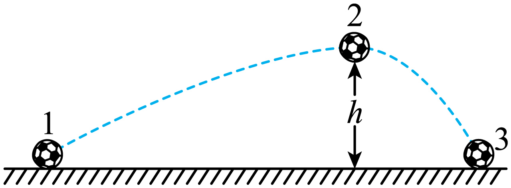

# 2025-2026 北京市第一七一中学高一下期中第 5 题

## 题目来源

- [2025-2026北京市第一七一中学高一下期中第257题](https://xbresource.jiaoyanyun.com/#/boutique/search?sid=4&gid=3&queId=cde30f3cc475499d81834b652785518b)  
  省市: 北京；区县: 北京市；学校: 第一七一中学；年级: 高一；学期: 下期；考试: 期中；题号: 257
- [2025~2026学年3湖北武汉武昌区湖北省武昌实验中学高一下学期月考第3题](https://xbresource.jiaoyanyun.com/#/boutique/search?sid=4&gid=3&queId=cde30f3cc475499d81834b652785518b)  
  学年: 2025~2026；月份: 3；省市: 湖北；城市: 武汉；区县: 武昌区；学校: 湖北省武昌实验中学；年级: 高一；学期: 下学期；考试: 月考；题号: 3
- [2025~2026学年3月湖北武汉武昌区湖北省武昌实验中学高一下学期月考第3题](https://xbresource.jiaoyanyun.com/#/boutique/search?sid=4&gid=3&queId=cde30f3cc475499d81834b652785518b)

## 标签

- #物理
- #选择题
- #北京
- #北京市
- #第一七一中学
- #高一
- #下期
- #期中
- #2025-2026学年
- #湖北
- #武汉
- #武昌区
- #湖北省武昌实验中学
- #下学期
- #月考

## 题目

> [!ti] *2025-2026 北京市第一七一中学高一下期中第 5 题*
> 如图所示，足球在地面1的位置被踢出后，经过最高点2位置，落到地面3的位置。下列说法正确的是（　　）
> 
> > [!opts2]
> > - A. 足球在2位置动能最小
> > - B. 足球在2位置重力的瞬时功率为零
> > - C. 足球在运动过程中机械能守恒
> > - D. 足球在空中做匀变速曲线运动

## 答案

B

## 详解

【详解】ACD．由图可知足球受空气阻力作用，则足球受合力不断改变，并非匀变速曲线运动，且空气阻力做负功，则足球的机械能不守恒，由于空气阻力与重力做功大小情况无法判断，则足球在2位置动能不一定最小，故ACD错误；
B．足球在2位置速度水平向右，与重力方向垂直，则足球在2位置重力的瞬时功率为零，故B正确；
故选B。

## 检索信息

- 相似度: 73.82
- 选择依据: 已搜索到候选题，直接采用评分最高的一条
- 搜索词: 足球在 2 位置动能一定最小
