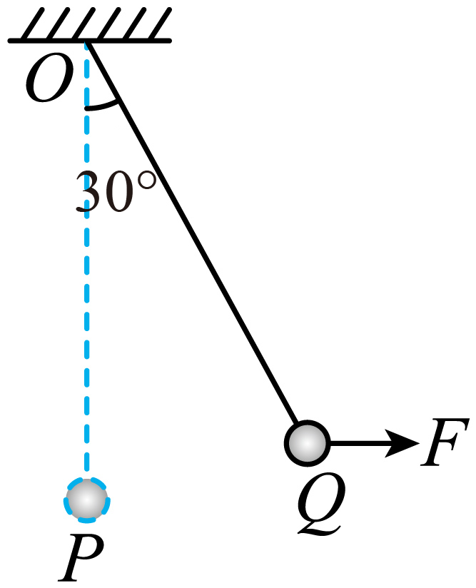

# 2025~2026学年北京第五十五中高一下期中第10题

## 题目来源

- [2025~2026学年北京第五十五中高一下期中](https://xbresource.jiaoyanyun.com/#/boutique/search?sid=4&gid=3&queId=97e16ea0e1ed4df2ba845a6ae0e678fb)  
  学年: 2025~2026；省市: 北京；学校: 北京第五十五中；年级: 高一；学期: 下期；考试: 期中
- [2024~2025学年北京东城区高一下学期期末（统一）第10题](https://xbresource.jiaoyanyun.com/#/boutique/search?sid=4&gid=3&queId=97e16ea0e1ed4df2ba845a6ae0e678fb)  
  学年: 2024~2025；省市: 北京；城市: 北京；区县: 东城区；年级: 高一；学期: 下学期；考试: 期末；备注: （统一）；题号: 10

## 标签

- #物理
- #选择题
- #2025-2026学年
- #北京
- #北京第五十五中
- #高一
- #下期
- #期中
- #2024-2025学年
- #东城区
- #下学期
- #期末

## 题目

> [!ti] *2025~2026学年北京第五十五中高一下期中第10题*
> 如图所示，一个质量为m的小球，用绳长为l的轻绳悬挂于O点，初始时刻小球静止于P点。第一次小球在水平拉力F1的作用下，从P点缓慢移动到Q点，此时轻绳与竖直方向夹角为30°，随即撤去F1；第二次小球在大小为F2的水平恒力的作用下，从P点开始运动到达Q点，随即撤去F2。不计空气阻力，重力加速度为g。分析上述两次运动过程，下列说法正确的是（　　）
> 
> > [!opts1]
> > - A. F1的大小始终为mgtan30°
> > - B. F1做的功等于mglcos30°
> > - C. F2做的功等于F2lsin30°
> > - D. 两个过程小球回到最低点P时绳中拉力一定相等

## 答案

C

## 详解

【详解】A．小球处于动态平衡状态，则 $F_{1} = mg\tan\theta$ ，绳子与竖直方向的夹角 $\theta$ 在增大的过程中， $F_{1}$ 在增大，故A错误；
B．小球从P点缓慢移动到Q点，则由动能定理，有 $W_{1} - mgl(1 - \cos 30^{\circ}) = 0$ 
解得F1做的功等于 $W_{1} = mgl(1 - \cos 30^{\circ})$ ，故B错误；
C．F2做的功 $W_{2} = F_{2}l\sin 30^{\circ}$ ，故C正确；
D．两个过程小球从最低点P点回到P时，由动能定理，有 $W = \frac{1}{2}mv^{2} - 0$ 
在P点，有 $F_{\text{T}} - mg = m\frac{v^{2}}{l}$ 
而两种情况，拉力做功不同，则回到P点时的速度不同，绳中拉力不相等，故D错误。
故选C。

## 检索信息

- 相似度: 59.28
- 选择依据: 已搜索到候选题，直接采用评分最高的一条
- 搜索词: 如图所示 一个质量为$m$ 的小球 用绳长为1的轻绳悬挂于O点 初始时刻小球静止于P点 参 次小球在水平$y_ L $力$F_ L $的作用下 从P点缓慢移动到Q点 此时轻绳与整直方向夹角为30°,随即撤去 $F_ 1 :$ 第二次小球在大
