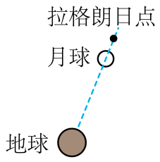

# 2025~2026学年北京第五十五中高一下期中第14题

## 题目来源

- [2025~2026学年北京第五十五中高一下期中](https://xbresource.jiaoyanyun.com/#/boutique/search?sid=4&gid=3&queId=e55d89a86e234707b97b49b36f7096e5)  
  学年: 2025~2026；省市: 北京；学校: 北京第五十五中；年级: 高一；学期: 下期；考试: 期中
- [2023~2024学年浙江宁波北仑区浙江省北仑中学高一下学期期中第13题2分](https://xbresource.jiaoyanyun.com/#/boutique/search?sid=4&gid=3&queId=e55d89a86e234707b97b49b36f7096e5)  
  学年: 2023~2024；省市: 浙江；城市: 宁波；区县: 北仑区；学校: 浙江省北仑中学；年级: 高一；学期: 下学期；考试: 期中；题号: 13；分值: 2
- [2025~2026学年9江苏无锡梁溪区无锡市第一中学高三上学期月考第10题](https://xbresource.jiaoyanyun.com/#/boutique/search?sid=4&gid=3&queId=e55d89a86e234707b97b49b36f7096e5)  
  学年: 2025~2026；月份: 9；省市: 江苏；城市: 无锡；区县: 梁溪区；学校: 无锡市第一中学；年级: 高三；学期: 上学期；考试: 月考；题号: 10
- [2023~2024学年3江苏苏州吴江区震泽中学高一下学期月考第9题](https://xbresource.jiaoyanyun.com/#/boutique/search?sid=4&gid=3&queId=e55d89a86e234707b97b49b36f7096e5)  
  学年: 2023~2024；月份: 3；省市: 江苏；城市: 苏州；区县: 吴江区；学校: 震泽中学；年级: 高一；学期: 下学期；考试: 月考；题号: 9
- [2025~2026学年9月江苏无锡梁溪区无锡市第一中学高三上学期月考第10题](https://xbresource.jiaoyanyun.com/#/boutique/search?sid=4&gid=3&queId=e55d89a86e234707b97b49b36f7096e5)
- [2023~2024学年3月江苏苏州吴江区震泽中学高一下学期月考第9题](https://xbresource.jiaoyanyun.com/#/boutique/search?sid=4&gid=3&queId=e55d89a86e234707b97b49b36f7096e5)

## 标签

- #物理
- #选择题
- #2025-2026学年
- #北京
- #北京第五十五中
- #高一
- #下期
- #期中
- #2023-2024学年
- #浙江
- #宁波
- #北仑区
- #浙江省北仑中学
- #下学期
- #江苏
- #无锡
- #梁溪区
- #无锡市第一中学
- #高三
- #上学期
- #月考
- #苏州
- #吴江区
- #震泽中学
- #浙江宁波北仑区
- #圆周运动

## 题目

> [!ti] *2025~2026学年北京第五十五中高一下期中第14题*
> 如图所示，地球和月球组成“地月双星系统”，两者绕共同的圆心C点（图中未画出）做周期相同的圆周运动.数学家拉格朗日发现，处在拉格朗日点（如图所示）的航天器在地球和月球引力的共同作用下可以绕“地月双星系统”的圆心C点做周期相同的圆周运动，从而使地、月、航天器三者在太空的相对位置保持不变.不考虑航天器对“地月双星系统”的影响，不考虑其它天体对该系统的影响．已知：地球质量为M，月球质量为m，地球与月球球心距离为d．则下列说法错误的是（ ）
> 
> > [!opts1]
> > - A. 位于拉格朗日点的绕C点稳定运行的航天器，其向心加速度大于月球的向心加速度
> > - B. 地月双星系统的周期 $T=2\pi \sqrt{\frac{d^{3}}{G\left(M+m\right)}}$
> > - C. 圆心C点在地球和月球的连线上，距离地球和月球球心的距离之比等于地球和月球的质量之比
> > - D. 拉格朗日点距月球球心的距离x满足关系式 $\frac{GM}{\left(d+x\right)^{2}}+\frac{Gm}{x^{2}}=$ $G\frac{M+m}{d^{3}}\left(x+\frac{dM}{M+m}\right)$

## 答案

C

## 详解

【详解】A．位于拉格朗日点的绕 $C$ 点稳定运行的航天器的周期与地球的周期相同，根据 $a=\left(\frac{2\pi }{T}\right)^{2}r$ 可知，离 $C$ 点越远加速度越大，故A正确，不符合题意；
B．地球和月球组成“地月双星系统”，两者绕共同的圆心 $C$ 点（图中未画出）做周期相同的圆周运动．根据万有引力提供向心力，对月球
$G\frac{Mm}{d^{2}}=m\frac{4\pi ^{2}}{T^{2}}r_{1}$ 
对地球
$G\frac{Mm}{d^{2}}=M\frac{4\pi ^{2}}{T^{2}}r_{2}$ 
两式相加
$G\frac{M+m}{d^{2}}=\frac{4\pi ^{2}}{T^{2}}\left(r_{1}+r_{2}\right)$ 
因为
$d=r_{1}+r_{2}$ 
所以
$T=2\pi \sqrt{\frac{d^{3}}{G(M+m)}}$ 
故B正确，不符合题意；
C．由
$G\frac{Mm}{d^{2}}=m\frac{4\pi ^{2}}{T^{2}}r_{1}$ 
$G\frac{Mm}{d^{2}}=M\frac{4\pi ^{2}}{T^{2}}r_{2}$ 
可得
$\frac{r_{2}}{r_{1}}=\frac{m}{M}$ 
即圆心 $C$ 点在地球和月球的连线上，距离地球和月球球心的距离之比等于地球和月球的质量的反比，故C错误，符合题意；
D．根据
$\frac{r_{2}}{r_{1}}=\frac{m}{M}$ 
$d=r_{1}+r_{2}$ 
可得，月球距离圆心 $C$ 点距离为
$r_{1}=\frac{dM}{M+m}$ 
航天器在月球和地球引力的共同作用下可以绕“月地双星系统”的圆心 $C$ 点做周期相同的圆周运动，设航天器的质量为 $m_{0}$ ，则
$G\frac{Mm_{0}}{(d+x)^{2}}+G\frac{mm_{0}}{x^{2}}=m_{0}\frac{4\pi ^{2}}{T^{2}}\left(x+\frac{dM}{M+m}\right)$ 
即
$G\frac{M}{(d+x)^{2}}+G\frac{m}{x^{2}}=G\frac{M+m}{d^{3}}\left(x+\frac{dM}{M+m}\right)$ 
故D正确，不符合题意．
故选C．

## 检索信息

- 相似度: 64.32
- 选择依据: 已搜索到候选题，直接采用评分最高的一条
- 搜索词: 如图所示 她球和月球组成"地月双星系统”,两者绕共同的圆心C 点 图中未画出 做周期相同的圓周运动 数学家拉格朗日发现 处在拉格朗日点 如图所示 的航天器在地球和月球引力的共同作用下可以绕“地月双星系统”的圆心 C点做周期相同的圆周运动 从
