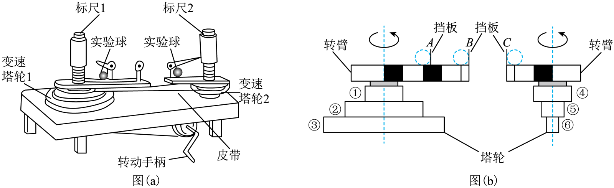

# 2025~2026学年北京第五十五中高一下期中第15题

## 题目来源

- [2025~2026学年北京第五十五中高一下期中](https://xbresource.jiaoyanyun.com/#/boutique/search?sid=4&gid=3&queId=d5450bf66d0b423fb499937d454b4101)  
  学年: 2025~2026；省市: 北京；学校: 北京第五十五中；年级: 高一；学期: 下期；考试: 期中
- [2023~2024学年4海南琼海市琼海市嘉积中学高一下学期月考（省直辖县级行政单位）第14题](https://xbresource.jiaoyanyun.com/#/boutique/search?sid=4&gid=3&queId=d5450bf66d0b423fb499937d454b4101)  
  学年: 2023~2024；月份: 4；省市: 海南；城市: 琼海市；学校: 琼海市嘉积中学；年级: 高一；学期: 下学期；考试: 月考；备注: （省直辖县级行政单位）；题号: 14
- [2023~2024学年4月海南琼海市琼海市嘉积中学高一下学期月考（省直辖县级行政单位）第14题](https://xbresource.jiaoyanyun.com/#/boutique/search?sid=4&gid=3&queId=d5450bf66d0b423fb499937d454b4101)

## 标签

- #物理
- #选择题
- #2025-2026学年
- #北京
- #北京第五十五中
- #高一
- #下期
- #期中
- #2023-2024学年
- #海南
- #琼海市
- #琼海市嘉积中学
- #下学期
- #月考
- #海南琼海市琼海市
- #嘉积中学
- #平抛运动
- #圆周运动

## 题目

> [!ti] *2025~2026学年北京第五十五中高一下期中第15题*
> 在“探究向心力大小的表达式”实验中，所用向心力演示器如图（a）所示．图（b）是演示器部分原理示意图：其中皮带轮①、④的半径相同，轮②的半径是轮①的2倍，轮④的半径是轮⑤的2倍，两转臂上黑白格的长度相等．A、B、C为三根固定在转臂上的挡板，可与转臂上做圆周运动的实验球产生挤压，从而提供向心力，图（a）中的标尺1和2可以显示出两球所受向心力的大小关系．可供选择的实验球有：质量均为 $2m$ 的球Ⅰ和球Ⅱ，质量为m的球Ⅲ．
> 
> （1）下列实验与本实验万法相同的是 $\_\_\_\_$ ；
> > [!opts2]
> > - A. 探究平抛运动的特点
> > - B. 探究弹簧形变量与力的关系
> > - C. 探究加速度与力和质量的关系
> > - D. 探究两个互成角度的力的合成规律
> 
> 
>  （2）为探究向心力与圆周运动轨道半径的关系，实验时应选择甲球和 $\_\_\_\_$ 球作为实验球；
>  （3）在某次实验中，一组同学把甲球和乙球分别放在 AC 位置，将皮带处于塔轮的某一层上，匀速转动手柄时，左边标尺露出 1 个分格，右边标尺露出 16 个分格，则 AC 位置处的小球转动所需的向心力之比为 $\_\_\_\_\_\_$， AC 两个挡板角速度之比为 $\_\_\_\_\_\_$.

## 答案

(1) C
(2) 乙
(3) 1:16 1:4

## 详解

【详解】（1）[1][2]为探究向心力与圆周运动轨道半径的关系，则应该保持小球质量和角速度相等，则实验时应将皮带与轮①和轮④相连，同时应选择球Ⅰ和球Ⅱ作为实验球；
（2）[1][2][3]若实验时将皮带与轮②和轮⑤相连，这是要探究向心力与角速度的关系，此时轮②和轮⑤的塔轮半径之比为4:1，两轮边缘的线速度相等，根据v=ωr可知这个物理量（角速度）之比为1:4，应将两个实验球分别置于短臂C和长臂A处，以保持转动半径相等；
（3）实验采用的实验方法是控制变量法；下列实验也采用此方法的是探究加速度与力和质量的关系，故选C。

## 检索信息

- 相似度: 52.57
- 选择依据: 已搜索到候选题，直接采用评分最高的一条
- 搜索词: 题共2小题 共18分 S.在“探究向心力大小的表达式”实验中 所用向心力演示器如图 a所示 图 b 是演示器部分原理示意 图 其中皮带轮$\textcircled \mathrm o $、$\textcircled 4 $的半径相同 轮$\
