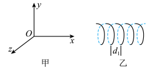
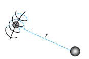

# 2025~2026学年北京第五十五中高一下期中第 19题

## 题目来源

- [2025~2026学年北京第五十五中高一下期中](https://xbresource.jiaoyanyun.com/#/boutique/search?sid=4&gid=3&queId=d381b86f408342a08761b4cd7ed24578)  
  学年: 2025~2026；省市: 北京；学校: 北京第五十五中；年级: 高一；学期: 下期；考试: 期中
- [2024~2025学年北京西城区北京市第三十五中学高一下学期期中第20题10分](https://xbresource.jiaoyanyun.com/#/boutique/search?sid=4&gid=3&queId=d381b86f408342a08761b4cd7ed24578)  
  学年: 2024~2025；省市: 北京；区县: 西城区；学校: 北京市第三十五中学；年级: 高一；学期: 下学期；考试: 期中；题号: 20；分值: 10

## 标签

- #物理
- #复合题
- #2025-2026学年
- #北京
- #北京第五十五中
- #高一
- #下期
- #期中
- #2024-2025学年
- #西城区
- #北京市第三十五中学
- #下学期
- #圆周运动

## 题目

> [!ti] *2025~2026学年北京第五十五中高一下期中第 19题*
> 人们通吊利用运动的合成与分解，把比较复杂的机祓运动等效分解为两个或多个简单的机械运动进行研究．下列情境中物体的运动轨迹都形似弹簧，其运动可分解为沿轴线的匀速直线运动和垂直轴线的匀速躅周运动
> (1)
> 情境 $1$ :在图 $1$ 甲所示的三维坐标系中，质点 $1$ 沿 $Ox$ 方向以速度 $v$ 做匀速直线运动，质点 $2$ 在 $yOz$ 平面内以角速度 $\omega$ 做匀速圆周运动．质点 $3$ 同时参与质点 $1$ 和质点 $2$ 的运动，其运动轨连形似弹簧，如乙图所示．质点 $3$ 在完成一个圆周运动的时间内，沿 $Ox$ 方向运动的距离称为一个螺距，求质点 $3$ 轨迹的“螺距” $d _ { 1 }$ 
> 
> (2)
> 情境 $2$ : $2020$ 年 $12$ 月 $17$ 日凌晨，嫦娥五号返回器携带月壤回到地球．登月前，嫦娥五号在距离月球表面高为h处绕月球做匀速圆周运动，嫦娥五号绕月的圆平面与月球绕地球做匀速圆周运动的平面可看作垂直，如图 $2$ 所示．已知月球的轨道半径为 $r$ ，月球半径为 $R$ ，且 $r > > R$ ，地球质量为 $M _ { 3 k }$ ，月球质量为 $m _ { 月 }$ ，嫦娥五号质量为 $m _ { 0 }$ ，引力常量为 $G$ ．求嫦娥五号轨迹的“螺距” $d _ { 2 }$ ．
> 
> (3)
> 如图，竖直放置的薄圆筒内壁光滑，其半径为 $R$ ，内壁上 $P 、 Q$ 两点连线竖直。一可视为质点的小球由 $P$ 点沿与筒半径垂直方向水平抛出，小球质量为 $m$ ，初速度大小为 $\sqrt{g R}$ 。小球的运动轨迹与 $P Q$ 的交点依次为 $A 、 B 、 C$ 三点。重力加速度大小为 $g$ ，不计空气阻力。求小球从 B 点运动至 C 点过程中的"螺距"$d_3$ 及平均速度大小 v.
> ![[Pasted image 20260429181145.png|100]]

## 答案

(1) 
暂无
(2) 暂无

## 详解

暂无

## 检索信息

- 相似度: 58.7
- 选择依据: 已搜索到候选题，直接采用评分最高的一条
- 搜索词: 10分 人们通常利用运动的台成与力和根运动进行研究 下列情境中物体的运动轨迹都形似弹簧 其运动可分解为沿轴线的直线运动和垂直轴线的匀速圆周运动 1 情境 1:在图 1 甲所示的三维坐标系中 质点 1 沿$o$x方向以速度$v$做匀速直线运动
