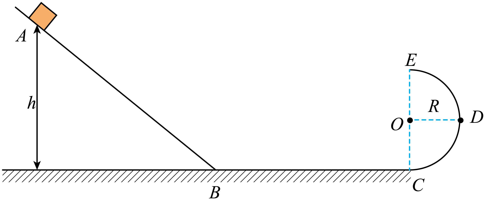

# 2025~2026学年北京第五十五中高一下期中第 20题

## 题目来源

- [2025~2026学年北京第五十五中高一下期中](https://xbresource.jiaoyanyun.com/#/boutique/search?sid=4&gid=3&queId=12b10b444a0649b5b3c48c7e11bea84c)  
  学年: 2025~2026；省市: 北京；学校: 北京第五十五中；年级: 高一；学期: 下期；考试: 期中
- [2024~2025学年江苏苏州工业园区苏州大学附属中学高一下学期期中第15题](https://xbresource.jiaoyanyun.com/#/boutique/search?sid=4&gid=3&queId=12b10b444a0649b5b3c48c7e11bea84c)  
  学年: 2024~2025；省市: 江苏；城市: 苏州；区县: 工业园区；学校: 苏州大学附属中学；年级: 高一；学期: 下学期；考试: 期中；题号: 15
- [1新疆月考（2024年 普通高中学业水平考试）第33题](https://xbresource.jiaoyanyun.com/#/boutique/search?sid=4&gid=3&queId=12b10b444a0649b5b3c48c7e11bea84c)  
  月份: 1；省市: 新疆；考试: 月考；备注: （2024年 普通高中学业水平考试）；题号: 33
- [2024~2025学年4河北沧州泊头市泊头市第一中学高一下学期月考第14题](https://xbresource.jiaoyanyun.com/#/boutique/search?sid=4&gid=3&queId=12b10b444a0649b5b3c48c7e11bea84c)  
  学年: 2024~2025；月份: 4；省市: 河北；城市: 沧州；区县: 泊头市；学校: 泊头市第一中学；年级: 高一；学期: 下学期；考试: 月考；题号: 14
- [2024~2025学年3江苏南通海门区江苏省海门中学高一下学期月考第20题](https://xbresource.jiaoyanyun.com/#/boutique/search?sid=4&gid=3&queId=12b10b444a0649b5b3c48c7e11bea84c)  
  学年: 2024~2025；月份: 3；省市: 江苏；城市: 南通；区县: 海门区；学校: 江苏省海门中学；年级: 高一；学期: 下学期；考试: 月考；题号: 20
- [1月新疆月考（2024年 普通高中学业水平考试）第33题](https://xbresource.jiaoyanyun.com/#/boutique/search?sid=4&gid=3&queId=12b10b444a0649b5b3c48c7e11bea84c)
- [2024~2025学年4月河北沧州泊头市泊头市第一中学高一下学期月考第14题](https://xbresource.jiaoyanyun.com/#/boutique/search?sid=4&gid=3&queId=12b10b444a0649b5b3c48c7e11bea84c)
- [2024~2025学年3月江苏南通海门区江苏省海门中学高一下学期月考第20题](https://xbresource.jiaoyanyun.com/#/boutique/search?sid=4&gid=3&queId=12b10b444a0649b5b3c48c7e11bea84c)

## 标签

- #物理
- #复合题
- #2025-2026学年
- #北京
- #北京第五十五中
- #高一
- #下期
- #期中
- #2024-2025学年
- #江苏
- #苏州
- #工业园区
- #苏州大学附属中学
- #下学期
- #新疆
- #月考
- #河北
- #沧州
- #泊头市
- #泊头市第一中学
- #南通
- #海门区
- #江苏省海门中学
- #江苏苏州工业园区

## 题目

> [!ti] *2025~2026学年北京第五十五中高一下期中第 20题*
> 如图所示，在竖直平面内，光滑斜面下端与水平面BC平滑连接于B点，水平面BC与光滑半圆弧轨道CDE相切于C点，E点在圆心O点正上方，D点与圆心等高．一物块（可看作质点）从斜面上A点由静止释放，物块通过半圆弧轨道E点且水平飞出，最后落到水平面BC上的F（图中未标出）点处．已知物块质量 $m=1 \mathrm{~kg}$ ，斜面上 A 点距离水平面 $B C$ 的高度为 $h$ ，圆弧轨道半径 $R=0.4 \mathrm{~m}$ ，
> $\mathrm{B} 、 \mathrm{C}$ 两点距离 $L=2.0 \mathrm{~m}, \mathrm{~F} 、 \mathrm{C}$ 两点距离 $x=1.6 \mathrm{~m}$ 。求：
> 
> (1)物块通过E点时的速度大小；
> （2）求物块运动到 C 点时，受到的轨道对它的支持力；
> （3）若物块与水平面 BC 间的动摩擦因数为 0.2 ；将物块从斜面上由静止释放，若物块在半圆弧轨道上运动时不脱离轨道，则物块释放点距离水平面 BC 的高度 $h$ 应满足的条件。

## 答案

无

## 详解

无

## 检索信息

- 相似度: 53.33
- 选择依据: 已搜索到候选题，直接采用评分最高的一条
- 搜索词: ! https://storage.simpletex.cn/view/fzvbf3gixfgAZr265ydDcYZ8pzA3IAVhd iBC 20、 12分 如图所示 在整直平面N 进半圆水轨道 CDE 相切于$C$ 点 $E$ 点在
