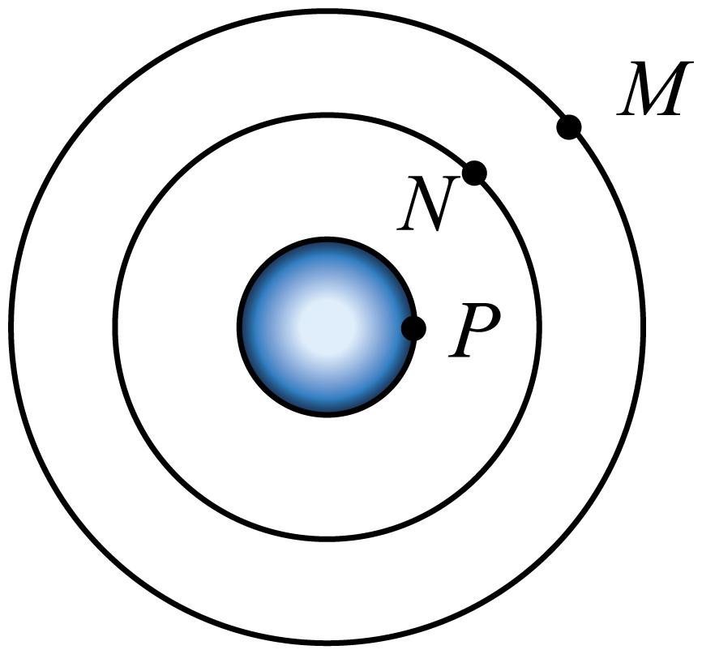

# 2025~2026学年北京第五十五中高一下期中第 4题

## 题目来源

- [2026学年甘肃兰州安宁区西北师范大学附属中学高三二模第3题](https://xbresource.jiaoyanyun.com/#/boutique/search?sid=4&gid=3&queId=4d59231d74954e318bbd24bc9f48971c)  
  学年: 2026；省市: 甘肃；城市: 兰州；区县: 安宁区；学校: 西北师范大学附属中学；考试: 高三二模；题号: 3
- [2026年甘肃兰州安宁区西北师范大学附属中学高三二模第3题](https://xbresource.jiaoyanyun.com/#/boutique/search?sid=4&gid=3&queId=4d59231d74954e318bbd24bc9f48971c)

## 标签

- #物理
- #选择题
- #2026学年
- #甘肃
- #兰州
- #安宁区
- #西北师范大学附属中学
- #高三二模
- #学年甘肃兰州安宁区
- #高三
- #圆周运动

## 题目

> [!ti] *2025~2026学年北京第五十五中高一下期中第3题*
> 如图所示，我国的地球静止卫星 $M$ 、量子卫星 $N$ 均在赤道平面内绕地球做圆周运动， $P$ 是地球赤道上一点。则（　　）
> 
> > [!opts2]
> > - A. $P$ 点的周期比 $N$ 的大
> > - B. $P$ 点的速度等于第一宇宙速度
> > - C. $M$ 的向心加速度比 $N$ 的向心加速度大
> > - D. $M$ 的角速度比 $N$ 的角速度大

## 答案

A

## 详解

【详解】A．根据题意有， $T_{P} = T_{M}$ 
根据万有引力提供向心力有 $G\frac{M_{地}m}{r^{2}} = m\frac{4\pi^{2}}{T^{2}}r$ 
解得 $T = 2\pi\sqrt{\frac{r^{3}}{GM_{地}}}$ 
即轨道半径越大则周期越大，故 $T_{M} > T_{N}$ 
则 $T_{P} > T_{N}$ ，故A正确；
B．方法1： $P$ 点和M点的角速度相等，P点圆周运动的半径比M点小，根据 $v = \omega r$ 可知， $P$ 点的线速度小于M点的线速度，根据万有引力提供向心力有 $G\frac{M_{地}m}{r^{2}} = m\frac{v^{2}}{r}$ 
解得 $v = \sqrt{\frac{GM_{地}}{r}}$ 
即轨道半径越大线速度越小，故第一宇宙速度大于M点的线速度，故 $P$ 点的线速度小于第一宇宙速度。
方法2： $P$ 点的线速度 $v_{P} = \frac{2\text{π}R}{T} = \frac{2 \times 3.14 \times 6400\text{km}}{24 \times 3600\text{s}} \approx 0.47\frac{\text{km}}{\text{s}}$ 
而第一宇宙速度 $v = 7.9\frac{\text{km}}{\text{s}}$ 
故 $P$ 点的速度小于第一宇宙速度，故B错误；
C．根据万有引力提供向心力有 $G\frac{M_{地}m}{r^{2}} = ma$ 
解得 $a = \frac{GM_{地}}{r^{2}}$ 
即轨道半径越大向心加速度越小，故 $a_{M} < a_{N}$ ，故C错误；
D．根据万有引力提供向心力有 $G\frac{M_{地}m}{r^{2}} = m\omega^{2}r$ 
解得 $\omega = \sqrt{\frac{GM_{地}}{r^{3}}}$ 
即轨道半径越大角速度越小，故 $\omega_{M} < \omega_{N}$ ，故D错误。
故选A。

## 检索信息

- 相似度: 47.73
- 选择依据: 题库搜索第一条，且相似度达到搜索排序兜底线
- 搜索词: 如图所示 我国的地球常止卫星 M、量子卫星 N 均在赤道平面内绕地球做图周运动 P是地球赤道a.P点的周明伦N的大/ $T_N T_n=T_p$
