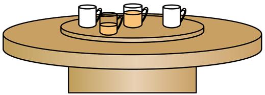

# 2025~2026学年北京第五十五中高一下期中第 6题

## 题目来源

- [2024~2025学年北京西城区西城外国语学校高一下学期期中第8题](https://xbresource.jiaoyanyun.com/#/boutique/search?sid=4&gid=3&queId=0a41dac0762b40ecb4c7d6b961946ca1)  
  学年: 2024~2025；省市: 北京；城市: 北京；区县: 西城区；学校: 西城外国语学校；年级: 高一；学期: 下学期；考试: 期中；题号: 8

## 标签

- #物理
- #选择题
- #2024-2025学年
- #北京
- #西城区
- #西城外国语学校
- #高一
- #下学期
- #期中

## 题目

> [!ti] *2025~2026学年北京第五十五中高一下期中第 6题*
> 如图所示，餐桌中心有一个圆盘，可绕其中心轴转动，现在圆盘上放相同的茶杯，茶杯可看作质点，茶杯与圆盘间动摩擦因数为µ。现使圆盘匀速转动，则下列说法正确的是（　　）
> 
> > [!opts1]
> > - A. 每个茶杯均受重力、支持力、静摩擦力、向心力四个力作用
> > - B. 如果茶杯相对圆盘静止，茶杯受到圆盘的摩擦力沿半径指向圆心
> > - C. 若缓慢增大圆盘转速，离中心轴近的空茶杯相对圆盘先滑动
> > - D. 若缓慢增大圆盘转速，到中心轴距离相同的空茶杯比有茶水茶杯相对圆盘先滑动

## 答案

B

## 详解

【详解】A．合力充当向心力，不受向心力，A错误
B．如果茶杯相对圆盘静止，茶杯受到圆盘的摩擦力是静摩擦力，沿半径指向圆心，充当向心力，B正确；
CD．根据牛顿第二定律 $\mu mg = m\omega^{2}r$ ，解得 $\omega = \sqrt{\frac{\mu g}{r}}$ 
若缓慢增大圆盘转速，离中心轴远的茶杯先滑动，与质量无关，CD错误。
故选B。

## 检索信息

- 相似度: 49.61
- 选择依据: 题库搜索第一条，且相似度达到搜索排序兜底线
- 搜索词: 如图所示 餐桌中心有一个圆盘 可绕其中心轴转动 现在圆盘上放相同的茶杯 茶杯可看作易 点 茶杯与圆盘间动摩擦因数为 μ 现使圆盘匀速转和、正确的是$\sqrt 10.15 $ $OHO-O$
