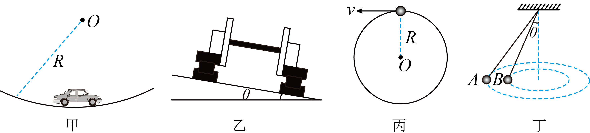

# 2025~2026学年北京第五十五中高一下期中第 7题

## 题目来源

- [2025~2026学年北京第五十五中高一下期中](https://xbresource.jiaoyanyun.com/#/boutique/search?sid=4&gid=3&queId=614202e9fd0e4b478f1ee7e48c0722b6)  
  学年: 2025~2026；省市: 北京；学校: 北京第五十五中；年级: 高一；学期: 下期；考试: 期中
- [2025~2026学年北京海淀区北京一零一中学高一上学期期末第14题](https://xbresource.jiaoyanyun.com/#/boutique/search?sid=4&gid=3&queId=614202e9fd0e4b478f1ee7e48c0722b6)  
  学年: 2025~2026；省市: 北京；城市: 北京；区县: 海淀区；学校: 北京一零一中学；年级: 高一；学期: 上学期；考试: 期末；题号: 14

## 标签

- #物理
- #选择题
- #2025-2026学年
- #北京
- #北京第五十五中
- #高一
- #下期
- #期中
- #海淀区
- #北京一零一中学
- #上学期
- #期末
- #圆周运动

## 题目

> [!ti] *2025~2026学年北京第五十五中高一下期中第 7题*
> 如图所示，下列有关圆周运动的实例分析中，说法正确的是（　　）
> 
> > [!opts1]
> > - A. 甲图中，汽车通过凹形桥的最低点时，汽车处于失重状态
> > - B. 乙图中，火车转弯超过规定速度行驶时，内轨和轮缘间会有挤压作用
> > - C. 丙图中，套在光滑圆环上的小球在竖直平面内做圆周运动时，过最高点的速度至少为 $\sqrt{Rg}$
> > - D. 丁图中，A、B两小球在同一水平面做圆锥摆运动，则A与B的角速度相等

## 答案

D

## 详解

【详解】A．甲图中，汽车通过凹形桥的最低点时，加速度向上，则汽车处于超重状态，A 错误；
B．乙图中，火车转弯超过规定速度行驶时，轨道对火车的支持力和重力的合力不足以提供火车做圆周运动的向心力，则火车有做离心运动的趋势，则外轨和轮缘间会有挤压作用，B错误；
C．丙图中，光滑圆环上的小球在竖直平面内做圆周运动时，过最高点时圆环对小球能提供支撑力，则速度最小为零，C错误；
D．丁图中，A、B两小球在同一水平面做圆锥摆运动，根据 $mg\tan\theta = m\omega^{2}h\tan\theta$ 
可得 $\omega = \sqrt{\frac{g}{h}}$ ，可知A与B的角速度相等，D正确。
故选AD。

## 检索信息

- 相似度: 56.54
- 选择依据: 已搜索到候选题，直接采用评分最高的一条
- 搜索词: ! https://storage.simpletex.cn/view/fgOPA7hCQ6nLc7cPCz9d7ABUYIv8y1mEZ 乙图中 火车转售超过规定速度行驶时 内机作为19年20月$\sqrt Rg $ 丙图中 倭孝光清圆环
